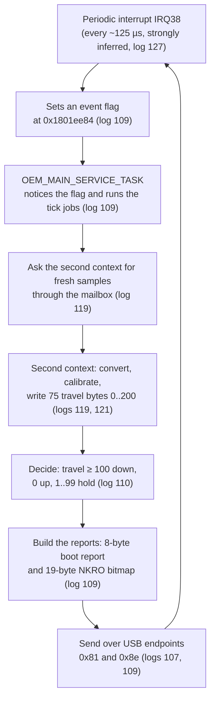

# Lesson 01 — What's inside a keyboard

> **In one sentence:** Your Falchion Ace HFX is a small computer: a SONiX chip runs a program stored in flash memory, measures how far each magnetic key is pressed, decides which keys are down, and reports them to your PC over USB, again and again, many times a second.
>
> **You will learn:**
> - why "a key is a switch" is only half true for this keyboard, and what a Hall-effect sensor adds
> - the chips on the board (MCU, U5, U7, U12), what each marking tells us, and how much of it was never checked electrically
> - the difference between hardware and firmware, and between flash and RAM
> - what "the keyboard's program" actually is on this device, and which part of it we have a verified copy of
> - how the 68 physical keys are numbered in two different ways
> - a first look at what the chip does in every moment: scan, decide, report
>
> **Time:** ~40 minutes · **Prerequisites:** none. Keep the [Glossary](00-glossary.md) open in another tab.

---

## 1. The story (kid version)

Imagine a tiny office inside your keyboard.

In the office sits one **clerk**. The clerk cannot think for itself. It follows a thick **instruction book** that never gets erased, even when the lights go out. While it works, the clerk scribbles on a **whiteboard**. The whiteboard is fast to write on, but it is wiped clean every time the power goes off.

Under the floor of the office there are 68 **water tanks**, one per key. When you press a key, you push a float down into its tank. The clerk has a gauge on every tank. It does not just see "float up" or "float down". It reads a number: how deep the float is. Many times a second the clerk walks past every gauge, writes the numbers on the whiteboard, decides "this float is deep enough, that key counts as pressed", and drops a note through the **mail slot** in the wall. On the other side of the mail slot is your computer.

The instruction book is written in a language the clerk understands but you do not. Reverse engineering this keyboard meant learning to read that book without anyone giving us a dictionary, and without ever tearing out a page by accident.

### How the analogy maps to the real thing

| In the story | In the real keyboard |
|---|---|
| The clerk | The SONiX SNC73270 microcontroller (MCU), with ARM Cortex-M3 processor cores inside |
| The instruction book | The [firmware](00-glossary.md#firmware), kept in [flash](00-glossary.md#flash) memory |
| The whiteboard | [RAM](00-glossary.md#ram), the fast working memory that forgets when power is lost |
| Water tanks and floats | A magnet on each key, and a [Hall-effect](00-glossary.md#hall-effect) sensor that measures how close it is |
| The depth gauge's number | A per-key sample that the firmware turns into a "travel" number from 0 to 200 (logs 119, 121) |
| "Deep enough counts as pressed" | The [actuation](00-glossary.md#actuation) rule: `travel >= 100` means down (log 110) |
| The mail slot | The USB cable and its [HID](00-glossary.md#hid) [reports](00-glossary.md#report) |
| Walking past every gauge, many times a second | The scan cycle, driven by a periodic [interrupt](00-glossary.md#interrupt-irq) called IRQ38 (logs 109, 127) |

---

## 2. Why we needed this

On 2026-08-29 the investigation started with one practical question, written at the top of [FINDINGS.md](../FINDINGS.md): **can the installed firmware be backed up through USB?** You cannot answer that until you know what is inside the box:

- **Which chip runs the keyboard?** Instructions for one chip family are useless, or dangerous, on another. The earliest guide in this repository contained STM32 load addresses and ST-Link flashing commands copied from a generic recipe. The audit on 2026-08-29 declared them invalid for the SONiX SNC73270 (logs 27–28; FINDINGS "Historical audit of the earlier Claude Code work").
- **Where is the program stored?** If the firmware lives in the external flash chip, a hardware reader could copy it. If part of it lives inside the MCU, it could not. This is still **unresolved** (FINDINGS "User-supplied hardware facts").
- **What kind of keys are these?** A Hall-effect keyboard measures distance, so its firmware has to do arithmetic on analog samples. That shapes everything you will see in Lessons 15 and 17.

The alternative, plugging the keyboard in and poking at it with tools straight away, was rejected. Lesson 3 explains why. First you learn the parts, then you look from the outside ([Lesson 4](04-usb-and-hid.md)), and only much later do you touch anything.

---

## 3. The real thing

### 3.1 A key is a switch... usually

On an ordinary keyboard each key is a **switch**: two pieces of metal that touch when you press. The electronics only ever see two states, "touching" (1) or "not touching" (0). A [bit](00-glossary.md#bit) is enough to describe a key.

To read many switches with few wires, ordinary keyboards arrange them in a grid of rows and columns (a "matrix") and check one row at a time. That is general background, not a claim about this board. **For this keyboard, no contact-matrix model is asserted** (log 109). Phase 5C noticed that the per-key data the firmware clears is two bytes wide per key. As log 109 put it, "a contact matrix would not need 16 bits per key".

### 3.2 This keyboard measures distance instead: the Hall effect

A **Hall-effect sensor** is a tiny chip whose output voltage changes when a magnet comes near it. The closer the magnet, the bigger the change. Put a magnet in each key and a sensor under it, and you can measure **how far** the key is pressed, not just whether it is pressed.

```
   key cap            key cap            key cap
  ┌───────┐          ┌───────┐
  │       │          │       │          ┌───────┐
  │ magnet│          │       │          │       │
  └───┬───┘          │ magnet│          │       │
      │              └───┬───┘          │ magnet│
      │  far             │  closer      └───┬───┘  closest
  ════╧════ sensor   ════╧════ sensor   ════╧════ sensor
  small change       bigger change      biggest change
```

A voltage is not a number yet. An [ADC](00-glossary.md#adc) (Analog-to-Digital Converter) measures the voltage and turns it into one. The SNC7320-series product brief lists a 10-bit, six-channel SAR ADC ([notes/references.md](../notes/references.md)). Notice the careful wording in that note. The brief says the ADC is **consistent with** a Hall-effect front end. It does not say which hardware register is the ADC, and the repository refuses to name any register from the brief alone.

What the firmware does with the numbers was worked out much later (Lesson 15 goes deep). Here is the high-level preview, with the evidence level for each step:

| Step | What happens | Evidence |
|---|---|---|
| 1 | A converter loop runs 240 iterations of "write, strobe, read back" | observed, in the second execution context (logs 118, 119) |
| 2 | 75 raw samples are stored as 16-bit numbers | observed (log 119) |
| 3 | Each sample is normalised: `(reference − sample) × 1279 × scale >> 21`, clamped, and looked up in a 1280-byte table | observed (log 119); formula explained in log 121 |
| 4 | The result is a **travel** byte from 0 to 200 | observed (log 119) |
| 5 | `travel >= 100` → key down; `travel == 0` → key up; 1..99 → **unchanged** (the "hold band") | observed, confirmed against the instruction listing (log 110) |

The hold band is clever. If a key sits right at the threshold and the reading wobbles between 99 and 100, the key does not flicker on and off. Once it is down, it stays down until the travel drops all the way to exactly 0 (log 110).

The keyboard also calibrates itself every time it starts. It begins from built-in defaults (reference `0x15e0`, floor `0xdac`, scale `0x3e6`), keeps adjusting them as it runs, and **saves nothing**. For the first 600 conversion passes it forces every travel byte to zero, so a keyboard that is still calibrating cannot type anything by accident (log 121). You will learn to read those `0x…` numbers in [Lesson 2](02-how-computers-count.md).

What is **not** known, and cannot be known from the code alone: sensor polarity, voltage limits, noise margin, and physical travel in millimetres. "The recovered numbers carry no unit, and a test asserts none in the report is given one" (FINDINGS "Phase 5D").

### 3.3 The parts on the board

These markings were read off the circuit board by you, the owner, and written down on 2026-08-18 (TIMELINE "Component and interface notes"). They are listed in FINDINGS under a heading that says what they are: **"User-supplied hardware facts (not re-verified by USB diagnostics)."**

| Board label | Marking | What it is | How sure |
|---|---|---|---|
| main MCU | SONiX SNC73270 | The microcontroller that runs the keyboard | marking user-observed |
| U5 | Zbit ZB25VQ32BTIG | External [SPI](00-glossary.md#spi) flash, 32 Mbit = 4,194,304 bytes (4 MiB). Expected JEDEC ID `5E 40 16` | marking user-observed; **JEDEC ID never read** |
| U7 | `DIO322 2403 2F3` | "likely a USB signal switch" | marking user-observed; function is an inference |
| U12 | `C3NC V0006` | unidentified | marking user-observed |
| two connectors | (none recorded) | The keyboard has two physical USB connectors | observed: both were tested (logs 19–26) |

Three things to notice:

1. **"These markings have not yet been electrically traced. No programmer or debug probe was connected"** (TIMELINE, 2026-08-18). A marking tells you the part number printed on the chip. It does not tell you which pins go where.
2. The JEDEC ID `5E 40 16` is what the ZB25VQ32 *should* answer if asked. Nobody asked it. "Read U5 or verified its JEDEC ID electrically" is in the "Work not performed" list (TIMELINE).
3. It is tempting to guess that U7 switches between the two USB connectors. **No document in this repository says that**, and nobody traced it, so this course will not claim it. Guessing a part's job from its position is exactly the kind of shortcut Lesson 3 teaches you to avoid.

What *is* observed about the two connectors: on 2026-08-29 the keyboard was plugged into its other connector and inspected again. It showed the same VID:PID `0b05:1b7e`, the same `bcdDevice` 1.59, the same five HID interfaces, and a byte-for-byte identical 159-byte descriptor blob. **"The other keyboard connector does not expose additional USB access"** (FINDINGS "Retry through the keyboard's other connector", log 26).

### 3.4 The brain: SONiX SNC73270

A **microcontroller** (MCU) is a whole small computer on one chip: processor, memory, timers, and hardware for talking to the outside world (USB, SPI, ADC and so on). It is not as fast as your PC's processor, but it starts instantly and runs one job forever.

The marking is SNC73270. The chip belongs to SONiX's SNC7320 series. The very first eight bytes of the ASUS firmware file spell `SNC7320A` (you will read them yourself in section 6). According to the series product brief, as summarised in [notes/references.md](../notes/references.md), the series has:

- **dual** [Cortex-M3](00-glossary.md#cortex-m3) cores (two ARM processors)
- USB host and device
- GPIO (general-purpose pins), timers and PWM
- two watchdogs
- an SPI NOR flash interface
- a 10-bit, six-channel SAR ADC

The note also says what the brief **may not** be used for: "It is a product brief for the SNC7320 series, not a register map for the SNC73270." It "carries no register addresses, no bit fields and no interrupt assignment table." The URL was supplied by the owner and was not downloaded by the analysis tools.

**Two cores: does the firmware use both?** This got its own note, [notes/dual-core-question.md](../notes/dual-core-question.md). The short version:

- **Observed:** there are two *execution contexts*. The keyboard application talks to a separate service program through a shared-memory [mailbox](00-glossary.md#mailbox) at `0x20000000`. Each has its own vector table (logs 113, 118, 119).
- **Unresolved:** whether they run *at the same time* on two cores, or take turns on one. "The mechanism is settled; the silicon is not."

The second context turned out to be the one that runs the Hall converter loop from section 3.2 (log 119).

### 3.5 Hardware versus firmware

- **Hardware** is what you can touch: the circuit board, the chips, the magnets, the USB connectors.
- **[Firmware](00-glossary.md#firmware)** is the program that the hardware runs. It is "firm" because it is stored permanently in the device, unlike software you install on a PC.

The same hardware with different firmware behaves differently. The keyboard reports firmware release `bcdDevice 1.59` over USB (log 04), and ASUS publishes an update package containing release 1.00.58 (logs 29–35). Same keyboard, two different firmware versions. (Lesson 13 compares them byte by byte.)

### 3.6 Flash versus RAM

The MCU needs two kinds of memory, just like the clerk needs a book and a whiteboard.

| | [Flash](00-glossary.md#flash) | [RAM](00-glossary.md#ram) |
|---|---|---|
| Keeps data without power? | Yes | No |
| Speed | Slower to write; writing needs an erase first | Fast to read and write |
| What lives there | The firmware, and saved settings | Variables, buffers, the running program's working data |
| On this keyboard | U5 (external, 4 MiB); the MCU may also have internal storage (**unresolved**) | Inside the MCU |

Here is a surprise that the investigation found. The keyboard application is **stored** in flash but **runs** from RAM. At start-up, a small loader copies it from the flash window at `0x60021000` into RAM at `0x18000000`, unpacks a compressed part, and fills another area with zeros. This is called a [scatter-load](00-glossary.md#scatter-load) (logs 72–73). Those two numbers, `0x60000000` for flash and `0x18000000` for RAM, will follow you through the whole course. [Lesson 2](02-how-computers-count.md) explains what they mean.

### 3.7 What "the keyboard's program" actually is

You might picture the firmware as one program. It is not. The ASUS image is a structured **496 KiB container** with several pieces (FINDINGS "Observed image layout", logs 36–37). A simplified map:

```
file offset   what is there                                        later name
───────────   ──────────────────────────────────────────────────   ───────────────────────
0x00000       bootloader: USB updater mode, checks, boot choice    "the bootloader" (L10-11)
0x10000       SN_FWIN header and checksum record table             (L6, L9)
0x11000       code payload A                                       Candidate A = entry image / loader
0x21000       code payload B: the keyboard application             Candidate B = the application
0x61000       an exact copy of the first 64 KiB (the bootloader)   the mirror
0x74000       a separate image that runs at 0x18038000             the second execution context
```

"Candidate A" and "Candidate B" were the names given to the two code payloads before anyone knew what they did. A turned out to be the first-stage loader; B is the keyboard itself (logs 36, 79–80).

Now the most important distinction in the whole project:

- `dumps/vendor/M605_V01_00_58.bin` is the **ASUS file**, version 1.00.58. It is a reference. It is **not** a copy of your keyboard.
- `dumps/device/ROG_Falchion_Ace_HFX_installed_bcdDevice_1.59_app_0x10000_0x7bfff.bin` is a **copy read from your keyboard** on 2026-09-02, three times, all byte-identical (log 92). It covers only the application region `[0x10000, 0x7c000)`, which is 442,368 bytes.

That verified dump is not a full image of U5 either. U5 holds 4 MiB, and the USB method "cannot read the bootloader `[0,0x10000)` or the remainder of the 4 MiB U5 address space" (TIMELINE, log 92). Lesson 3 explains why "we have the ASUS file" was never accepted as "we have a backup".

### 3.8 The 68 physical keys and the key map

The keyboard has **68 physical keys**. The project met two completely different numbering schemes for them, and "They have not been reconciled" ([notes/key-matrix.md](../notes/key-matrix.md)).

**Scheme 1: the wire index.** The vendor command that remaps a key (`51 21`, Lesson 5) numbers keys 1 to 68, left to right, top to bottom:

```
row 1   Esc=1   1=2   2=3   3=4   4=5   5=6   6=7   7=8   8=9   9=10
        0=11    -=12  +=13  Bksp=14  Ins=15
row 2   Tab=16  Q=17  W=18  E=19  R=20  T=21  Y=22  U=23  I=24  O=25
        P=26    [=27  ]=28  \=29  Del=30
row 3   Caps=31 A=32  S=33  D=34  F=35  G=36  H=37  J=38  K=39  L=40
        ;=41    '=42  Enter=43  PgUp=44
row 4   LShift=45  Z=46  X=47  C=48  V=49  B=50  N=51  M=52
        ,=53    .=54  /=55  RShift=56  Up=57  PgDn=58
row 5   Ctrl=59  Win=60  Alt=61  Space=62  Alt=63  Fn=64  ROG=65
        Left=66  Down=67  Right=68
```

Count the rows: 15 + 15 + 14 + 14 + 10 = 68. But be careful about how much of this table was *tested*. Only seven entries were directly confirmed: Backspace=14, Q=17, I=24, O=25, Enter=43, N=51, M=52. "The remaining 61 entries are extrapolated from the same row-major rule and are consistent with all seven confirmed points, but have not each been individually exercised." Those tests were done in the earlier Windows work, whose raw captures are missing, so they are historical observations (FINDINGS "Earlier protocol research and evidence status").

**Scheme 2: the Armoury Crate config file.** In the Windows app's saved profile, each key is `(row << 8) | col`. The base layer uses columns 0–11 and the Fn layer uses the same column plus 50. So **M** is wire index `52`, but `row 4 / col 5` on the base layer and `row 4 / col 55` on the Fn layer. The file holds 136 entries, which is 68 keys × 2 layers.

**And the firmware's own table?** Inside the firmware, the key map is dimensioned **5 groups × 15 = 75 entries per layer**. That comes straight from the multiply instructions (log 110). 75 is not 68, and that is fine: 75 is the table's size, and the number of slots actually in use is a value the firmware reads at run time, which the saved image leaves at zero. "15 is the table stride; the active count is a boundary, not a key count" (FINDINGS "Phase 5D"). There is also a 189-entry wire-ID translation table. The project has a unit test that stops anyone using 189 as a key count (log 109).

One more count, for the lights: the LED layout file from Armoury Crate has 84 LEDs. `lamp_id` 0–15 are the underglow strip and 16–83 are the 68 key LEDs ([notes/key-matrix.md](../notes/key-matrix.md)).

### 3.9 What the chip does, moment by moment (a preview)

Here is the loop that the investigation traced through Phases 5C and 5D and logs 119, 121 and 127. Every name below is explained in a later lesson. For now, just follow the arrows.



Three stages, like the clerk: **scan** (get samples), **decide** (compare travel with the threshold), **report** (send it over USB).

Some honest details that will matter later:

- The timer's speed was **not** read from any clock register. It is **strongly inferred** from timing measured in a USB capture: at the 1000 Hz setting, the decide-and-report stage runs on every 8th tick, and 8 × 125 µs = 1 ms (log 127).
- At the 8000 Hz polling setting, the firmware skips its divide-by-8 and runs that stage on every tick. The sample fetch is not gated by the rate: it is called on both paths, so "Hall acquisition is never slowed by the polling rate" (log 127). Lesson 17 tells that story.
- Two of the report buffers are 8 bytes (boot keyboard) and 19 bytes (the NKRO bitmap: 152 bits, one per possible key). Both sizes come from the USB descriptors themselves (log 109).

The same chip also handles lighting (the LampArray interface, Lesson 16), the vendor commands from Armoury Crate (Lesson 5), saving settings into six profiles (Lesson 16), and a bootloader mode for updates (Lessons 10–12).

### 3.10 The chip's other jobs

Keys are the main job, but not the only one. Each of these gets its own lesson later. For now, just know they exist and where the evidence is.

| Job | What the firmware does | Where you learn it |
|---|---|---|
| Talking to Armoury Crate | Receives 64-byte vendor commands on interface 1, such as `12 00` (version query), `51 21` (remap a key on the Fn layer) and `50 55` (commit settings) | [Lesson 5](05-talking-to-the-keyboard.md); [notes/protocol.md](../notes/protocol.md) |
| Saving settings | `50 55` does not write flash itself. It sets a command byte that a storage state machine picks up later: "The commit queues; it does not program" (log 111) | [Lesson 16](16-settings-lights-saving.md) |
| Profiles | The firmware keeps six [profiles](00-glossary.md#profile) (log 125) | [Lesson 16](16-settings-lights-saving.md) |
| Lights | Interface 4 is a LampArray lighting interface. All thirteen Main items in its 327-byte descriptor are Feature items, so lighting runs over control transfers (log 112) | [Lesson 16](16-settings-lights-saving.md) |
| Polling rate | Switches between 1000 Hz and 8000 Hz with command `51 31` (log 126) | [Lesson 17](17-polling-rate.md) |
| Updates | A separate bootloader mode, PID `1b7f`, "Gaming Keyboard Bootloader2", can erase, program and read the application region (log 81) | [Lessons 10–12](10-how-it-boots.md) |
| Staying alive | Two magic-key-protected blocks at `0x40008000` and `0x40009000` are disabled at reset, and the first is fed every 8 ticks of IRQ38 (log 114). They are treated as watchdogs, but matching them to the brief's "two watchdogs" is a consistency, not an identification ([notes/references.md](../notes/references.md)) | [Lesson 7](07-arm-cortex-m3.md), [Lesson 10](10-how-it-boots.md) |

One small thing to notice already: saving a setting and changing a setting are different events. The historical Windows tests showed that a `51 21` remap takes effect **immediately**, even without the `50 55` commit (TIMELINE, 2026-08-26). So "I didn't save it" does not mean "I didn't change anything". Lesson 3 comes back to this.

---

## 4. Decisions and why

| Decision | Why | Alternative rejected | Evidence |
|---|---|---|---|
| Treat the board markings as user-supplied, not verified | Nobody traced the board or read U5's JEDEC ID | Treating "U5 is the firmware chip" as fact | FINDINGS "User-supplied hardware facts"; TIMELINE 2026-08-18 |
| Do not assume U5 holds the complete firmware | U5 could hold firmware, assets, configuration, calibration or a subset; the MCU may have internal storage | Planning a backup from U5 alone | FINDINGS "User-supplied hardware facts"; Recommended next step 6 |
| Discard the STM32 addresses and ST-Link recipe | They were generic placeholders, never validated for SNC73270 | Following the early guide | FINDINGS "Safety problems identified by the audit"; logs 27–28 |
| Use the SNC7320 brief only to raise or lower confidence, never to name a register | It is a series-level brief with no register map | Assigning ADC/watchdog identities from the brief | [notes/references.md](../notes/references.md) |
| Keep the dual-core question open | Two contexts with a mailbox are observed; running at the same time is not | Declaring "both cores run in parallel" | [notes/dual-core-question.md](../notes/dual-core-question.md), log 118 |
| Do not assert a contact-matrix model | Per-key data is 16 bits wide and the device is Hall-effect | Modelling the keyboard as switches | log 109 |
| Make the actuation model refuse to guess the active key count | The firmware reads it at run time and the saved image leaves it zero | Hard-coding 15 or 68 | log 110; `tool/model_hall_actuation.py` |

---

## 5. What went wrong, and how it was caught

**1. The generic STM32 recipe.**
- *Believed:* the early guide gave an STM32 load address `0x08000000`, an OpenOCD STM32 target and an ST-Link flashing example.
- *True:* the keyboard uses a SONiX SNC73270. Those values were "generic placeholders, not validated for the SONiX SNC73270".
- *Caught by:* the audit of earlier work on 2026-08-29 (logs 27–28).
- *Lesson:* **know which chip you have before you use any recipe.** A flashing command for the wrong chip is not just useless. It is a risk.

**2. A descriptor from a different device.**
- *Believed:* `notes/report-desc-0.txt` was keyboard interface 4, a 63-byte vendor channel on page `0xFF32`.
- *True:* the saved USB descriptor said interface 4's report descriptor was 327 bytes long, not 39. The old bytes matched none of the keyboard's current interfaces. Log 27 compared them against every HID device on the PC, including other ASUS, Logitech and Razer devices, and none matched.
- *Caught by:* log 27. The likely cause was reading `hidraw0` without first checking which device it belonged to.
- *Lesson:* **a file name is not proof of where data came from.** Always record which device, which interface, and when.

**3. "No USB bootloader exposed."**
- *Believed:* because `dfu-util -l` found nothing, the keyboard had no bootloader over USB.
- *True:* it has no *standard* (DFU) updater in normal mode. A proprietary bootloader at PID `1b7f` was later found statically and then entered live (logs 81, 88).
- *Caught by:* the audit narrowed the claim to "no DFU/bootloader interface in normal mode" (logs 27–28).
- *Lesson:* **"I didn't find it" is not "it doesn't exist".** State exactly what you searched.

**4. A "halfword array" that was really a bitmap.**
- *Believed:* log 109 described a "per-key halfword array" at `0x18023410` and called three report buffers contiguous.
- *True:* it is the key-state **bitmap**, five 32-bit words, and there is a one-byte gap at `0x18023c37` between buffers. The 5-byte buffer log 109 called "system control" is the mouse report.
- *Caught by:* log 110, which recorded the correction rather than editing log 109 (FINDINGS "Phase 5D").
- *Lesson:* **an early description of a data structure is a hypothesis.** The next person who reads the code closely should expect to fix it.

**5. "The actuation comparison runs on IRQ38 divided by 8."**
- *Believed:* logs 110 and 119 said the comparison runs every eighth tick.
- *True:* that holds at 1000 Hz. At 8000 Hz the firmware bypasses the divide-by-8 and runs it on every tick (log 127).
- *Caught by:* log 127, while hunting the polling-rate reader (TIMELINE "Corrections retained for auditability").
- *Lesson:* **a fact can be true under one setting and false under another.** Write down the conditions.

**6. The tidy LED table.**
- *Believed:* matching the 68 key positions in order against LED IDs 16–83 gave a key-name table.
- *True:* the result looked tidy but put M in the wrong place, at `row 6 / col 1` instead of `row 4 / col 5`. "The tidiness was an artifact of the zip, not evidence for it." The file was removed ([notes/key-matrix.md](../notes/key-matrix.md) §4).
- *Lesson:* **a pattern that looks neat can still be wrong.** Check it against one known point.

---

## 6. Try it yourself

Every command below only **reads** files already in this folder. Run them from `keyboard/falchion-re/`.

**Exercise 1: read the hardware facts as the project wrote them.**

```bash
sed -n '/^## User-supplied hardware facts/,/^## Earlier/p' FINDINGS.md | head -14
```

Output:

```
## User-supplied hardware facts (not re-verified by USB diagnostics)

- Main MCU marking: SONiX SNC73270.
- U5: Zbit ZB25VQ32BTIG external flash.
- U5 nominal capacity: 32 Mbit / 4,194,304 bytes.
- Expected U5 JEDEC ID: `5E 40 16`.
- U7 marking: `DIO322 2403 2F3`, likely a USB signal switch.
- U12 marking: `C3NC V0006`, unidentified.
- No Bus Pirate, SWD probe, or SPI programmer is connected.

These facts must not be treated as proof that U5 contains the complete executable firmware. It could hold firmware, assets, configuration, calibration data, or a subset. The SNC73270 may also contain internal nonvolatile memory; that remains unresolved.

## Earlier protocol research and evidence status
```

Find the words that tell you how sure the project is. ("not re-verified", "Expected", "likely", "unidentified", "unresolved".)

**Exercise 2: see the chip family name inside the firmware.**

```bash
xxd -l 16 dumps/vendor/M605_V01_00_58.bin
```

Output:

```
00000000: 534e 4337 3332 3041 1000 0000 0000 0000  SNC7320A........
```

The right-hand column shows the bytes as text: `SNC7320A`. That is the container marker. Lesson 2 teaches you to read the hex in the middle.

**Exercise 3: how big is the program compared with the flash chip?**

```bash
stat -c '%s %n' dumps/vendor/M605_V01_00_58.bin dumps/device/*.bin
```

Output:

```
507904 dumps/vendor/M605_V01_00_58.bin
442368 dumps/device/ROG_Falchion_Ace_HFX_installed_bcdDevice_1.59_app_0x10000_0x7bfff.bin
```

507,904 bytes is 496 KiB. U5 holds 4,194,304 bytes. So the whole ASUS image fills only about an eighth of U5. Nobody knows yet what is in the rest, because U5 was never read (TIMELINE "Work not performed").

**Exercise 4: find the keyboard's name in the firmware.**

```bash
strings -t x dumps/vendor/M605_V01_00_58.bin | grep 'FALCHION\|ASUSTeK'
```

Output:

```
  3f665 ASUSTeK
  3f66f ROG FALCHION ACE HFX
```

The number on the left is where the text starts in the file, in hex. These are the same offsets FINDINGS lists under "Concrete patchability evidence". They sit near the end of the application (Candidate B), which is where USB identity lives.

**Exercise 5: look up your key numbers.**

```bash
grep -n 'row 4' notes/key-matrix.md | head -3
```

Output:

```
15:Example of the mismatch: **M** is index `52` on the wire but `row 4 / col 55` in the file.
30:row 4   LShift=45  Z=46  X=47  C=48  V=49  B=50  N=51  M=52
116:row 4:      X  X  X  X  X  X  X  X  X  .  X  X
```

Line 30 is the wire index. Line 116 is the config file's grid for row 4. Which of the two schemes counts from 1?

**Exercise 6: run the recovered actuation rule.** The investigation turned the firmware's decision into a small Python function. This does not touch the keyboard. It is just arithmetic.

```bash
python3 -c "
from tool.model_hall_actuation import actuate
prev=False
for t in [0,40,99,100,150,99,50,1,0]:
    prev=actuate(t,prev); print(t, prev)
"
```

Output:

```
0 False
40 False
99 False
100 True
150 True
99 True
50 True
1 True
0 False
```

Watch the hold band at work. On the way down, 99 is not enough (`False`). On the way back up, 99, 50 and even 1 keep the key down (`True`). Only `0` releases it.

**Exercise 7: check the calibration arithmetic.** Log 121 says the scale is `0x200000 / (reference − floor)`, and that the defaults agree with each other.

```bash
python3 -c "print(0x15e0, 0xdac, 0x15e0-0xdac, 0x200000//(0x15e0-0xdac), 0x3e6, (2100*1279*998)>>21)"
```

Output:

```
5600 3500 2100 998 998 1278
```

Reference 5600 minus floor 3500 is a span of 2100. `0x200000 / 2100` gives 998, which is exactly the stored default scale `0x3e6`. Full travel then converts to 1278, where the travel table reads 200 (log 121). Three constants written in different places agree with each other, and that agreement is what makes the formula trustworthy.

**Exercise 8: find the bootloader's name, twice.**

```bash
strings -t x -n 8 dumps/vendor/M605_V01_00_58.bin | grep -i 'bootloader'
```

Output:

```
   dfef Gaming Keyboard Bootloader2
  6efef Gaming Keyboard Bootloader2
```

The same name appears twice. Section 3.7 said the file holds "an exact copy of the first 64 KiB" at `0x61000`. Subtract the two offsets (`0x6efef − 0xdfef`) and you get exactly `0x61000`. You will do that kind of subtraction a lot in [Lesson 2](02-how-computers-count.md).

---

## 7. Check your understanding

1. Why can't a single bit describe a key on this keyboard?
   <details><summary>Answer</summary>Because the keyboard measures how far the key is pressed, not just whether it is pressed. The firmware works with a travel number from 0 to 200 per key (logs 119, 121), and it needs the previous state too, because of the hold band (log 110).</details>

2. Which of these are verified facts, and which are user-observed markings: "the MCU is SNC73270", "U5's JEDEC ID is `5E 40 16`", "both connectors expose the same USB layout"?
   <details><summary>Answer</summary>The MCU marking is user-observed. The JEDEC ID is only an *expected* value: it was never read. The connector result is observed: both connectors were inspected read-only and compared byte for byte (logs 19–26).</details>

3. The application is stored in flash at `0x60021000`. Where does it run?
   <details><summary>Answer</summary>In RAM at `0x18000000`. The entry image (Candidate A) copies it there with a scatter-load at start-up (logs 72–73).</details>

4. Is `dumps/vendor/M605_V01_00_58.bin` a backup of your keyboard?
   <details><summary>Answer</summary>No. It is the official ASUS release 1.00.58. Your keyboard runs 1.59. The only readback of your keyboard is the application-region dump from log 92, and even that is not a full U5 image and does not include the primary bootloader region.</details>

5. The firmware's key map has 75 entries per layer. Does that mean the keyboard has 75 keys?
   <details><summary>Answer</summary>No. 75 (5 groups × 15) is the table's size, read from the multiply instructions. The active count per group is a value read at run time, and the saved image leaves it zero. The physical keyboard has 68 keys (log 110; notes/key-matrix.md).</details>

6. What would it take to know for sure that the two Cortex-M3 cores run at the same time?
   <details><summary>Answer</summary>Evidence that both execution contexts make progress at once, for example proving that `0x45000100` bit 15 releases a core, or finding an interrupt whose handler lives in one image while another image triggers it. Neither has been found ([notes/dual-core-question.md](../notes/dual-core-question.md)).</details>

---

## 8. Sources

- [../FINDINGS.md](../FINDINGS.md): "User-supplied hardware facts", "Retry through the keyboard's other connector", "Historical audit of the earlier Claude Code work", "Firmware architecture and modification feasibility", "Candidate A reset, scatter-load, and RAM base", "Phase 5C", "Phase 5D", "The Hall acquisition gate is closed (log 119)", "The calibration lifecycle (log 121)", "The polling-rate reader, and a period for IRQ38 (log 127)"
- [../TIMELINE.md](../TIMELINE.md): "2026-08-18 — Component and interface notes", "Corrections retained for auditability", "Work not performed"
- [../notes/references.md](../notes/references.md)
- [../notes/dual-core-question.md](../notes/dual-core-question.md)
- [../notes/key-matrix.md](../notes/key-matrix.md)
- [../logs/26-port-retry-corrected-comparison.txt](../logs/26-port-retry-corrected-comparison.txt)
- [../logs/27-claude-notes-report-desc-provenance.txt](../logs/27-claude-notes-report-desc-provenance.txt), [../logs/28-claude-progress-audit.txt](../logs/28-claude-progress-audit.txt)
- [../logs/37-firmware-modification-feasibility.txt](../logs/37-firmware-modification-feasibility.txt)
- [../logs/109-phase5c-scan-scheduling.txt](../logs/109-phase5c-scan-scheduling.txt), [../logs/110-phase5d-hall-acquisition.txt](../logs/110-phase5d-hall-acquisition.txt)
- [../logs/118-second-context-image-analysis.txt](../logs/118-second-context-image-analysis.txt), [../logs/119-mailbox-client-and-sample-flow.txt](../logs/119-mailbox-client-and-sample-flow.txt), [../logs/121-calibration-lifecycle.txt](../logs/121-calibration-lifecycle.txt), [../logs/127-polling-rate-reader.txt](../logs/127-polling-rate-reader.txt)
- [../tool/model_hall_actuation.py](../tool/model_hall_actuation.py)

[← Previous: Glossary](00-glossary.md) · [Course home](README.md) · [Next →: How computers count](02-how-computers-count.md)
