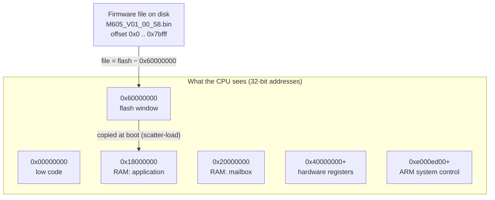

# Lesson 02 — How computers count

> **In one sentence:** Everything in this project, from USB packets to firmware instructions, is a list of bytes, and once you can read hex, byte order, addresses and bit masks you can read the real firmware yourself.
>
> **You will learn:**
> - bits, bytes, binary and hexadecimal, and how to convert hex to decimal and back
> - how to read an `xxd` dump, and the one trap in its right-hand column
> - KiB and MiB, and why `0x10000` keeps appearing
> - little-endian byte order, words and halfwords, using real bytes from the ASUS firmware file
> - addresses, memory maps, and the difference between a **file offset**, a **flash address** and a **RAM address**
> - bit fields and masks: `& 0xf`, `1 << index`, and how the polling-rate setting lives in the low 4 bits of a halfword
>
> **Time:** ~75 minutes (don't rush it) · **Prerequisites:** [Lesson 1](01-what-is-a-keyboard.md)

---

## 1. The story (kid version)

Think of a car's odometer. Each wheel shows a digit from 0 to 9. When the last wheel passes 9, it rolls back to 0 and pushes the next wheel up by one. That is counting in **base 10**.

Now imagine an odometer where each wheel has **sixteen** faces: `0 1 2 3 4 5 6 7 8 9 a b c d e f`. It rolls over after `f`, not after 9. That is **hexadecimal**, or "hex". Computers love it because one hex wheel holds exactly 4 on/off switches, and two hex wheels hold exactly one byte.

Next, imagine a very long street where every house holds one byte. Each house has a number: its **address**. Some stretches of the street are a library of books that never change (flash). Some are whiteboards (RAM). Some are doorbells: press one and a machine somewhere does something (hardware registers). A map of which stretch is which is called a **memory map**.

Finally, imagine you photocopied part of the street into a notebook. Page 0 of your notebook is not house number 0 on the street. To find a house in the notebook, you need to know **where the copy started**. Most of the confusing moments in this project came down to that one question.

### How the analogy maps to the real thing

| In the story | In the real keyboard |
|---|---|
| An odometer wheel with 16 faces | One hex digit = 4 [bits](00-glossary.md#bit) |
| Two wheels | One [byte](00-glossary.md#byte), `0x00` to `0xff` |
| A house number | An [address](00-glossary.md#address), such as `0x18000000` |
| The map of the street | The [memory map](00-glossary.md#memory-map) |
| The notebook copy | A file on your disk, such as `dumps/vendor/M605_V01_00_58.bin` |
| Page number in the notebook | A file [offset](00-glossary.md#offset) |
| "Where the copy started" | The base: `0x60000000` for the flash window, `0x18000000` for the application in RAM, `0x10000` for the device dump |

---

## 2. Why we needed this

From the first log to the last, the evidence in this repository is written in hex. USB descriptors are hex (Lesson 4). The vendor commands are hex (`51 21`, `50 55`). The firmware file is 507,904 bytes of raw binary, and every address in every log looks like `0x18002b2e`.

Hex reading was not just a skill for later. Several real mistakes in this project were counting mistakes:

- A comparison script read the text column of an `xxd` dump as if it were bytes, and reported a difference that did not exist (log 25, corrected by log 26).
- An address in the vendor release was read as if it were the same address in the installed release (corrected in log 106).
- Eight 16-byte text strings were mistaken for a table of code pointers, because four bytes of text happened to look like an address when read little-endian (log 131).

You will meet all three again in section 5. By the end of this lesson you will be able to see why each one happened.

---

## 3. The real thing

### 3.1 Bits and bytes

A **[bit](00-glossary.md#bit)** is one on/off value: 0 or 1.

A **[byte](00-glossary.md#byte)** is 8 bits. With 8 switches you can make 2 × 2 × 2 × 2 × 2 × 2 × 2 × 2 = 256 patterns, so a byte holds a number from 0 to 255.

Almost everything in this project is measured in bytes:

- A vendor HID report on interface 1 is **64 bytes** (FINDINGS "Interfaces, reports, endpoints, and bindings").
- The boot keyboard report is **8 bytes**.
- The bootloader reads flash in chunks of up to **48 bytes** (`0x30`) (log 92).

### 3.2 Binary: counting with only 0 and 1

In base 10, the places are worth 1, 10, 100, 1000... In **binary** (base 2), they are worth 1, 2, 4, 8, 16, 32, 64, 128.

```
bit number:    7    6    5    4    3    2    1    0
place value:  128   64   32   16    8    4    2    1
```

To read a binary number, add the place values of the bits that are 1:

```
0b00001111  =  8 + 4 + 2 + 1         =  15
0b10000001  =  128 + 1               =  129
0b10001111  =  128 + 8 + 4 + 2 + 1   =  143
```

`0b` in front means "this is binary". Bit 0, the rightmost, is called the **least significant bit** because it is worth the least. Bit 7 is the **most significant bit**.

Those three numbers are not random. 129 is `0x81`, the keyboard's boot-report endpoint. 143 is `0x8f`, the bootloader's status query (log 90). You will take them apart with masks in section 3.10.

### 3.3 Hexadecimal

Hex is base 16. Its digits are:

```
hex:      0  1  2  3  4  5  6  7  8  9  a   b   c   d   e   f
decimal:  0  1  2  3  4  5  6  7  8  9  10  11  12  13  14  15
binary:   0000 0001 0010 0011 0100 0101 0110 0111 1000 1001 1010 1011 1100 1101 1110 1111
```

The prefix `0x` means "hex". So `0x10` is not ten. It is one sixteen and zero ones: **16**.

**Why hex and not decimal?** Because each hex digit is exactly 4 bits, so a byte is always exactly two hex digits. You can read a byte's bits straight off its hex: `0x8f` is `1000` then `1111`, which is `0b10001111`. Decimal gives you no such shortcut.

#### Hex to decimal

Each hex place is worth 16 times the one to its right: 1, 16, 256, 4096, 65536...

```
0x30    = 3×16 + 0              = 48       (the bootloader's chunk size, log 92)
0x40    = 4×16 + 0              = 64       (a USB vendor report is 64 bytes)
0x64    = 6×16 + 4              = 100      (the actuation threshold, log 110)
0x98    = 9×16 + 8              = 152      (bits in the NKRO report, log 109)
0xff    = 15×16 + 15            = 255      (the biggest byte)
0x400   = 4×256                 = 1,024    (one KiB)
0x10000 = 1×65536               = 65,536   (64 KiB, the bootloader region's size)
0x7c000 = 7×65536 + 12×4096     = 507,904  (the whole ASUS firmware file)
```

Look at `0x64`. The firmware's actuation compare is literally the instruction `cmp r3,#0x64` (FINDINGS "Phase 5D"). In decimal, that is "compare with 100".

#### Decimal to hex

Divide by 16 again and again, and write the remainders from last to first. For 442,368 (the size of the device dump):

```
442368 ÷ 16 = 27648  remainder 0
 27648 ÷ 16 =  1728  remainder 0
  1728 ÷ 16 =   108  remainder 0
   108 ÷ 16 =     6  remainder 12 → c
     6 ÷ 16 =     0  remainder 6
reading upward: 0x6c000
```

You don't have to do this by hand. The shell and Python do it for you:

```bash
printf '%d %d %d %d %d %d %d\n' 0x10 0x30 0x40 0xff 0x10000 0x7c000 0x6c000
printf '0x%x 0x%x 0x%x\n' 507904 442368 4194304
```

Output:

```
16 48 64 255 65536 507904 442368
0x7c000 0x6c000 0x400000
```

### 3.4 Reading an `xxd` dump

`xxd` prints a file as hex. Here are the first 16 bytes of the ASUS firmware file:

```bash
xxd -g 1 -l 16 dumps/vendor/M605_V01_00_58.bin
```

```
00000000: 53 4e 43 37 33 32 30 41 10 00 00 00 00 00 00 00  SNC7320A........
```

There are three columns:

1. `00000000:` is the **offset**: how many bytes from the start of the file this line begins. It is in hex.
2. `53 4e 43 …` are the **bytes**, 16 per line. `-g 1` puts a space between every byte.
3. `SNC7320A........` shows the same bytes as **text**. A byte that is a printable letter is shown as that letter. Anything else is shown as a dot.

Each printable character has a number (its ASCII code): `S` is `0x53`, `N` is `0x4e`, `C` is `0x43`, `7` is `0x37`, and so on. So the first 8 bytes spell `SNC7320A`, the SONiX container marker.

Without `-g 1`, `xxd` groups bytes in pairs: `534e 4337 …`. The bytes are the same and in the same order. The pairing is only spacing.

**The trap in the third column.** The text column is only a display. It is not data. If a program reads a whole `xxd` line and pulls out everything that *looks* like hex, it will also pick up letters like `a`, `b`, `c`, `d`, `e`, `f` from the text column. That is exactly how log 25 reported a descriptor difference that did not exist (section 5).

### 3.5 KiB and MiB

Computers count memory in powers of 2:

| Unit | Bytes | Hex |
|---|---|---|
| 1 KiB (kibibyte) | 1,024 | `0x400` |
| 64 KiB | 65,536 | `0x10000` |
| 1 MiB (mebibyte) | 1,048,576 | `0x100000` |
| 4 MiB | 4,194,304 | `0x400000` |

The "i" in KiB means "binary thousand", 1,024 instead of 1,000.

Numbers from this project:

- The ASUS firmware file is `0x7c000` bytes = 507,904 = **496 KiB** (FINDINGS "Observed image layout").
- The bootloader region is `[0x0, 0x10000)` = **64 KiB** (log 81).
- The application region the bootloader can read is `[0x10000, 0x7c000)` = `0x6c000` = 442,368 bytes = **432 KiB** (log 92).
- U5 holds 32 Mbit = 4,194,304 bytes = `0x400000` = **4 MiB** (FINDINGS "User-supplied hardware facts").
- The bootloader checks the application in `0x10000`-byte chunks, taking a CRC of each 64 KiB piece (log 75, Lesson 9).

**Range notation.** `[0x10000, 0x7c000)` means "from `0x10000` up to but **not including** `0x7c000`". The square bracket includes its end, the round bracket excludes it. That is why the dump's file name ends in `0x7bfff`, the last byte actually included. The size is always end minus start: `0x7c000 − 0x10000 = 0x6c000`.

### 3.6 Numbers bigger than a byte: little-endian

A byte only goes up to 255. USB vendor IDs, addresses and lengths need more room, so they use 2 or 4 bytes together. The question is: **which byte goes first?**

- **[Big-endian](00-glossary.md#big-endian):** the most significant byte first, the way we write numbers.
- **[Little-endian](00-glossary.md#little-endian):** the **least** significant byte first. ARM Cortex-M uses this order.

The simplest real example: ASUS's USB vendor ID is `0x0b05` and the keyboard's product ID is `0x1b7e`. Log 37 found them stored side by side in the firmware at file offset `0x3f4f3`:

```bash
xxd -g 1 -s 0x3f4f0 -l 16 dumps/vendor/M605_V01_00_58.bin
```

```
0003f4f0: c0 c0 a7 05 0b 7e 1b 58 01 14 20 fa 05 14 01 01  .....~.X.. .....
```

Count along the line. `0x3f4f0` is `c0`, `0x3f4f1` is `c0`, `0x3f4f2` is `a7`, and **`0x3f4f3` is `05`**. The next four bytes are:

```
offset   0x3f4f3  0x3f4f4  0x3f4f5  0x3f4f6
byte        05       0b       7e       1b
            └── VID ──┘       └── PID ──┘
            low    high       low    high
```

Read each pair backwards, high byte first: `0b 05` → `0x0b05`, and `1b 7e` → `0x1b7e`. That is `0b05:1b7e`, the same VID:PID that `lsusb` shows (log 04). FINDINGS calls it the "little-endian VID:PID `0b05:1b7e`".

The tool `od` can do the reversing for you. `-t x2` means "show 2-byte numbers in hex, using this computer's byte order", and a PC is little-endian too:

```bash
od -A x -t x2 -j 0x3f4f3 -N 4 dumps/vendor/M605_V01_00_58.bin
```

```
03f4f3 0b05 1b7e
03f4f7
```

**A 4-byte example, from the live backup.** When the backup tool asks the bootloader to read address `0x00010000`, it sends a set-address command `0x20` followed by the address, little-endian. The saved dry-run in log 91 shows:

```
    set_addr   20 00 00 01 00 00 00 00 ...
```

`20` is the command. Then `00 00 01 00` is the address with the smallest byte first: reversed, it is `00 01 00 00` = `0x00010000`. The tool builds it with Python's `struct.unpack("<I", …)`, where `<` means little-endian and `I` means 4-byte unsigned integer ([tool/backup_firmware.py](../tool/backup_firmware.py)).

### 3.7 Words and halfwords

On this CPU:

| Name | Size | Example in this project |
|---|---|---|
| byte | 8 bits (1 byte) | a travel value 0..200 per key (log 119) |
| **halfword** | 16 bits (2 bytes) | the VID `0x0b05`; a raw Hall sample (log 119); the profile field at `+0x4f8` (log 126) |
| **[word](00-glossary.md#word)** | 32 bits (4 bytes) | an address such as `0x18000000`; a CRC-32 value |

**A real table of words: the vector table.** The start of Candidate A, at file offset `0x11000`, is an ARM [vector table](00-glossary.md#vector-table). Its entries are words.

```bash
xxd -g 1 -s 0x11000 -l 16 dumps/vendor/M605_V01_00_58.bin
```

```
00011000: 40 61 03 18 a9 14 00 00 bf 20 00 00 af 10 00 00  @a....... ......
```

Read four bytes at a time, backwards:

```
bytes        40 61 03 18   a9 14 00 00   bf 20 00 00   af 10 00 00
as a word    0x18036140    0x000014a9    0x000020bf    0x000010af
meaning      initial SP    reset handler  (other exception handlers)
```

`od -t x4` does the same reversal:

```bash
od -A x -t x4 -N 16 -j 0x11000 dumps/vendor/M605_V01_00_58.bin
```

```
011000 18036140 000014a9 000020bf 000010af
011010
```

These match FINDINGS exactly: "`0x11000`: initial SP `0x18036140`, reset handler `0x000014a9`". Word 0 is where the [stack pointer](00-glossary.md#stack-pointer-sp) starts (an address in RAM, `0x18…`). Word 1 is the address of the first instruction to run. Lesson 7 explains why it ends in `9` instead of `8`. (Short version, in section 3.10: bit 0 is a flag.)

**A real line of halfwords: Thumb instructions.** ARM [Thumb-2](00-glossary.md#thumb-2) instructions are 2 or 4 bytes. Here is the start of the polling-rate command handler in your keyboard's installed firmware. Log 126 lists it at runtime address `0x18002b2e`. Section 3.9 shows how to find it at offset `0x13b2e` in the device dump:

```bash
xxd -g 1 -s 0x13b2e -l 0x20 dumps/device/ROG_Falchion_Ace_HFX_installed_bcdDevice_1.59_app_0x10000_0x7bfff.bin
```

```
00013b2e: 21 79 03 29 01 d0 00 29 19 d1 c1 4a b2 f8 f8 04  !y.)...)...J....
00013b3e: 61 f3 03 00 a2 f8 f8 04 00 f0 0f 01 06 fa 01 f0  a...............
```

Line them up with log 126's listing. Each address step of 2 is a 2-byte instruction, and each step of 4 is a 4-byte one:

```
address    bytes          instruction (from log 126)
18002b2e   21 79          ldrb   r1,[r4,#0x4]     ; request byte 4, the index
18002b30   03 29          cmp    r1,#0x3
18002b32   01 d0          beq    0x18002b38
18002b34   00 29          cmp    r1,#0x0
18002b36   19 d1          bne    0x18002b6c
18002b38   c1 4a          ldr    r2,[0x18002e40]
18002b3a   b2 f8 f8 04    ldrh.w r0,[r2,#0x4f8]   ; load a HALFWORD
18002b3e   61 f3 03 00    bfi    r0,r1,#0x0,#0x4  ; put the index into bits 0..3
18002b42   a2 f8 f8 04    strh.w r0,[r2,#0x4f8]   ; store the halfword back
18002b46   00 f0 0f 01    and    r1,r0,#0xf       ; keep only the low 4 bits
18002b4a   06 fa 01 f0    lsl.w  r0,r6,r1         ; r0 = 1 << index
```

You do not need to decode ARM yet. Just notice two things. The instruction `ldrh` means "load **h**alfword". And the second halfword of `ldrh.w`, read little-endian, is `0x04f8`, and `0x4f8` is the field offset the listing shows. Section 3.10 explains what this code does with the bits.

### 3.8 Signed and unsigned (just enough)

The same four bytes can mean two different numbers. Look at file offset `0x10014`:

```
00010010: 00 10 01 60 ff ff ff ff 01 00 00 00 ff ff ff ff  ...`............
```

The word at `0x10014` is `ff ff ff ff` = `0xffffffff`.

- Read as **unsigned**, it is 4,294,967,295, the biggest 32-bit number.
- Read as **signed** (two's complement), it is **−1**.

Neither is "right". It depends on how the program uses it. Two places where this matters in the project:

- The Armoury Crate config file writes an unused key slot as `"keydata_1":"-1"` ([notes/key-matrix.md](../notes/key-matrix.md)). Stored in two bytes, −1 is `0xffff`.
- The firmware marks a missing Hall sample with the value `0xffff` (log 119). Log 121 notes that this sentinel "is compared **before** the subtraction, so it never wraps". If code subtracted first, an unsigned `0xffff` in arithmetic could turn into a huge or negative nonsense value. The firmware checks first.

For the rest of this course, assume numbers are **unsigned** unless a lesson says otherwise.

### 3.9 Addresses, memory maps, and the three kinds of location

An **address** names one byte in the CPU's view of memory. On a Cortex-M3 addresses are 32 bits, so they run from `0x00000000` to `0xffffffff`. Not every address has memory behind it. Different ranges connect to different hardware. A **memory map** says which is which.

Here is the part of the keyboard's memory map this course uses. Every row comes from a log:

| Address range starts at | What is there | Evidence |
|---|---|---|
| `0x00000000` | Low code addresses: the bootloader's own code, and where the entry image runs (Lesson 10) | logs 75, 101, 123 |
| `0x18000000` | RAM. The application is copied here and runs here. The stack pointer must lie in `0x18000000..0x18040000` | logs 72–73, 113 |
| `0x18038000` | RAM. The second execution context runs here | logs 98, 118 |
| `0x20000000` | RAM. The mailbox ring shared by the two contexts | log 118 |
| `0x40000000` and up | Hardware registers ([MMIO](00-glossary.md#mmio)). The USB controller is at `0x40100000` | logs 100, 107 |
| `0x45000000` | The system-control block used for clock and power setup | log 73 |
| `0x60000000` | The flash window: flash contents appear here, and code can run in place ([XIP](00-glossary.md#xip)) | logs 73, 74 |
| `0xe000ed08`, `0xe000ed0c` | ARM's own control registers: [VTOR](00-glossary.md#vtor) and [AIRCR](00-glossary.md#aircr) | logs 100, 101 |



Now the key idea of this lesson. **One byte can have three different numbers**, depending on where you are standing:

1. **File offset:** its position in a file on your disk. Starts at 0 for the first byte of the file.
2. **Flash address:** where the CPU sees it in the flash window. For the ASUS file, **file = flash − `0x60000000`**.
3. **RAM (runtime) address:** where it ends up after being copied into RAM. For the application, runtime `0x18000000` holds what was at flash `0x60021000`.

The investigation locked in the first rule from the checksum. The record table says Candidate A is at flash `0x60011000`. A CRC-32 over file bytes `0x11000..0x168ac` exactly matches the stored value, and "This locks both the flash→file mapping (`file = flash − 0x60000000`) and the algorithm" (FINDINGS "SN_FWIN integrity record table", log 74).

#### Worked example 1: flash to file

The SN_FWIN record table at file `0x10024` (read it yourself in section 3.11) lists:

| record | flash_addr | file offset = flash − `0x60000000` | ram_dest |
|---|---|---|---|
| A | `0x60011000` | `0x11000` | `0x18000000` |
| B | `0x60021000` | `0x21000` | `0x18000000` |

That is why Candidate A starts at file `0x11000` and Candidate B at file `0x21000`.

#### Worked example 2: RAM to file (vendor file)

The application's runtime address for a byte is `0x18000000 + (its position inside Candidate B)`. Candidate B starts at file `0x21000`. So, for code and data in the copied region:

```
file offset = runtime − 0x18000000 + 0x21000
```

Log 61 does exactly this for the reserved-key policy arrays and prints all three numbers:

```
unsupported_lists=runtime=0x1801c810 candidate_offset=0x1c810 file_offset=0x3d810 base_count=6 fn_count=57
```

`0x1801c810 − 0x18000000 = 0x1c810` (the "candidate offset", the position inside Candidate B), and `0x1c810 + 0x21000 = 0x3d810` (the file offset). Check it:

```bash
xxd -g 1 -s 0x3d810 -l 24 dumps/vendor/M605_V01_00_58.bin
```

```
0003d810: e8 00 00 00 53 00 00 00 39 00 00 00 47 00 00 00  ....S...9...G...
0003d820: e3 00 00 00 e2 00 00 00                          ........
```

Six little-endian words: `0xe8`, `0x53`, `0x39`, `0x47`, `0xe3`, `0xe2`. Log 61 lists the same six values as the base-layer unsupported-key policy: `VendorOrCustom_E8`, `NumLock`, `CapsLock`, `ScrollLock`, `LeftGUI`, `LeftAlt`.

#### Worked example 3: the device dump has a different base

The device dump does not start at flash `0x0`. It starts at logical flash offset `0x10000` (that is what `app_0x10000_0x7bfff` in its name means). So:

```
dump offset = logical flash offset − 0x10000
```

Its first bytes should therefore be the SN_FWIN header, which the vendor file has at `0x10000`:

```bash
xxd -g 1 -l 16 dumps/device/ROG_Falchion_Ace_HFX_installed_bcdDevice_1.59_app_0x10000_0x7bfff.bin
```

```
00000000: 53 4e 5f 46 57 49 4e 00 76 31 2e 30 2e 30 30 00  SN_FWIN.v1.0.00.
```

It is. Now combine the rules. The installed application also starts at logical `0x21000`, which is dump offset `0x11000`. So for the installed application:

```
dump offset = runtime − 0x18000000 + 0x11000
```

For the polling-rate handler at `0x18002b2e`: `0x2b2e + 0x11000 = 0x13b2e`, the offset used in section 3.7. And log 126 printed the handler's literal pool with `xxd -s 0x2e40` on the extracted installed application image, which starts at runtime `0x18000000`. In the full dump that is offset `0x13e40`:

```bash
xxd -g 1 -s 0x13e40 -l 16 dumps/device/ROG_Falchion_Ace_HFX_installed_bcdDevice_1.59_app_0x10000_0x7bfff.bin
```

```
00013e40: e0 1d 02 18 36 e7 01 18 3d 53 5f 50 52 5f 55 00  ....6...=S_PR_U.
```

The same bytes log 126 shows: `*(0x18002e40) = 0x18021de0` (the profile block), `*(0x18002e44) = 0x1801e736` (the multiplier byte), then the text `=S_PR_U`.

**Warning: the two releases are not at the same addresses.** The installed application record is 44 bytes longer than the vendor one (record length `0x1e780` against `0x1e754`, log 94). Code and data can therefore sit at different runtime addresses in 1.59 and 1.00.58. For example, the key-state structure that the installed firmware reads at `0x1801e734` is at `0x1801e70a` in the vendor application (log 127), and log 98 had to match functions across the two releases one by one. An address from one release must never be used in the other without checking. Section 5 has the real mistakes.

#### Worked example 4: the mirrored bootloader

FINDINGS says file `0x61000-0x70fff` is an "exact byte-for-byte copy of the first 64 KiB bootloader region". If that is true, a text string at offset X in the bootloader should also appear at X + `0x61000`:

```bash
strings -t x -n 8 dumps/vendor/M605_V01_00_58.bin | grep -i 'bootloader'
```

```
   dfef Gaming Keyboard Bootloader2
  6efef Gaming Keyboard Bootloader2
```

`0xdfef + 0x61000 = 0x6efef`. It does.

### 3.10 Bit fields and masks

Sometimes a single byte or halfword holds several small values packed together, each in its own group of bits. That is a **bit field**. To pull one out, or to change one, you use three tools.

| Operation | Symbol | Rule, bit by bit | Used for |
|---|---|---|---|
| AND | `&` | 1 only if **both** are 1 | **keep** some bits, clear the rest |
| OR | `\|` | 1 if **either** is 1 | **set** some bits |
| shift left | `<<` | slide all bits left, fill with 0 | build a value, or multiply by 2, 4, 8… |

The number you AND with is called a **mask**. The 1-bits in the mask are the bits you keep.

#### Example 1: which way does a USB endpoint point?

Endpoint `0x81` is the boot keyboard's IN endpoint. The top bit (`0x80`) gives the direction and the low 4 bits give the number (Glossary, [endpoint](00-glossary.md#endpoint)):

```
0x81         = 1000 0001
0x81 & 0x80  = 1000 0000  → 0x80: the direction bit is set, so IN (device to host)
0x81 & 0x0f  = 0000 0001  → endpoint number 1
```

#### Example 2: the bootloader's replies

The backup tool expects each bootloader reply to start with the query code with its top bit cleared. From [tool/backup_firmware.py](../tool/backup_firmware.py):

```python
Q_STATUS, Q_READDATA = 0x8F, 0xAA
R_STATUS, R_READDATA = Q_STATUS & 0x7F, Q_READDATA & 0x7F     # 0x0f, 0x2a
```

```
0x8f         = 1000 1111
0x7f         = 0111 1111   (mask: every bit except the top one)
0x8f & 0x7f  = 0000 1111   = 0x0f
0xaa & 0x7f  = 0010 1010   = 0x2a
```

And the live replies in log 90 start with exactly those bytes: `status_before=0f 00 00 …` and `buffer_reply=2a 00 00 …`.

#### Example 3: the Thumb bit

The reset handler word you read at `0x11004` was `0x000014a9`. On Cortex-M, bit 0 of a code address is a flag meaning "this is Thumb code". The instruction itself starts at the even address (Glossary, [Thumb-2](00-glossary.md#thumb-2)):

```
0x14a9 & 1    = 1        → the Thumb flag is set
0x14a9 & ~1   = 0x14a8   → the real start of the code (~1 means "every bit except bit 0")
```

FINDINGS names it `CandidateA_Reset_Handler @ 0x14a8`. Candidate A's own addresses count from its start, and it starts at file `0x11000`, so the code is at file `0x11000 + 0x14a8 = 0x124a8`. Log 37 lists "file 0x124a8: application candidate-A reset handler".

#### Example 4: the polling rate in the low 4 bits

This is the example from the lesson title. The profile block has a halfword at offset `+0x4f8`. Log 125 read it as a version stamp. Log 126 refined that: the halfword holds the version stamp **and**, in its **low four bits**, bits 0..3, the polling-rate index.

```
halfword at profile +0x4f8:

bit:  15 14 13 12 11 10  9  8  7  6  5  4 | 3  2  1  0
      └──── rest of the halfword ────────┘ └─ index ─┘
```

Reading it, from the reload path and the `12 15` read-back command (log 126):

```
and   r0,r0,#0xf       ; index = halfword & 0xf
```

`0xf` is `0000 0000 0000 1111`, so the AND keeps bits 0..3 and clears everything else.

Writing it, from the `51 31` handler (section 3.7): `bfi r0,r1,#0x0,#0x4` means "bit-field insert: put the low 4 bits of r1 into bits 0..3 of r0, leave the other bits alone". Then:

```
lsl.w r0,r6,r1         ; r6 = 1, so r0 = 1 << index
```

`1 << index` slides a single 1-bit left by `index` places:

| index | `1 << index` | in binary | rate | how known |
|---|---|---|---|---|
| 0 | 1 | `0001` | 1000 Hz | measured on the wire |
| 1 | 2 | `0010` | 2000 Hz | derived from `1 << index`; **not observed** |
| 2 | 4 | `0100` | 4000 Hz | derived from `1 << index`; **not observed** |
| 3 | 8 | `1000` | 8000 Hz | measured on the wire |

(FINDINGS "The polling-rate protocol, from the wire (log 126)".) The handler only accepts 0 and 3. Log 127 later found that indices 1 and 2 would not actually work, because the tick code only has two branches. Lesson 17 tells the whole story. For now, the point is how much information four bits can hold, and how the firmware gets them out with `& 0xf`.

The Armoury Crate profile decode says `"pollingRate": "3"` ([notes/ac-profile3-decoded.json](../notes/ac-profile3-decoded.json)). Log 126: "`"pollingRate": "3"` MEANS 8000 Hz".

#### Example 5: sixteen bytes of text that looked like an address

The entry image contains fault messages like `R1:   0x%08X` followed by a line break (`0d 0a`) and two zero bytes. In the installed dump (the entry image starts at dump offset `0x1000`, so entry address `0x1404` is dump offset `0x2404`):

```bash
xxd -g 1 -s 0x2404 -l 4 dumps/device/ROG_Falchion_Ace_HFX_installed_bcdDevice_1.59_app_0x10000_0x7bfff.bin
```

```
00002404: 0d 0a 00 00                                      ....
```

Read as a little-endian word, `0d 0a 00 00` is `0x00000a0d`. It is odd, so the Thumb bit is set, and `0x00000a0c` is inside the image. It *looks* exactly like a pointer to code. Log 131 found that an earlier analysis had treated this run of strings as a table of eight code pointers. "86% of the run's span is printable text." Bytes do not carry labels. The same four bytes are a line ending or an address, depending only on how you read them.

### 3.11 Putting it together: decoding the SN_FWIN record table

Here are the header and record table the bootloader reads (Lesson 6 covers the header in depth):

```bash
xxd -g 1 -s 0x10000 -l 0x50 dumps/vendor/M605_V01_00_58.bin
```

```
00010000: 53 4e 5f 46 57 49 4e 00 76 31 2e 30 2e 30 30 00  SN_FWIN.v1.0.00.
00010010: 00 10 01 60 ff ff ff ff 01 00 00 00 ff ff ff ff  ...`............
00010020: 00 00 00 00 00 10 01 60 ac 58 00 00 7a c1 75 5e  .......`.X..z.u^
00010030: 00 00 00 18 00 10 02 60 54 e7 01 00 16 c1 76 1a  .......`T.....v.
00010040: 00 00 00 18 00 10 02 60 00 00 00 00 00 00 00 00  .......`........
```

- `0x10000`: `SN_FWIN` then a zero byte. A zero byte ends a text string.
- `0x10008`: `v1.0.00`. This is the container format version, **not** the ASUS release version (log 94).
- `0x10024`: the record table. Each record is four words: `(flash_addr, length, crc32, ram_dest)` (log 74).

Take record A, 16 bytes starting at `0x10024`, and reverse each group of four:

```
00 10 01 60 → 0x60011000   flash_addr   (file 0x11000)
ac 58 00 00 → 0x000058ac   length       (22,700 bytes)
7a c1 75 5e → 0x5e75c17a   crc32
00 00 00 18 → 0x18000000   ram_dest
```

`xxd -e -g 4` prints little-endian words directly:

```bash
xxd -s 0x10024 -l 0x30 -e -g 4 dumps/vendor/M605_V01_00_58.bin
```

```
00010024: 60011000 000058ac 5e75c17a 18000000  ...`.X..z.u^....
00010034: 60021000 0001e754 1a76c116 18000000  ...`T.....v.....
00010044: 60021000 00000000 00000000 00000000  ...`............
```

These are exactly the values in FINDINGS: record A `0x60011000`, `0x000058ac`, `0x5e75c17a`, `0x18000000`. Record B `0x60021000`, `0x0001e754`, `0x1a76c116`, `0x18000000`. The third slot has an address but **zero length**. It is an inactive hole, not the end of the table (log 95).

With Python's `struct` module, the same decoding is one line per record:

```bash
python3 - <<'EOF'
import struct
d = open('dumps/vendor/M605_V01_00_58.bin', 'rb').read()
for i in range(3):
    o = 0x10024 + 16*i
    print(hex(o), [hex(x) for x in struct.unpack_from('<4I', d, o)])
EOF
```

```
0x10024 ['0x60011000', '0x58ac', '0x5e75c17a', '0x18000000']
0x10034 ['0x60021000', '0x1e754', '0x1a76c116', '0x18000000']
0x10044 ['0x60021000', '0x0', '0x0', '0x0']
```

`'<4I'` means: little-endian (`<`), four (`4`) unsigned 32-bit integers (`I`).

---

## 4. Decisions and why

| Decision | Why | Alternative rejected | Evidence (log) |
|---|---|---|---|
| Express every offset as a logical flash offset, with a single translation point | Two images with different bases (vendor at 0, dump at `0x10000`) made ad-hoc offsets error-prone | Hand-computed offsets scattered through each script | log 94 (`tool/falchion_image.py`) |
| Lock `file = flash − 0x60000000` with a checksum, not a guess | A CRC-32 over the mapped bytes reproduced the stored value exactly | Assuming a base from the look of the addresses | log 74 |
| Compare descriptor bytes with strict two-hex-digit parsing | Free-text parsing picked up `xxd`'s text column | Parsing whole `xxd` lines | logs 25, 26 |
| Regenerate the binary pointer search byte-safely | Shell escaping had corrupted the search bytes | Trusting the first search result | log 50 |
| Derive installed addresses instead of assuming them equal to vendor ones | The releases are laid out differently | Reusing vendor addresses for 1.59 | log 106 |
| Scope every address query to one image | Both applications share base `0x18000000`, so an unscoped query mixes two releases | One query across all exports | log 128 |
| Label `2000 Hz` and `4000 Hz` "derived, not observed" | They come from arithmetic (`1 << index`), not from a measurement | Listing all four rates as fact | log 126 |

---

## 5. What went wrong, and how it was caught

**1. The text column that wasn't data (log 25).**
- *Believed:* after plugging into the other connector, the saved USB descriptor blob was `DIFFERENT` from the first one.
- *True:* the parser had included `xxd`'s ASCII column. With strict byte parsing, log 26 found `old_hex_chars=318 new_hex_chars=318` and `USB DESCRIPTORS: IDENTICAL`. (318 hex characters is 159 bytes.)
- *Caught by:* re-checking the comparison with strict two-hex-digit extraction. Log 25 was kept, marked as superseded.
- *Lesson:* **know which part of a dump is data and which part is decoration.**

**2. A search corrupted by the shell (log 50).**
- *Believed:* the first binary search for pointer bytes had searched for the right bytes.
- *True:* "Shell escaping was malformed; log 50 was regenerated byte-safely" (TIMELINE "Corrections retained for auditability").
- *Lesson:* **when you search for bytes, make sure the bytes you typed are the bytes you searched for.**

**3. A checksum "at `0x61000`" (log 84).**
- *Believed:* an earlier draft said the duplicate bootloader's checksum was at `0x61000`.
- *True:* `0x61000` is where the duplicate region **starts**. Its word-sum is stored in its last word, at `0x70ffc` (the primary's is at `0x0fffc`).
- *Lesson:* **the start of a region and a field inside it are different addresses.** Say which one you mean.

**4. Vendor addresses read as installed addresses (log 106).**
- *Believed:* log 80's addresses were addresses in the installed firmware.
- *True:* log 80 had decompiled the **vendor** application slice. "The installed primitive was derived as `0x18012fd0`, not assumed equal."
- *Lesson:* **an address only means something together with the image it belongs to.**

**5. An unscoped query that merged two releases (log 128).**
- *Believed:* one block of RAM had five writers.
- *True:* "The vendor application shares the `0x18000000` base, so an unscoped range query merged two releases and turned block D's single writer into five. Queries are now scoped to one export and a test pins it."
- *Lesson:* same as mistake 4, but made by a tool. Same address, different image, different byte.

**6. Text read as pointers (log 131).**
- *Believed:* entry-image table `0x1404` held "eight structures carrying a shared default callback `0x00000a0c`".
- *True:* it holds eight `Rn:   0x%08X` format strings. "The `0d 0a 00 00` terminating each one reads as `0x00000a0d`." The function Ghidra created at `0x00000a0c` was then wrongly cited as proof, and that function had been created by the analysis's own seed.
- *Caught by:* the review of Phase 5A recorded in log 131.
- *Lesson:* **a value that looks like an address is not proof that it is one.** Check what the neighbouring bytes are.

**7. The "zero terminator" that was a hole (log 95).**
- *Believed:* the record table ended at the first slot with a zero length.
- *True:* the bootloader loops over all eight slots and skips only zero-length ones. "Slots 3 to 7 are all-zero in both preserved images, which is why the old rule produced the right two records for the wrong reason."
- *Caught by:* independent review of Phase 1. The reviewer built an image with an active slot behind the hole (log 95; see Lesson 3).
- *Lesson:* **getting the right answer is not the same as having the right rule.**

---

## 6. Try it yourself

All commands read files only. Run them from `keyboard/falchion-re/`. Try to work out each answer **before** you run the command.

**Exercise 1: hex to decimal.** Convert by hand, then check:

```bash
printf '%d %d %d %d %d\n' 0x30 0x64 0x98 0x400 0x10000
```

```
48 100 152 1024 65536
```

**Exercise 2: decimal to hex.** What are 507,904, 442,368 and 4,194,304 in hex?

```bash
printf '0x%x 0x%x 0x%x\n' 507904 442368 4194304
```

```
0x7c000 0x6c000 0x400000
```

**Exercise 3: range arithmetic.** The backup reads `[0x10000, 0x7c000)` in 48-byte chunks. How many chunks is that?

```bash
printf '%d 0x%x %d\n' $((0x7c000-0x10000)) $((0x7c000-0x10000)) $(((0x7c000-0x10000)/0x30))
```

```
442368 0x6c000 9216
```

Log 92 says the same: `size per pass: 0x6c000 = 442368 bytes`, `chunks per pass: 9216`.

**Exercise 4: binary.** Write `0x0f`, `0x81` and `0x8f` in binary, then check:

```bash
python3 -c "print(bin(0x0f), bin(0x81), bin(0x8f))"
```

```
0b1111 0b10000001 0b10001111
```

**Exercise 5: masks.** Predict all six values first:

```bash
python3 -c "print(hex(0x8f & 0x7f), hex(0xaa & 0x7f), hex(0x81 & 0x80), 0x81 & 0x0f, hex(0x14a9 & ~1), 0x14a9 & 1)"
```

```
0xf 0x2a 0x80 1 0x14a8 1
```

**Exercise 6: shifts.** Build the polling-rate multipliers:

```bash
python3 -c "print([1 << i for i in range(4)])"
```

```
[1, 2, 4, 8]
```

**Exercise 7: find the chip family.** What are the first 8 bytes as text?

```bash
xxd -g 1 -l 8 dumps/vendor/M605_V01_00_58.bin
```

```
00000000: 53 4e 43 37 33 32 30 41                          SNC7320A
```

**Exercise 8: little-endian VID:PID.** Read two halfwords at `0x3f4f3`.

```bash
xxd -g 1 -s 0x3f4f3 -l 4 dumps/vendor/M605_V01_00_58.bin
python3 -c "import struct; d=open('dumps/vendor/M605_V01_00_58.bin','rb').read(); print([hex(x) for x in struct.unpack_from('<2H', d, 0x3f4f3)])"
```

```
0003f4f3: 05 0b 7e 1b                                      ..~.
['0xb05', '0x1b7e']
```

(`H` in `struct` means an unsigned 16-bit halfword. Python drops the leading zero of `0x0b05`.)

**Exercise 9: flash address to file offset.** Record B says flash `0x60021000`. What file offset is that, and what are Candidate B's first 8 bytes?

```bash
printf '0x%x\n' $((0x60021000 - 0x60000000))
xxd -g 1 -s 0x21000 -l 8 dumps/vendor/M605_V01_00_58.bin
```

```
0x21000
00021000: fe b5 1e 46 14 46 4f f0                          ...F.FO.
```

Log 37 lists file `0x21000` as the "start of candidate-B executable code", so these bytes are Thumb instructions. You'll learn to read them in Lesson 7.

**Exercise 10: runtime address to file offset.** The key-translation table is at runtime `0x1801bff6` in the vendor application (log 61). Where is it in the file?

```bash
printf '0x%x\n' $((0x1801bff6 - 0x18000000 + 0x21000))
grep -m1 'key_translation' logs/61-candidate-b-table-analysis.txt
```

```
0x3cff6
key_translation=runtime=0x1801bff6 candidate_offset=0x1bff6 file_offset=0x3cff6 length=189
```

Log 61's `file_offset` is exactly the number you computed. (The `length=189` is the 189-entry wire-ID table from Lesson 1, the one that must never be used as a key count.)

**Exercise 11: the dump's base.** The device dump starts at logical `0x10000`. Where in the dump is the SN_FWIN record table (logical `0x10024`)? Compare its record B with the vendor file's.

```bash
xxd -s 0x24 -l 0x20 -e -g 4 dumps/device/ROG_Falchion_Ace_HFX_installed_bcdDevice_1.59_app_0x10000_0x7bfff.bin
```

```
00000024: 60011000 000058ac 7d552485 18000000  ...`.X...$U}....
00000034: 60021000 0001e780 eb0a9879 18000000  ...`....y.......
```

Record B's length is `0x1e780` here and `0x1e754` in the vendor file. `0x1e780 − 0x1e754 = 0x2c` = 44 bytes: "the application record grew by 44 bytes" (log 94). Record A's CRC also differs: `0x7d552485` installed against `0x5e75c17a` vendor. Log 91 saw exactly this when it read the first 48 bytes live: "the last u32 record checksum differs (`85 24 55 7d` installed, `7a c1 75 5e` preserved)".

**Exercise 12: the word-sum.** The last word of the application region, at `0x7bffc`, is the 32-bit sum of every word before it, from `0x10000` (FINDINGS "Integrity and authentication"). Check it:

```bash
xxd -g 1 -s 0x7bffc -l 4 dumps/vendor/M605_V01_00_58.bin
python3 - <<'EOF'
import struct
d = open('dumps/vendor/M605_V01_00_58.bin', 'rb').read()
n = (0x7bffc - 0x10000) // 4
s = sum(struct.unpack_from('<%dI' % n, d, 0x10000)) & 0xffffffff
print(hex(s), hex(struct.unpack_from('<I', d, 0x7bffc)[0]))
EOF
```

```
0007bffc: a9 c5 27 5d                                      ..']
0x5d27c5a9 0x5d27c5a9
```

`& 0xffffffff` is a mask too: it keeps only the lowest 32 bits of the sum, which is what "sum mod 2³²" means. The result, `0x5d27c5a9`, is the value FINDINGS gives.

**Exercise 13: the mirror.** Is the 64 KiB at `0x61000` really identical to the first 64 KiB? And does the device dump contain the same copy (logical `0x61000` = dump offset `0x51000`)?

```bash
head -c 65536 dumps/vendor/M605_V01_00_58.bin | sha256sum
dd if=dumps/vendor/M605_V01_00_58.bin bs=4096 skip=$((0x61000/4096)) count=16 status=none | sha256sum
dd if=dumps/device/ROG_Falchion_Ace_HFX_installed_bcdDevice_1.59_app_0x10000_0x7bfff.bin bs=4096 skip=$((0x51000/4096)) count=16 status=none | sha256sum
```

```
4a4568b61bc245397b0ede6f285eb1bd8a7fa2018bc1373bc05e73eabb0f686a  -
4a4568b61bc245397b0ede6f285eb1bd8a7fa2018bc1373bc05e73eabb0f686a  -
4a4568b61bc245397b0ede6f285eb1bd8a7fa2018bc1373bc05e73eabb0f686a  -
```

All three match the hash `4a4568b6…686a` in log 94 and [notes/step6-offline-custom-firmware-plan.md](../notes/step6-offline-custom-firmware-plan.md). (`dd` counts in blocks here: `bs=4096` means 4 KiB blocks, so `skip=$((0x61000/4096))` skips 97 blocks and `count=16` copies 64 KiB.)

**Exercise 14: halfword instructions.** Find the polling-rate handler in the dump and spot the `0x4f8` inside the `ldrh.w` instruction.

```bash
printf '0x%x\n' $((0x18002b3a - 0x18000000 + 0x11000))
xxd -g 1 -s 0x13b3a -l 4 dumps/device/ROG_Falchion_Ace_HFX_installed_bcdDevice_1.59_app_0x10000_0x7bfff.bin
```

```
0x13b3a
00013b3a: b2 f8 f8 04                                      ....
```

The second halfword is `f8 04`, which read little-endian is `0x04f8`.

---

## 7. Check your understanding

1. What is `0x7c000` in decimal, and what does it measure in this project?
   <details><summary>Answer</summary>507,904 bytes, which is 496 KiB. It is the size of the ASUS firmware file, and the end of the application region `[0x10000, 0x7c000)`.</details>

2. The bytes at a certain offset are `00 10 02 60`. What 32-bit value is that, and what file offset does it point to in the vendor image?
   <details><summary>Answer</summary>Little-endian, it is `0x60021000`. That is a flash-window address, so the file offset is `0x60021000 − 0x60000000 = 0x21000`: the start of Candidate B.</details>

3. The application variable at runtime `0x1801e736` holds the polling-rate multiplier. Why can't you just look at file offset `0x1801e736 − 0x18000000 + 0x21000` to see its value?
   <details><summary>Answer</summary>Three reasons. First, it is a RAM variable: the value that matters is written by the firmware at run time. Second, that formula is only valid for bytes in the region copied byte for byte from flash. `0x1e736` is past the vendor copy region's length of `0x1e354` (log 73), in the part that is decompressed at start-up, so its bytes are not stored plainly at that offset. Third, `0x1801e736` is an address in the **installed** release (logs 126–127), and the vendor application keeps the same structure at a different address (log 127).</details>

4. A halfword at profile `+0x4f8` is `0x…3` in its low four bits. What is `halfword & 0xf`, what is `1 << that`, and what polling rate is it?
   <details><summary>Answer</summary>`& 0xf` gives 3. `1 << 3` is 8. Index 3 was measured on the wire as 8000 Hz (log 126).</details>

5. Why is `0xffff` dangerous as a Hall sample if the code subtracted before checking it?
   <details><summary>Answer</summary>Because `0xffff` is a "no sample" marker, not a real reading. Subtracting it from a reference would produce a wrapped or negative nonsense value. The firmware compares against the sentinel before the subtraction, so it never wraps (log 121).</details>

6. Why did log 131's "table of pointers" at `0x1404` look convincing?
   <details><summary>Answer</summary>Each 16-byte text record ended in `0d 0a 00 00`. Read as a little-endian word that is `0x00000a0d`: odd (so it has the Thumb bit) and pointing inside the image, at a perfectly regular 16-byte stride. Only the shape looked like pointers. The bytes around it were printable text.</details>

---

## 8. Sources

- [../FINDINGS.md](../FINDINGS.md): "Observed image layout", "Integrity and authentication", "Concrete patchability evidence", "Candidate A reset, scatter-load, and RAM base (logs 72–73)", "SN_FWIN integrity record table and Candidate B checksum status (log 74)", "Shared image-format library and installed-versus-vendor layout facts (log 94)", "Phase 5D", "The polling-rate protocol, from the wire (log 126)", "The `0x1404` run is eight printf format strings"
- [../TIMELINE.md](../TIMELINE.md): "Corrections retained for auditability", "Plan review and Step 6 Phase 1 (log 94)"
- [../logs/25-port-retry-comparison.txt](../logs/25-port-retry-comparison.txt), [../logs/26-port-retry-corrected-comparison.txt](../logs/26-port-retry-corrected-comparison.txt)
- [../logs/37-firmware-modification-feasibility.txt](../logs/37-firmware-modification-feasibility.txt)
- [../logs/61-candidate-b-table-analysis.txt](../logs/61-candidate-b-table-analysis.txt)
- [../logs/74-candidate-integrity-crc-analysis.txt](../logs/74-candidate-integrity-crc-analysis.txt)
- [../logs/90-live-split-channel-status-buffer-probe.txt](../logs/90-live-split-channel-status-buffer-probe.txt), [../logs/91-one-block-read-validation.txt](../logs/91-one-block-read-validation.txt), [../logs/92-full-app-region-backup.txt](../logs/92-full-app-region-backup.txt)
- [../logs/94-version-aware-image-format-library.txt](../logs/94-version-aware-image-format-library.txt), [../logs/95-phase1-record-scan-correction.txt](../logs/95-phase1-record-scan-correction.txt)
- [../logs/126-polling-rate-capture-analysis.txt](../logs/126-polling-rate-capture-analysis.txt), [../logs/127-polling-rate-reader.txt](../logs/127-polling-rate-reader.txt)
- [../logs/131-pointer-root-and-windows-capture-tooling-corrections.txt](../logs/131-pointer-root-and-windows-capture-tooling-corrections.txt)
- [../notes/key-matrix.md](../notes/key-matrix.md), [../notes/ac-profile3-decoded.json](../notes/ac-profile3-decoded.json)
- [../tool/backup_firmware.py](../tool/backup_firmware.py), [../tool/falchion_image.py](../tool/falchion_image.py)

[← Previous: What's inside a keyboard](01-what-is-a-keyboard.md) · [Course home](README.md) · [Next →: The detective's rules](03-the-detectives-rules.md)
