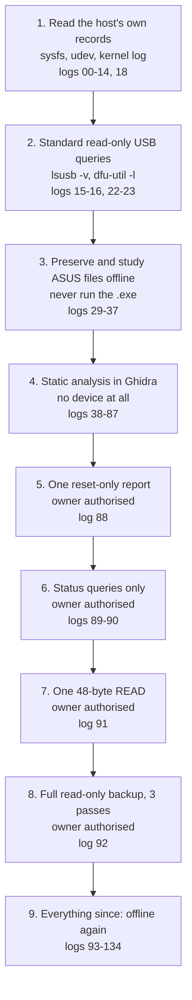
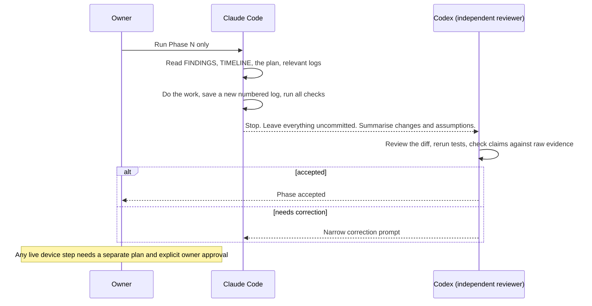

# Lesson 03 — The detective's rules

> **In one sentence:** The keyboard was never bricked because the investigation followed a small set of rules: label how sure you are, read before you write, keep every result in a numbered and hashed log, ask the owner before every live step, build tools that refuse anything unsafe, and write down every mistake instead of hiding it.
>
> **You will learn:**
> - the four evidence labels, and the finer confidence words the later notes use
> - why the work went read-only first, and why the ASUS firmware file was never treated as a backup
> - why an echoed reply from the keyboard is not proof that anything happened
> - how numbered logs, `logs/COMMANDS.md` and `SHA256SUMS` turn a folder into a lab notebook you can check yourself
> - how each live step was authorised, and how the tools refuse unsafe actions by design
> - how Claude Code and Codex split the work, and why an audit of the earlier Claude work came first
>
> **Time:** ~50 minutes · **Prerequisites:** [Lesson 1](01-what-is-a-keyboard.md), [Lesson 2](02-how-computers-count.md)

---

## 1. The story (kid version)

A good detective does not arrest the first person who looks guilty. She writes in her notebook what she **saw with her own eyes**, what a witness **told her**, what she **thinks** happened, and what she **still doesn't know**. She keeps those four lists apart, because mixing them up is how innocent people go to jail.

She also has house rules. She photographs the room before she touches anything. She never "tidies up" a crime scene. Every page in her notebook is numbered, and she never tears one out. If she gets something wrong on page 25, she does not erase it. She writes on page 26: "page 25 was wrong, here is why". And before she does anything that can't be undone, like opening a locked safe, she asks the owner for permission, one safe at a time.

Finally, she has a partner. After each day's work, the partner reads the notebook, re-checks the evidence, and says "accepted" or "fix this".

### How the analogy maps to the real thing

| In the story | In the real investigation |
|---|---|
| "Saw it myself" / "a witness said" / "I think" / "don't know" | **Verified current evidence** / **Historical observation** / **Inference** / **Unresolved** (TIMELINE "Evidence and safety conventions") |
| Photographing the room before touching | Read-only USB inspection first (logs 00–26); preserving the ASUS files with hashes (logs 29–35) |
| Numbered notebook pages, never torn out | The numbered `logs/NN-*.txt` files, indexed in [logs/COMMANDS.md](../logs/COMMANDS.md) and fingerprinted in [logs/SHA256SUMS](../logs/SHA256SUMS) |
| "Page 25 was wrong" written on page 26 | Log 25 is kept, and log 26 corrects it. TIMELINE keeps a whole table: "Corrections retained for auditability" |
| Asking before opening each safe | The owner authorised each live device action separately (logs 88–92) |
| The partner who re-checks | Codex, the independent reviewer, checked each phase that Claude Code carried out ([notes/step6-offline-custom-firmware-plan.md](../notes/step6-offline-custom-firmware-plan.md)) |

---

## 2. Why we needed this

A keyboard's firmware is the only thing that makes it a keyboard. If a write goes wrong halfway, you can end up with a [brick](00-glossary.md#brick): a device that no longer starts. On this keyboard that risk was real and specific:

- There was **no standard USB updater** to fall back on. `dfu-util -l` found no DFU target (logs 16, 23).
- There was **no hardware programmer**. "No Bus Pirate, SWD probe, or SPI programmer is connected" (FINDINGS "User-supplied hardware facts").
- There was **no copy of the installed firmware** at the start. The only firmware on disk was ASUS's 1.00.58 file, and the keyboard runs 1.59.
- The earliest guide in the repository contained instructions that, if followed, could have destroyed the evidence (section 5).

So before anyone learned anything clever about the firmware, the project had to decide *how* it would work. The rules in this lesson are that decision. They were written down in TIMELINE's first section, applied from log 00 onwards, and later formalised in the Step 6 plan (log 93).

The alternative was the common hobbyist approach: flash a modified image and see what happens. It was never considered acceptable here. As FINDINGS puts it: **"Being able to edit the BIN is not the same as having a recoverable modification workflow."**

---

## 3. The real thing

### 3.1 The four evidence labels

These come word for word from TIMELINE "Evidence and safety conventions":

| Label | Meaning (TIMELINE's words) | Example from this project |
|---|---|---|
| **Verified current evidence** | "reproduced from the connected keyboard, preserved ASUS files, or saved offline analysis" | VID:PID `0b05:1b7e` and `bcdDevice 1.59`, read from the keyboard's descriptors (logs 04, 15) |
| **Historical observation** | "recorded by the earlier Windows/Armoury Crate investigation. The notes and decoded snapshots exist, but the cited raw PCAP files are not currently present" | "`Fn+Q` stayed unchanged even though the device echoed the request" ([notes/protocol.md](../notes/protocol.md) §5) |
| **Inference** | "a conclusion supported by several facts but not yet proven directly" | U7 is "likely a USB signal switch" (FINDINGS "User-supplied hardware facts") |
| **Unresolved** | "the available evidence does not support a safe answer" | Whether the SNC73270 has internal nonvolatile memory (same section) |

As the work went deeper into the firmware, the notes started using finer confidence words for each claim:

- **observed**: read directly from the bytes or the instruction listing. Example: "`travel >= 100` → key down", confirmed "against the listing rather than the decompiler" (log 110).
- **strongly inferred**: several independent facts point the same way, but one assumption remains. Example: "IRQ38 = 8000 Hz (125 µs), strongly-inferred", because it "additionally assumes the report stage makes at most one new report available per invocation" (log 127).
- **inference** (or "inferred"): a reasonable reading, not proven. Example: after the bootloader copies the entry image to address 0 and resets, what actually runs "depends on an unidentified address-0 alias, so it is an inference" (log 103).
- **unresolved**: the evidence cannot decide. Example: whether the two execution contexts run at the same time ([notes/dual-core-question.md](../notes/dual-core-question.md)).

Some tools enforce the labels in code. `tool/map_rgb_driver_hunt.py`, for example, checks that every claim's confidence is one of `observed`, `strongly-inferred`, `inferred`, `hypothesis` or `unresolved`, and fails if any claim has no label or no citation.

The historical protocol notes use their own tags: **[V]** verified on hardware, **[C]** from a packet capture, **[S]** static analysis of ASUS's DLL, **[?]** unresolved. Their header warns that because the PCAPs are gone, `[V]` and `[C]` now mean "recorded as verified/captured during the earlier work, not independently reproducible from the current checkout" ([notes/protocol.md](../notes/protocol.md)).

**The golden rule: never upgrade a label without new evidence.** "Consistent with" is not "proven". The SNC7320 product brief lists two watchdogs, and the firmware has two magic-key-protected blocks. The references note allows that to "raise or lower the prior on a hypothesis", and then says: "a consistency is not an identification" ([notes/references.md](../notes/references.md)).

### 3.2 Read-only first

The investigation moved in widening circles, each one riskier than the last and each started only after the one before it was safe:



The FINDINGS header lists what the 2026-08-29 session did **not** do: "No firmware update, HID data/feature report request, vendor control command, DFU detach/upload/download, USB reset, driver detach, permission change, erase, program, or SPI transaction was performed."

Even reading can have side effects, so "read-only" had to be checked, not assumed. Two examples:

- `usbhid-dump` "was invoked only with `--help`; it was never pointed at the keyboard" (FINDINGS "Commands run").
- Interface 4's descriptor was fetched with the standard `GET_DESCRIPTOR` request, and "No feature value (`GET_REPORT`) or output report was requested" (FINDINGS "Interfaces, reports, endpoints, and bindings").

**Not saving is not the same as not writing.** The historical Windows tests showed that the remap command `51 21` changes the keyboard's behaviour immediately, without the `50 55` commit. "Therefore an uncommitted remap is still a device write and is not preservation-safe" (TIMELINE, 2026-08-26). FINDINGS adds: "`Fn + Caps` is a settings factory reset, not firmware recovery."

### 3.3 Why the vendor image is not a backup

ASUS's update package contains `M605_V01_00_58.bin`. It is preserved and hashed (log 35), and it was essential for the analysis. But it was never accepted as a backup, for four reasons, all in the docs:

1. **It is a different version.** "`dumps/vendor/M605_V01_00_58.bin` is a vendor reference image (v1.00.58), not a readback of this unit (v1.59)" (FINDINGS "Current answer").
2. **The bytes really differ.** The first live 48-byte read in log 91 matched the vendor file for 44 bytes and then differed: "`85 24 55 7d` installed, `7a c1 75 5e` preserved". The installed application record is also 44 bytes longer (log 94). You checked both yourself in Lesson 2, exercise 11.
3. **Nobody has shown it would work as a recovery.** "Work not performed" includes: "proven that the official 1.00.58 image is a safe downgrade or recovery path" (TIMELINE).
4. **The docs say it outright:** "Never proceed from an official updater image alone as if it were the installed-device backup" (TIMELINE "Recommended continuation").

Even the real backup is described precisely. The log-92 dump "is not a complete physical-flash dump. The protocol cannot read the bootloader `[0,0x10000)` or the remainder of the 4 MiB U5 address space" (TIMELINE, log 92). The rules in [dumps/device/README.md](../dumps/device/README.md) say device dumps "are not interchangeable with official ASUS updater images", and that "Every accepted dump must come from at least three identical passes, have a recorded SHA-256, and pass the repository's structural analyzers."

### 3.4 An echoed response isn't proof

This is the lesson from the earlier Windows work, and it runs through the whole project. [notes/protocol.md](../notes/protocol.md) §5 is titled **"THE TRAP — echo does not mean effect"**:

```
51 21 11 9F 09 00 0A 00    src 17 = Q   (reserved: Fn+Q = Play/Pause)  -> ACK, NO EFFECT
51 21 18 9F 09 00 0A 00    src 24 = I   (not reserved)                 -> ACK, APPLIED (vk 0x38)
```

Two commands differing in one byte. The keyboard answered both the same way, but it only obeyed one. The note's conclusion: **"Any tool built on this protocol must verify by reading back or observing the key. Never treat the echo as success."**

This is a historical observation, because the capture is missing. Later static analysis explained it. The `51 21` handler "does not call the reserved-key check". A separate function checks reserved keys when the configuration is applied. "Thus the static firmware structure supports the historical result: packet acceptance/echo and effective binding policy are separate decisions" ([notes/protocol.md](../notes/protocol.md) §5).

The same lesson showed up again, in a different form, with the polling-rate command. Its reply looks like a copy of the request. Log 126 found it is not: the firmware "rebuilds it from `&request[4]` with length 1, which is why it coincides". An identical-looking reply can be built in a completely different way from what you'd assume.

That is why the backup tool does not trust a reply just because one arrived. It checks the reply code (`0x0f` for status, `0x2a` for data), checks the error byte, and uses a sample → status → confirm handshake to prove each chunk is fresh (logs 84, 86). And it does not trust the finished dump until three passes agree and the dump passes its own checksums (log 92).

### 3.5 Why the lost PCAPs matter

A PCAP is a saved USB capture (see [PCAP / pcapng](00-glossary.md#pcap--pcapng)). The earlier Windows investigation recorded its Armoury Crate traffic in captures that its notes cite. **Those files "are absent from the repository and do not appear in reachable Git history"** (FINDINGS "Earlier protocol research and evidence status").

What survived: the decoded profile snapshots, the key map, the notes and the PowerShell tools. What was lost: the ability for anyone to re-check the exact packets. So the project made a rule. The exact command counts, packet sequences and A/B results "are retained as **previously observed on hardware**, not as results that can currently be reproduced from repository evidence alone."

That is the difference between **historical** and **verified**. It is not a judgement about whether the earlier work was right. Much of it was later confirmed independently: the current descriptors confirm the 64-byte vendor transport, and static analysis explains the reserved-key behaviour. It is a statement about what *you* can check today.

One of the losses has a known cause. The Windows capture script used to overwrite its output file without asking, "and the original first-launch capture was lost that way" ([tools/README.md](../tools/README.md)). Log 131 corrected the script: an existing output is now refused, and "there is NO -Force. A switch that puts evidence destruction one keystroke away is the same hazard with a longer name." Newer captures, made in September, are in `captures/` and were analysed in logs 126 and 131–132.

### 3.6 The lab notebook: numbered logs, COMMANDS.md, SHA256SUMS

Every step of the investigation produced a raw text log, numbered in order: `logs/00-host-context.txt` to `logs/134-pointer-alias-invalidation.txt`. There are 134 of them (there is no log 129). Three files make the notebook checkable:

| File | What it holds | Rule |
|---|---|---|
| `logs/NN-*.txt` | The raw output of each step | "Historical raw logs are immutable. A later correction gets a new log; it does not rewrite the old one" ([step6 plan](../notes/step6-offline-custom-firmware-plan.md)) |
| [logs/COMMANDS.md](../logs/COMMANDS.md) | One row per log: the exact command, and the result or note | Superseded conclusions are marked there, e.g. log 83's row says "**Conclusion superseded by log 84**" |
| [logs/SHA256SUMS](../logs/SHA256SUMS) | A [SHA-256](00-glossary.md#sha-256) fingerprint for every log | Add a log's hash "only after the log is final" |

A SHA-256 is a 64-hex-character fingerprint. If even one character of a file changes, the fingerprint changes completely. `sha256sum -c` recomputes every fingerprint and compares it with the saved list. You can run it now (section 6).

The same idea protects the binaries:

- `dumps/device/SHA256SUMS` holds the installed dump's hash, `fc6128ab…637b` (log 92).
- The vendor image's hash, `6d410ee0…e19f1d`, is recorded in [vendor/asus/ARTIFACTS.md](../vendor/asus/ARTIFACTS.md).
- The Step 6 plan: "Before and after every phase, verify the two hashes above. Any mismatch is a hard stop."

Even the index can be wrong, and it gets fixed the same open way. Review found that log 94's row in COMMANDS.md said "37 new / 173 total tests" where the raw log correctly said 38 / 174. "The row is fixed and log 94 is unedited" (TIMELINE, log 95).

### 3.7 Owner authorisation for each live step

"Every later device action was individually owner-authorized" (TIMELINE "Evidence and safety conventions"). Each authorisation is quoted in its log:

| Log | What was authorised | The owner's words (as recorded) |
|---|---|---|
| 88 | One reset-only bootloader-entry report | "Yes, send the one reset-only bootloader-entry report." |
| 89 | A minimal four-report status probe (it stopped after report 1) | The owner "changed the FF01 node ACL manually and explicitly authorized the minimal four-report probe" |
| 90 | The corrected four-report probe, after being shown the exact reports | The owner "explicitly answered "yes"" |
| 91 | One 48-byte flash read at `0x10000` | "Ok lets do it" |
| 92 | The full application-region backup, three identical passes | "lets do the next step" |

Look at how narrow each one is. Log 90's authorisation "explicitly excluded address, execute-READ, unlock, erase, program, reset, and SPI commands." When log 91's preflight found that the keyboard had already returned to normal mode, it **stopped** before opening a protocol node. The re-entry needed "separate approval".

And the scope of each run is recorded in plain words. Log 92: "No unlock, erase, program, update, persistent configuration, driver detach, or SPI operation occurred." TIMELINE adds: "No SPI Write Enable (`0x06`) was sent."

Permissions were handled the same way. The bootloader's device nodes came up root-only. The owner granted narrow, temporary access, write-only to the command node and read-only to the response node, and "Re-enumeration removed the temporary ACLs" (log 91). The Step 6 plan forbids the automated side from doing any of this itself: "Do not use `sudo`, change ACLs/permissions, detach drivers, reset the device, or install packages." 

### 3.8 Dry-run by default, and refusal by construction

Every tool that *could* talk to the keyboard was built so that, by default, it doesn't. [tool/enter_bootloader.py](../tool/enter_bootloader.py) says it in its first lines:

```
Default mode is a dry run and never opens /dev/hidraw*. Live mode requires both
--run and --acknowledge-reset.
```

Its structure has four layers:

1. **Dry-run default.** Without `--run`, it prints the 64-byte payload and its hash, then: `DRY RUN: no device enumerated or opened; no report sent`.
2. **A second flag.** `--run` alone gives `REFUSED: --run also requires --acknowledge-reset`.
3. **Exact device selection.** It will only pick one application-mode `0b05:1b7e` interface with the right descriptor. If the keyboard is already in bootloader mode it refuses: "keyboard already exposes bootloader PID 1b7f; refusing an app-mode write".
4. **A one-entry allowlist.** The only bytes it can send are one fixed 65-byte frame. `guard_exact_write` checks this twice, once before opening the node and again "immediately before the only device mutation in this tool". Any other bytes raise `UnsafeWrite`.

[tool/backup_firmware.py](../tool/backup_firmware.py) works the same way with a larger allowlist. Every outgoing report passes through `guard()`, "at build time and again just before write()". The only commands allowed are set-address, set-length, execute (and only with payload `READ(0x05)`), status and read-data. Addresses must lie inside the application region. The erase, program, unlock, load-data and reset command bytes are listed in a `FORBIDDEN` set, "Listed so the intent is explicit and testable."

**Be precise about what this proves.** An early write-up said erase, program and unlock were "unconstructable". Log 84 narrowed that to "the guard rejected every write/unlock/reset form in the self-check". The guard is strong evidence, but it is a tested property of the code, not a law of physics. The docs say exactly that much and no more.

### 3.9 The workflow: Claude Code executes, Codex reviews, the owner decides

From the Step 6 plan onwards (log 93), the work followed a fixed loop, set out in [notes/step6-offline-custom-firmware-plan.md](../notes/step6-offline-custom-firmware-plan.md) "Execution and review model":



The rules, in the plan's own words:

- "Claude Code should execute **one phase only per invocation**. At the end of each phase it must stop, summarize exactly what changed, list every assumption, and leave the work uncommitted."
- "Codex then reviews the diff, reruns the tests, checks the claims against raw evidence, and either accepts the phase or gives a narrow correction prompt."
- Every phase must run the full offline suite with exactly `python3 -m unittest discover -s "$PWD/tool" -t "$PWD/tool"`, run `sha256sum -c logs/SHA256SUMS`, and "State explicitly that no device was accessed."
- The plan's safety boundary: do not open `/dev/hidraw*`, do not run the probe or entry tools, "Never overwrite an evidence file", and "Do not claim a modified image boots merely because its checksums pass."

Did the review actually catch things? Yes. The clearest case is Phase 1. **"Independent review rejected the first cut of Phase 1 (log 95)."** The new record parser stopped at the first empty slot. The reviewer built an in-memory image with an active slot 3 behind the empty slot 2, fixed its checksum, and the library reported everything fine while missing slot 3. That was "a checksum dependency the Phase-2 comparator and the Phase-7 builder would both have missed" (TIMELINE, log 95). The fix scans all eight slots.

The plan itself was reviewed before any phase ran. That review "produced four corrections", including pinning the exact test command, because "running it from inside `tool/` discovers only 130 tests and then fails to import `test_enter_bootloader.py`" (TIMELINE, log 94).

### 3.10 The audit of the earlier Claude work

Before any of the firmware work, the investigation audited the work that came before it. That earlier work had also been done with Claude Code, in commits `307e921` and `f28a7a2` (FINDINGS "Historical audit of the earlier Claude Code work", logs 27–28).

The audit was fair in both directions. It listed **valid progress** (the VID:PID, the five interfaces, the `0xFF00` descriptor, the correct observation that `dfu-util -l` finds nothing) and **problems**:

- A saved descriptor could not have come from the keyboard (Lesson 1, mistake 2).
- "No USB bootloader exposed" was too broad.
- A `MODE="0666"` udev rule was "broader than necessary". Log 28 found it at guide lines 54–55.
- The guide told the reader to let Armoury Crate "apply any pending firmware/config update", which "directly conflicts with preserving the installed original firmware. Do not follow it."
- "Phases 1–3 are described as read-only/reversible, but Phase 3 includes changing settings, replaying HID writes, and remapping keys."
- Example write code (`d.write(report)`) was a placeholder "that could write persistent configuration".
- The STM32 addresses and ST-Link commands were "generic placeholders, not validated for the SONiX SNC73270".

"No historical raw artifact was deleted or silently rewritten" (TIMELINE "Earlier-work audit"). The unsafe instructions were "removed or quarantined". The old files stayed, so anyone can see what changed and why.

This is the same discipline turned on itself. The project did not trust earlier work because it came from the same kind of tool, and it later audited its *own* claims just as hard. Log 84 was "a review of the previous four commits" that "found overstated conclusions and one functional defect" (TIMELINE).

### 3.11 Corrections retained for auditability (preview)

TIMELINE ends with a long table titled **"Corrections retained for auditability"**. It begins: "The investigation deliberately records mistakes and superseded interpretations." Some entries are small (a shell-escaping bug in log 50). Some would have been dangerous if nobody had caught them. For example, the backup tool once "batched its queries", and "the `0x8f` status reply was consumed as read data" (log 84). Several say plainly "my own error".

Lesson 19 covers this culture in depth. For now, notice the pattern every entry follows: what was believed, what is true, and which log shows it. Nothing is quietly deleted.

---

## 4. Decisions and why

| Decision | Why | Alternative rejected | Evidence (log) |
|---|---|---|---|
| Label every claim with an evidence level | Mixing "saw", "was told" and "think" is how wrong conclusions spread | Writing everything as plain fact | TIMELINE "Evidence and safety conventions" |
| Start read-only, and widen scope one step at a time | No recovery path existed; a mistake could brick the keyboard | Flashing first and seeing what happens | logs 00–26; FINDINGS "Current safety conclusion" |
| Treat the ASUS image as a reference, not a backup | Different version, different bytes, no proven recovery path | "We have the firmware file, so we're safe" | logs 91, 94; TIMELINE "Work not performed" |
| Keep the PCAP-based results as "historical" | The raw captures are missing, so no one can re-check them | Promoting them to verified | FINDINGS "Earlier protocol research and evidence status" |
| Never edit a raw log; correct with a new one | The record must show what was believed and when | Quietly fixing old logs | logs 25–26; step6 plan "Execution and review model" |
| Hash every log and evidence binary | Anyone can check nothing changed | Trusting file names and dates | logs/SHA256SUMS; dumps/device/SHA256SUMS |
| Separate owner approval for every live step | Each step had different risks; approval for one is not approval for the next | One blanket "go ahead" | logs 88–92 |
| Device tools default to dry run and use allowlists | A wrong flag or typo should do nothing, not something | Tools with a generic "send these bytes" option | logs 83, 84, 87; `tool/enter_bootloader.py` |
| One phase per Claude Code run, then independent Codex review | A second checker catches what the first missed | Running all phases in one go | log 93; log 95 |
| Audit the earlier work before building on it | It contained unsafe and unsupported instructions | Continuing from the old guide | logs 27–28 |

---

## 5. What went wrong, and how it was caught

**1. Sandbox failures that looked like device results.**
- *Believed (or at risk of being believed):* `lsusb` and `dfu-util` failed, so something was wrong with the device.
- *True:* the first attempts ran in a sandbox that blocked USB access (`unable to initialize libusb: -99`, log 01). "Not a device result; direct read-only retry succeeded" (TIMELINE "Corrections retained for auditability"). The failures were kept in logs 01 and 11, not deleted.
- *Lesson:* **know what your tool can and cannot see.** A failure of the tool is not a fact about the device.

**2. A comparison that invented a difference (logs 25 → 26).**
- *Believed:* the other connector gave a `DIFFERENT` descriptor.
- *True:* the parser had read `xxd`'s text column. Log 26 proved the bytes identical. Log 25 is kept, marked superseded.
- *Lesson:* **keep the wrong page in the notebook.** Someone checking later needs to see why the answer changed.

**3. A claimed live refusal that never happened (logs 83 → 84).**
- *Believed:* a TIMELINE entry said the `--run` refusal was "verified by a run against the current app-mode device, which correctly refused and wrote nothing."
- *True:* "log 83 contains dry-run output only and does not support that claim." The live path was never entered. The claim was withdrawn, and "the raw log is unchanged."
- *Lesson:* **a claim must point at a log that actually contains it.**

**4. "Unconstructable" (log 84).**
- *Believed:* erase, program and unlock reports were impossible for the backup tool to build.
- *True:* narrowed to "the guard rejected every write/unlock/reset form in the self-check".
- *Lesson:* **describe what you tested, not what you hope.**

**5. The first live probe listened on the wrong channel (log 89).**
- *Believed:* log 82 had inferred that one bootloader interface (FF01) carried both commands and replies, because the descriptor was there.
- *True:* commands go in on FF01 and replies come out on FF00. The live probe timed out after its first report. Because of its exact-sequence guard, "it sent no `0x21` set-length, no `0xaa` buffer query, no address, no execute-READ, and no flash operation."
- *Caught by:* the timeout itself, then read-only Ghidra analysis of the endpoint routing.
- *Lesson:* **the safety design worked.** An inference was wrong, and the tool failed safely instead of carrying on.

**6. A sandbox `ls` that "lost" the keyboard (log 89).**
- *Believed:* the device paths had disappeared.
- *True:* "That absence was a sandbox artifact, not re-enumeration." Direct passive enumeration showed the keyboard was still in bootloader mode.
- *Lesson:* same as mistake 1. Check with a tool that can actually see.

**7. A parser that invented a terminator (log 95).**
- *Believed:* the first Phase 1 library stopped reading the record table at the first empty slot.
- *True:* the bootloader scans all eight slots. The independent reviewer demonstrated the gap with a crafted image.
- *Lesson:* **independent review finds what self-review misses.** Tests have to be able to express the failure.

**8. A capture script that destroyed evidence (log 131).**
- *Believed:* `capture.ps1` printing `saved:` meant the capture was saved.
- *True:* it "Printed unconditionally, after an unchecked exit status, having already overwritten any existing `-Out`. That is how the original first-launch capture was lost."
- *Lesson:* **a success message is only as good as the check behind it.** It's the same lesson as the echo trap.

---

## 6. Try it yourself

Everything here reads files only. None of it talks to the keyboard. Run from `keyboard/falchion-re/`.

**Exercise 1: verify the installed backup's fingerprint.** `sha256sum -c` must run from the folder that contains the file:

```bash
(cd dumps/device && sha256sum -c SHA256SUMS)
```

```
ROG_Falchion_Ace_HFX_installed_bcdDevice_1.59_app_0x10000_0x7bfff.bin: OK
```

(The brackets run the `cd` in a subshell, so your own shell stays where it was.)

**Exercise 2: verify every log in the notebook.**

```bash
sha256sum -c logs/SHA256SUMS | head -3
sha256sum -c logs/SHA256SUMS | grep -c ': OK$'
```

```
logs/00-host-context.txt: OK
logs/01-lsusb.txt: OK
logs/02-lsusb-tree.txt: OK
134
```

All 134 logs match their recorded fingerprints.

**Exercise 3: see how much one letter changes a hash.** This does not modify anything. `sed` changes one capital letter in the text it prints, and `sha256sum` hashes that printed text:

```bash
grep 'logs/88-' logs/SHA256SUMS
sha256sum logs/88-live-bootloader-entry-and-passive-validation.txt
sed 's/Yes, send/yes, send/' logs/88-live-bootloader-entry-and-passive-validation.txt | sha256sum
```

```
c845ceb25b6f58b3dca6f1edf3f13b4b5fb2f6d01b7128840a964a0c2bec2d2d  logs/88-live-bootloader-entry-and-passive-validation.txt
c845ceb25b6f58b3dca6f1edf3f13b4b5fb2f6d01b7128840a964a0c2bec2d2d  logs/88-live-bootloader-entry-and-passive-validation.txt
a300a44a3ed25aff09eb1033742f7c9b7703fbbeb7ecd77ad147b5d3c7b92597  -
```

Changing "Yes" to "yes" in the owner's authorisation gives a completely different fingerprint. Nobody could quietly edit that quote.

**Exercise 4: check the vendor image against its recorded hash.**

```bash
sha256sum dumps/vendor/M605_V01_00_58.bin
grep -o '6d410ee0[0-9a-f]*' vendor/asus/ARTIFACTS.md | head -1
```

```
6d410ee0a54f640b4ab016cdb973f08e3d3d0ab7a716c7368167e562e0e19f1d  dumps/vendor/M605_V01_00_58.bin
6d410ee0a54f640b4ab016cdb973f08e3d3d0ab7a716c7368167e562e0e19f1d
```

**Exercise 5: read the four evidence labels in the original.**

```bash
sed -n '/^## Evidence and safety conventions/,/^## Current status/p' TIMELINE.md | sed -n 3,10p
```

```
- **Verified current evidence** means reproduced from the connected keyboard,
  preserved ASUS files, or saved offline analysis during the 2026-08-29 work.
- **Historical observation** means recorded by the earlier Windows/Armoury Crate
  investigation. The notes and decoded snapshots exist, but the cited raw PCAP
  files are not currently present in the repository.
- **Inference** means a conclusion supported by several facts but not yet proven
  directly.
- **Unresolved** means the available evidence does not support a safe answer.
```

**Exercise 6: find the owner's authorisations.**

```bash
grep -A3 '^OWNER AUTHORIZATION' logs/91-one-block-read-validation.txt
grep -A3 '^OWNER AUTHORIZATION' logs/92-full-app-region-backup.txt
```

```
OWNER AUTHORIZATION
After being told that the next phase was one 48-byte flash block at address
0x10000, the owner answered: "Ok lets do it".

OWNER AUTHORIZATION
After the successful one-block validation, the owner was told that the next
step was the full application-region backup with three identical passes and
answered: "lets do the next step".
```

**Exercise 7: see which old conclusions were superseded.** Each of these rows in the command index points at a log whose conclusion was later corrected:

```bash
grep -n 'superseded' logs/COMMANDS.md | cut -c1-60
```

```
36:| `25-port-retry-comparison.txt` | Initial text reconstru
78:| `67-ghidra-candidate-b-kbid-map-report.txt` | `Falchion
88:| `77-image-builder-roundtrip.txt` | `python3 tool/build_
94:| `83-backup-tool-dryrun.txt` | `python3 tool/backup_firm
96:| `85-bootloader-read-scheduling-analysis.txt` | `ghidra-
145:| `119-mailbox-client-and-sample-flow.txt` | Regeneratio
156:| `125-profile-format.txt` | An inventory `consts` searc
```

Pick one, open its row in [logs/COMMANDS.md](../logs/COMMANDS.md), and find which later log corrected it.

**Exercise 8: watch the bootloader-entry guard refuse, without any device.** This imports the tool's guard function and calls it directly. It never opens `/dev/hidraw*`.

```bash
python3 -c "
import hashlib
from tool import enter_bootloader as e
print(hashlib.sha256(e.HIDRAW_WRITE).hexdigest(), len(e.HIDRAW_WRITE))
e.guard_exact_write(e.HIDRAW_WRITE); print('exact allowlisted frame: accepted')
try:
    e.guard_exact_write(b'\x00' + bytes.fromhex('7b aa 41 53 55 53 ab') + bytes(57))
except e.UnsafeWrite as x: print('REFUSED:', x)
"
```

```
de6cfe16cc4639b2593bdfe86dade88e4e282a9ad6552b5684fbd35ef50506d8 65
exact allowlisted frame: accepted
REFUSED: outgoing bytes differ from the single reset-only allowlist entry
```

The first line is the same hash log 88 recorded for the frame that was actually sent: `hidraw_write_sha256=de6cfe16…06d8`. The second attempt changed a single byte (`aa` to `ab`) and was refused.

**Exercise 9: watch the backup tool's guard refuse.** Again, no device. This only builds reports in memory.

```bash
python3 -c "
from tool import backup_firmware as b
print(b.build_report(b.SET_ADDR, (0x10000).to_bytes(4,'little'))[:8].hex(' '))
for sub,p in [(0x10,b''),(b.EXEC,bytes([0x01])),(b.SET_ADDR,(0x0).to_bytes(4,'little'))]:
    try: b.build_report(sub,p)
    except b.UnsafeReport as x: print('REFUSED:',x)
"
```

```
20 00 00 01 00 00 00 00
REFUSED: sub-command 0x10 is a write/unlock/reset command
REFUSED: execute payload must be exactly READ(0x05), got 01
REFUSED: address 0x0 outside the readable app region
```

The first line is the same little-endian set-address report you decoded in Lesson 2. Then three refusals: a forbidden command byte, an execute that is not READ, and an address outside the application region.

**Exercise 10: run the whole offline test suite.** This is the exact command every phase had to run. The tests use fake devices and files, and "none touches a device" (TIMELINE, log 84). It takes about 25 seconds.

```bash
python3 -m unittest discover -s "$PWD/tool" -t "$PWD/tool" 2>&1 | grep -E '^(Ran |OK$|FAILED)'
```

```
Ran 1391 tests in 24.881s
OK
```

(Your time will differ. Some tests print simulated backup output as they run. The `grep` hides that.)

**Exercise 11: read what was never done.**

```bash
sed -n '/^## Work not performed/,/^## Recommended continuation/p' TIMELINE.md
```

```
## Work not performed

For clarity, this investigation has not:

- captured a complete 4 MiB U5 image, the bootloader region, or internal MCU
  storage; the verified log-92 artifact is application-region only;
- read U5 or verified its JEDEC ID electrically;
- connected SWD, SPI, Bus Pirate, or another hardware probe;
- executed the ASUS updater;
- used `fwupd` to update or modify the keyboard;
- sent any persistent configuration command;
- erased, programmed, unlocked, or detached a driver;
- proven that the official 1.00.58 image is a safe downgrade or recovery path;
- sent any erase, program, or flash-unlock command, or flashed anything;
- built or flashed custom firmware.

## Recommended continuation
```

One line needs a date attached. Later, Phase 8 (log 117) *built* an experimental image offline. Every file name contains `UNTESTED`, and "Booting is not claimed" (FINDINGS "Phase 8"). Nothing has been **flashed**. Reading a list like this, always ask: *as of when?*

---

## 7. Check your understanding

1. Classify each statement with one of the four labels: (a) the keyboard's VID:PID is `0b05:1b7e`; (b) `Fn+Q` ignored a remap even though the keyboard echoed it; (c) U7 is a USB signal switch; (d) the SNC73270 has internal flash.
   <details><summary>Answer</summary>(a) Verified current evidence (logs 04, 15). (b) Historical observation: recorded in the earlier Windows work, whose PCAP is missing, though later static analysis supports it. (c) Inference: FINDINGS says "likely". (d) Unresolved.</details>

2. Why wasn't `M605_V01_00_58.bin` good enough as a backup, even though it is official ASUS firmware for this keyboard?
   <details><summary>Answer</summary>It is version 1.00.58 and the keyboard runs 1.59. The bytes differ (log 91 saw a different record checksum in the first 48 bytes). Nobody has proven that flashing it is a safe downgrade or recovery path. TIMELINE says never to treat an updater image as the installed-device backup.</details>

3. The keyboard replied to a `51 21` remap with an echo. What does that prove?
   <details><summary>Answer</summary>Only that the command was received and a reply was sent. The reserved-key A/B test showed an identical echo for a remap that took effect and one that did not. Proof needs reading back the setting or observing the key ([notes/protocol.md](../notes/protocol.md) §5).</details>

4. You find a mistake in log 60. What do you do?
   <details><summary>Answer</summary>Leave log 60 unchanged. Write the correction in a new numbered log, add that log's hash to `logs/SHA256SUMS` once it is final, add its row to `logs/COMMANDS.md` (marking log 60's conclusion as superseded), and record the correction in FINDINGS and TIMELINE, citing both logs.</details>

5. `enter_bootloader.py --run` was typed without `--acknowledge-reset`. What happens?
   <details><summary>Answer</summary>It prints the payload and hash, then `REFUSED: --run also requires --acknowledge-reset` and exits with code 2. It never selects or opens a device ([tool/enter_bootloader.py](../tool/enter_bootloader.py)).</details>

6. In the Claude Code / Codex workflow, who is allowed to authorise a live device action?
   <details><summary>Answer</summary>Only the owner, explicitly and separately for each action. Claude Code executes one offline phase and stops. Codex reviews it. Neither can authorise device access. The plan says any future live test needs a new, separate plan and "explicit owner approval" ([notes/step6-offline-custom-firmware-plan.md](../notes/step6-offline-custom-firmware-plan.md) Phase 9).</details>

---

## 8. Sources

- [../TIMELINE.md](../TIMELINE.md): "Evidence and safety conventions", "Current status at a glance", "2026-08-26 — Reserved Fn-key behavior", "2026-08-29 02:34–02:45 — Earlier-work audit", "2026-08-30 — Read-only backup tool built", "2026-08-31 — Correction pass (log 84)", the 2026-09-02 entries for logs 88–93, "Plan review and Step 6 Phase 1 (log 94)", "Corrections retained for auditability", "Work not performed"
- [../FINDINGS.md](../FINDINGS.md): top section and "Current answer", "Earlier protocol research and evidence status", "Historical audit of the earlier Claude Code work", "Current safety conclusion", "Phase 8", "Windows capture tooling, corrected (log 131)", "Commands run", "Evidence integrity"
- [../notes/step6-offline-custom-firmware-plan.md](../notes/step6-offline-custom-firmware-plan.md): "Non-negotiable safety boundary", "Execution and review model", "Phase 9"
- [../notes/protocol.md](../notes/protocol.md) §5, [../notes/references.md](../notes/references.md), [../notes/dual-core-question.md](../notes/dual-core-question.md)
- [../logs/COMMANDS.md](../logs/COMMANDS.md), [../logs/SHA256SUMS](../logs/SHA256SUMS), [../dumps/device/SHA256SUMS](../dumps/device/SHA256SUMS), [../dumps/device/README.md](../dumps/device/README.md), [../vendor/asus/ARTIFACTS.md](../vendor/asus/ARTIFACTS.md)
- [../logs/01-lsusb.txt](../logs/01-lsusb.txt), [../logs/25-port-retry-comparison.txt](../logs/25-port-retry-comparison.txt), [../logs/26-port-retry-corrected-comparison.txt](../logs/26-port-retry-corrected-comparison.txt)
- [../logs/27-claude-notes-report-desc-provenance.txt](../logs/27-claude-notes-report-desc-provenance.txt), [../logs/28-claude-progress-audit.txt](../logs/28-claude-progress-audit.txt)
- [../logs/83-backup-tool-dryrun.txt](../logs/83-backup-tool-dryrun.txt), [../logs/84-correction-audit.txt](../logs/84-correction-audit.txt)
- [../logs/88-live-bootloader-entry-and-passive-validation.txt](../logs/88-live-bootloader-entry-and-passive-validation.txt), [../logs/89-bootloader-split-channel-correction.txt](../logs/89-bootloader-split-channel-correction.txt), [../logs/90-live-split-channel-status-buffer-probe.txt](../logs/90-live-split-channel-status-buffer-probe.txt), [../logs/91-one-block-read-validation.txt](../logs/91-one-block-read-validation.txt), [../logs/92-full-app-region-backup.txt](../logs/92-full-app-region-backup.txt)
- [../logs/93-step6-offline-custom-firmware-plan.txt](../logs/93-step6-offline-custom-firmware-plan.txt), [../logs/94-version-aware-image-format-library.txt](../logs/94-version-aware-image-format-library.txt), [../logs/95-phase1-record-scan-correction.txt](../logs/95-phase1-record-scan-correction.txt)
- [../logs/126-polling-rate-capture-analysis.txt](../logs/126-polling-rate-capture-analysis.txt), [../logs/131-pointer-root-and-windows-capture-tooling-corrections.txt](../logs/131-pointer-root-and-windows-capture-tooling-corrections.txt)
- [../tool/enter_bootloader.py](../tool/enter_bootloader.py), [../tool/backup_firmware.py](../tool/backup_firmware.py), [../tool/map_rgb_driver_hunt.py](../tool/map_rgb_driver_hunt.py), [../tools/README.md](../tools/README.md)

[← Previous: How computers count](02-how-computers-count.md) · [Course home](README.md) · [Next →: USB and HID](04-usb-and-hid.md)
