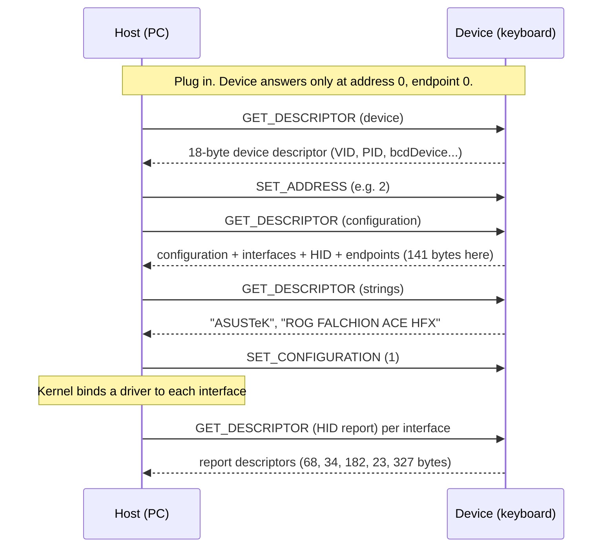
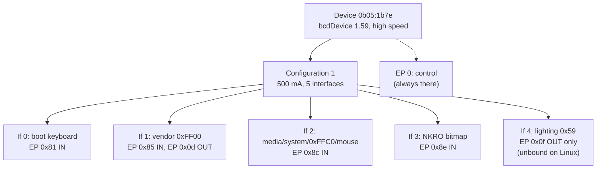

# Lesson 04 — USB and HID: how the keyboard introduces itself

> **In one sentence:** When you plug the keyboard in, it hands the computer a stack of small self-descriptions called descriptors, and by reading those (and nothing else) the investigation learned its identity, its five interfaces, its mail slots, and that it offers no standard firmware-update door.
> **You will learn:**
> - How USB works from zero: host and device, enumeration, endpoint 0, and the descriptor family tree
> - How to read raw descriptor bytes: VID/PID/`bcdDevice`, endpoint addresses and their direction bit, `bInterval`
> - How a HID report descriptor is built, decoded item by item from this keyboard's real bytes
> - This keyboard's five interfaces, why interface 4 is unbound on Linux, and why there is no DFU
> - Three mistakes from this phase (sandbox failures, an `xxd` parsing bug, a descriptor with the wrong owner) and what each teaches
>
> **Time:** ~75 minutes · **Prerequisites:** [Lesson 02](02-how-computers-count.md), [Lesson 03](03-the-detectives-rules.md)

## 1. The story (kid version)

Imagine a new student arriving at a big school. At the front office, the secretary doesn't know anything about them yet. So the student hands over an envelope of cards. The first card says: "My name is ROG FALCHION ACE HFX, my family is ASUSTeK, my ID number is `0b05:1b7e`." The next card says: "I belong to five clubs." Then there is one card per club: "Club 0 is the keyboard club. Its mailbox is number 1, and mail only goes *out* of it to the office." And so on.

The secretary reads the cards, gives the student a locker number, and sends each club's paperwork to the right teacher. From then on, the student and the office only ever talk through those mailboxes.

That is USB. The computer is the office. The keyboard is the student. The cards are **descriptors**. The clubs are **interfaces**. The mailboxes are **endpoints**. And the first conversation at the front desk always happens at one special desk, desk number 0, which every student is guaranteed to have.

In this lesson we read the keyboard's envelope of cards, byte by byte. We never *send* it anything except the standard "please show me your cards" questions.

**How the analogy maps to the real thing**

| In the story | In the real keyboard |
|---|---|
| The front office | The **host**: your Linux PC and its USB controller |
| The new student | The **device**: the keyboard |
| The envelope of cards | The **descriptors** the device sends when asked |
| The front desk, desk 0 | **Endpoint 0**, the control endpoint every USB device has |
| Handing over the cards and getting a locker number | **Enumeration**: reading descriptors, assigning an address, loading drivers |
| The student's ID number | **VID:PID** `0b05:1b7e` |
| The clubs | The five **interfaces**, all of class HID |
| Each club's mailbox | The **endpoints** `0x81`, `0x85`, `0x0d`, `0x8c`, `0x8e`, `0x0f` |
| A card describing what a club's letters look like | The **HID report descriptor** |

## 2. Why we needed this

Before anything else, the investigation had one question: **can the firmware installed on this keyboard be backed up over USB?** If yes, every later risk becomes smaller, because you can always put the original back.

The cheapest, safest way to start answering is to look at what the keyboard *already tells* the computer. Every USB device describes itself during enumeration, and Linux saves those descriptions in files under `/sys`. Reading them sends nothing new to the device. `lsusb -v` asks for the same descriptors through the standard "get descriptor" request, which every USB device must answer. `dfu-util -l` asks the standard question "do you support **DFU**?" ([DFU](00-glossary.md#dfu) is the standard USB firmware-update method).

The alternatives were all worse at this stage:

- Sending vendor commands (like Armoury Crate does) changes device state. That was out of scope for the read-only phase ([FINDINGS.md](../FINDINGS.md), safety scope).
- Streaming reports with `usbhid-dump` reads live traffic. The investigation invoked it only with `--help` and never pointed it at the keyboard (log 14; [FINDINGS.md](../FINDINGS.md), "Commands run").
- Opening the case and clipping onto the flash chip needs hardware that was not connected ([FINDINGS.md](../FINDINGS.md), "User-supplied hardware facts").

So the plan for logs 00–26 on 2026-08-29 was: record the host, read sysfs, read descriptors, ask about DFU, then replug through the keyboard's other connector and do it all again ([TIMELINE.md](../TIMELINE.md), 2026-08-29 02:11–02:34).

## 3. The real thing

### 3.1 USB from zero

**Host and device.** USB is not a conversation between equals. The **host** (the PC) is always in charge. A **device** (the keyboard) speaks only when the host asks. Even "the keyboard sends a keypress" really means "the host asked, many times per second, whether there was anything new, and this time the answer was yes."

**Enumeration.** This is what happens in the first moments after you plug something in ([enumeration](00-glossary.md#enumeration)). The kernel log recorded this keyboard's arrival (log 13):

```text
usb 6-2: new high-speed USB device number 2 using xhci-pci-prom21
usb 6-2: New USB device found, idVendor=0b05, idProduct=1b7e, bcdDevice= 1.59
usb 6-2: New USB device strings: Mfr=1, Product=3, SerialNumber=2
usb 6-2: Product: ROG FALCHION ACE HFX
usb 6-2: Manufacturer: ASUSTeK
```

In general terms, the steps are:



**Endpoint 0, the front desk.** Every USB device has endpoint 0. It is the only endpoint that works in both directions, and it carries **control transfers**: short, structured request-and-answer messages such as `GET_DESCRIPTOR` ([control transfer](00-glossary.md#control-transfer)). This keyboard's device descriptor says `bMaxPacketSize0 64`, so endpoint 0 moves up to 64 bytes per packet (log 15).

**The descriptor family tree.** A [descriptor](00-glossary.md#descriptor) is a little block of bytes. Every one starts with the same two bytes: its own length, and its type. They nest like this:

```text
Device descriptor           (type 0x01)  who I am: VID, PID, bcdDevice, how many configurations
└── Configuration descriptor (type 0x02) power, how many interfaces
    ├── Interface descriptor (type 0x04) interface 0: class, subclass, protocol, number of endpoints
    │   ├── HID descriptor   (type 0x21) "my report descriptor is N bytes long"
    │   └── Endpoint descriptor (type 0x05) address, type, max packet size, interval
    ├── Interface descriptor ... interface 1
    │   ├── HID descriptor
    │   ├── Endpoint descriptor
    │   └── Endpoint descriptor
    └── ... interfaces 2, 3, 4
HID report descriptor (type 0x22)   fetched separately, one per interface
String descriptors    (type 0x03)   the human-readable names
```

An **interface** is one "function" of a device ([interface](00-glossary.md#interface)). An **endpoint** is one numbered one-way channel belonging to an interface ([endpoint](00-glossary.md#endpoint)). **HID** (Human Interface Device) is the USB class for keyboards and mice, class number `0x03` ([HID](00-glossary.md#hid)).

### 3.2 The device descriptor, byte by byte

Linux keeps a copy of the device and configuration descriptors in one file, `/sys/bus/usb/devices/6-2/descriptors`. Log 07 is that file dumped with `xxd -g 1`. Here are its first 18 bytes, the device descriptor:

```text
00000000: 12 01 00 02 00 00 00 40 05 0b 7e 1b 59 01 01 03
00000010: 02 01 ...
```

| Byte(s) | Value | Field | Meaning |
|---|---|---|---|
| `12` | 18 | `bLength` | This descriptor is 18 bytes (`0x12` = 16 + 2 = 18) |
| `01` | 1 | `bDescriptorType` | Type 1 = device |
| `00 02` | `0x0200` | `bcdUSB` | USB 2.00. Two bytes, **little-endian**: low byte first ([little-endian](00-glossary.md#little-endian)) |
| `00` `00` `00` | 0, 0, 0 | class, subclass, protocol | "Look at each interface for its class" |
| `40` | 64 | `bMaxPacketSize0` | Endpoint 0 packets up to 64 bytes (`0x40` = 4 x 16 = 64) |
| `05 0b` | `0x0b05` | `idVendor` | ASUS |
| `7e 1b` | `0x1b7e` | `idProduct` | This keyboard in normal mode |
| `59 01` | `0x0159` | `bcdDevice` | Release 1.59 |
| `01` | 1 | `iManufacturer` | String #1 = "ASUSTeK" |
| `03` | 3 | `iProduct` | String #3 = "ROG FALCHION ACE HFX" |
| `02` | 2 | `iSerialNumber` | String #2 = spaces only |
| `01` | 1 | `bNumConfigurations` | One configuration |

Three of these deserve a closer look.

**VID and PID** ([PID / VID](00-glossary.md#pid--vid)). The Vendor ID and Product ID are two 16-bit numbers that together name the product. Notice how they appear in the bytes: `05 0b` is read as `0x0b05`, because the low byte comes first. This is the first time in the course you meet little-endian in the wild. You will meet it again at `0x3f4f3` inside the firmware file in [Lesson 06](06-the-firmware-file.md).

**`bcdDevice`** ([bcdDevice](00-glossary.md#bcddevice)). "BCD" means *binary-coded decimal*: each hex digit is read as a decimal digit. `0x0159` is read as "01.59", so release 1.59. The investigation was careful about what this proves. It is "firmware-facing version metadata, but USB does not guarantee it uniquely identifies all firmware components" ([FINDINGS.md](../FINDINGS.md), "Verified USB identity").

**The serial number** is a string of spaces. That makes it "not a useful unique identifier" ([FINDINGS.md](../FINDINGS.md), "Verified USB identity"). You can see the blank value in log 04: `serial=            `.

### 3.3 The configuration descriptor and power

The next 9 bytes of log 07 are the configuration descriptor:

```text
09 02 8d 00 05 01 00 a0 fa
```

| Byte(s) | Field | Value |
|---|---|---|
| `09` | `bLength` | 9 bytes |
| `02` | type | configuration |
| `8d 00` | `wTotalLength` | `0x008d` = 141 bytes: this descriptor plus everything nested inside it |
| `05` | `bNumInterfaces` | **5 interfaces** |
| `01` | `bConfigurationValue` | configuration number 1 |
| `00` | `iConfiguration` | no name string |
| `a0` | `bmAttributes` | lsusb decodes this as "Bus Powered, Remote Wakeup" (log 15) |
| `fa` | `bMaxPower` | `0xfa` = 250, in units of 2 mA, so **500 mA** (lsusb prints `MaxPower 500mA`) |

Quick check: 18 bytes of device descriptor plus 141 bytes of configuration equals 159 bytes. That is exactly the size of the blob in log 07, and log 26 counts it as `old_hex_chars=318 new_hex_chars=318`, which is 318 / 2 = 159 bytes.

### 3.4 Interfaces, HID descriptors, endpoints

After the configuration header, the blob repeats a pattern five times: interface, HID, endpoint(s). Here is interface 0, straight from log 07:

```text
09 04 00 00 01 03 01 01 00      interface descriptor
09 21 11 01 00 01 22 44 00      HID descriptor
07 05 81 03 08 00 01            endpoint descriptor
```

**Interface descriptor** (`09 04 ...`):

| Byte | Field | Value |
|---|---|---|
| `00` | `bInterfaceNumber` | interface 0 |
| `00` | `bAlternateSetting` | 0 |
| `01` | `bNumEndpoints` | 1 endpoint (not counting endpoint 0) |
| `03` | `bInterfaceClass` | HID |
| `01` | `bInterfaceSubClass` | Boot Interface |
| `01` | `bInterfaceProtocol` | Keyboard |

The "boot" subclass means a PC's firmware setup screen can use this interface with a simple fixed format, even before an operating system loads.

**HID descriptor** (`09 21 ...`): `11 01` is `bcdHID` 1.11; `00` country code; `01` one class descriptor follows; `22` its type is "report"; and `44 00` is its length, `0x0044` = 68 bytes. **The HID descriptor is how the host learns how long the report descriptor is before asking for it.** Remember that length. It becomes the key clue in the mistake in §5.3.

**Endpoint descriptor** (`07 05 ...`):

| Byte(s) | Field | Value |
|---|---|---|
| `81` | `bEndpointAddress` | endpoint 1, direction IN |
| `03` | `bmAttributes` | transfer type 3 = interrupt |
| `08 00` | `wMaxPacketSize` | 8 bytes |
| `01` | `bInterval` | 1 (see §3.5) |

**The direction bit.** An endpoint address packs two facts into one byte. The top bit (`0x80`) is the direction: 1 means **IN** (device to host), 0 means **OUT** (host to device). The low four bits are the endpoint number. "IN" and "OUT" are always named from the host's point of view.

```text
0x81 = 1000 0001  ->  IN,  endpoint 1
0x85 = 1000 0101  ->  IN,  endpoint 5
0x0d = 0000 1101  ->  OUT, endpoint 13
0x8c = 1000 1100  ->  IN,  endpoint 12
0x8e = 1000 1110  ->  IN,  endpoint 14
0x0f = 0000 1111  ->  OUT, endpoint 15
```

lsusb prints exactly these: `0x81 EP 1 IN`, `0x0d EP 13 OUT`, `0x0f EP 15 OUT` (log 15). This bit matters again in [Lesson 05](05-talking-to-the-keyboard.md): the corrected capture decoder takes a packet's direction "from bit 7 of the endpoint address", not from guessing at text (log 131).

The other four interfaces, from the same blob:

```text
09 04 01 00 02 03 00 00 00 | 09 21 11 01 00 01 22 22 00 | 07 05 85 03 40 00 01 | 07 05 0d 03 40 00 04
09 04 02 00 01 03 00 00 00 | 09 21 11 01 00 01 22 b6 00 | 07 05 8c 03 15 00 01
09 04 03 00 01 03 00 00 00 | 09 21 11 01 00 01 22 17 00 | 07 05 8e 03 13 00 04
09 04 04 00 01 03 00 00 00 | 09 21 11 01 00 01 22 47 01 | 07 05 0f 03 40 00 04
```

Read the report-descriptor lengths: `22 00` = 34, `b6 00` = 182, `17 00` = 23, and `47 01` = `0x0147` = 327. Read the packet sizes: `40 00` = 64, `15 00` = 21, `13 00` = 19. All five interfaces are class `03` with subclass and protocol `00`, except interface 0.

### 3.5 Interrupt transfers, `bInterval`, full speed and high speed

All six non-zero endpoints have `bmAttributes 03`: **interrupt** transfers. Despite the name, nothing interrupts anything. An interrupt endpoint is one the host *polls* on a fixed schedule, with a guaranteed slot. That schedule is set by `bInterval` ([bInterval](00-glossary.md#binterval)).

What `bInterval` means depends on the bus speed:

- **Full speed** (12 Mb/s) divides time into 1 ms **frames**. There `bInterval` counts frames.
- **High speed** (480 Mb/s) divides each frame into eight 125 µs **microframes**. There the period is `2^(bInterval − 1)` microframes.

This keyboard negotiated high speed: `Negotiated speed: High Speed (480Mbps)` (log 15) and `speed=480` (log 04). So:

| `bInterval` | Period at high speed | Endpoints | What sysfs says (log 08) |
|---|---|---|---|
| 1 | 2⁰ x 125 µs = **125 µs** | `0x81`, `0x85`, `0x8c` | `interval=125us` |
| 4 | 2³ x 125 µs = 8 x 125 µs = **1 ms** | `0x0d`, `0x8e`, `0x0f` | `interval=1ms` |

The formula and the kernel's own numbers agree. 125 µs is 8000 times per second. That becomes important in [Lesson 17](17-polling-rate.md). There, an earlier high-speed reading that had only been *inherited* was finally *derived* from a capture, because "reports 125 us apart cannot occur on a full-speed bus, where a `bInterval = 1` interrupt endpoint completes only on 1 ms frame boundaries" ([TIMELINE.md](../TIMELINE.md), corrections table, log 126).

### 3.6 HID report descriptors: a tiny language

A **report** is one HID message, like one letter ([report](00-glossary.md#report)). A **report descriptor** is the grammar for those letters: which bits mean what ([report descriptor](00-glossary.md#report-descriptor)). It is written in a small byte language of **items**.

Each short item starts with a **prefix byte** that packs three fields:

```text
prefix byte:  t t t t  y y  s s
              \_tag_/  type size
size:  00 = 0 data bytes, 01 = 1, 10 = 2, 11 = 4
type:  00 = Main   (declares data: Input, Output, Feature, Collection, End Collection)
       01 = Global (settings that stick: Usage Page, Logical Min/Max, Report Size, Report Count, Report ID)
       10 = Local  (settings for the next Main item only: Usage, Usage Min/Max)
```

Take `95 05`. `0x95` is `1001 0101`. Tag `1001` (9), type `01` (Global), size `01` (1 byte). Global tag 9 is **Report Count**. The data byte is `05`. So `95 05` means "Report Count = 5".

The two settings you'll see most are **Report Size** (how many bits each field has, prefix `75`) and **Report Count** (how many such fields, prefix `95`). A Main item such as **Input** (prefix `81`) then says "create Count fields of Size bits each, going IN to the host." **Output** (`91`) is the same, going OUT to the device. **Feature** (`b1`) is read or written through endpoint 0 rather than an interrupt endpoint ([feature report](00-glossary.md#feature-report)).

The Main item's data byte also has flag bits. The ones you need: bit 0 set = **Constant** (padding), bit 1 set = **Variable** (one field per usage) and clear = **Array** (fields hold usage numbers), bit 2 set = **Relative**.

Linux keeps each bound interface's report descriptor in `/sys/class/hidraw/hidrawN/device/report_descriptor`. Log 09 is those four files dumped with `xxd -g 1`. **hidraw** is the Linux device-file family that gives raw access to one HID interface ([hidraw](00-glossary.md#hidraw)). Reading the *sysfs descriptor file* is safe. Writing to `/dev/hidraw*` would send data to the keyboard, and this course never does that.

### 3.7 Interface 0 decoded: the boot keyboard (68 bytes)

Here is log 09's `hidraw0` block, whose sysfs path ends in `6-2:1.0` (interface 0), decoded item by item:

```text
Bytes        Item                          Meaning
05 01        Usage Page (Generic Desktop)
09 06        Usage (Keyboard)
a1 01        Collection (Application)      "everything until c0 is one keyboard"
  05 08        Usage Page (LEDs)
  15 00        Logical Minimum 0
  25 01        Logical Maximum 1             each field is on/off
  19 01        Usage Minimum 1
  29 05        Usage Maximum 5               LEDs 1..5 (Num, Caps, Scroll, Compose, Kana)
  95 05        Report Count 5
  75 01        Report Size 1
  91 02        Output (Data,Var,Abs)         -> 5 LED bits, host to keyboard
  95 01        Report Count 1
  75 03        Report Size 3
  91 03        Output (Const,Var,Abs)        -> 3 padding bits. 5 + 3 = 8 bits = 1-byte LED output
  05 07        Usage Page (Keyboard/Keypad)
  15 00        Logical Minimum 0
  25 01        Logical Maximum 1
  19 e0        Usage Minimum 0xe0            Left Control ...
  29 e7        Usage Maximum 0xe7            ... Right GUI: the 8 modifier keys
  75 01        Report Size 1
  95 08        Report Count 8
  81 02        Input (Data,Var,Abs)          -> byte 0: one bit per modifier
  75 08        Report Size 8
  95 01        Report Count 1
  81 01        Input (Const)                 -> byte 1: reserved, always constant
  05 07        Usage Page (Keyboard/Keypad)
  15 00        Logical Minimum 0
  26 ff 00     Logical Maximum 255           prefix 0x26 = size 2, so two data bytes: 0x00ff
  19 00        Usage Minimum 0
  29 98        Usage Maximum 0x98
  75 08        Report Size 8
  95 06        Report Count 6
  81 00        Input (Data,Array,Abs)        -> bytes 2..7: up to six key codes at once
c0           End Collection
```

Add up the Input fields: 8 x 1 bit + 1 x 8 bits + 6 x 8 bits = 64 bits = **8 bytes**. That is exactly the endpoint `0x81`'s `wMaxPacketSize` of 8. The Output fields add up to 1 byte. That matches [FINDINGS.md](../FINDINGS.md): "8-byte input (modifiers, reserved byte, six keycodes); 1-byte LED output".

Notice `26 ff 00`. The prefix `0x26` has size bits `10`, meaning 2 data bytes, and they are little-endian again: `ff 00` = `0x00ff` = 255.

### 3.8 Interface 1 decoded: the vendor channel (34 bytes)

This is the most important interface in the course. Log 09's `hidraw1` block (sysfs path `6-2:1.1`):

```text
Bytes        Item                          Meaning
06 00 ff     Usage Page (0xFF00)           prefix 0x06 = Global Usage Page, 2 bytes: 00 ff -> 0xff00
09 01        Usage (1)
a1 01        Collection (Application)
  09 02        Usage (2)
  75 08        Report Size 8                 each field is one byte
  95 40        Report Count 64               0x40 = 64 fields
  15 00        Logical Minimum 0
  26 ff 00     Logical Maximum 255
  81 02        Input (Data,Var,Abs)          -> 64 bytes, keyboard to host
  09 03        Usage (3)
  75 08        Report Size 8
  95 40        Report Count 64
  15 00        Logical Minimum 0
  26 ff 00     Logical Maximum 255
  91 02        Output (Data,Var,Abs)         -> 64 bytes, host to keyboard
c0           End Collection
```

Three things jump out.

1. **Usage page `0xFF00` is vendor-defined.** Pages from `0xFF00` to `0xFFFF` are reserved for vendors to use however they like. The HID standard does not say what the bytes mean. ASUS does.
2. **64 bytes in, 64 bytes out.** A two-way pipe of plain bytes, carried on endpoints `0x85` IN and `0x0d` OUT, each with `wMaxPacketSize` 64 (log 08).
3. **There is no `85 xx` item.** Prefix `0x85` is Global tag 8, **Report ID**. Interface 1 has none. So its reports carry no ID byte on the wire. This is why Windows and Linux both need a leading `0x00` placeholder when *writing* one, which [Lesson 05](05-talking-to-the-keyboard.md) explains.

**This is where the vendor configuration commands travel.** FINDINGS calls interface 1 "the strongest candidate for the proprietary ASUS configuration channel", and adds a caution that matters: "Its existence alone does not show that firmware readback is supported."

### 3.9 Report IDs: interface 2 (182 bytes)

When one interface carries several kinds of report, each kind gets a **Report ID**: a first byte that says which kind this is. Interface 2 declares four (log 09, `hidraw2`; only the structural items are shown):

```text
05 0c 09 01 a1 01   Consumer page, Consumer Control collection
  85 01               Report ID 1
  75 01 95 12 ...     18 one-bit media-key fields (e.g. 09 cd = Play/Pause, 09 e2 = Mute,
                      09 e9 = Volume Up, 09 ea = Volume Down) + 6 padding bits = 3 bytes
c0
05 01 09 80 a1 01   Generic Desktop, System Control
  85 02               Report ID 2
  ... 3 bits + 5 padding bits = 1 byte
c0
06 c0 ff 09 01 a1 01  Vendor page 0xFFC0
  85 03               Report ID 3
  26 ff 00 75 08 95 14 81 00   20 one-byte fields (0x14 = 20) = 20 bytes
c0
05 01 09 02 a1 01   Generic Desktop, Mouse
  85 04               Report ID 4
  ... 3 buttons + padding, then X, Y, Wheel (09 30, 09 31, 09 38) as 3 bytes
c0
```

The largest is Report ID 3: 20 payload bytes plus the 1 ID byte = 21 bytes. And endpoint `0x8c`'s `wMaxPacketSize` is `0x0015` = 21. The descriptor and the endpoint agree again.

Interface 3 (23 bytes, `hidraw3`) is short enough to read whole:

```text
05 01 09 06 a1 01   Generic Desktop, Keyboard
  75 01 95 98         Report Size 1, Report Count 0x98 = 152
  15 00 25 01         0..1
  05 07 19 00 29 98   Keyboard page, usages 0x00..0x98
  81 02               Input (Data,Var,Abs)
c0
```

152 one-bit fields = 19 bytes, no Report ID, and endpoint `0x8e` has `wMaxPacketSize` 19. This is an **NKRO** bitmap: one bit per key, so any number of keys can be down at once ([NKRO](00-glossary.md#nkro)).

### 3.10 Interface 4: lighting, and the one Linux won't bind (327 bytes)

Interface 4's HID descriptor says its report descriptor is 327 bytes (`47 01`). But log 09 has no `hidraw4` for the keyboard. Why? The kernel log gives the reason in one line (log 13):

```text
usbhid 6-2:1.4: couldn't find an input interrupt endpoint
```

Look back at interface 4's only endpoint: `07 05 0f 03 40 00 04`. That is `0x0f`, an **OUT** endpoint. Linux's `usbhid` driver refused to bind an interface that has no **input** interrupt endpoint. sysfs agrees: `6-2:1.4` shows `driver=(none)` (log 05), and `lsusb -t` shows `If 4, Class=Human Interface Device, Driver=[none]` (log 02).

So how did the investigation read it? `lsusb -v` asks the device directly with a standard `GET_DESCRIPTOR` request and prints what it gets. For interfaces 0–3 it printed `Report Descriptors: ** UNAVAILABLE **`; for interface 4 it printed `Report Descriptor: (length is 327)` followed by a parsed listing (log 15). The first items:

```text
Item(Global): Usage Page, data= [ 0x59 ] 89
Item(Local ): Usage, data= [ 0x01 ] 1
Item(Main  ): Collection, data= [ 0x01 ] 1   Application
Item(Global): Report ID, data= [ 0x01 ] 1
...
Item(Main  ): Feature, data= [ 0x03 ] 3
```

Usage page `0x59` is **Lighting and Illumination**, the standard page for RGB lighting ([LampArray](00-glossary.md#lamparray)). It declares Feature reports with IDs 1–6. FINDINGS summarises it: "Feature-report IDs 1–6; largest descriptor-defined report is 51 B including ID; no HID Input item". Windows, which handles this page natively, lists it as `MI_04 UP=0x0059 ... feat=51` ([notes/protocol.md](../notes/protocol.md), §1).

Two cautions the investigation kept:

- **Only the descriptor was read.** "No feature value (`GET_REPORT`) or output report was requested." And its lighting feature reports "are not a DFU interface" ([FINDINGS.md](../FINDINGS.md), "Interfaces, reports, endpoints, and bindings").
- **For interface 4, only lsusb's parsed items survive, not raw bytes.** Log 108 later corrected a claim that interface 4's descriptor was "byte-identical to the host's". That was "unprovable from this repository", because log 09 holds `hidraw0`–`hidraw3` only and log 15 holds parsed items, not hex. So this lesson decodes raw bytes for interfaces 0–3 only.

### 3.11 The five interfaces at a glance

This is FINDINGS' table, which every later lesson leans on:

| Interface | HID function / usage | Reports | Interrupt endpoints | Linux binding |
|---|---|---|---|---|
| 0 | Generic Desktop / Keyboard; boot keyboard | 8-byte input; 1-byte LED output | `0x81` IN, 8 B, 125 µs | `usbhid` → `hid-generic`, `hidraw0` |
| 1 | Vendor-defined page `0xFF00`, usage 1 | 64-byte input and 64-byte output, no report ID | `0x85` IN, 64 B, 125 µs; `0x0d` OUT, 64 B, 1 ms | `usbhid` → `hid-generic`, `hidraw1` |
| 2 | Consumer/System/Mouse plus vendor page `0xFFC0` | IDs 1–4; largest is ID 3, 21 B including ID | `0x8c` IN, 21 B, 125 µs | `usbhid` → `hid-generic`, `hidraw2` |
| 3 | Generic Desktop / Keyboard bitmap | 152 input bits = 19 B, no report ID | `0x8e` IN, 19 B, 1 ms | `usbhid` → `hid-generic`, `hidraw3` |
| 4 | Lighting and Illumination, page `0x59` | Feature-report IDs 1–6; no Input item | `0x0f` OUT, 64 B, 1 ms | Unbound: `couldn't find an input interrupt endpoint` |



### 3.12 Linking hidraw numbers to interfaces: sysfs, lsusb, udev

A name like `hidraw1` is **handed out by the kernel in arrival order**. It is not a property of the keyboard. On this machine, `hidraw4`–`hidraw8` belonged to a Razer Viper V4 Pro and `hidraw10`–`hidraw12` a Logitech receiver (log 13). The only safe way to know which hidraw is which is to follow its sysfs path back to the USB interface. Log 06 does exactly that:

```text
== /sys/class/hidraw/hidraw1 ==
/sys/devices/.../usb6/6-2/6-2:1.1/0003:0B05:1B7E.0002
HID_ID=0003:00000B05:00001B7E
HID_PHYS=usb-0000:0c:00.0-2/input1
```

Read the path from the right: HID device `0003:0B05:1B7E` (bus type 3 = USB, VID, PID), under USB interface `6-2:1.1` (bus 6, port 2, configuration 1, **interface 1**). udev confirms it: `ID_USB_INTERFACE_NUM=01` and a stable link name `usb-ASUSTeK_ROG_FALCHION_ACE_HFX-if01-hidraw` (log 10).

Even the HID instance suffix is not stable. On first plug-in, interface 0 was `...1B7E.0001`. After the replug in §3.14, it was `...1B7E.000F` (log 24). **Always resolve a device by VID:PID and interface ancestry, never by its number.** Keep that sentence in mind for §5.3.

### 3.13 Why there is no DFU

DFU devices announce themselves with an interface of class `0xFE`, subclass `0x01`. Every interface here is class `0x03` (logs 05, 15). Then the direct `dfu-util -l` run produced its banner and nothing else, with no `Found DFU:` line (log 16):

```text
dfu-util 0.11

Copyright 2005-2009 Weston Schmidt, Harald Welte and OpenMoko Inc.
Copyright 2010-2021 Tormod Volden and Stefan Schmidt
This program is Free Software and has ABSOLUTELY NO WARRANTY
Please report bugs to http://sourceforge.net/p/dfu-util/tickets/

```

FINDINGS draws the conclusion at exactly the right size: "no DFU target is exposed in the current operating mode." Not "no bootloader". Not "backup impossible". Just this mode, this protocol.

**fwupd** (Linux's firmware-update service) could not be tested. It was not installed (`zsh:4: command not found: fwupdmgr`, log 03; `error: package 'fwupd' was not found`, log 12), and installing software was out of scope. So FINDINGS makes no fwupd claim either way.

The honest status after this lesson's work: **no standard USB readback in normal mode, question still open.** The ASUS updater config in [Lesson 06](06-the-firmware-file.md) will name a *second* PID, `1b7f`, for a bootloader mode. [Lesson 11](11-the-bootloader-door.md) goes through that door.

### 3.14 The other connector

At 02:29:56 the keyboard was replugged through its other physical connector and everything was repeated (logs 19–26). It came back as bus 006 device 008 instead of device 002, on the same sysfs port `6-2`, with the same VID:PID and `bcdDevice` (log 19). Log 26's strict comparison:

```text
== corrected USB descriptor comparison ==
old_hex_chars=318 new_hex_chars=318
USB DESCRIPTORS: IDENTICAL
== corrected HID report descriptor comparisons ==
interface=0 old_hex_chars=136 new_hex_chars=136 result=IDENTICAL
interface=1 old_hex_chars=68 new_hex_chars=68 result=IDENTICAL
interface=2 old_hex_chars=364 new_hex_chars=364 result=IDENTICAL
interface=3 old_hex_chars=46 new_hex_chars=46 result=IDENTICAL
```

136 / 2 = 68, 68 / 2 = 34, 364 / 2 = 182, 46 / 2 = 23: the four report-descriptor lengths again. The full `lsusb -v` differed only in the line `Bus 006 Device 002` vs `Bus 006 Device 008`. A second `dfu-util -l` again listed nothing (log 23). Conclusion: "the other keyboard connector does not expose additional USB access, a different PID, DFU, or a different report layout in normal operating mode" ([FINDINGS.md](../FINDINGS.md), "Retry through the keyboard's other connector").

## 4. Decisions and why

| Decision | Why | Alternative rejected | Evidence (log) |
|---|---|---|---|
| Read descriptors from sysfs and standard `GET_DESCRIPTOR` only | Sends nothing new to the device; safe before any backup exists | Sending vendor HID commands; streaming with `usbhid-dump` | logs 04–10, 14, 15; FINDINGS safety scope |
| Map hidraw nodes by sysfs ancestry and VID:PID | hidraw numbers are arrival order and change on replug | Assuming `hidraw0` is "the keyboard" | logs 06, 10, 24 |
| Treat sandbox failures as environmental, retry directly with approval | A tool that cannot start has not asked the device anything | Recording "no device" or "no DFU" from a failed run | logs 01, 11, 18 → 15, 16 |
| Do not install fwupd | Installing changes the host; low value since no DFU is advertised | Installing it to "just check" | logs 03, 12; FINDINGS "Recommended next steps" 2 |
| Read interface 4's descriptor but no feature values | Descriptor reads are standard; `GET_REPORT` is a device query outside scope | Requesting lighting feature reports | log 15; FINDINGS interfaces section |
| Repeat everything through the other connector | A second port could expose a different mode or PID | Assuming both ports are the same | logs 19–26 |
| Keep the wrong comparison (log 25) and add a corrected one (log 26) | An audit trail should show the mistake and the fix | Deleting or overwriting log 25 | logs 25, 26 |
| Size the DFU conclusion to "this mode" | Absence of DFU does not prove absence of every update path | "No USB bootloader exposed" | log 16; FINDINGS audit |

## 5. What went wrong, and how it was caught

### 5.1 Sandbox failures that looked like device results

**What was believed.** The very first `lsusb` printed `unable to initialize libusb: -99` (log 01). The first `dfu-util -l` printed `dfu-util: unable to initialize libusb: LIBUSB_ERROR_OTHER` (log 11). A check of `/dev/hidraw0` said `No such file or directory` (log 18).

**What was true.** Claude Code runs commands inside a sandbox, and that sandbox hid the USB device nodes. The tools never reached the keyboard. The command index says so plainly: "Failed in sandbox", "Sandbox attempt failed at libusb initialization; not a detection result", "Nodes hidden by sandbox" (logs/COMMANDS.md). Log 06 even ended with "exit 1 because sandbox hides `/dev` nodes".

**How it was caught.** The failures were preserved, and approved direct runs outside the sandbox were made: `lsusb -d 0b05:1b7e -v` succeeded (log 15), and `dfu-util -l` completed with no target (log 16). The same trap reappeared much later: during the bootloader work, "a sandboxed `ls` later reported both paths absent, but direct read-only enumeration proved the device was still in bootloader mode and the same paths still existed; the sandbox result was not a device result" ([FINDINGS.md](../FINDINGS.md), "Uncertain or superseded assumptions").

**The lesson.** **An error from the tool is not an answer from the device.** Before you record "not found", ask whether the question was ever delivered.

### 5.2 The comparison that read the ASCII column (log 25 → log 26)

**What was believed.** After the replug, log 25 compared the saved descriptor blob with the new one and printed:

```text
== saved first descriptor blob vs current descriptor blob ==
DIFFERENT
```

If that were true, the second connector would have been a different USB device, which would be big news.

**What was true.** The bytes were identical. The comparison's parser had "included an `xxd` ASCII column" ([TIMELINE.md](../TIMELINE.md), 2026-08-29 02:29–02:34). An `xxd` line has three parts: the offset, the hex bytes, and a text rendering of the same bytes on the right. That right-hand text can contain characters that *look* like hex. Look at line `0x20` of log 07:

```text
00000020: 03 01 01 00 09 21 11 01 00 01 22 44 00 07 05 81  .....!...."D....
```

The `D` in the text column is a valid hex digit to a careless pattern. Exercise 5 below shows a naive extraction picking it up.

**How it was caught.** The investigation did not accept a surprising result. It re-parsed with "strict two-hex-digit extraction" (logs/COMMANDS.md) and got `USB DESCRIPTORS: IDENTICAL` with equal character counts on both sides (log 26). Log 25 was kept, marked superseded.

**The lesson.** **When a result is surprising, suspect your measuring tool first.** And parse data from where the data is, not from a human-friendly rendering of it.

### 5.3 The descriptor with the wrong owner (`report-desc-0.txt`, logs 17 and 27)

**What was believed.** The earliest notes (2026-08-17/18) held a small saved report descriptor, `notes/report-desc-0.txt`, and the old `notes/findings.md` table said interface 4 was a vendor page **`0xFF32`** channel: `Report ID 2, 63B IN + 63B OUT` (log 28 quotes that line).

**What was true.** Decode the saved bytes (log 17):

```text
0632 ff09 74a1 01a1 0385 0275 0815 0026 ...
```

`06 32 ff` = Usage Page `0xFF32`; `85 02` = Report ID 2; `95 3f` = Report Count 63. It is a real, well-formed descriptor, but it is **39 bytes**. Now look at what the USB descriptor said interface 4's report descriptor length was: 327 bytes. The early notes' own `notes/usb-descriptors.txt`, saved about two minutes earlier (mtimes 03:43:32 and 03:45:00 in log 28), says `wDescriptorLength 327` for interface 4. **A 39-byte descriptor cannot be interface 4's 327-byte descriptor from that same enumeration.** Current enumeration shows interface 4 is page `0x59`, lighting, as in §3.10.

Where did it come from? FINDINGS' honest answer: "Its source is unknown, most likely a different device selected when `hidraw0` was used without first resolving VID:PID and interface ancestry." That is an inference, and it is labelled as one. It is exactly the trap from §3.12: this machine had a dozen hidraw nodes, most of them not the keyboard.

**How it was caught.** The earlier-work audit (logs 27–28) compared the old file with every hidraw report descriptor then connected and found "No match; old interface-4 attribution is unsupported" (logs/COMMANDS.md). The corrections table lists: "Old interface-4 `0xFF32` claim | Provenance unsupported; current interface 4 is page `0x59`" ([TIMELINE.md](../TIMELINE.md)). The file itself was kept, "preserved for provenance but ... not treated as current interface evidence".

**Something extra you can check yourself.** While writing this lesson, the hex string that log 27 reconstructed from the old file was measured. It is 76 hex characters, which is **38** bytes, and it ends `...09769102c0`. The file itself decodes to 39 bytes ending `...02c0c0` (Exercise 6). So log 27's reconstruction dropped the final `c0`. This weakens log 27's hash comparison: a truncated string could never have matched any full descriptor. **It does not change the conclusion.** That rests on the 39-versus-327 length mismatch, which uses the untruncated file. This point is not recorded in the project documents; it is noted here as something the course's own check found.

**The lesson.** **A saved artefact without its provenance (which device, which interface, which moment) is a rumour.** Before you trust a file, prove it belongs to what you think it belongs to.

### 5.4 "No USB bootloader exposed", narrowed

The old notes said: "DFU available: **NO** — `dfu-util -l` finds nothing; no USB bootloader exposed" (log 28 quotes it). The first half was verified. The second half was too broad. The audit narrowed it to "no DFU/bootloader interface in normal mode" ([TIMELINE.md](../TIMELINE.md), corrections). That narrowing mattered enormously. A separate bootloader mode did exist, at PID `1b7f`, validated live in log 88 ([Lesson 11](11-the-bootloader-door.md)). **Say exactly what you tested, and no more.**

### 5.5 Two smaller cautions

- The early guide proposed a udev rule with `MODE="0666"` for the keyboard (log 28). The audit did not reassert it: it "was not re-verified in the managed environment and is broader than necessary" ([FINDINGS.md](../FINDINGS.md), audit). World-writable device nodes are exactly the kind of convenience that lets a mistyped command reach the keyboard.
- Interface 4's descriptor was once called "byte-identical to the host's". Log 108 withdrew that, because no raw bytes of it were ever saved on the host side (§3.10). An item-by-item match is not a byte match. Say which one you have.

## 6. Try it yourself

All commands read saved files only. Run them from `keyboard/falchion-re/`.

**1. Find VID, PID and `bcdDevice` in the raw bytes.**

```bash
head -1 logs/07-falchion-usb-descriptors-sysfs-xxd.txt
```

```text
00000000: 12 01 00 02 00 00 00 40 05 0b 7e 1b 59 01 01 03  .......@..~.Y...
```

Point at `05 0b`, `7e 1b`, `59 01`. Say each one out loud as a little-endian number.

**2. List every endpoint and its interval.**

```bash
grep -E '^(==|bEndpointAddress|wMaxPacketSize|interval|direction)' logs/08-falchion-endpoints-sysfs.txt
```

```text
== /sys/bus/usb/devices/6-2:1.0 ==
bEndpointAddress=81
wMaxPacketSize=0008
interval=125us
direction=in
== /sys/bus/usb/devices/6-2:1.1 ==
bEndpointAddress=0d
wMaxPacketSize=0040
interval=1ms
direction=out
bEndpointAddress=85
wMaxPacketSize=0040
interval=125us
direction=in
…
== /sys/bus/usb/devices/6-2:1.4 ==
bEndpointAddress=0f
wMaxPacketSize=0040
interval=1ms
direction=out
```

For each address, check that bit 7 (`0x80`) matches `direction`.

**3. Decode interfaces 0 and 1 with a 20-line decoder.** This reads log 09 and walks the items using the prefix-byte rule from §3.6.

```bash
python3 - <<'EOF'
import re
TYPES = {0: "Main", 1: "Global", 2: "Local"}
NAMES = {(0,8):"Input",(0,9):"Output",(0,11):"Feature",(0,10):"Collection",(0,12):"End Collection",
         (1,0):"Usage Page",(1,1):"Logical Minimum",(1,2):"Logical Maximum",(1,7):"Report Size",
         (1,8):"Report ID",(1,9):"Report Count",(2,0):"Usage",(2,1):"Usage Minimum",(2,2):"Usage Maximum"}
text = open("logs/09-falchion-hid-report-descriptors-xxd.txt").read()
for name in ("hidraw0", "hidraw1"):
    block = text.split("== " + name + " ==")[1].split("==")[0]
    data = bytes.fromhex("".join(re.findall(r"^[0-9a-f]{8}: ((?:[0-9a-f]{2} )+)", block, re.M)))
    print(f"--- {name}: {len(data)} bytes")
    i = 0
    while i < len(data):
        p = data[i]; size = [0, 1, 2, 4][p & 3]; t = (p >> 2) & 3; tag = p >> 4
        val = int.from_bytes(data[i+1:i+1+size], "little")
        raw = data[i:i+1+size].hex(" ")
        print(f"{raw:<12} {TYPES[t]:<6} {NAMES.get((t,tag),'?'):<16} {val:#x}" if size else f"{raw:<12} {TYPES[t]:<6} {NAMES.get((t,tag),'?')}")
        i += 1 + size
EOF
```

```text
--- hidraw0: 68 bytes
05 01        Global Usage Page       0x1
09 06        Local  Usage            0x6
a1 01        Main   Collection       0x1
05 08        Global Usage Page       0x8
…
95 06        Global Report Count     0x6
81 00        Main   Input            0x0
c0           Main   End Collection
--- hidraw1: 34 bytes
06 00 ff     Global Usage Page       0xff00
09 01        Local  Usage            0x1
a1 01        Main   Collection       0x1
09 02        Local  Usage            0x2
75 08        Global Report Size      0x8
95 40        Global Report Count     0x40
15 00        Global Logical Minimum  0x0
26 ff 00     Global Logical Maximum  0xff
81 02        Main   Input            0x2
09 03        Local  Usage            0x3
75 08        Global Report Size      0x8
95 40        Global Report Count     0x40
15 00        Global Logical Minimum  0x0
26 ff 00     Global Logical Maximum  0xff
91 02        Main   Output           0x2
c0           Main   End Collection
```

Change `("hidraw0", "hidraw1")` to `("hidraw2",)` and find the four `Report ID` lines yourself. (The regex grabs hex only from between the offset and the text column, which is the lesson of §5.2.)

**4. See why interface 4 is unbound.**

```bash
grep -a "couldn't find" logs/13-interface-4-and-kernel-log.txt
grep -n 'Report Descriptor: (length' logs/15-lsusb-falchion-verbose.txt
```

```text
Aug 28 23:32:00 cachyos kernel: usbhid 6-2:1.4: couldn't find an input interrupt endpoint
178:          Report Descriptor: (length is 327)
```

**5. Reproduce the `xxd` ASCII trap.** Count hex digits two ways in log 07:

```bash
f=logs/07-falchion-usb-descriptors-sysfs-xxd.txt
echo strict: $(grep -oE ' [0-9a-f]{2}' <(cut -c10-57 $f) | tr -d ' \n' | wc -c)
echo naive: $(cut -d: -f2- $f | grep -oiE '[0-9a-f]' | tr -d '\n' | wc -c)
```

```text
strict: 318
naive: 319
```

The naive count includes the `D` from the text column of line `0x20`. One stray character is all it takes to turn "identical" into "different".

**6. Measure the old descriptor, and its reconstruction in log 27.**

```bash
python3 - <<'E'
t=open('notes/report-desc-0.txt').read()
h="".join("".join(l.split(':',1)[1][:41].split()) for l in t.splitlines())
print(h,len(h)//2)
g=open('logs/27-claude-notes-report-desc-provenance.txt').read().split('old_descriptor_hex=')[1].split()[0]
print(g,len(g)//2)
E
grep -n 'wDescriptorLength' notes/usb-descriptors.txt
```

```text
0632ff0974a101a10385027508150026ff00953f097581027508150026ff00953f09769102c0c0 39
0632ff0974a101a10385027508150026ff00953f097581027508150026ff00953f09769102c0 38
47:          wDescriptorLength      68
77:          wDescriptorLength      34
117:          wDescriptorLength     182
147:          wDescriptorLength      23
177:          wDescriptorLength     327
```

39 is not 327. That is the whole argument.

**7. Confirm there was no DFU target.**

```bash
grep -c 'Found DFU' logs/16-dfu-util-list-direct.txt logs/23-port-retry-dfu-util-list.txt
```

```text
logs/23-port-retry-dfu-util-list.txt:0
logs/16-dfu-util-list-direct.txt:0
```

**8. Compute a `bInterval` period.** At high speed, period = 2^(bInterval−1) x 125 µs:

```bash
for b in 1 4; do echo "bInterval=$b -> $(( (1 << (b-1)) * 125 )) us"; done
```

```text
bInterval=1 -> 125 us
bInterval=4 -> 1000 us
```

## 7. Check your understanding

1. Endpoint `0x8c`: which interface, which direction, which endpoint number?
   <details><summary>Answer</summary>Interface 2. `0x8c` = `1000 1100`: bit 7 set, so IN (device to host); low bits `1100` = 12, so endpoint 12. lsusb prints it as `0x8c EP 12 IN` (log 15).</details>

2. Interface 1's report descriptor has no `85 xx` item. What does that tell you, and why does it matter?
   <details><summary>Answer</summary>Its reports have no Report ID, so the 64 bytes on the wire are all payload. When software writes one, the OS still expects a report-ID slot, so a leading `0x00` placeholder must be added: 65 bytes on Windows (see Lesson 05, notes/protocol.md §1).</details>

3. Why did Linux leave interface 4 without a driver?
   <details><summary>Answer</summary>Its only endpoint is `0x0f`, an OUT endpoint, and it has no HID Input item. `usbhid` reported "couldn't find an input interrupt endpoint" (log 13). It is a lighting interface (page `0x59`) that uses feature reports.</details>

4. `dfu-util -l` found nothing. Does that prove the firmware cannot be read over USB?
   <details><summary>Answer</summary>No. It proves no DFU target is exposed in the normal operating mode. A proprietary bootloader mode (PID `1b7f`) existed and was later used for a READ-only backup (logs 81–82, 88, 92). The old note's "no USB bootloader exposed" was narrowed for exactly this reason.</details>

5. Log 25 said `DIFFERENT`. Log 26 said `IDENTICAL`. Which do you trust, and why?
   <details><summary>Answer</summary>Log 26. Its parser extracted only strict two-hex-digit groups. Log 25's included characters from `xxd`'s ASCII column, which can contain hex-looking letters. The character counts in log 26 (318 and 318) also match the known 159-byte blob.</details>

6. What single number disproves that `report-desc-0.txt` came from interface 4?
   <details><summary>Answer</summary>327. The USB HID descriptor for interface 4 declared a 327-byte report descriptor (`47 01`, and `wDescriptorLength 327` in notes/usb-descriptors.txt saved two minutes earlier). The saved file is 39 bytes.</details>

## 8. Sources

- [../FINDINGS.md](../FINDINGS.md), sections "Verified USB identity", "Interfaces, reports, endpoints, and bindings", "DFU and fwupd", "Retry through the keyboard's other connector", "Historical audit of the earlier Claude Code work", "Uncertain or superseded assumptions"
- [../TIMELINE.md](../TIMELINE.md), 2026-08-17, 2026-08-29 02:11–02:45, "Corrections retained for auditability"
- [../logs/COMMANDS.md](../logs/COMMANDS.md), rows for logs 00–28
- [../logs/00-host-context.txt](../logs/00-host-context.txt), [../logs/01-lsusb.txt](../logs/01-lsusb.txt), [../logs/02-lsusb-tree.txt](../logs/02-lsusb-tree.txt), [../logs/03-tool-availability.txt](../logs/03-tool-availability.txt)
- [../logs/04-usb-sysfs-devices.txt](../logs/04-usb-sysfs-devices.txt), [../logs/05-usb-sysfs-interfaces.txt](../logs/05-usb-sysfs-interfaces.txt), [../logs/06-hidraw-sysfs.txt](../logs/06-hidraw-sysfs.txt)
- [../logs/07-falchion-usb-descriptors-sysfs-xxd.txt](../logs/07-falchion-usb-descriptors-sysfs-xxd.txt), [../logs/08-falchion-endpoints-sysfs.txt](../logs/08-falchion-endpoints-sysfs.txt), [../logs/09-falchion-hid-report-descriptors-xxd.txt](../logs/09-falchion-hid-report-descriptors-xxd.txt), [../logs/10-falchion-udev-properties.txt](../logs/10-falchion-udev-properties.txt)
- [../logs/11-dfu-util-list.txt](../logs/11-dfu-util-list.txt), [../logs/12-fwupd-availability.txt](../logs/12-fwupd-availability.txt), [../logs/13-interface-4-and-kernel-log.txt](../logs/13-interface-4-and-kernel-log.txt), [../logs/14-usbhid-dump-help.txt](../logs/14-usbhid-dump-help.txt)
- [../logs/15-lsusb-falchion-verbose.txt](../logs/15-lsusb-falchion-verbose.txt), [../logs/16-dfu-util-list-direct.txt](../logs/16-dfu-util-list-direct.txt), [../logs/17-prior-report-descriptor-comparison.txt](../logs/17-prior-report-descriptor-comparison.txt), [../logs/18-device-node-metadata.txt](../logs/18-device-node-metadata.txt)
- [../logs/19-port-retry-sysfs-devices.txt](../logs/19-port-retry-sysfs-devices.txt) through [../logs/24-port-retry-cached-descriptors.txt](../logs/24-port-retry-cached-descriptors.txt)
- [../logs/25-port-retry-comparison.txt](../logs/25-port-retry-comparison.txt) (superseded), [../logs/26-port-retry-corrected-comparison.txt](../logs/26-port-retry-corrected-comparison.txt)
- [../logs/27-claude-notes-report-desc-provenance.txt](../logs/27-claude-notes-report-desc-provenance.txt), [../logs/28-claude-progress-audit.txt](../logs/28-claude-progress-audit.txt)
- [../logs/108-phase5b-prose-correction.txt](../logs/108-phase5b-prose-correction.txt) (interface 4 bytes vs parsed items)
- [../notes/usb-descriptors.txt](../notes/usb-descriptors.txt), [../notes/report-desc-ff00.txt](../notes/report-desc-ff00.txt), [../notes/report-desc-0.txt](../notes/report-desc-0.txt), [../notes/findings.md](../notes/findings.md)

[← Previous](03-the-detectives-rules.md) · [Course home](README.md) · [Next →](05-talking-to-the-keyboard.md)
