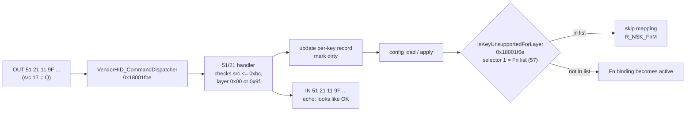

# Lesson 05 — Talking to the keyboard: the Armoury Crate era

> **In one sentence:** By watching ASUS's own app talk to the keyboard over interface 1, the earlier Windows work learned the shape of the 64-byte vendor messages and a handful of commands, and one experiment revealed a trap: the keyboard politely echoes a request even when it quietly ignores it, which the firmware analysis later explained.
> **You will learn:**
> - What a 64-byte vendor report on interface 1 / page `0xFF00` looks like, and why writes need a leading `0x00`
> - The recorded commands `12 00`, `51 21`, `51 22`, `50 55` and the startup handshake
> - How the 68 keys are numbered on the wire (one-based, row-major) and in the Armoury Crate profile file
> - The reserved Fn-key A/B experiment, and how `IsKeyUnsupportedForLayer` explained it
> - Why `51 21` without `50 55` is still a write, and why `Fn + Caps` is not firmware recovery
> - What the Windows tools do, and the four defects log 131 found in them
>
> **Time:** ~70 minutes · **Prerequisites:** [Lesson 04](04-usb-and-hid.md)

## 1. The story (kid version)

Picture a library with a slot in the wall. You can't see the librarian. You push a slip of paper through the slot, and a slip comes back. Every slip is exactly 64 squares long, no more, no less. The first square says what *kind* of request it is. The second square narrows it down. The rest are details.

You want to learn the librarian's language, but there is no dictionary. So you sit next to someone who already speaks it, the library's own helper, and copy down every slip they push through and every slip that comes back. After a while you see patterns. "When the helper wants to know the library's version, they send `12 00`, and the answer always contains `59 00 01 00`."

Then you try something clever. You ask the librarian to change a rule that the library's rulebook says is locked. The librarian writes back a slip that copies your request word for word, which looks like "OK!" But nothing changes. The copy was only a receipt that your slip *arrived*, not a promise that it was *obeyed*.

Much later, someone gets hold of the librarian's own rulebook, the firmware, and finds the page that says: "When loading the rules, skip anything on this list of 57 locked keys."

**How the analogy maps to the real thing**

| In the story | In the real keyboard |
|---|---|
| The slot in the wall | Interface 1, usage page `0xFF00`: endpoints `0x0d` OUT and `0x85` IN |
| A 64-square slip | One 64-byte vendor HID report |
| First and second squares | Opcode and subcommand, for example `51 21` |
| The library's own helper | [Armoury Crate](00-glossary.md#armoury-crate), ASUS's Windows app |
| Copying down every slip | A USBPcap capture ([PCAP / pcapng](00-glossary.md#pcap--pcapng)) |
| The receipt copy of your slip | The device **echo**: the reply repeats the request header |
| The locked-rule page in the rulebook | `IsKeyUnsupportedForLayer` and its lists at `0x1801c810` |

## 2. Why we needed this

This work happened **before** the read-only Linux phase of [Lesson 04](04-usb-and-hid.md), on 2026-08-26 (commits `f53b293`, `205ef8f` and `87e22df`, [TIMELINE.md](../TIMELINE.md)). The goal then was practical: understand how Armoury Crate configures the keyboard, and whether the Fn keys that ASUS locks (media keys, profile switch and so on) could be remapped anyway.

The approach was to watch, not guess. Armoury Crate already knows the protocol. So a USB capture of it doing ordinary things shows the commands. Alongside that, Armoury Crate's saved profile files could be decoded to see what each click changed on disk. And ASUS's helper DLL leaks the names of its own functions into a debug log.

The alternative, sending guessed bytes to the keyboard, was much riskier. It still happened in a few controlled experiments (the A/B test in §3.9), and **those experiments were device writes**. That is why the later preservation phase treated all of this as historical and repeated none of it: "Earlier protocol experiments did send configuration-changing HID reports. They are retained as historical evidence and were not repeated during preservation" ([TIMELINE.md](../TIMELINE.md), conventions).

**A warning about evidence strength, before any bytes.** The raw capture files these notes were built from are gone. "The raw USBPcap/PCAP files cited by these notes are absent from the repository and reachable Git history" ([TIMELINE.md](../TIMELINE.md), 2026-08-26). So [notes/protocol.md](../notes/protocol.md) tags its claims `[V]` verified on hardware, `[C]` from a packet capture, `[S]` static analysis of ASUS's DLL, `[?]` unresolved. It warns that `[V]` and `[C]` mean "*recorded as verified/captured during the earlier work*, not independently reproducible from the current checkout." FINDINGS calls them "**previously observed on hardware**". This lesson keeps that label on every such fact.

## 3. The real thing

### 3.1 The transport

From [notes/protocol.md](../notes/protocol.md) §1, tagged `[V]`:

| Property | Value |
|---|---|
| Windows instance | `HID\VID_0B05&PID_1B7E&MI_01` (`MI_01` = interface 1) |
| Usage page / usage | `0xFF00` / `0x01` |
| Report descriptor | 34 bytes, **declares no Report ID** |
| Payload | 64 bytes IN, 64 bytes OUT |
| Linux endpoints | `0x85` IN, `0x0d` OUT |

This matches the Linux descriptor you decoded yourself in [Lesson 04](04-usb-and-hid.md) §3.8, which is why FINDINGS says "The current USB descriptor logs independently confirm the transport shape."

**The leading `0x00`.** Operating-system HID APIs expect every report to begin with a report-ID byte. When the descriptor declares no Report ID, as here, you still have to supply a placeholder `0x00` in front. So on Windows you write **65** bytes: `0x00` plus the 64-byte payload. This is also why Windows' `HidP_GetCaps` reports `in=65 out=65` while the descriptor says 64. protocol.md: "Getting this wrong is the most common reason a hand-built report is silently dropped."

Windows splits the keyboard into collections slightly differently from Linux (protocol.md §1):

```text
MI_01          UP=0xFF00  U=0x01   in=65  out=65  feat=0    <- config channel
MI_02&COL01    UP=0x000C  U=0x01   in=4   out=0   feat=0    consumer / media
MI_02&COL02    UP=0x0001  U=0x80   in=2   out=0   feat=0    system control
MI_02&COL03    UP=0xFFC0  U=0x01   in=21  out=0   feat=0    vendor, input-only (key events/stats)
MI_04          UP=0x0059  U=0x01   in=0   out=0   feat=51   HID LampArray (Windows Dynamic Lighting)
MI_00, MI_03   keyboard collections                          boot keyboard + NKRO
```

Compare with Lesson 04: `in=4` is Report ID 1's 3 bytes plus the ID byte, `in=21` is Report ID 3's 20 bytes plus its ID, and `feat=51` is interface 4's largest feature report.

**ASUS's own device table** `[S]`. Inside `AacKbHal_x64.dll`, the Armoury Crate hardware-abstraction DLL, there is a table of 0x40-byte records. One of them is this keyboard:

```text
offset      VID     PID    ?    usagePg  usage  usagePg2  variant  ?
0x153DEC   0x0B05  0x1B7E  1    0xFF00   0x01   0xFFC0    0x10     6   <- Falchion Ace HFX
```

It names **two** channels per device: `0xFF00` for commands, and `0xFFC0`, the `MI_02&COL03` event channel. A `cmp ecx, 0x1B7E` at DLL file offset `0x05C005` shows this board is handled inside that DLL.

### 3.2 Anatomy of a vendor report

Every message on this channel follows one pattern:

```text
byte:   0        1          2 .. 63
       opcode   subcommand  payload (zero-padded to 64 bytes)

OUT  51 21 34 9F 02 00 0A 00 00 00 ... 00      host -> keyboard   (EP 0x0d)
IN   51 21 34 9F 02 00 0A 00 00 00 ... 00      keyboard -> host   (EP 0x85): header echoed
```

protocol.md §2: "The device **echoes the request header back** on every command." Queries (`12 xx`) echo the header and then add data. Hold on to the word *echo*. It is the centre of §3.9.

### 3.3 The recorded commands

This is protocol.md's command table, with its evidence tags:

| Opcode | Meaning | Source |
|---|---|---|
| `12 <sub>` | GET / query. Reply echoes `12 <sub>` then appends data. | [C][V] |
| `22 01` | init handshake (echo only) | [C] |
| `25 00`, `25 01` | init handshake (echo only) | [C] |
| `51 21 ...` | **set Fn-layer key binding** | [C][V] |
| `51 22 ...` | set — exact function unconfirmed, seen with `C8` (200) payload | [C] |
| `50 55` | **commit to flash.** Reply ~220 ms later. | [C][V] |

Two notes on these rows, from later work:

- **`51 22` is now partly explained statically.** Firmware analysis found that "`0x21` clears a per-key mode byte, while `0x22` sets it and stores the actuation value from bytes 7-8 divided by 10" ([FINDINGS.md](../FINDINGS.md), "Candidate B vendor-HID and key-policy analysis"). That is a reading of the code, not a wire observation.
- **This is the *captured* surface, not the whole surface.** Log 128 later found the firmware's dispatcher accepts "seventeen top-level opcodes, twenty-four `0x51` subcommands and ten `0x12` queries" ([TIMELINE.md](../TIMELINE.md), corrections). [Lesson 18](18-commands-and-building.md) covers the full map.

### 3.4 The startup handshake and the version query

When Armoury Crate connects, it sends a burst of queries. protocol.md §2 recorded them, in order, tagged `[C]`:

```text
OUT 12 03      IN 12 03 00...
OUT 12 00      IN 12 00 00 00 59 00 01 00 06 00 03 00     <- version
OUT 22 01      IN 22 01 00...
OUT 12 12      IN 12 12 00 00 01 01 00...
OUT 12 08      IN 12 08 00 00 01 00...
OUT 12 16      IN 12 16 00...
OUT 12 14      IN 12 14 00...
OUT 25 00      IN 25 00 00...
OUT 25 01      IN 25 01 00...
```

Decode the version reply. After the echoed `12 00` and two zero bytes come `59 00 01 00`. protocol.md reads it as "`0x59`=89 minor, `01` major = 1.59". That is the same 1.59 as `bcdDevice 0x0159` in [Lesson 04](04-usb-and-hid.md). Two independent routes (a USB descriptor and a vendor query) give the same version. The remaining reply bytes, `06 00 03 00`, are not interpreted in the notes, and this course does not guess.

protocol.md adds a caution that later became policy: "Do not send it merely as a liveness probe during preservation; it is still an undocumented vendor-HID transaction." Even a "read" command is still a message the firmware has to handle. Only descriptor reads are standard.

> **Preview: the handshake was later confirmed from a preserved capture.** In log 126 (2026-09-09), the owner's capture `captures/02-polling-rate.pcap` showed that the Armoury Crate launch burst "*ends* with exactly `notes/protocol.md`'s recorded nine-command block, in order." "The startup handshake is confirmed, not corrected." What the old notes had not recorded: the burst is longer, and it opens with `12 14` with byte 2 = `02`. That is a model-string read whose reply is ASCII `024080600167`, the same model id as the profile filename in §3.7 ([FINDINGS.md](../FINDINGS.md), "The polling-rate protocol, from the wire"). Exercise 6 runs the decoder on that capture. [Lesson 17](17-polling-rate.md) covers it properly.

### 3.5 `51 21`: remap a key on the Fn layer

The wire format, tagged `[C][V]` (protocol.md §3):

```text
byte:  0    1    2         3    4         5    6           7    8..63
      51   21   <src>     9F   <tgt>     00   <actuation> 00   00 ...

  src        source key index   (see 3.6)
  9F         constant in every sample observed
  tgt        target key index   [?]
  actuation  0x0A = 10, matches the config file default
```

Captured from Armoury Crate, with the profile-file entry each one changed:

| action | packet | config entry changed |
|---|---|---|
| M → 1 | `51 21 34 9F 02 00 0A 00` | `keyfunction_55_4` |
| M → 2 | `51 21 34 9F 03 00 0A 00` | `keyfunction_55_4` |
| N → 1 | `51 21 33 9F 02 00 0A 00` | `keyfunction_54_4` |
| ? → ? | `51 21 3D 9F 04 00 0A 00` | `keyfunction_53_5` |
| ? → ? | `51 21 0F 9F 05 00 0A 00` | `keyfunction_56_7` |
| ? → ? | `51 21 2B 9F 06 00 0A 00` | `keyfunction_57_2` |
| ? → ? | `51 21 19 9F 07 00 0A 00` | `keyfunction_57_7` |

Two hardware observations, both tagged `[V]`:

1. **It writes the Fn layer** ([Fn layer](00-glossary.md#fn-layer)). "After `M → 2`, plain `M` still types `m` while **`Fn+M` types `2`**."
2. **`50 55` is not required for it to take effect.** "Sent `51 21 34 9F 04 00 0A 00` with no commit, `Fn+M` changed straight away." Replugging was observed to revert uncommitted changes.

The second point carries the most important safety idea in this lesson:

> **A `51 21` without `50 55` is still a write.** It "changes live device state immediately. Replugging was observed to revert those uncommitted changes, but that does **not** make the command read-only or preservation-safe" (protocol.md §3). FINDINGS: "omitting `50 55` only avoids the known persistent commit; `51 21` still changes live device state."

An observation that replugging reverted a change on one occasion is not a guarantee about every command, every firmware version, or every failure mode.

### 3.6 The 68 keys: one-based, row-major

The source byte is a **key index**. protocol.md §4 and [notes/key-matrix.md](../notes/key-matrix.md) §1 record it as "A **1-based row-major count** over the 68 physical keys, reading the layout left-to-right, top-to-bottom":

```text
row 1   Esc=1   1=2   2=3   3=4   4=5   5=6   6=7   7=8   8=9   9=10
        0=11    -=12  +=13  Bksp=14  Ins=15
row 2   Tab=16  Q=17  W=18  E=19  R=20  T=21  Y=22  U=23  I=24  O=25
        P=26    [=27  ]=28  \=29  Del=30
row 3   Caps=31 A=32  S=33  D=34  F=35  G=36  H=37  J=38  K=39  L=40
        ;=41    '=42  Enter=43  PgUp=44
row 4   LShift=45  Z=46  X=47  C=48  V=49  B=50  N=51  M=52
        ,=53    .=54  /=55  RShift=56  Up=57  PgDn=58
row 5   Ctrl=59  Win=60  Alt=61  Space=62  Alt=63  Fn=64  ROG=65
        Left=66  Down=67  Right=68
```

"One-based" means counting starts at 1, not 0. "Row-major" means you finish a whole row before moving to the next, like reading a page.

The wire carries these numbers in hex. Check the captured table: M is 52 = `0x34` (3 x 16 + 4), and the M packets start `51 21 34`. N is 51 = `0x33`, and the N packet starts `51 21 33`. The pattern holds.

How strong is the table? key-matrix.md says it plainly. Seven entries were **directly confirmed**: Backspace=14, Q=17, I=24, O=25, Enter=43, N=51, M=52. "The remaining 61 entries are extrapolated from the same row-major rule and are consistent with all seven confirmed points, but have not each been individually exercised." Seven confirmed points plus a simple rule is **strongly inferred**, not proven for every key.

| index | key | how it was established |
|---|---|---|
| 14 | Backspace | sent `51 21 0E ...`, `Fn+Backspace` changed |
| 17 | Q | sent `51 21 11 ...`, `Fn+Q` unchanged (reserved, see §3.9) |
| 24 | I | sent `51 21 18 ...`, `Fn+I` produced `vk=0x38` |
| 25 | O | captured from Armoury Crate remapping O |
| 43 | Enter | captured from Armoury Crate remapping Enter |
| 51, 52 | N, M | captured from Armoury Crate remapping N and M |

**The target byte is a different story.** Contradictory observations (protocol.md §4):

| target byte | result |
|---|---|
| `0x09` on src 24 (I) | typed `8` (`vk=0x38`) |
| `0x04` on src 14 (Backspace) | typed `4` |
| `0x04` on src 52 (M) | typed `3` |

The same target byte gave different characters on different keys. The notes offer two explanations and choose neither: "either the target field is not a plain key index, or Armoury Crate interactions between tests mutated state." It stayed `[?]`. Later static analysis recovered part of the rule. For ordinary values, "`internal_target = table[wire_target]`" through a 189-byte table at runtime `0x1801bff6`. But FINDINGS warns that "earlier live tests reported inconsistent effects and the active unit's effective KBID is not known" ([KBID](00-glossary.md#kbid)). The clean experiment that could settle it would need more device writes, so it was deferred.

### 3.7 The profile file: a second, different numbering

Armoury Crate saves each profile to `C:\ProgramData\ASUS\Framework\keyboard\ROG FALCHION ACE HFX\fp_<profile>_config_<model>.xml`, with model `024080600167`. The payload is wrapped three times: **base64 → percent-decode → JSON** (protocol.md §7). The decoded profile 3 is preserved as [notes/ac-profile3-decoded.json](../notes/ac-profile3-decoded.json). Its top-level keys are `nationCode`, `button`, `lighting`, `performance`, `lever`.

`button.keyboardButton` holds **136 entries**: 68 keys x 2 layers. Each is named `keyfunction_<col>_<row>` and carries a `source_key`:

```text
source_key = (row << 8) | col
```

`row << 8` means "row times 256". `|` means "combine the bits". With `col` 0–11 for the **base layer** and `col` 50–61 for the **Fn layer** of the same key (`col + 50`). Take M: base `keyfunction_5_4` has `source_key` `1029`, and 4 x 256 + 5 = 1029. Its Fn twin `keyfunction_55_4` has `1079`, and 4 x 256 + 55 = 1079. The rule held on "**135 of 136** entries". The sole exception, row 1 / col 0, stores `0x0000` instead of `0x0100`.

**Two numberings, not reconciled.** key-matrix.md: "M is index `52` on the wire but `row 4 / col 55` in the file." The wire numbering counts physical keys. The file numbering is a sparse 7 x 12 grid. The notes do not claim a formula between them.

Fields that change when you remap a key ([notes/key-matrix.md](../notes/key-matrix.md) §3, `[V]`):

| field | factory | after a user remap |
|---|---|---|
| `selectedmode` | `"0"` base / `"7"` Fn | `1` |
| `button_function` | `0` base / `7` Fn | `1` |
| `target_key` | same as `source_key` | the target's `(row<<8)\|col` |
| `keydata_1` | `-1` | mirrors `target_key` |

[notes/ac-profile3-keys.csv](../notes/ac-profile3-keys.csv) flattens the same 136 entries into columns `idx` (col), `grp` (row), `mode`, `defKey`, `src`, `bfun`, `tgt`, `act`, `trig`.

**The snapshots.** `snapshots/baseline.json` is byte-identical to `notes/ac-profile3-decoded.json`. `snapshots/after-q-a.json` differs from it in exactly six key entries, all on the Fn layer, each switching `selectedmode` from `7` to `1` and getting a new `target_key` (Exercise 4):

```text
keyfunction_56_7 1848 7 -> 1 1848 -> 258
keyfunction_57_2 569 7 -> 1 569 -> 260
keyfunction_57_7 1849 7 -> 1 1849 -> 259
keyfunction_54_4 1078 7 -> 1 1078 -> 1536
keyfunction_55_4 1079 7 -> 1 1079 -> 1792
keyfunction_53_5 1333 7 -> 1 1333 -> 257
```

Those are exactly the six `keyfunction_*` names in the captured `51 21` table in §3.5. The project documents do not describe what action produced `after-q-a.json`, so this course does not guess beyond that observation.

### 3.8 The HAL leaks its own function names

`AacKbHal_x64.dll` exports only COM boilerplate, so there are no function names in its export table. "But it logs every call via `OutputDebugString` as `[<Class>][<Method>]`, which leaks the whole API" (protocol.md §8, `[S]`). A selection:

```text
ChangeKey, ChangeKey_Normal, ChangeKey_DKS, ChangeKey_ModTap, ChangeKey_Toggle
SetActuation_AllKey / _PreKey        SetRapidTrigger_AllKey / _PreKey
SetDeadZone_AllKey / _PreKey         SetSpeedTap, SetProfile
GetVersion, GetDeviceInfo            SetPollingRate, GetPollingRate
```

`OutputDebugString` writes to a Windows debug channel called DBWIN, which any single listener can read. That is what `tools/haltrace.ps1` does: label USB packets with the method name that caused them, "instead of guessing what an opcode does" ([tools/README.md](../tools/README.md)).

### 3.9 The trap: an echo is not an effect

This is the experiment that made this era memorable. protocol.md §5, tagged `[V]`: "Controlled A/B — two commands differing only in the source byte, sent back to back, neither committed, no Armoury Crate interaction between them":

```text
51 21 11 9F 09 00 0A 00    src 17 = Q   (reserved: Fn+Q = Play/Pause)  -> ACK, NO EFFECT
51 21 18 9F 09 00 0A 00    src 24 = I   (not reserved)                 -> ACK, APPLIED (vk 0x38)
```

Same result for `src 2` (the `1` key, reserved as F1): acknowledged, but `Fn+1` stayed F1, while `src 14` in the same batch applied normally. An "A/B" test changes exactly one thing between two runs, here the source byte, so any difference in outcome must come from that one thing.

Three observations came out of it:

1. **The keyboard echoed both requests identically.** No error code. "`FF AA` was never observed in any test."
2. **The reserved one silently did nothing.**
3. **Armoury Crate itself blocks these keys in its UI** before sending anything ([FINDINGS.md](../FINDINGS.md), "Earlier protocol research").

The keys ASUS reserves come from the official manual (protocol.md §6). A few:

```text
Fn + 1/2/3/4/5/6/7/8/9/-/=   Function key switch (F1-F12)
Fn + A/S/D/F/G/H             Profile switch (H = default)
Fn + Caps                    Factory default (hold until LEDs blink green)
Fn + Q/W/E/R/T/Y             Play-Pause / Prev / Next / Mute / Vol- / Vol+
Fn + Ins                     Fn lock / unlock
Fn + Windows                 Windows lock
```

The rule that follows, in protocol.md's own box: "**Any tool built on this protocol must verify by reading back or observing the key. Never treat the echo as success.**"

At the time, *why* it happened was unknown. FINDINGS' audit kept the result "as **previously observed on hardware**, not as results that can currently be reproduced from repository evidence alone," because the PCAPs were missing.

### 3.10 How the firmware explained it, three days later

On 2026-08-29, after the firmware file of [Lesson 06](06-the-firmware-file.md) was in hand, Ghidra analysis of Candidate B ([Lesson 08](08-ghidra.md)) found the explanation (logs 47–54, then logs 60–61 for the exact values). Addresses below are in the vendor 1.00.58 image. Some installed-1.59 addresses are shifted ([Lesson 13](13-installed-vs-vendor.md)).

**Step 1: the dispatcher.** `VendorHID_CommandDispatcher` at runtime `0x18001fbe` ([dispatcher](00-glossary.md#dispatcher)) "reads the 64-byte request buffer at `0x1802337c`, dispatches top-level opcode `0x50` to a branch containing subcommand `0x55`, and dispatches opcode `0x51` to the keyboard-configuration handlers."

**Step 2: the `51 21` handler never checks the reserved list.** "Source byte 2 must be at most `0xbc`; byte 3 must be `0x00` or `0x9f`" (the mysterious `9F` constant from §3.5 is one of two accepted layer values). The handler updates the per-key record, marks state dirty, and "constructs a 64-byte response that echoes opcode `0x51`, the subcommand, source, and payload." And: "There is no explicit reserved-source rejection in this packet handler."

**Step 3: a separate gate at load time.** A predicate at runtime `0x18001f6e`, now labelled `IsKeyUnsupportedForLayer`, "copies and searches one of two runtime lists: 6 32-bit entries for layer selectors 0 or 2, and 57 entries for other selectors. The configuration-load state machine calls it with selector 0 for base mappings and selector 1 for Fn mappings; when it returns true, the mapping is skipped and the firmware uses diagnostic strings `R_NSK_M` or `R_NSK_FnM`" ([FINDINGS.md](../FINDINGS.md)).



**Step 4: the lists themselves.** The 63 entries (6 + 57) sit at runtime `0x1801c810`, which is Candidate B offset `0x1c810` and **full-file offset `0x3d810`**. They were extracted directly from the official BIN by `tool/analyze_candidate_b_tables.py` (logs 60–61, 68). Two entries of the 57-entry Fn list (Exercise 7):

```text
index internal_code usage matching_wire_sources
22 0x0000001e 1                  2:1
44 0x00000014 Q                  17:Q
```

Those are the two reserved keys from the A/B test: wire source 17 (Q) and wire source 2 (the `1` key). Both are in the Fn policy list. The list as a whole "closely matches the manual's locked function families": F1–F12, digits, `-`/`=`, arrows, navigation keys, Esc, Tab, modifiers, Q/W/E/R/T/Y/U/P, A/S/D/F/G/H, Caps Lock, plus one vendor/custom value `0xe8` (protocol.md §5).

**How strong is this?** Use the project's words exactly. The policy function is "verified device-side reserved/unsupported-key policy logic and is the **strongest current explanation** for the historical 'ACK but no effect' behavior" ([FINDINGS.md](../FINDINGS.md)). "Packet acceptance/echo and effective binding policy are separate decisions" (protocol.md §5). It is a static explanation that *agrees with* a historical observation. It was not re-tested on the device, and the historical observation itself cannot be replayed from preserved captures.

### 3.11 `Fn + Caps` is not a safety net

The manual lists `Fn + Caps` as "Factory default (hold until LEDs blink green)." It is tempting to think of it as an undo button for anything. It is not. "`Fn + Caps` performs a settings factory reset. It is not firmware recovery and cannot repair a failed flash or bootloader" ([notes/findings.md](../notes/findings.md)). It resets *settings* stored by working firmware. If the firmware itself is broken, there is nothing running to perform the reset. [Lesson 10](10-how-it-boots.md) covers a different key combination the bootloader itself checks.

### 3.12 The Windows tools

[tools/README.md](../tools/README.md) lists six PowerShell scripts. The columns that matter most are "elevated?" (needs administrator rights) and "writes to keyboard?":

| script | elevated? | writes to keyboard? | purpose |
|---|---|---|---|
| `snap-config.ps1` | no | no | snapshot + recursively diff every Armoury Crate profile |
| `keywatch.ps1` | no | no | show the real vk/scan code of a keypress |
| `decode.ps1` | no | no | pull the 64-byte vendor reports out of a capture, annotate, diff |
| `haltrace.ps1` | **yes** | no | live capture of the ASUS HAL's `[Class][Method]` debug log |
| `capture.ps1` | **yes** | no | start a passive USBPcap capture |
| `send.ps1` | no | **YES** | send a raw 64-byte command on the 0xFF00 channel |

- **`send.ps1` is quarantined.** It opens `MI_01` and writes a 65-byte report. Its header says: "WARNING: every invocation writes an undocumented vendor-HID report. Omitting -Commit avoids the recorded 0x50 0x55 persistent commit but does not make the command read-only." The README presents no command examples for it on purpose.
- **`keywatch.ps1`** exists because "'F1', '9' and 'nothing' are indistinguishable in a text box." It is how "APPLIED (vk 0x38)" in §3.9 was observed.
- **USBPcap gotchas** the README records: it needs a reboot after install; it is an *extcap* interface, so `dumpcap -D` never lists it and `tshark -D` must be used; and non-admin processes cannot see it, which looks exactly like a broken install.

PowerShell cannot run in this repository's Linux environment. So three of the scripts have **offline twins** in `tool/` that own the rules and are tested: `decode.ps1` ↔ `tool/decode_capture.py`, `capture.ps1` and `haltrace.ps1` ↔ `tool/windows_tools.py`, `snap-config.ps1` ↔ `tool/profile_diff.py`. The README is careful about what that proves. "**They do not execute any PowerShell.**" The checks are "token and ordering checks over the script text" and "not an equivalence proof." "**Every `.ps1` in this directory is Windows-unvalidated.**"

### 3.13 Why the lost PCAPs matter

A capture file is the raw evidence. Notes are someone's reading of it. When the file is lost:

- exact packet counts and sequences can't be re-checked;
- a misreading can't be caught by a second reader;
- tools can't be tested against real data.

That is exactly the downgrade this era's evidence suffered: from "captured" to "previously observed on hardware." It also blocked the most useful re-check, whether the reserved-key echo really happened as described. The investigation's response was to preserve what did survive (the decoded JSON, CSV, snapshots, notes, and tools), label it honestly, and make future captures much harder to lose (§5.1).

Later, the owner took new captures, now in `captures/`: `01-first-launch.pcapng`, `02-polling-rate.pcap` and `.pcapng`, and `02-polling-rate-owner-facts.txt`, all hashed in logs 126 and 131. From those, log 126 confirmed the startup handshake and proved `51 31` on the wire.

## 4. Decisions and why

| Decision | Why | Alternative rejected | Evidence (log) |
|---|---|---|---|
| Watch Armoury Crate instead of guessing bytes | The vendor app already speaks the protocol; watching sends nothing | Fuzzing opcodes on the keyboard | [notes/protocol.md](../notes/protocol.md); TIMELINE 2026-08-26 |
| Run the reserved-key test as a controlled A/B, no AC in between | Only the source byte differs, so a different outcome must come from it | Comparing results from separate sessions | protocol.md §5 |
| Verify effects with `keywatch.ps1`, never trust the echo | The echo was shown to be delivery, not effect | Treating an echoed reply as success | protocol.md §5; tools/README.md |
| Label the era's results "previously observed on hardware" | Raw PCAPs are missing from the repo and Git history | Citing them as reproducible evidence | FINDINGS "Earlier protocol research"; logs 27–28 |
| Do not replay any of these commands during preservation | `51 21` changes live state; `50 55` persists it | "It's only a remap, no commit" | FINDINGS; TIMELINE conventions |
| Defer the target-byte experiment | Resolving it needs more writes and settings resets | Running it during preservation | notes/key-matrix.md §2 |
| Give PowerShell tools offline twins and say what they don't prove | PowerShell can't run here; claims must match what was run | Calling the scripts "tested" | log 131; tools/README.md |
| `capture.ps1` refuses an existing file and has no `-Force` | "A switch that puts evidence destruction one keystroke away is the same hazard with a longer name" | Adding a `-Force` override | log 131, finding 3 |

## 5. What went wrong, and how it was caught

### 5.1 The first-launch capture was overwritten (`capture.ps1`)

**What was believed.** `capture.ps1` printed `saved:` at the end, so the capture was saved.

**What was true.** The script "overwrote an existing `-Out` silently — which is how the original first-launch capture was lost — accepted any `-Interface` string without checking it against the enumerated list, ignored tshark's exit status, and printed `saved:` unconditionally" ([FINDINGS.md](../FINDINGS.md), "Windows capture tooling, corrected").

**How it was caught.** The README already recorded the loss. Log 131 reproduced the defect from the file: `& $tshark @a` "followed unconditionally by" `Write-Host "saved: $Out"`.

**The fix.** An existing `-Out` is refused, with no `-Force`. `-Unique` makes a timestamped name. The interface must appear in `tshark -D`. The exit status is checked. The output must exist, be non-empty, and begin with a pcap or pcapng magic number before `saved:` is printed with its size and SHA-256.

**The lesson.** **A success message is only as good as the check in front of it.** And a tool that handles evidence should make destroying evidence impossible, not merely discouraged.

### 5.2 `decode.ps1` decoded nothing (log 131)

**What was believed.** Its description said it "keeps only the 0b05:1b7e traffic."

**What was true.** It "implemented no VID/PID, address, endpoint or length filter at all," derived direction by matching the word `host` in text fields, and read `usb.capdata`, "which USBPcap leaves **empty** on the vendor endpoints." Re-derived from the preserved capture: "148 frames match the corrected filter; 0 of them carry a non-empty `usb.capdata`. The old script's yield from captures/02-polling-rate.pcap was zero reports" (log 131).

**The fix.** Payloads come from `usbhid.data`. The subject is found by reading every device identity in the capture and keeping `0b05:1b7e`, with **all** its addresses. The filter is OUT `0x0d`, IN `0x85`, exactly 64 bytes, and direction comes from bit 7 of the endpoint address (you met that bit in [Lesson 04](04-usb-and-hid.md) §3.4). The same keyboard is address 2 in one capture and addresses 6 and 7 in another, which is why an address must never be hard-coded.

**The lesson.** **A comment describing what code does is not evidence that it does it.** Test against real data.

### 5.3 `snap-config.ps1` said "NO CHANGE" when things had changed (log 131)

**What was believed.** Snapshot, change a setting, snapshot again: "NO CHANGE" means nothing changed.

**What was true.** The diff "walked only `button.keyboardButton`." Measured against `notes/ac-profile3-decoded.json`: "1500 flattened paths in the model, 1360 under .button.keyboardButton <- all the old diff could see, 140 everywhere else <- including EVERY global setting." A polling-rate, global rapid-trigger, Speed Tap, dead-zone, lighting or lever change was invisible. It also defaulted to profile 3 only.

**The fix.** A recursive diff of every path, `-AllProfiles` with each file's name, mtime and SHA-256, and a test mutation in each of 14 setting categories that must show up (Exercise 8).

**The lesson.** **"No difference found" is only as wide as where you looked.**

### 5.4 `haltrace.ps1` could silently share its stream (log 131)

Windows' `CreateFileMapping` "succeeds when the object already exists and reports it only through `GetLastError == ERROR_ALREADY_EXISTS` (183), which the script never read." With DebugView also running, two listeners would split the messages and neither would have a complete trace. It now refuses, requires elevation, and releases every handle on failure. One limitation remains and is stated, not fixed: "DBWIN has one slot and no queue... **A missing line is not evidence that a HAL call did not happen.**"

### 5.5 Two hypotheses tested and disproved

key-matrix.md §4 keeps these "so nobody spends time on them again":

- "`mode == 7` marks a locked key." **False.** "All 68 Fn-layer entries carry mode 7 uniformly at factory, including keys Armoury Crate remaps freely." It just means "Fn-layer default."
- "Matrix row-major order matches ascending `lamp_id` in the LED CSV." **False.** Zipping the two lists "produced a tidy-looking key-name table that was wrong... The tidiness was an artifact of the zip, not evidence for it."

**The lesson.** **A neat-looking result is not evidence.** Check it against one known point before trusting the pattern.

### 5.6 Unsafe instructions in the early guide

The 2026-08-29 audit (logs 27–28) found problems in the original research guide ([FINDINGS.md](../FINDINGS.md), "Safety problems identified by the audit"):

- It told the reader to let Armoury Crate "apply any pending firmware/config update", which "directly conflicts with preserving the installed original firmware."
- "Phases 1–3 are described as read-only/reversible, but Phase 3 includes changing settings, replaying HID writes, and remapping keys."
- "The example `d.write(report)` and remap replay are placeholders that could write persistent configuration."

These were removed or quarantined. The lesson from [Lesson 03](03-the-detectives-rules.md) applies: **name a write a write, even when it is "just a setting".**

### 5.7 Two over-readings corrected by later work

- **A raw `51 21` in the firmware was not a command table.** "The only raw adjacent bytes `51 21` elsewhere in Candidate B were an instruction encoding (`movs r1,#0x51`), not a packet table" ([TIMELINE.md](../TIMELINE.md), 2026-08-29 21:55). Bytes that match a pattern can be something else entirely.
- **The six-row command table is the captured surface, not the command surface** (log 128, §3.3).

## 6. Try it yourself

All commands read saved files only. Run them from `keyboard/falchion-re/`. None of them talks to the keyboard, and none runs PowerShell.

**1. Read the captured `51 21` table.**

```bash
grep -n '51 21 [0-9A-F][0-9A-F] 9F' notes/protocol.md
```

```text
133:| M → 1 | `51 21 34 9F 02 00 0A 00` | `keyfunction_55_4` |
134:| M → 2 | `51 21 34 9F 03 00 0A 00` | `keyfunction_55_4` |
135:| N → 1 | `51 21 33 9F 02 00 0A 00` | `keyfunction_54_4` |
136:| ? → ? | `51 21 3D 9F 04 00 0A 00` | `keyfunction_53_5` |
137:| ? → ? | `51 21 0F 9F 05 00 0A 00` | `keyfunction_56_7` |
138:| ? → ? | `51 21 2B 9F 06 00 0A 00` | `keyfunction_57_2` |
139:| ? → ? | `51 21 19 9F 07 00 0A 00` | `keyfunction_57_7` |
147:`51 21 34 9F 04 00 0A 00` with no commit, `Fn+M` changed straight away.
238:51 21 11 9F 09 00 0A 00    src 17 = Q   (reserved: Fn+Q = Play/Pause)  -> ACK, NO EFFECT
239:51 21 18 9F 09 00 0A 00    src 24 = I   (not reserved)                 -> ACK, APPLIED (vk 0x38)
```

Line 147 is the "no commit needed" test. Lines 238–239 are the reserved-key A/B: the two packets differ only in byte 2.

**2. Convert source bytes to key indices.**

```bash
printf '%s=%d ' 0x0e 0x0e 0x11 0x11 0x18 0x18 0x33 0x33 0x34 0x34; echo
```

```text
0x0e=14 0x11=17 0x18=24 0x33=51 0x34=52
```

Look each number up in §3.6: Backspace, Q, I, N, M.

**3. Check the `source_key` rule on M.**

```bash
echo $(( (4<<8)|55 )) $(( (4<<8)|5 ))
grep -E '^"(5|55)","4"' notes/ac-profile3-keys.csv
```

```text
1079 1029
"5","4","0","1029","1029","0","1029","10","0"
"55","4","7","1079","1079","7","1079","10","0"
```

Column 3 is `mode`: `0` on the base layer, `7` on the Fn layer.

**4. Diff the two snapshots at key level.** The files start with a byte-order mark, hence `utf-8-sig`.

```bash
python3 - <<'E'
import json
a=json.load(open('snapshots/baseline.json',encoding='utf-8-sig'))
b=json.load(open('snapshots/after-q-a.json',encoding='utf-8-sig'))
print(list(a.keys()))
ka=a['button']['keyboardButton']; kb=b['button']['keyboardButton']
print(len(ka))
for k in ka:
    if ka[k]!=kb[k]: print(k, ka[k]['button']['source_key'], ka[k]['selectedmode'],'->',kb[k]['selectedmode'], ka[k]['button']['normal']['target_key'],'->',kb[k]['button']['normal']['target_key'])
for top in a:
    if top!='button' and a[top]!=b[top]: print('diff in',top)
E
```

```text
['nationCode', 'button', 'lighting', 'performance', 'lever']
136
keyfunction_56_7 1848 7 -> 1 1848 -> 258
keyfunction_57_2 569 7 -> 1 569 -> 260
keyfunction_57_7 1849 7 -> 1 1849 -> 259
keyfunction_54_4 1078 7 -> 1 1078 -> 1536
keyfunction_55_4 1079 7 -> 1 1079 -> 1792
keyfunction_53_5 1333 7 -> 1 1333 -> 257
```

No line starts with `diff in`, so only key bindings differ. Compare the six names with §3.5's table.

**5. Confirm `baseline.json` is the preserved profile.**

```bash
cmp snapshots/baseline.json notes/ac-profile3-decoded.json && echo same
```

```text
same
```

**6. Preview: the handshake in a preserved capture.** This reads a saved `.pcap` with `tshark`. It does not capture anything.

```bash
python3 tool/decode_capture.py captures/02-polling-rate.pcap | head -18
```

```text
CAPTURE captures/02-polling-rate.pcap
SUBJECT 0b05:1b7e at bus 3 address 6; bus 3 address 7
FILTER ((usb.bus_id==3 && usb.device_address==6) || (usb.bus_id==3 && usb.device_address==7)) && (usb.endpoint_address==0x0d || usb.endpoint_address==0x85) && usb.data_len==64
REPORTS 148 out=74 in=74 unique=28

 frame      time  dir  len  first 16 bytes
 76627    185.573  OUT   64B  12 14 02 00 00 00 00 00 00 00 00 00 00 00 00 00  (rest zero)
 76628    185.574  IN    64B  12 14 02 00 30 32 34 30 38 30 36 30 30 31 36 37  (rest zero)
 76647    185.589  OUT   64B  12 07 00 00 00 00 00 00 00 00 00 00 00 00 00 00  (rest zero)
 76650    185.590  IN    64B  12 07 00 00 01 00 00 00 00 00 00 00 00 00 00 00  (rest zero)
 76787    185.732  OUT   64B  12 00 00 00 00 00 00 00 00 00 00 00 00 00 00 00  (rest zero)
 76790    185.733  IN    64B  12 00 00 00 59 00 01 00 06 00 03 00 00 00 00 00  (rest zero)
 76795    185.735  OUT   64B  22 01 00 00 00 00 00 00 00 00 00 00 00 00 00 00  (rest zero)
 76796    185.736  IN    64B  22 01 00 00 00 00 00 00 00 00 00 00 00 00 00 00  (rest zero)
 76800    185.739  OUT   64B  12 12 00 00 00 00 00 00 00 00 00 00 00 00 00 00  (rest zero)
 76801    185.740  IN    64B  12 12 00 00 01 01 00 00 00 00 00 00 00 00 00 00  (rest zero)
 134105    287.084  OUT   64B  12 03 00 00 00 00 00 00 00 00 00 00 00 00 00 00  (rest zero)
 134108    287.085  IN    64B  12 03 00 00 00 00 00 00 00 00 00 00 00 00 00 00  (rest zero)
```

Find the version reply `59 00 01 00`. Then decode `30 32 34 30 38 30 36 30 30 31 36 37` as ASCII (`0x30` is the character `0`): it spells `024080600167`. Notice every IN line repeats its OUT line's first bytes. That is the echo.

**7. Find Q and `1` in the firmware's Fn policy list.** This reads the vendor BIN only.

```bash
python3 tool/analyze_candidate_b_tables.py dumps/vendor/M605_V01_00_58.bin | grep '^unsupported_lists'
python3 tool/analyze_candidate_b_tables.py dumps/vendor/M605_V01_00_58.bin | sed -n '/^FN_UNSUPPORTED_POLICY/,$p' | grep -E '^(index|22|44) '
python3 tool/analyze_candidate_b_tables.py dumps/vendor/M605_V01_00_58.bin | sed -n '/^FN_UNSUPPORTED_POLICY/,$p' | grep -Ec '^[0-9]{2} 0x'
```

```text
unsupported_lists=runtime=0x1801c810 candidate_offset=0x1c810 file_offset=0x3d810 base_count=6 fn_count=57
index internal_code usage matching_wire_sources
22 0x0000001e 1                  2:1
44 0x00000014 Q                  17:Q
57
```

57 entries, and the two reserved keys from the A/B test are among them. (Don't over-read the `matching_wire_sources` column for every row. protocol.md warns that the static translation table "does not make every special/navigation entry line up one-to-one".)

**8. See the 14 setting categories the corrected diff must catch.**

```bash
python3 tool/profile_diff.py --categories
```

```text
CATEGORY all-key actuation: 1 path(s)
CATEGORY all-key rapid trigger: 1 path(s)
CATEGORY dead zone: 3 path(s)
CATEGORY lever: 49 path(s)
CATEGORY lighting: 65 path(s)
CATEGORY per-key actuation: 136 path(s)
CATEGORY per-key rapid trigger list: 4 path(s)
CATEGORY per-key trigger type: 136 path(s)
CATEGORY polling rate: 1 path(s)
CATEGORY rapid trigger continue status: 1 path(s)
CATEGORY rapid trigger press distance: 1 path(s)
CATEGORY rapid trigger release distance: 1 path(s)
CATEGORY rapid trigger separate mode: 1 path(s)
CATEGORY speed tap: 7 path(s)
RESULT categories=14 missing=0
```

**9. Read `send.ps1`'s own warning (reading, not running).**

```bash
sed -n 10,13p tools/send.ps1
```

```text
  WARNING: every invocation writes an undocumented vendor-HID report. Omitting -Commit
  avoids the recorded 0x50 0x55 persistent commit but does not make the command read-only;
  live device state may still change. Retained for historical protocol reproducibility.
  Do not run during firmware preservation without a separate approved write-test plan.
```

## 7. Check your understanding

1. Why do Windows writes to interface 1 need 65 bytes when the report is 64?
   <details><summary>Answer</summary>The report descriptor declares no Report ID, but the OS HID API still expects a report-ID byte first. You prepend a `0x00` placeholder, then the 64-byte payload. That's why `HidP_GetCaps` shows `in=65 out=65` (notes/protocol.md §1).</details>

2. The source byte in `51 21 34 9F 02 00 0A 00` is `0x34`. Which key, and how do you know?
   <details><summary>Answer</summary>`0x34` = 52, which is M in the one-based row-major table. It was directly confirmed: the captured "M → 1" and "M → 2" packets use `34`, and `Fn+M` then typed `2` (notes/protocol.md §3–4).</details>

3. Someone says: "I only sent `51 21`, not `50 55`, so I didn't write anything." What's wrong with that?
   <details><summary>Answer</summary>`51 21` takes effect immediately in RAM, so it changes live device state. `50 55` only adds persistence. Omitting it "only avoids the known persistent commit" (FINDINGS). A replug reverting one change was an observation, not a guarantee.</details>

4. The keyboard echoed the `Fn+Q` remap exactly like the `Fn+I` remap. Why did only one take effect?
   <details><summary>Answer</summary>The `51 21` handler accepts and echoes both. Separately, when the configuration is loaded, `IsKeyUnsupportedForLayer` (`0x18001f6e`) checks Fn mappings against a 57-entry list at `0x1801c810` and skips matches. Q (usage `0x14`) is in that list; I is not. FINDINGS calls this the "strongest current explanation", a static finding that agrees with a historical observation.</details>

5. Is `Fn + Caps` a way to recover from a bad firmware flash?
   <details><summary>Answer</summary>No. It is a settings factory reset performed by working firmware. It "cannot repair a failed flash or bootloader" (notes/findings.md).</details>

6. Why does it matter that the original PCAPs are missing?
   <details><summary>Answer</summary>Without the raw captures, packet sequences and the A/B results can't be re-derived or re-checked by anyone, so they are downgraded to "previously observed on hardware". It also meant tools couldn't be tested on real data until the new captures in `captures/` arrived, and the original first-launch capture was lost to an overwrite in `capture.ps1`.</details>

## 8. Sources

- [../FINDINGS.md](../FINDINGS.md), sections "Earlier protocol research and evidence status", "Historical audit of the earlier Claude Code work", "Candidate B vendor-HID and key-policy analysis", "The polling-rate protocol, from the wire (log 126)", "Windows capture tooling, corrected (log 131)"
- [../TIMELINE.md](../TIMELINE.md), 2026-08-26 entries (protocol and key map; reserved Fn-key behavior; backup assessment), 2026-08-29 21:55–22:27, "Corrections retained for auditability"
- [../notes/protocol.md](../notes/protocol.md), [../notes/key-matrix.md](../notes/key-matrix.md), [../notes/findings.md](../notes/findings.md)
- [../notes/ac-profile3-decoded.json](../notes/ac-profile3-decoded.json), [../notes/ac-profile3-keys.csv](../notes/ac-profile3-keys.csv), [../snapshots/baseline.json](../snapshots/baseline.json), [../snapshots/after-q-a.json](../snapshots/after-q-a.json)
- [../notes/windows-behavior-capture-plan.md](../notes/windows-behavior-capture-plan.md), [../WINDOWS-CAPTURE-03-features.md](../WINDOWS-CAPTURE-03-features.md)
- [../tools/README.md](../tools/README.md), [../tools/capture.ps1](../tools/capture.ps1), [../tools/decode.ps1](../tools/decode.ps1), [../tools/send.ps1](../tools/send.ps1), [../tools/keywatch.ps1](../tools/keywatch.ps1), [../tools/snap-config.ps1](../tools/snap-config.ps1), [../tools/haltrace.ps1](../tools/haltrace.ps1)
- [../logs/27-claude-notes-report-desc-provenance.txt](../logs/27-claude-notes-report-desc-provenance.txt), [../logs/28-claude-progress-audit.txt](../logs/28-claude-progress-audit.txt)
- [../logs/47-ghidra-candidate-b-opcode-search.txt](../logs/47-ghidra-candidate-b-opcode-search.txt) through [../logs/54-ghidra-protocol-labels.txt](../logs/54-ghidra-protocol-labels.txt); [../logs/60-candidate-b-runtime-table-extraction.txt](../logs/60-candidate-b-runtime-table-extraction.txt), [../logs/61-candidate-b-table-analysis.txt](../logs/61-candidate-b-table-analysis.txt)
- [../logs/126-polling-rate-capture-analysis.txt](../logs/126-polling-rate-capture-analysis.txt), [../logs/131-pointer-root-and-windows-capture-tooling-corrections.txt](../logs/131-pointer-root-and-windows-capture-tooling-corrections.txt)
- [../tool/analyze_candidate_b_tables.py](../tool/analyze_candidate_b_tables.py), [../tool/decode_capture.py](../tool/decode_capture.py), [../tool/profile_diff.py](../tool/profile_diff.py), [../tool/windows_tools.py](../tool/windows_tools.py)

[← Previous](04-usb-and-hid.md) · [Course home](README.md) · [Next →](06-the-firmware-file.md)
