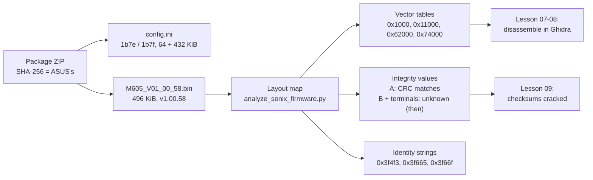

# Lesson 06 — The firmware file: opening the ASUS package without running it

> **In one sentence:** ASUS's official update package was verified against ASUS's own published hash, read like a book without ever running its programs, and its 496 KiB firmware image was mapped region by region into a bootloader, two code payloads, a spare copy of the bootloader, and a small RAM image.
> **You will learn:**
> - How to prove a download is authentic with SHA-256, and how to preserve it without changing it
> - What the updater's config file (`Vid`, `Pid`, `BootloaderPID`, the `Cmd 1` line) reveals, and why the `.exe` files were never run
> - The layout of the 496 KiB container: `SNC7320A`, `SN_BCFG`, `SN_FWIN`, Candidate A at `0x11000`, Candidate B at `0x21000`, padding, the `0x60000` backup container, and the `0x74000` RAM image
> - How to read a vector table, and what entropy says about encryption
> - Where the USB identity sits inside Candidate B, and the three levels of patching
>
> **Time:** ~75 minutes · **Prerequisites:** [Lesson 02](02-how-computers-count.md), [Lesson 03](03-the-detectives-rules.md), [Lesson 04](04-usb-and-hid.md)

## 1. The story (kid version)

A big sealed crate arrives from the factory. On the side is a long serial number, and the factory's website prints the same number, so you know nobody swapped the crate on the way. Inside is a small robot that knows how to open your keyboard and replace its brain. There's also a sheet of instructions for that robot, and the new brain itself, packed in a box.

You are not going to switch on the robot. It's built to replace things, and you don't have a spare brain yet. Instead you read the robot's instruction sheet, and then you unpack the new brain's box and write down where everything is: "labels here, first set of instructions here, empty padding here, a spare copy of the first set there, a little extra booklet at the very end."

That map is what this lesson builds.

**How the analogy maps to the real thing**

| In the story | In the real thing |
|---|---|
| The sealed crate | `ROG_FALCHION_ACE_HFX.zip`, 238,446,426 bytes |
| The serial number on the crate and the website | Its SHA-256, which matches the one ASUS publishes |
| The robot that replaces brains | The updater programs `FW_Update_Tool_M605.exe` and `peripheral_fwu_pro.exe` |
| The robot's instruction sheet | `config.ini` and `Dependence.ini` |
| The new brain in its box | `M605_V01_00_58.bin`, the firmware image |
| Labels on the box | Magic text markers: `SNC7320A`, `SN_BCFG`, `SN_FWIN` |
| The spare copy of the first instructions | The bootloader copy at `0x61000` |
| Not switching the robot on | Never running any `.exe` from the package |

## 2. Why we needed this

At the end of [Lesson 04](04-usb-and-hid.md), the answer to "can we back up the installed firmware?" was: not through any standard USB door. Before going further, the investigation needed to know **what the firmware even looks like**. How big is it? Where does the code start? Is it encrypted? What does the update process expect?

The owner supplied ASUS's official package, `ROG_FALCHION_ACE_HFX.zip`, on 2026-08-29. The work in logs 29–37 then ran from 02:46 to 03:22 that morning ([TIMELINE.md](../TIMELINE.md)). Everything was **static**: reading bytes and strings, never executing anything.

The alternatives:

- **Run the updater and watch it.** Rejected outright. It is a confirmed writer that "would attempt bootloader entry, erase, and programming" ([FINDINGS.md](../FINDINGS.md), "Updater configuration and transport").
- **Wait for a dump of the installed firmware.** There was none. Studying the vendor image is the closest safe substitute, *as long as you never confuse the two*. That caution runs through this whole lesson.

## 3. The real thing

### 3.1 Is the package authentic?

A [SHA-256](00-glossary.md#sha-256) is a 64-hex-digit fingerprint of a file. Change one bit anywhere and the fingerprint changes completely. So if your file's SHA-256 equals the one the publisher printed, you have the publisher's exact file.

Log 29 recorded both:

```text
== sha256 ==
a3e895dd4389e6725b15b0c0af6d6644a470a8359c4086a206490b74e9e9d7b9  /home/dereck/Downloads/ROG_FALCHION_ACE_HFX.zip
== expected ASUS SHA-256 ==
A3E895DD4389E6725B15B0C0AF6D6644A470A8359C4086A206490B74E9E9D7B9
```

Same digits; ASUS just prints them in capitals. FINDINGS: "This exactly matches the SHA-256 published by ASUS for Armoury Crate Gear – ROG Falchion Ace HFX version 1.0.1.15."

### 3.2 What's inside the package

The firmware part of the package lives under `Firmware/Bin/Firmware/7038/` (log 32):

```text
      109  Dependence.ini
      376  config.ini
    37736  FW_Update_Tool_M605.exe      PE32 ... Mono/.Net assembly
    82640  InterruptTransfer.dll
    90672  FW/HidInterruptHandle.dll
   286568  FW/peripheral_fwu_pro.exe    PE32 executable ... (console)
   507904  FW/M605_V01_00_58.bin        data
```

"This is the only firmware BIN found in the package" ([FINDINGS.md](../FINDINGS.md)). `file` calls it just `data`, meaning no known file format. That's normal for raw firmware.

### 3.3 The updater's instruction sheet

`config.ini` is plain text (log 33; Exercise 2 reads it straight from the ZIP):

```text
[USB Info]
Vid = 0x0b05
Pid = 0x1B7E
Usage = 0x01
UsagePage = 0xff00
...
[FW Info]
Bin Name = M605_V01_00_58.bin
Cmd 1 = m 1B7E 1B7F 64 432 FF00 FF00 4
Cmd 2 = 
Executable file = peripheral_fwu_pro.exe
Version = 1.00.58
```

And `Dependence.ini` (log 32):

```text
[Config]
...
cmd=FW_Update_Tool_M605.exe -s
BootloaderPID=0B051B7F
```

The first block you already know from [Lesson 04](04-usb-and-hid.md): VID `0x0b05`, PID `0x1b7e`, usage page `0xff00` is interface 1. **`BootloaderPID=0B051B7F` is new.** It names a *second* identity, `0b05:1b7f`, which the keyboard does not show in normal mode.

The `Cmd 1` line is a list of arguments. What does each one mean? The updater's own usage text answers it (log 34, line 413):

```text
Usage: [S/M] [APP_PID] [BOOT_PID] [BOOT_SIZE] [APP_SIZE] [APP_USAGE_PAGE] [BOOT_USAGE_PAGE] [PAGE_SIZE] [BINARY_NAME <bin>] [(S)APP_PID]
```

Line them up:

| Usage slot | `Cmd 1` value | Meaning (FINDINGS) |
|---|---|---|
| `[S/M]` | `m` | mode flag (the docs do not decode it) |
| `[APP_PID]` | `1B7E` | normal application PID |
| `[BOOT_PID]` | `1B7F` | bootloader PID |
| `[BOOT_SIZE]` | `64` | bootloader region: 64 KiB |
| `[APP_SIZE]` | `432` | application region: 432 KiB |
| `[APP_USAGE_PAGE]` | `FF00` | application HID usage page |
| `[BOOT_USAGE_PAGE]` | `FF00` | bootloader HID usage page |
| `[PAGE_SIZE]` | `4` | page size: 4 KiB |

Now add: 64 + 432 = **496 KiB**. The BIN is 507,904 bytes. 496 x 1024 = 507,904. **The config's two regions add up exactly to the file.** And 64 KiB = `0x10000` bytes, which predicts the bootloader ends at file offset `0x10000`. Hold that thought for §3.7 ([KiB / MiB](00-glossary.md#kib--mib)).

A preview that shows why configs are clues, not proofs: the config says the bootloader uses `FF00`. Later, live work found bootloader mode actually splits traffic, with commands on an `FF01` node and replies on `FF00` (log 89, [Lesson 11](11-the-bootloader-door.md)).

### 3.4 Reading the updater without running it

`strings` pulls readable text out of a binary. In the native updater, the relevant strings appear in operational order (log 37):

```text
Binary size is Wrong !!!
Same FW Version! Skip Update...
Jump to Bootloader
Start Erase...
Start Programming...
Read checksum...
Programming Success!
Programming Success! (no check checksum)
FW Update Complete!
Get New Version =
```

Its imports include Windows HID discovery plus `ReadFile`/`WriteFile` (log 34). Together these describe the updater's job: check the size, maybe skip an equal version, jump to the bootloader, erase, program, read a checksum, check the version. "This is a proprietary HID firmware protocol, not DFU" ([FINDINGS.md](../FINDINGS.md)).

Two things were **not** found, and the docs size those negatives carefully:

- **No readback.** "No full-flash readback/upload operation was identified in the static string/import review. This does not prove readback is impossible, but the supplied updater is designed around erase/program/checksum rather than backup."
- **No firmware signature.** "No firmware-path RSA, ECDSA, AES, public-key, certificate-verification, or Windows cryptographic API dependency was identified. Certificate strings in the Windows binaries belong to their Authenticode code-signing certificates" (log 37). This "is evidence that modification may be accepted with corrected integrity metadata, but it is not proof that no hidden or device-ROM authentication exists."

And the rule that never bent:

> "**Never run `FW_Update_Tool_M605.exe` or `peripheral_fwu_pro.exe` against the keyboard during preservation.** They are confirmed writers and would attempt bootloader entry, erase, and programming." ([FINDINGS.md](../FINDINGS.md))

### 3.5 Preserving the originals

Before any analysis, the ZIP and the BIN were copied into the project, then checked (log 35):

```text
cp --no-clobber --preserve=timestamps SOURCE_ZIP DESTINATION_ZIP
cp --no-clobber --preserve=timestamps SOURCE_BIN DESTINATION_BIN
cmp --silent SOURCE_ZIP DESTINATION_ZIP
cmp --silent SOURCE_BIN DESTINATION_BIN
...
ZIP byte comparison: MATCH
BIN byte comparison: MATCH
```

`--no-clobber` refuses to overwrite an existing file. `cmp` compares byte by byte. The results are in [vendor/asus/ARTIFACTS.md](../vendor/asus/ARTIFACTS.md):

| Preserved path | Size | SHA-256 |
|---|---:|---|
| `vendor/asus/original/ROG_FALCHION_ACE_HFX.zip` | 238,446,426 bytes | `a3e895dd…d7b9` |
| `dumps/vendor/M605_V01_00_58.bin` | 507,904 bytes | `6d410ee0a54f640b4ab016cdb973f08e3d3d0ab7a716c7368167e562e0e19f1d` |

The ZIP is kept locally but ignored by Git, "because it exceeds GitHub's normal per-file size limit." The BIN and the manifest are tracked.

**The most important sentence in ARTIFACTS.md:** "The BIN is a vendor recovery/reference image. It is **not** a readback of this keyboard and is one version older than the installed USB-reported version 1.59." The keyboard says 1.59; this file says 1.00.58. "No indexed official ASUS result for `M605_V01_00_59.bin` was found" ([FINDINGS.md](../FINDINGS.md)). A dump of the *installed* firmware came only much later ([Lesson 12](12-the-race-and-the-backup.md)).

### 3.6 The map

Here is the whole 496 KiB file. The right-hand column is the evidence level FINDINGS gives ("Verified or strongly supported role").

```text
file offset
0x00000 ┌──────────────────────────────────────────┐ ─┐
        │ SNC7320A container header                │  │
0x00200 │ SN_BCFG                                  │  │ primary bootloader region
0x01000 │ bootloader vector table + code/data      │  │ 64 KiB (Cmd 1: "64")
0x0fffc │ ....................... word-sum 0xfb665ae3│  │
0x10000 ├──────────────────────────────────────────┤ ─┤
        │ SN_FWIN application header (v1.0.00)     │  │
0x11000 │ Candidate A  (0x58ac bytes)              │  │
0x168ac │ 0xFF padding                             │  │
0x21000 │ Candidate B  (0x1e754 bytes)             │  │
        │   ... ASUSTeK / ROG FALCHION ACE HFX     │  │
0x3f754 │ 0x00 to end of page                      │  │ application region
0x40000 │ 0x00 reserved / padding                  │  │ 432 KiB (Cmd 1: "432")
0x60000 │ SNC7320A wrapper header (-> 0x62000)     │  │
0x61000 │ exact copy of 0x00000-0x0ffff            │  │
0x70ffc │ ....................... word-sum 0xfb665ae3│  │
0x71000 │ 0x00 padding                             │  │
0x74000 │ RAM image (runs at 0x18038000)           │  │
0x7bffc │ ....................... word-sum 0x5d27c5a9│  │
0x7c000 └──────────────────────────────────────────┘ ─┘ end = 507,904 bytes
```

The same thing as FINDINGS' table ([FINDINGS.md](../FINDINGS.md), "Observed image layout"):

| File range | Verified or strongly supported role |
|---|---|
| `0x00000-0x0ffff` | Primary bootloader/container, USB stack, flash handling, boot selection, and CRC verification |
| `0x10000` | `SN_FWIN` application header (`v1.0.00` is the container-format string, not the ASUS release version) |
| `0x11000-0x168ab` | Candidate payload A; Cortex-M vector table, USB/system coordination, RTOS/fault code, flash-ID handling |
| `0x17000-0x20fff` | `0xFF` padding |
| `0x21000-0x3f753` | Candidate payload B; valid Thumb-2 code and the bulk of keyboard behavior, Fn, macros, profiles, power management, and USB identity |
| `0x40000-0x5ffff` | `0x00` reserved/padding area |
| `0x60000-0x60fff` | Additional `SNC7320A` wrapper/header |
| `0x61000-0x70fff` | Exact byte-for-byte copy of the first 64 KiB bootloader region |
| `0x71000-0x73fff` | `0x00` padding |
| `0x74000-0x7bfff` | Independently executable RAM image mapped at runtime to `0x18038000` |

The names "Candidate A" and "Candidate B" were chosen *before* anyone knew what the two payloads did. A turned out to be the entry image or loader, and B the keyboard application ([Candidate A / Candidate B](00-glossary.md#candidate-a--candidate-b); logs 79–80, [Lesson 10](10-how-it-boots.md)).

How were the boundaries found? `tool/analyze_sonix_firmware.py` classifies every 4 KiB page as all-`0xFF`, all-`0x00`, or content (log 36):

```text
4 KiB page groups:
  0x00000-0x17000: content
  0x17000-0x21000: all-FF
  0x21000-0x40000: content
  0x40000-0x60000: all-00
  0x60000-0x71000: content
  0x71000-0x74000: all-00
  0x74000-0x79000: content
  0x79000-0x7b000: all-00
  0x7b000-0x7c000: content
```

Page granularity blurs the edges a little. Candidate A really ends at `0x168ac` and `0xFF` starts right there, in the middle of a page. Candidate B ends at `0x3f754`, followed by zeros. The final page `0x7b000-0x7c000` counts as "content" only because of its very last 4 bytes, the word-sum at `0x7bffc`; everything before it in that page is zero. (Checked for this lesson with a short Python scan of the BIN.)

### 3.7 Walking the file, one landmark at a time

**Offset `0x00000`: the container marker.**

```text
00000000: 53 4e 43 37 33 32 30 41 10 00 00 00 00 00 00 00  SNC7320A........
00000010: 00 10 00 60 00 00 01 00 00 00 00 00 00 00 00 00  ...`............
```

The first 8 bytes are ASCII `SNC7320A`. At `+0x10` sit two little-endian 32-bit words: `00 10 00 60` = `0x60001000` and `00 00 01 00` = `0x00010000`. The analyzer calls them a target field and a size field: `header=0x00000 target_field=0x60001000 size_field=0x10000 target_as_file_offset=0x01000` (log 36). `SNC7320A` "likely identifies a SONiX firmware/container family"; the physical chip is marked SNC73270 ([SNC73270 / SNC7320](00-glossary.md#snc73270--snc7320)). "The relationship needs authoritative documentation."

**Addresses starting `0x600…`.** Notice `0x60001000` becomes file offset `0x01000`. Throughout this image, "header address fields and code references use the `0x600xxxxx` address range, not the STM32-style `0x08000000` assumed in the old guide" ([FINDINGS.md](../FINDINGS.md)). The glossary notes the chip's flash window starts at `0x60000000` ([XIP](00-glossary.md#xip)). So for this file, **address = `0x60000000` + file offset**.

**Offset `0x00200`: `SN_BCFG`.** Another marker, `SN_BCFG` followed by `0x60010000` at `+0x08` (Exercise 5). Its detailed meaning belongs to [Lesson 10](10-how-it-boots.md).

**Offset `0x01000`: the bootloader's vector table.** Covered in §3.8.

**Offset `0x10000`: `SN_FWIN`, the application header.** Exactly where "64 KiB bootloader" predicted ([SN_FWIN](00-glossary.md#sn_fwin)).

```text
00010000: 53 4e 5f 46 57 49 4e 00 76 31 2e 30 2e 30 30 00  SN_FWIN.v1.0.00.
00010010: 00 10 01 60 ff ff ff ff 01 00 00 00 ff ff ff ff  ...`............
00010020: 00 00 00 00 00 10 01 60 ac 58 00 00 7a c1 75 5e  .......`.X..z.u^
00010030: 00 00 00 18 00 10 02 60 54 e7 01 00 16 c1 76 1a  .......`T.....v.
00010040: 00 00 00 18 00 10 02 60 00 00 00 00 00 00 00 00  .......`........
```

`v1.0.00` "is the container-format string, not the ASUS release version." The analyzer lists the words from `+0x10` (log 36):

```text
+0x10: 0x60011000        +0x30: 0x18000000
+0x14: 0xffffffff        +0x34: 0x60021000
+0x18: 0x00000001        +0x38: 0x0001e754
+0x1c: 0xffffffff        +0x3c: 0x1a76c116
+0x20: 0x00000000        +0x40: 0x18000000
+0x24: 0x60011000        +0x44: 0x60021000
+0x28: 0x000058ac        +0x48: 0x00000000
+0x2c: 0x5e75c17a        +0x4c: 0x00000000
```

Read two groups of words as records:

```text
candidate-A: address=0x60011000 file=0x11000 length=0x58ac  end=0x168ac stored=0x5e75c17a
candidate-B: address=0x60021000 file=0x21000 length=0x1e754 end=0x3f754 stored=0x1a76c116
```

Each record has a flash address (so file offset = address − `0x60000000`), a length, and a stored integrity value. Candidate B's record is also preceded by `0x18000000`. That later turned out to be B's **runtime base**, the RAM address it is copied to and run from (logs 62–70; [base address](00-glossary.md#base-address), [Lesson 08](08-ghidra.md)). At the time, the analyzer wrote "format interpretation remains provisional". It was right to.

**Offset `0x11000`: Candidate A.** It starts with a vector table (§3.8).

**Offsets `0x168ac`–`0x21000`: `0xFF` padding.** Erased flash reads as `0xFF`, so a region "left blank" in an image is often `0xFF`.

**Offset `0x21000`: Candidate B.** No vector table here. It begins directly with code:

```text
00021000: fe b5 1e 46 14 46 4f f0 ff 35 03 28 1a d1 01 29  ...F.FO..5.(...)
```

Local decoders "identify valid Thumb-2/Cortex-M instructions at ... file 0x21000: start of candidate-B executable code" (log 37). [Lesson 07](07-arm-cortex-m3.md) teaches you to read bytes like these.

**Offsets `0x40000`–`0x60000`: zeros.** 128 KiB of `0x00`, "reserved/padding".

**Offset `0x60000`: a second container header.**

```text
00060000: 53 4e 43 37 33 32 30 41 10 00 00 00 00 00 00 00  SNC7320A........
00060010: 00 20 06 60 00 00 01 00 00 00 00 00 00 00 00 00  . .`............
```

Same marker, but its target is `0x60062000` (file `0x62000`), not `0x60001000`. It is a wrapper pointing at the copy that follows it.

**Offset `0x61000`: a complete copy of the first 64 KiB.** The analyzer compares the regions byte for byte (log 36):

```text
complete first 64 KiB vs embedded copy: 0x00000-0x10000 == 0x61000-0x71000: True
bootloader code/data after first header page: 0x01000-0x10000 == 0x62000-0x71000: True
```

That is why the marker list shows every bootloader landmark twice: `SNC7320A` at `0x00000` and `0x61000`, `SN_BCFG` at `0x00200` and `0x61200`, and the text `SN_FWIN` inside the bootloader at `0x0907c` and again at `0x6a07c`. (`0x907c + 0x61000 = 0x6a07c`.) The string `Gaming Keyboard Bootloader2` appears at `0xdfef` and `0x6efef`. That is the product name the keyboard later showed on USB in bootloader mode ([Bootloader](00-glossary.md#bootloader)). Why ship two bootloaders? Lesson 10 and Lesson 12 come back to it. Log 94 found the installed keyboard's dump also contains this mirrored copy.

**Offset `0x74000`: the RAM image.** Log 43 added this region to the analyzer. Its vector table (§3.8) makes sense only if the slice is loaded at `0x18038000` ([FINDINGS.md](../FINDINGS.md)): "The `0x74000` vector values map exactly into the image when the slice is loaded at `0x18038000`; its reset code begins at file offset `0x741c0`."

**Offset `0x7bffc`: the last word.**

```text
0007bff0: 00 00 00 00 00 00 00 00 00 00 00 00 a9 c5 27 5d  ..............']
```

Little-endian `a9 c5 27 5d` = `0x5d27c5a9`. The analyzer lists it with the two bootloader-end words as "terminal words (integrity meaning unresolved)". Later they were solved (§3.9).

### 3.8 Vector tables: the first two words matter

On an ARM Cortex-M chip ([Cortex-M3](00-glossary.md#cortex-m3)), a program image usually begins with a **[vector table](00-glossary.md#vector-table)**. Word 0 is the initial **[stack pointer](00-glossary.md#stack-pointer-sp)**, a RAM address. Word 1 is the **[reset handler](00-glossary.md#reset-handler)**, the address of the first instruction to run. Because Cortex-M runs **[Thumb-2](00-glossary.md#thumb-2)** code, a code pointer has bit 0 set, so `0x14a9` means "code at `0x14a8`".

The analyzer checked four candidates (log 43):

```text
primary bootloader: file=0x01000 initial_sp=0x1802b230 reset=0x000002f5 plausible_cortex_m=True
application candidate-A: file=0x11000 initial_sp=0x18036140 reset=0x000014a9 plausible_cortex_m=True
embedded bootloader code: file=0x62000 initial_sp=0x1802b230 reset=0x000002f5 plausible_cortex_m=True
RAM-resident image (runtime base 0x18038000): file=0x74000 initial_sp=0x1803e458 reset=0x180381c1 plausible_cortex_m=True
```

Read Candidate A's raw bytes yourself:

```text
00011000: 40 61 03 18 a9 14 00 00 bf 20 00 00 af 10 00 00  @a....... ......
```

`40 61 03 18` = `0x18036140`, a stack address in the `0x18…` RAM range. `a9 14 00 00` = `0x000014a9`: odd, so Thumb, code at offset `0x14a8`. And log 37 reports a valid Thumb-2 reset handler at file `0x124a8` = `0x11000 + 0x14a8`. The numbers agree. The same check for the bootloader: `0x2f5` → `0x2f4`, plus `0x1000` = file `0x12f4`, also in log 37.

Notice the bootloader's and Candidate A's reset handlers are small numbers near zero (`0x2f5`, `0x14a9`), not `0x6000xxxx`. They are linked to run as if at address 0. [Lesson 10](10-how-it-boots.md) explains why ("the handoff is a copy and a reset", log 101).

### 3.9 A first look at integrity values

The analyzer tried the most common checksum, standard IEEE [CRC-32](00-glossary.md#crc), on each candidate (log 36):

```text
candidate-A: ... stored=0x5e75c17a crc32=0x5e75c17a match=True
candidate-B: ... stored=0x1a76c116 crc32=0x60c95a7b match=False
```

A matched. B didn't. Log 37 drew the only safe conclusion: "Its interpretation remains unresolved... Do not patch or recalculate them using an assumed algorithm."

The answer arrived a day later (logs 75–76, [Lesson 09](09-checksums-and-trust.md)). The bootloader takes a CRC-32 of each `0x10000`-byte chunk and **adds** the results. B spans two chunks, so `0x1a76c116 = 0x35530359 + 0xe523bdbd`. The three terminal words are additive 32-bit [word-sums](00-glossary.md#word-sum): `0xfb665ae3` over `0x00000..0x10000` (stored at `0x0fffc`, and again at `0x70ffc` in the copy), and `0x5d27c5a9` over the whole application region `0x10000..0x7c000`, stored at `0x7bffc` ([FINDINGS.md](../FINDINGS.md), "Integrity and authentication"). The analyzer's printed label "integrity meaning unresolved" dates from before that work. The tool still prints it, but the question is closed.

### 3.10 Entropy: is it encrypted?

**[Entropy](00-glossary.md#entropy)** measures how unpredictable the bytes are, from 0 to 8 bits per byte. Encrypted or compressed data looks random and scores close to 8. Log 33:

```text
== estimated Shannon entropy bits/byte ==
4.820935
```

The byte histogram shows why: `215046` bytes are `00` and `46772` are `ff` (log 33), which is over half the file. FINDINGS: "Entropy is approximately 4.82 bits/byte, with large zero/`0xFF` areas; the image is not globally encrypted or compressed."

"Globally" is doing real work in that sentence. One region *is* compressed: the USB/HID descriptor set, which Candidate A unpacks at boot (log 105, [Lesson 14](14-inside-tasks-and-usb.md)). A whole-file number can't see a small compressed island.

### 3.11 The keyboard's name, in plain sight

Near the end of Candidate B (log 37; Exercise 6):

```text
0003f4f0: c0 c0 a7 05 0b 7e 1b 58 01 14 20 fa 05 14 01 01  .....~.X.. .....
0003f660: 2b fc 42 03 18 41 53 55 53 54 65 4b 00 15 1e 52  +.B..ASUSTeK...R
0003f670: 4f 47 20 46 41 4c 43 48 49 4f 4e 20 41 43 45 20  OG FALCHION ACE 
0003f680: 48 46 58 13 12 01 42 02 15 05 0b 40 82 42 01 29  HFX...B....@.B.)
```

- **`0x3f4f3`**: `05 0b 7e 1b`, "unique adjacent little-endian USB VID:PID `0b05:1b7e`". Count along the first line: `0x3f4f0` is `c0`, `f1` is `c0`, `f2` is `a7`, and `f3` starts `05 0b 7e 1b`.
- **`0x3f665`**: `ASUSTeK`.
- **`0x3f66f`**: `ROG FALCHION ACE HFX`.

These are the same names and numbers the keyboard gave the host in [Lesson 04](04-usb-and-hid.md). That is the first concrete link between this file and the device on your desk. It also showed that data here is not hidden: "offline binary modification is technically possible" (log 37).

### 3.12 The chip family, from its own brief

The official SONiX SNC7320 Series Product Brief (log 37) says the family has "Two independently programmable ARM Cortex-M3 processors, Core 0 and Core 1, each up to 162 MHz", "One SWD port", "256 KiB shared AHB SRAM and 4 KiB mailbox RAM", and an "External SPI-NOR controller supports up to 256 MiB, 1/2/4-bit modes, and XIP." Two cores means two programs, and this file holds several payloads. It also means the external flash (U5) may not hold everything: "This makes it unsafe to assume U5 alone contains everything required for recovery" ([TIMELINE.md](../TIMELINE.md), 2026-08-29 03:06). The brief "did not expose a detailed numeric memory map or the SN_FWIN/SNC7320A container format." So everything in §3.7 was worked out from the bytes.

### 3.13 Three levels of patching

With the map in hand, FINDINGS separates three kinds of modification ("Concrete patchability evidence"):

1. **Data patching**: "descriptors, strings, tables, or known constants. This is easiest to create offline, but still requires all affected checksums before it can be safely flashed."
2. **Behavior patching**: "changing existing Thumb functions, branches, key logic, or feature handling. This is feasible with a Cortex-M3 disassembler/decompiler once load addresses and cross-core calls are mapped."
3. **Replacement/custom firmware**: "possible in principle, but substantially harder because startup, ROM APIs, memory remapping, inter-core mailbox use, USB, Hall-effect scanning, board GPIO/power control, and the boot protocol are not yet documented."

And the conclusion at the time, which stayed true for weeks:

> "**Do not flash a modified image yet.** Being able to edit the BIN is not the same as having a recoverable modification workflow." ([FINDINGS.md](../FINDINGS.md), "Current safety conclusion")



## 4. Decisions and why

| Decision | Why | Alternative rejected | Evidence (log) |
|---|---|---|---|
| Verify the ZIP's SHA-256 against ASUS's published value first | Everything later depends on this being ASUS's real file | Trusting the download | log 29 |
| Never run any `.exe` from the package | The updaters are confirmed writers: bootloader entry, erase, program | "Just run it to see what it does" | logs 34, 37; FINDINGS |
| Copy with `--no-clobber`, then `cmp` and hash | Preservation must not alter or overwrite the original | Working on the only copy | log 35; ARTIFACTS.md |
| Label the BIN a vendor reference, not a backup | It is 1.00.58; the keyboard reports 1.59 | Treating it as "the firmware" | ARTIFACTS.md; FINDINGS |
| Build a reproducible analyzer instead of ad-hoc notes | Anyone can re-run it and get the same map | Hand-written offsets | log 36; `tool/analyze_sonix_firmware.py` |
| Call the payloads "Candidate A/B" and records "provisional" | Their roles weren't known yet | Naming them "application" / "bootloader" early | logs 36–37 |
| Refuse to recalculate B's checksum with a guessed algorithm | A wrong checksum in a flashed image could brick the device | Assuming plain CRC-32 | log 37 |
| Size the "not encrypted" claim to "not globally" | A whole-file entropy can't rule out a compressed region | "Not encrypted or compressed anywhere" | log 33; later log 105 |

## 5. What went wrong, and how it was caught

### 5.1 The size that printed a date

**What happened.** Log 33's metadata line was meant to print the BIN's size in decimal and hex. It printed:

```text
path=... size_dec=507904 size_hex=0x2026-08-29 02:45:56.697327247 -0600 mtime=...
```

A formatting slip put a timestamp where the hex size belonged.

**How it was caught.** The very next log opens with the fix: `== corrected size ==` / `size_dec=507904 size_hex=0x7c000` (log 34). Log 33 was left as it was.

**The lesson.** **Read your own output.** A glance at "0x2026-08-29" would never survive being copied into a finding, but only if someone looks.

### 5.2 The loop that dumped the wrong offsets

"One temporary analysis loop initially decoded the firmware header instead of the intended offsets because it passed an empty offset to `xxd`. It did not modify any file and was immediately corrected" ([TIMELINE.md](../TIMELINE.md), 2026-08-29 03:06–03:22). `xxd -s ""` quietly starts at 0, so every "different" location showed the same header bytes.

**The lesson.** **When several different inputs give identical outputs, suspect the input, not the data.** And read-only analysis is what makes a bug like this harmless.

### 5.3 The STM32 address that didn't belong

The old research guide suggested loading the firmware at "`0x08000000` for STM32" and flashing with an ST-Link recipe (log 28 quotes those lines). This file uses `0x600xxxxx` addresses and a SONiX chip. The audit ruled that "the STM32 load address `0x08000000`, STM32 OpenOCD target, and ST-Link flashing example are generic placeholders, not validated for the SONiX SNC73270. They must not be used" ([FINDINGS.md](../FINDINGS.md), audit).

**The lesson.** **A generic recipe is a hypothesis about your device, not a fact about it.** Check it against the bytes, which here said `0x60…` from the first header.

### 5.4 The checksum "at `0x61000`"

An early draft cited the bootloader copy's checksum as being "at `0x61000`". But `0x61000` is where the duplicated region *starts*. The stored word-sums are in each region's last word: `0x0fffc` and `0x70ffc` (log 84; [FINDINGS.md](../FINDINGS.md), "Integrity and authentication"). Look at §3.6's map: the copy runs `0x61000..0x71000`, so its last word is `0x70ffc`.

**The lesson.** **"Where a region starts" and "where its checksum lives" are different addresses.** Draw the map, then point.

### 5.5 A stale label in a tool's output

The analyzer still prints `terminal words (integrity meaning unresolved)` and marks Candidate B's CRC `match=False`. Both lines were accurate on 2026-08-29. Both are superseded by logs 75–76. If you ran only the tool, you'd believe the question was still open.

**The lesson.** **A tool's output is a snapshot of what its author knew.** The authoritative status lives in [FINDINGS.md](../FINDINGS.md), and the corrections live in the logs.

### 5.6 A small documentation glitch to watch for

[TIMELINE.md](../TIMELINE.md)'s copy of the region table (2026-08-29 03:06–03:22) has two rows about log 111 and log 125 wedged in between its header and its first region row. They belong to a later correction and have nothing to do with the layout. Use FINDINGS' "Observed image layout" table, reproduced in §3.6, as the clean version.

## 6. Try it yourself

All commands read saved files only. Run them from `keyboard/falchion-re/`. **Nothing here runs an ASUS program.** Exercise 2 extracts a text file from the ZIP to your screen; it does not unpack or execute anything.

**1. Check both fingerprints.**

```bash
sha256sum vendor/asus/original/ROG_FALCHION_ACE_HFX.zip dumps/vendor/M605_V01_00_58.bin
```

```text
a3e895dd4389e6725b15b0c0af6d6644a470a8359c4086a206490b74e9e9d7b9  vendor/asus/original/ROG_FALCHION_ACE_HFX.zip
6d410ee0a54f640b4ab016cdb973f08e3d3d0ab7a716c7368167e562e0e19f1d  dumps/vendor/M605_V01_00_58.bin
```

Compare with log 29's expected ASUS value and with [vendor/asus/ARTIFACTS.md](../vendor/asus/ARTIFACTS.md).

**2. Read the updater's config straight out of the ZIP.**

```bash
7z e -so vendor/asus/original/ROG_FALCHION_ACE_HFX.zip ROG_FALCHION_ACE_HFX/Firmware/Bin/Firmware/7038/config.ini 2>/dev/null | tr -d '\r'
```

```text
[USB Info]
Vid = 0x0b05
Pid = 0x1B7E
Usage = 0x01
UsagePage = 0xff00
;Type 
;0 : Unify Dongle
;1 : Keyboard
;2 : Mouse
Device Type = 1

[FW Info]
Bin Name = M605_V01_00_58.bin
Cmd 1 = m 1B7E 1B7F 64 432 FF00 FF00 4
Cmd 2 = 
Executable file = peripheral_fwu_pro.exe
Version = 1.00.58

[Parameters]
Success Code = 255
Ignore Error = 12
Wait for ready = 6000
```

Then prove the BIN inside the ZIP is the one preserved:

```bash
7z e -so vendor/asus/original/ROG_FALCHION_ACE_HFX.zip ROG_FALCHION_ACE_HFX/Firmware/Bin/Firmware/7038/FW/M605_V01_00_58.bin 2>/dev/null | sha256sum
```

```text
6d410ee0a54f640b4ab016cdb973f08e3d3d0ab7a716c7368167e562e0e19f1d  -
```

**3. Match `Cmd 1` to the usage text, and the sizes to the file.**

```bash
grep -a -n 'Usage: \[S/M\] \[APP_PID\] \[BOOT_PID\] \[BOOT_SIZE\] \[APP_SIZE\] \[APP_USAGE_PAGE\] \[BOOT_USAGE_PAGE\] \[PAGE_SIZE\] \[BINARY_NAME <bin>\] \[(S)APP_PID\]$' logs/34-asus-updater-and-container-static-analysis.txt
echo $(( (64 + 432) * 1024 )); stat -c %s dumps/vendor/M605_V01_00_58.bin
```

```text
413:Usage: [S/M] [APP_PID] [BOOT_PID] [BOOT_SIZE] [APP_SIZE] [APP_USAGE_PAGE] [BOOT_USAGE_PAGE] [PAGE_SIZE] [BINARY_NAME <bin>] [(S)APP_PID]
507904
507904
```

**4. Run the layout analyzer.** It is read-only ("This tool never writes to the input image", from its `--help`).

```bash
python3 tool/analyze_sonix_firmware.py dumps/vendor/M605_V01_00_58.bin
```

```text
path=dumps/vendor/M605_V01_00_58.bin
size=507904 (0x7c000) expected=0x7c000 match=True
sha256=6d410ee0a54f640b4ab016cdb973f08e3d3d0ab7a716c7368167e562e0e19f1d expected_match=True

markers:
  SNC7320A: 0x00000, 0x60000, 0x61000
  SN_BCFG: 0x00200, 0x60200, 0x61200
  SN_FWIN: 0x0907c, 0x10000, 0x6a07c

SNC7320A header candidates:
  header=0x00000 target_field=0x60001000 size_field=0x10000 target_as_file_offset=0x01000
  header=0x60000 target_field=0x60062000 size_field=0x10000 target_as_file_offset=0x62000
  header=0x61000 target_field=0x60001000 size_field=0x10000 target_as_file_offset=0x01000

SN_FWIN header at 0x10000:
  embedded_format_version='v1.0.00'
  raw words +0x10..+0x4c:
    +0x10: 0x60011000
    …
    +0x4c: 0x00000000

candidate payload records (format interpretation remains provisional):
  candidate-A: address=0x60011000 file=0x11000 length=0x58ac end=0x168ac stored=0x5e75c17a crc32=0x5e75c17a match=True
  candidate-B: address=0x60021000 file=0x21000 length=0x1e754 end=0x3f754 stored=0x1a76c116 crc32=0x60c95a7b match=False

verified vector-table candidates:
primary bootloader: file=0x01000 initial_sp=0x1802b230 reset=0x000002f5 plausible_cortex_m=True
application candidate-A: file=0x11000 initial_sp=0x18036140 reset=0x000014a9 plausible_cortex_m=True
embedded bootloader code: file=0x62000 initial_sp=0x1802b230 reset=0x000002f5 plausible_cortex_m=True
RAM-resident image (runtime base 0x18038000): file=0x74000 initial_sp=0x1803e458 reset=0x180381c1 plausible_cortex_m=True

exact repetition checks:
  complete first 64 KiB vs embedded copy: 0x00000-0x10000 == 0x61000-0x71000: True
  bootloader code/data after first header page: 0x01000-0x10000 == 0x62000-0x71000: True

4 KiB page groups:
  0x00000-0x17000: content
  …
  0x7b000-0x7c000: content

terminal words (integrity meaning unresolved):
  file=0x0fffc value=0xfb665ae3
  file=0x70ffc value=0xfb665ae3
  file=0x7bffc value=0x5d27c5a9
```

Apart from the `path=` line, this matches log 43 line for line (checked with `diff` while writing this lesson). (Remember §5.5: "unresolved" is stale.)

**5. Visit the landmarks with `xxd`.** `-s` = start offset, `-l` = length, `-g1` = one byte per group.

```bash
F=dumps/vendor/M605_V01_00_58.bin
xxd -g1 -s 0x0 -l 32 $F
xxd -s 0x200 -l 16 $F
xxd -g1 -s 0x10000 -l 80 $F
xxd -g1 -s 0x11000 -l 16 $F
xxd -s 0x168a0 -l 32 $F
xxd -s 0x21000 -l 16 $F
xxd -s 0x60010 -l 16 $F
xxd -g1 -s 0x7bff0 -l 16 $F
```

```text
00000000: 53 4e 43 37 33 32 30 41 10 00 00 00 00 00 00 00  SNC7320A........
00000010: 00 10 00 60 00 00 01 00 00 00 00 00 00 00 00 00  ...`............
00000200: 534e 5f42 4346 4700 0000 0160 0000 0000  SN_BCFG....`....
00010000: 53 4e 5f 46 57 49 4e 00 76 31 2e 30 2e 30 30 00  SN_FWIN.v1.0.00.
00010010: 00 10 01 60 ff ff ff ff 01 00 00 00 ff ff ff ff  ...`............
00010020: 00 00 00 00 00 10 01 60 ac 58 00 00 7a c1 75 5e  .......`.X..z.u^
00010030: 00 00 00 18 00 10 02 60 54 e7 01 00 16 c1 76 1a  .......`T.....v.
00010040: 00 00 00 18 00 10 02 60 00 00 00 00 00 00 00 00  .......`........
00011000: 40 61 03 18 a9 14 00 00 bf 20 00 00 af 10 00 00  @a....... ......
000168a0: 0000 0000 0000 0000 0000 0000 ffff ffff  ................
000168b0: ffff ffff ffff ffff ffff ffff ffff ffff  ................
00021000: feb5 1e46 1446 4ff0 ff35 0328 1ad1 0129  ...F.FO..5.(...)
00060010: 0020 0660 0000 0100 0000 0000 0000 0000  . .`............
0007bff0: 00 00 00 00 00 00 00 00 00 00 00 00 a9 c5 27 5d  ..............']
```

In the `0x168a0` line, find the exact byte where Candidate A ends and the `0xFF` padding begins (`0x168ac`). In the `0x60010` line, read the target `0x60062000`.

**6. Find the keyboard's identity in the firmware.**

```bash
xxd -g1 -s 0x3f4f0 -l 16 dumps/vendor/M605_V01_00_58.bin
strings -t x dumps/vendor/M605_V01_00_58.bin | grep -E 'Bootloader2|ASUSTeK|FALCHION|SN_FWIN|SNC7320A|SN_BCFG'
```

```text
0003f4f0: c0 c0 a7 05 0b 7e 1b 58 01 14 20 fa 05 14 01 01  .....~.X.. .....
      0 SNC7320A
    200 SN_BCFG
   907c SN_FWIN
   dfef Gaming Keyboard Bootloader2
  10000 SN_FWIN
  3f665 ASUSTeK
  3f66f ROG FALCHION ACE HFX
  60000 SNC7320A
  60200 SN_BCFG
  61000 SNC7320A
  61200 SN_BCFG
  6a07c SN_FWIN
  6efef Gaming Keyboard Bootloader2
```

Pair up each bootloader landmark with its twin 0x61000 bytes later.

**7. Prove the bootloader copy is exact.** `cmp -i A:B` skips A bytes in the first file and B in the second; `-n` limits the length.

```bash
F=dumps/vendor/M605_V01_00_58.bin
cmp -n 65536 -i 0:$((0x61000)) $F $F && echo "first 64 KiB == copy at 0x61000"
```

```text
first 64 KiB == copy at 0x61000
```

**8. Decode the four vector tables yourself.** `<II` = two little-endian 32-bit words.

```bash
python3 - <<'E'
import struct
d=open('dumps/vendor/M605_V01_00_58.bin','rb').read()
for off in (0x1000,0x11000,0x62000,0x74000):
    sp,rst=struct.unpack_from('<II',d,off)
    print(f"file {off:#07x}: initial_sp={sp:#010x} reset={rst:#010x} thumb_bit={rst&1} code_at={rst&~1:#x}")
E
```

```text
file 0x01000: initial_sp=0x1802b230 reset=0x000002f5 thumb_bit=1 code_at=0x2f4
file 0x11000: initial_sp=0x18036140 reset=0x000014a9 thumb_bit=1 code_at=0x14a8
file 0x62000: initial_sp=0x1802b230 reset=0x000002f5 thumb_bit=1 code_at=0x2f4
file 0x74000: initial_sp=0x1803e458 reset=0x180381c1 thumb_bit=1 code_at=0x180381c0
```

For the last one: `0x180381c0 − 0x18038000 = 0x1c0`, and `0x74000 + 0x1c0 = 0x741c0`, the file offset FINDINGS names for the RAM image's reset code.

**9. Reproduce Candidate A's CRC match, B's mismatch, and the entropy.**

```bash
python3 -c "
import zlib,math,collections
d=open('dumps/vendor/M605_V01_00_58.bin','rb').read()
print('crcA', hex(zlib.crc32(d[0x11000:0x168ac])))
print('crcB', hex(zlib.crc32(d[0x21000:0x3f754])))
c=collections.Counter(d); n=len(d)
print('entropy', round(-sum(v/n*math.log2(v/n) for v in c.values()),6))
print('zeros',c[0],'ff',c[0xff])
"
```

```text
crcA 0x5e75c17a
crcB 0x60c95a7b
entropy 4.820935
zeros 215046 ff 46772
```

`crcA` equals the stored `0x5e75c17a`. `crcB` is the "wrong" number from log 36. Lesson 09 shows how `0x1a76c116` is really computed.

## 7. Check your understanding

1. How do you know the ZIP is ASUS's file and not a tampered copy?
   <details><summary>Answer</summary>Its SHA-256, `a3e895dd…d7b9`, exactly equals the value ASUS publishes for Armoury Crate Gear 1.0.1.15 (log 29). A single changed bit would change the hash completely.</details>

2. What do the numbers `64` and `432` in `Cmd 1` mean, and what do they predict about the file?
   <details><summary>Answer</summary>They are the bootloader size and the application size in KiB, per the updater's usage text. 64 + 432 = 496 KiB = 507,904 bytes = `0x7c000`, exactly the BIN's size, and a 64 KiB bootloader predicts the application header at `0x10000`, which is where `SN_FWIN` is.</details>

3. Why is `M605_V01_00_58.bin` not a backup of your keyboard?
   <details><summary>Answer</summary>It is ASUS's 1.00.58 image. The keyboard reports `bcdDevice 1.59` and `12 00` version 1.59. It is a vendor reference, "one version older", not a readback of this unit (ARTIFACTS.md).</details>

4. Candidate A's reset vector is `0x000014a9`. What two things does that tell you?
   <details><summary>Answer</summary>Bit 0 is set, so it points to Thumb code. The code is at `0x14a8`, which, from the start of Candidate A at file `0x11000`, is file `0x124a8`, where log 37 found a valid Thumb-2 reset handler.</details>

5. Entropy is 4.82 bits/byte. Does that prove nothing in the file is compressed?
   <details><summary>Answer</summary>No. It shows the image is not *globally* encrypted or compressed. A small compressed region can hide inside a mostly plain file, and one does: the USB descriptor set, unpacked at boot (log 105).</details>

6. Why were the two updater `.exe` files never run, even "just to watch"?
   <details><summary>Answer</summary>Static analysis shows they jump to the bootloader, erase, and program. They are confirmed writers. Running one would overwrite the installed 1.59 firmware before any backup existed.</details>

## 8. Sources

- [../FINDINGS.md](../FINDINGS.md), sections "Offline ASUS updater analysis" (Package authenticity, Firmware artifact, Updater configuration and transport, Firmware format and architecture, Preservation status), "Firmware architecture and modification feasibility (2026-08-29)" (Verified platform facts, Observed image layout, Integrity and authentication, Concrete patchability evidence, Current safety conclusion), "Historical audit of the earlier Claude Code work"
- [../TIMELINE.md](../TIMELINE.md), 2026-08-29 02:46–03:06 and 03:06–03:22
- [../vendor/asus/ARTIFACTS.md](../vendor/asus/ARTIFACTS.md)
- [../logs/28-claude-progress-audit.txt](../logs/28-claude-progress-audit.txt), [../logs/29-asus-package-original-metadata.txt](../logs/29-asus-package-original-metadata.txt), [../logs/30-asus-package-archive-list.txt](../logs/30-asus-package-archive-list.txt), [../logs/31-asus-package-extracted-inventory.txt](../logs/31-asus-package-extracted-inventory.txt), [../logs/32-asus-package-firmware-focused-inventory.txt](../logs/32-asus-package-firmware-focused-inventory.txt)
- [../logs/33-asus-firmware-image-static-analysis.txt](../logs/33-asus-firmware-image-static-analysis.txt), [../logs/34-asus-updater-and-container-static-analysis.txt](../logs/34-asus-updater-and-container-static-analysis.txt), [../logs/35-official-artifact-preservation.txt](../logs/35-official-artifact-preservation.txt)
- [../logs/36-firmware-layout-analyzer.txt](../logs/36-firmware-layout-analyzer.txt), [../logs/37-firmware-modification-feasibility.txt](../logs/37-firmware-modification-feasibility.txt), [../logs/43-firmware-layout-with-ram-image.txt](../logs/43-firmware-layout-with-ram-image.txt)
- [../logs/75-ghidra-bootloader-verify-report.txt](../logs/75-ghidra-bootloader-verify-report.txt), [../logs/76-candidate-integrity-resolved.txt](../logs/76-candidate-integrity-resolved.txt), [../logs/84-correction-audit.txt](../logs/84-correction-audit.txt) (later resolutions and corrections referenced here)
- [../tool/analyze_sonix_firmware.py](../tool/analyze_sonix_firmware.py)
- [../dumps/vendor/M605_V01_00_58.bin](../dumps/vendor/M605_V01_00_58.bin)

[← Previous](05-talking-to-the-keyboard.md) · [Course home](README.md) · [Next →](07-arm-cortex-m3.md)
