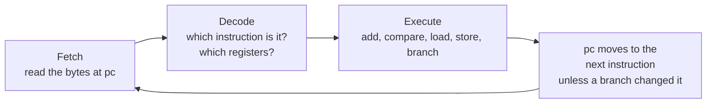

# Lesson 07 — ARM Cortex-M3 crash course

> **In one sentence:** The keyboard's chip is a small ARM processor that reads 2- and 4-byte instructions one after another, keeps its working numbers in 16 registers, and controls the hardware by reading and writing special addresses; once you can read a handful of those instructions, the firmware stops being a wall of hex.
>
> **You will learn:**
> - what a CPU does all day (fetch, decode, execute), and what the registers `r0`–`r12`, `sp`, `lr`, `pc` and `xPSR` are for
> - how Thumb-2 instructions are encoded, why a code pointer has bit 0 set, and how to decode real instructions from the preserved firmware bytes by hand
> - the instructions this course keeps meeting: `ldr`/`str`, `mov`/`add`/`sub`, `cmp` and the branches, `push`/`pop`, literal pools and veneers
> - the vector table, the NVIC, and the memory map of this chip (`0x0`, `0x18000000`, `0x20000000`, `0x40000000`, `0x60000000`, `0xe000e000`)
> - why one store to `AIRCR` resets the whole chip, and what "dual-core" does and does not mean for this firmware
>
> **Time:** ~90 minutes · **Prerequisites:** [Lesson 2](02-how-computers-count.md), [Lesson 6](06-the-firmware-file.md)

## 1. The story (kid version)

Imagine a robot cook in a kitchen. The robot has a very long recipe book. Every line of the book is one tiny instruction: "pick up the egg", "is the bowl full? if yes, skip to line 40", "put the egg in tray 3". The robot does exactly one line at a time. It reads the line, works out what it means, does it, and moves on to the next line. It never gets bored and it never skips a line unless a line tells it to.

On the counter in front of the robot there are sixteen small trays. The robot can only really work with what is in the trays: it adds trays together, compares them, and copies things between them and the big pantry at the back. One tray is special: it holds a bookmark that says which line of the recipe the robot is on. Another tray holds a sticky note that says "when you finish this side-recipe, go back to line 212".

Some cupboard doors in the pantry are not cupboards at all. They are switches for the oven and the lights. If the robot "puts something in" cupboard 4000, the oven turns on. Nobody told the robot these doors are special; to the robot, every door looks the same.

Finally, there is a doorbell. When it rings, the robot puts a bookmark in its recipe, runs to page 1, looks up "doorbell" in a short list printed there, does that little recipe, and then comes back to its bookmark. Page 1 also says which line to start on when the robot is first switched on.

**How the analogy maps to the real thing**

| In the kitchen | In the keyboard's chip |
|---|---|
| The robot cook | The ARM [Cortex-M3](00-glossary.md#cortex-m3) processor core |
| One line of the recipe book | One instruction (2 or 4 bytes of [Thumb-2](00-glossary.md#thumb-2) code) |
| Reading, understanding, doing a line | Fetch, decode, execute |
| The sixteen trays | The [registers](00-glossary.md#register-cpu) `r0`–`r12`, `sp`, `lr`, `pc` |
| The bookmark tray | `pc`, the program counter |
| The "go back to line 212" note | `lr`, the link register |
| The pantry | Memory: flash, [RAM](00-glossary.md#ram), and more |
| Cupboard doors that are really switches | [MMIO](00-glossary.md#mmio) hardware registers |
| The doorbell | An [interrupt](00-glossary.md#interrupt-irq) |
| The list on page 1 | The [vector table](00-glossary.md#vector-table) |

## 2. Why we needed this

By the end of [Lesson 6](06-the-firmware-file.md) the investigation had a map of the 496 KiB ASUS container: a bootloader region, an `SN_FWIN` header at file `0x10000`, **Candidate A** at file `0x11000`, **Candidate B** at file `0x21000`, and a RAM image at `0x74000` ([FINDINGS.md](../FINDINGS.md), "Observed image layout"). The file was not encrypted: its entropy was about 4.82 bits per byte (log 33), and "all sampled handlers decode as valid Cortex-M3 Thumb-2 code" (log 36).

That map said *where* things were, not *what they did*. The open questions were all about behaviour. Which code answers the Armoury Crate commands `51 21` and `50 55`? Which code decides whether the keyboard boots? Why did an earlier remap command get echoed back but have no effect?

Strings alone could not answer those questions. A string like `"[BLD] CRC Verify PASS!"` tells you a check exists, not what it checks. Worse, raw byte patterns lie. Lesson 8 tells the story of the adjacent bytes `51 21` inside Candidate B, which looked like a copy of the `51 21` command and turned out to be an instruction (TIMELINE, "Dispatcher identification"). You can only catch a mistake like that if you can read instructions.

So the next step had to be learning the processor's language. The chip on the board is marked SNC73270. It belongs to SONiX's SNC7320 series, whose product brief lists **dual Cortex-M3 cores**, USB, GPIO, timers and PWM, two watchdogs, an SPI NOR interface and a 10-bit, six-channel SAR ADC ([notes/references.md](../notes/references.md)). That brief is series-level. It has no register addresses, so every hardware address in this lesson comes from the firmware's own instructions, not from a datasheet.

## 3. The real thing

Every instruction below was copied from a saved Ghidra listing, from a decompile file, or decoded from the preserved firmware bytes during the writing of this lesson. The addresses tell you where each one lives.

### 3.1 What a CPU does all day

A CPU runs one loop, forever:



That's it. Everything the keyboard does, from reading keys to talking USB, is millions of trips around this loop. The only way the CPU "decides" anything is that some instructions change `pc` depending on a comparison.

### 3.2 The registers

A **register** is one of the CPU's own 32-bit storage slots. There are sixteen you can name in an instruction, plus a status register:

| Register | Other name | What it holds |
|---|---|---|
| `r0`–`r3` | | Function arguments and return values; scratch |
| `r4`–`r11` | | Values a function must preserve for its caller |
| `r12` | `ip` | Scratch; veneers use it (Section 3.9) |
| `r13` | `sp` | The [stack pointer](00-glossary.md#stack-pointer-sp) |
| `r14` | `lr` | The link register: where to return to |
| `r15` | `pc` | The program counter: the instruction being run |
| `xPSR` | | Status flags `N`, `Z`, `C`, `V`, plus the current exception number |

The argument convention in the first rows is ARM's standard calling convention, not something this project discovered. You can see it in action in the bootloader's call `BootHandoff(0, entry, 0x10000)`: just before the call, the listing loads `r0 = 0`, `r1 = the entry`, `r2 = 0x10000` (log 123):

```
00007f26  mov.w r2,#0x10000        ; length
00007f2a  mov r1,r4                ; src
00007f2c  movs r0,#0x0             ; dst
00007f2e  bl 0x00000fee
```

Here is the very first thing Candidate A does after a reset, from its reset handler at `0x14a8` (log 72):

```
000014a8  movw r0,#0xed08
000014ac  movt r0,#0xe000
000014b0  ldr r0,[r0,#0x0]          ; READ -> e000ed08
000014b2  ldr.w sp,[r0,#0x0]
```

Read it line by line:

1. `movw r0,#0xed08` puts `0xed08` into the low half of `r0`.
2. `movt r0,#0xe000` puts `0xe000` into the top half. Now `r0 = 0xe000ed08`, the address of [VTOR](00-glossary.md#vtor).
3. `ldr r0,[r0]` loads the 32-bit word stored at that address. VTOR holds the address of the vector table.
4. `ldr.w sp,[r0]` loads word 0 of the vector table into `sp`.

So four instructions set the stack pointer from the table (FINDINGS, "Candidate A reset, scatter-load, and RAM base"). You will see why that matters in Section 3.10.

### 3.3 Thumb-2: instructions are 2 or 4 bytes

Cortex-M3 runs only **Thumb-2** code. Each instruction is either one 16-bit **halfword** (2 bytes) or two halfwords (4 bytes). The CPU can tell which from the first halfword: if its top five bits are `11101`, `11110` or `11111`, a second halfword follows. Otherwise the instruction is 2 bytes long. (That rule is from the ARMv7-M architecture.)

Remember [little-endian](00-glossary.md#little-endian) from Lesson 2: the halfword `0x2b64` is stored as the bytes `64 2b`.

#### Decoding a 2-byte instruction by hand

Log 110 found the key-press decision in the installed application at `0x180057b4`: `cmp r3,#0x64`. The installed dump starts at flash `0x10000`, and the application image at `0x18000000` comes from flash `0x21000`, so this instruction sits at dump offset `0x21000 - 0x10000 + 0x57b4 = 0x167b4`. The two bytes there are `64 2b`, which is the halfword `0x2b64`. In binary:

```
0x2b64 = 0010 1011 0110 0100
         ^^^^^ ^^^ ^^^^^^^^^
         00101 011 01100100
         |     |   |
         |     |   imm8 = 0x64 = 100
         |     Rn  = 011 = r3
         opcode 00101 = "compare register with an 8-bit constant"
```

So `0x2b64` means "compare `r3` with `0x64`" (`0x64` = 100). That is exactly what Ghidra printed. It is the line that decides that a key with a travel value of 100 or more counts as down (log 110, [Lesson 15](15-inside-keys-and-magnets.md)).

The same shape with opcode `00100` means "move an 8-bit constant into a register". Candidate B offset `0x2c16` (file `0x23c16`) holds the bytes `51 21`, the halfword `0x2151` = `00100 001 01010001`: `movs r1,#0x51`. Remember this one. It is the "raw `51 21` byte hit" that Lesson 8 is about (log 47).

#### Decoding a 4-byte instruction

The reset handler's first instruction is stored as `4e f6 08 50`. That is two halfwords, `0xf64e` and `0x5008`. The top five bits of `0xf64e` are `11110`, so it is a 4-byte instruction. For `movw`, ARM scatters the 16-bit constant across both halfwords in four pieces called `imm4`, `i`, `imm3` and `imm8`. Put them back together and you get `imm16 = 0xed08`, with destination register `r0`. Exercise 3 does this in Python.

You don't need to memorise encodings. The point is that **nothing is magic**. Ghidra's listing is just this decoding done for every halfword, and you can check any line of it yourself.

#### Bit 0 of a code pointer

Instructions always start on an even address. So ARM reuses bit 0 of a *code pointer* as a flag: **bit 0 = 1 means "this is Thumb code"**. A Cortex-M3 only runs Thumb, so every valid code pointer is odd:

- Candidate A's reset vector is `0x000014a9`, which means "code at `0x14a8`" (FINDINGS, "Observed image layout").
- The literal the reset handler calls through is `0x00001217`, which means "code at `0x1216`" (log 72).

The scatter loader in Candidate A shows the rule being enforced in code. Its region table stores handler offsets without bit 0 (`0x1d8`, `0x17c`, `0x1f4`), so before jumping it forces the bit on (log 72):

```
00000166  tst r3,#0x1
0000016a  it ne
0000016c  sub.ne r3,r7,r3
0000016e  orr r3,r3,#0x1           ; force the Thumb bit
00000172  bx r3                    ; jump to the region handler
```

### 3.4 Loads and stores: moving data to and from memory

A Cortex-M3 can only do arithmetic on registers. To touch memory it uses **load** (`ldr`, memory into register) and **store** (`str`, register into memory). The suffix says how many bytes:

| Instruction | Moves | Example from this firmware |
|---|---|---|
| `ldr` / `str` | 4 bytes (a word) | `ldr r0,[r0,#0x0]` in the reset handler (log 72) |
| `ldrh` / `strh` | 2 bytes (a halfword) | `strh.w r0,[r2,#0x4f8]` in the `51 31` handler ([notes/polling-rate-protocol.md](../notes/polling-rate-protocol.md)) |
| `ldrb` / `strb` | 1 byte | `ldrb r0,[r4,#0x0]` in the vendor dispatcher (log 48) |

The part in square brackets is the address. `[r4,#0x0]` means "the address in `r4`, plus 0". In the vendor-command dispatcher, `r4` holds `0x1802337c`, the 64-byte request buffer, so these two lines read the command's first byte and test whether it is zero (log 48):

```
00001fc4  ldrb r0,[r4,#0x0]         ; READ -> 1802337c
00001fc6  cmp r0,#0x0
```

A fancier form adds a shifted register. This is the copy loop at the heart of the bootloader's `BootHandoff` routine (log 101):

```
18010014  ldr.w r4,[r6,r0,lsl #0x2]  ; r4 = word at (r6 + r0*4)
18010018  str.w r4,[r5,r0,lsl #0x2]  ; word at (r5 + r0*4) = r4
1801001c  adds r0,r0,#0x1
1801001e  cmp r0,r2
18010020  bcc 0x18010014
```

`lsl #0x2` means "shift left by 2", which multiplies by 4. `r0` counts words, so `r0*4` is a byte offset. Those five lines copy `r2` words from the address in `r6` to the address in `r5`. Lesson 10 explains why this tiny loop is the most important copy in the whole boot.

### 3.5 Arithmetic, and multiplying without multiplying

`mov`, `add` and `sub` do what their names say. The `s` on the end (`movs`, `adds`, `subs`) means "also update the flags" (Section 3.6). `rsb` is "reverse subtract": `rsb rd, a, b` computes `b - a`.

ARM lets the last operand be shifted for free, and compilers use that to multiply by constants. Here is the start of the key-state loop in the installed application (log 110, [ghidra/decompiles/app_keymap.txt](../ghidra/decompiles/app_keymap.txt)):

```
18005798  rsb r3,r3,r3, lsl #0x4    ; r3 = (r3 << 4) - r3 = r3 * 15
1800579c  add.w r3,r3,r3, lsl #0x2  ; r3 = r3 + (r3 << 2) = r3 * 5
```

`r3 * 16 - r3` is `r3 * 15`, then `* 5`. Those two instructions are how the investigation proved the application's key table is **5 groups × 15 = 75** entries per layer. The dimension is baked into the instruction encoding, so it can be trusted more than a guess from data (FINDINGS, "Phase 5D").

The same trick computes the `0x86` stride of the key-index windows you will meet in Lesson 8 (vendor Candidate B, log 49, decoded again for this lesson):

```
000026da  add.w r3,r2,r2, lsl #0x1  ; r3 = r2 * 3
000026de  add.w r3,r3,r2, lsl #0x6  ; r3 = r2*3 + r2*64 = r2 * 67
...
000026f0  add.w r2,r2,r3, lsl #0x1  ; r2 = base + r3*2 = base + r2 * 134
```

134 is `0x86`, and `r2` here was just loaded from `0x1801ee6c`, the effective KBID selector (FINDINGS, "KBID selection and key-index-map structure").

Two bit-twiddling instructions complete the set. They both appear in the handler for the polling-rate command `51 31` in the installed application ([notes/polling-rate-protocol.md](../notes/polling-rate-protocol.md)):

```
18002b3e  bfi    r0,r1,#0x0,#0x4   ; insert r1's low 4 bits into bits 0..3 of r0
18002b46  and    r1,r0,#0xf
18002b4a  lsl.w  r0,r6,r1          ; r0 = r6 << r1, and r6 = 1, so r0 = 1 << index
```

`bfi` means **bit field insert**: copy a field of bits from one register into another without disturbing the rest. `lsl.w` is "logical shift left". With `r6 = 1`, it turns a rate index into a power of two. The 4-bit field width in `bfi` is one reason the project reads the setting as a four-entry field, even though the handler itself only accepts 0 and 3 (Lesson 17).

### 3.6 Comparing and branching

`cmp a, b` computes `a - b`, throws the answer away, and keeps only four **flags** in `xPSR`:

| Flag | Set when the result... |
|---|---|
| `N` | is negative (top bit 1) |
| `Z` | is zero, so `a == b` |
| `C` | produced no borrow, so `a >= b` treating both as unsigned |
| `V` | overflowed as a signed number |

A **conditional branch** then jumps only if the flags match. The ones you will see most:

| Branch | Jumps when | Meaning after `cmp a,b` |
|---|---|---|
| `beq` / `bne` | `Z` set / clear | equal / not equal |
| `bcs` (alias `bhs`) | `C` set | `a >= b` unsigned |
| `bcc` (alias `blo`) | `C` clear | `a < b` unsigned |
| `bhi` | `C` set and `Z` clear | `a > b` unsigned |
| `bgt` | signed greater | `a > b` signed |
| `b` | always | unconditional jump |

Now the key-press decision reads like a sentence (installed application, log 110):

```
180057b2  ldrb r3,[r3,r4]         ; r3 = this key's travel, 0..200
180057b4  cmp r3,#0x64            ; compare with 100
180057b6  bcc 0x180057c2          ; travel < 100: go to the "not down" path
180057b8  ldr r6,[0x18005ac0]     ; travel >= 100: fall through here...
180057ba  ldr.w r3,[r6,r0,lsl #0x2]
180057be  orrs r3,r1              ; ...and SET this key's bit
180057c0  b 0x180057cc
180057c2  cbnz r3,0x180057d0      ; travel is 1..99: skip, change nothing
180057c4  ldr r6,[0x18005ac0]
180057c6  ldr.w r3,[r6,r0,lsl #0x2]
180057ca  bics r3,r1              ; travel == 0: CLEAR this key's bit
180057cc  str.w r3,[r6,r0,lsl #0x2]
```

`cbz` and `cbnz` are compact Thumb-2 shortcuts: "compare with zero and branch if zero / not zero" in one instruction, with no `cmp` and no flags. Here `cbnz` makes the 1..99 band leave the key unchanged, which is the hold band described in the [glossary](00-glossary.md#actuation).

When llvm-mc decodes the same bytes, it prints `blo` where Ghidra printed `bcc`. They are two names for one encoding. Different tools, same bytes.

`bcs` shows up as a bounds check in the RGB frame-buffer writer (log 112):

```
1800c134  cmp r0,#0x6
1800c136  bcs 0x1800c16c            ; row  >= 6  -> drop
1800c138  cmp r1,#0x11
1800c13a  bcs 0x1800c16c            ; col  >= 17 -> drop
```

And a chain of `cmp` plus `beq` is how a [dispatcher](00-glossary.md#dispatcher) picks a handler. From the vendor-command dispatcher (log 48):

```
00002018  cmp r2,#0x50
0000201a  beq 0x00002110            ; opcode 0x50 -> its branch
0000201c  cmp r2,#0x51
0000201e  bne 0x00002010
00002020  b 0x0000248e              ; opcode 0x51 -> the key-configuration handlers
```

A branch to itself, `b .`, is an infinite loop. Several of Candidate A's fault vectors point at exactly that (log 72):

```
000014d2  b 0x000014d2
000014d4  b 0x000014d4
000014d8  b 0x000014d8
000014de  b 0x000014de
```

`0x14df`, the address of the last one with the Thumb bit set, is the fill value in every unused interrupt slot (Section 3.10). If an unexpected interrupt ever fires, the CPU just spins there.

### 3.7 Function calls and the stack

A **function** is a block of code you call and that returns. Two instructions do the calling:

- `bl target` is "branch with link". It puts the return address into `lr`, then jumps.
- `bx lr` is "branch to the address in `lr`": return.

The smallest real function in this lesson is the bootloader's `FUN_00007fa8`, four instructions (log 102):

```
00007fa8  ldr r1,[0x00007fb0]       ; r1 = 0xe000ed08 (VTOR's address, from the literal pool)
00007faa  ldr r1,[r1,#0x0]          ; r1 = VTOR's value = where the vector table is
00007fac  str r0,[r1,#0x1c]         ; table word 7 = r0 (the argument)
00007fae  bx lr                     ; return
```

If a function calls another function, the second `bl` would overwrite `lr`. So the function saves `lr` on the **stack** first. The stack is an area of RAM that `sp` points at. `push` stores registers there and moves `sp` down; `pop` loads them back and moves `sp` up. Candidate A's `FUN_00000ec4` is a complete example (log 72):

```
00000ec4  push {r4,lr}              ; save r4 and the return address
00000ec6  mov.w r0,#0x45000000
00000eca  ldr.w r1,[r0,#0x10c]      ; READ  -> 4500010c
00000ece  orr r1,r1,#0x800          ; set bit 11
00000ed2  str.w r1,[r0,#0x10c]      ; WRITE -> 4500010c
  ...
00000ef2  movs r0,#0x0              ; return value 0
00000ef4  pop {r4,pc}               ; restore r4, and load the saved lr straight into pc
```

`pop {r4,pc}` is a neat trick: loading the saved return address directly into `pc` *is* the return. The read, set a bit, write back pattern in the middle is typical hardware code (Section 3.13).

### 3.8 Literal pools: constants stored next to code

A 16-bit instruction has no room for a 32-bit address. So compilers put the constants in a small table right after the function, called a [literal pool](00-glossary.md#literal-pool), and load them with a `pc`-relative `ldr`.

The reset handler does this twice (log 72):

```
000014b6  ldr r0,[0x000014ec]       ; Ghidra shows the resolved pool address
000014b8  blx r0                    ; call it
000014ba  ldr r0,[0x000014f0]
000014bc  bx r0                     ; jump to it
```

and the pool words are (log 72):

```
000014ec 0x00001217                 ; -> FUN_00001216, clock/power init
000014f0 0x00000141                 ; -> 0x140, which calls the scatter loader
```

When llvm-mc decodes the same bytes, it prints the raw form `ldr r0, [pc, #52]`. Here's how the two agree. For `pc`-relative loads the CPU uses the instruction's address plus 4, rounded down to a multiple of 4. For the instruction at `0x14b6` that is `0x14ba`, rounded down to `0x14b8`. Add 52 (`0x34`) and you get `0x14ec`. Ghidra simply did the sum for you.

**Most of the addresses in this course were found by reading literal pools.** For example, the bootloader's pool word at `0x7f98` is `0x60011000`, the only entry address the bootloader will accept (log 101, Lesson 10).

### 3.9 Veneers: jumping further than `bl` can reach

`bl` stores its target as a signed offset of about ±16 MiB (ARMv7-M architecture). Candidate A runs at address 0, but the application it starts runs at `0x18000000`, about 384 MiB away. So the call goes through a **[veneer](00-glossary.md#veneer)**, a tiny stub that builds the full address in a register and jumps. This is Candidate A's veneer at `0x401c`, decoded from the preserved bytes:

```
movw  r12, #0x23b
movt  r12, #0x1800         ; r12 = 0x1800023b
bx    r12                  ; jump to 0x1800023a, Thumb
```

Ghidra calls this `thunk_EXT_FUN_1800023a`, and `0x1800023a` is the application's `main` (logs 79–80). The bootloader has the same kind of veneer at `0xfee`, building `0x18010001` to reach the `BootHandoff` routine it copied into RAM (log 123). Veneers matter because a function that nobody calls with `bl` can still be reached through one, so "no callers" in Ghidra does not always mean "dead code" (logs 104–106, [Lesson 14](14-inside-tasks-and-usb.md)).

### 3.10 The vector table

The **vector table** is a list of 32-bit words at the start of an image. On reset, the Cortex-M hardware loads word 0 into `sp` and word 1 into `pc` (ARMv7-M architecture). The remaining words are the addresses of handlers for faults and interrupts.

Here is Candidate A's table, straight from the vendor file at `0x11000`:

```
$ xxd -s 0x11000 -l 0x40 dumps/vendor/M605_V01_00_58.bin
00011000: 4061 0318 a914 0000 bf20 0000 af10 0000  @a....... ......
00011010: cf0f 0000 d314 0000 d514 0000 0000 0000  ................
00011020: 0000 0000 0000 0000 0000 0000 e902 0000  ................
00011030: d914 0000 0000 0000 2d03 0000 e117 0000  ........-.......
```

Decoded (slot names are the ARMv7-M architecture's):

| Slot | Name | Vendor value | Meaning |
|---:|---|---|---|
| 0 | Initial SP | `0x18036140` | the stack starts high in the `0x18000000` RAM window |
| 1 | Reset | `0x000014a9` | code at `0x14a8`, the reset handler of Section 3.2 |
| 2 | NMI | `0x000020bf` | non-maskable interrupt handler |
| 3 | HardFault | `0x000010af` | |
| 4 | MemManage | `0x00000fcf` | |
| 5 | BusFault | `0x000014d3` | the `b .` loop at `0x14d2` |
| 6 | UsageFault | `0x000014d5` | the `b .` loop at `0x14d4` |
| 7–10 | Reserved | `0` | **slot 7** is reused as a handoff variable (Lesson 10) |
| 11 | SVCall | `0x000002e9` | |
| 12 | DebugMonitor | `0x000014d9` | the `b .` loop at `0x14d8` |
| 13 | Reserved | `0` | |
| 14 | PendSV | `0x0000032d` | used by the RTOS scheduler |
| 15 | SysTick | `0x000017e1` | the core's built-in timer tick |
| 16+ | IRQ0, IRQ1, ... | mostly `0x000014df` | external interrupts; `0x14df` is the fill for "unused" |

The installed 1.59 dump has the same table except word 0, which is `0x18036168` (checked for this lesson; also FINDINGS, "Installed hardware and runtime interface map").

How long is the table? This was one of the investigation's mistakes. An ARMv7-M vector table **has no terminator**, so you can't find its end by looking for a special value. Phase 5 first cut the table at the last `0x14df` fill word and got 73 slots. After review, log 102 bounded it at the first code address instead, `0x140`, which gives **80 slots: 16 core plus 64 external**. The last slot, at `0x13c`, holds `0x00000ad1`, a live `IRQ63` handler the first rule had thrown away (log 102). Log 103 labels the 80-slot reading **strongly inferred**, because no SNC73270 document states the real interrupt count.

**Nine external interrupts are live**: IRQ3 and IRQ63 point into the entry image, and IRQ6, IRQ31, IRQ32, IRQ36, IRQ37, IRQ38 and IRQ48 point into the application at `0x18000000` (log 102). The table lives in Candidate A, but most handlers belong to Candidate B, so those slots only become valid after Candidate B is copied into RAM (FINDINGS, "Installed hardware and runtime interface map").

### 3.11 The NVIC and interrupts

An **interrupt (IRQ)** is a hardware signal that makes the CPU pause, save some registers on the stack, run the handler listed in the vector table, and then carry on. The [NVIC](00-glossary.md#nvic) (Nested Vectored Interrupt Controller) is the part of the core that turns individual interrupts on and off and decides which one wins when two arrive together.

What the firmware does with it (FINDINGS, "Installed hardware and runtime interface map", log 100):

- Software enables **exactly two** interrupts through the NVIC's enable registers: **IRQ6** and **IRQ38**. Both have real handlers in the table, so "two independent parts of the image agree".
- IRQ6 serves the block at `0x40100000`, the application's principal peripheral, which later work identified as the USB controller (log 107).
- IRQ38 is the tick that drives key scanning (logs 109, 127).
- SysTick writes `0x10000000` (PENDSVSET) to **ICSR** at `0xe000ed04`, and PendSV is populated. That is the mechanism of a preemptive scheduler. What it schedules is not established by that census (log 100).

You can watch the entry image set interrupt priorities. `FUN_00000f0a` walks a list and stores the value `0x30` into bytes of the NVIC region, then unmasks interrupts (log 72):

```
00000f10  movs r1,#0x30
  ...
00000f1c  add.w r0,r0,#0xe000e000
00000f20  strb.w r1,[r0,#0x400]     ; WRITE -> e000e406
  ...
00000f3c  movs r0,#0x0
00000f3e  msr primask,r0            ; PRIMASK = 0: interrupts allowed
```

`0xe000e400` onward is where ARMv7-M keeps the per-interrupt priority bytes, and `msr primask` writes the core's global interrupt mask. `msr primask` with 1 masks interrupts, and with 0 unmasks them. Log 120 corrected an earlier reading of the bootloader's `FUN_00005272` for exactly this reason: it is `msr primask,r0`, an interrupt mask, not a "scan enable".

### 3.12 The memory map

A 32-bit CPU can name 4 GiB of addresses. On this chip, different ranges are different things. Every row below is backed by the cited evidence. None of it comes from a datasheet:

```
0x00000000  ┌──────────────────────────────┐  code runs here: bootloader, then the entry image
            │  (address-zero window)       │  writable RAM by hardware arrangement (log 123)
0x18000000  ├──────────────────────────────┤  main RAM window
            │  application copied here     │  Candidate B at 0x18000000 (log 73)
            │  stacks at 0x1802b230,       │  entry SP must be in 0x18000001..0x18040000
            │  0x18036140 / 0x18036168     │  (FINDINGS, "Boot container structures")
0x20000000  ├──────────────────────────────┤  small shared RAM
            │  mailbox ring buffer         │  0x20000000.. (log 118)
            │  0x20000ffc boot-entry flag  │  flag: log 101; an entry SP may also sit in 0x20000001..0x20001000
0x40000000  ├──────────────────────────────┤  vendor peripherals (MMIO)
            │  0x40008000, 0x40009000      │  magic-key register pair (logs 100, 114)
            │  0x40018000/19000/1b000      │  analog converter strobe/data (log 120)
            │  0x40100000                  │  principal peripheral, IRQ6 (logs 100, 107)
0x45000000  ├──────────────────────────────┤  vendor system control: clocks, power (log 72)
0x60000000  ├──────────────────────────────┤  flash window (XIP)
            │  file offset = addr - 0x60000000  (log 74)
0xe000e000  ├──────────────────────────────┤  ARM system control space
            │  NVIC, SysTick               │
            │  0xe000ed04 ICSR             │
            │  0xe000ed08 VTOR             │
            │  0xe000ed0c AIRCR            │
            └──────────────────────────────┘
```

Three rows deserve a word:

- **`0x60000000` is the flash, seen through a window.** [XIP](00-glossary.md#xip) means code can run directly from flash. The mapping `file = flash - 0x60000000` was locked when record A's CRC reproduced exactly (log 74, Lesson 9). Candidate A's copy loop reads straight from it: `ldmia.cs r0!,{r3,r4,r5,r6}` with `READ->60021000` (log 72).
- **`0x18000000` is RAM.** The bootloader's `FUN_00005240` refuses an image whose initial SP is outside `0x18000001..0x18040000` or `0x20000001..0x20001000` (FINDINGS, "Boot container structures and boot gate (logs 75, 78)"). The entry image's own init faults if MSP is outside `0x18000000..0x18040000` (FINDINGS, "Phase 5G").
- **`0xe000e000` and up is the same on every Cortex-M3.** These are architectural registers defined by ARM, not SONiX. That is why the project can name them with confidence, while the vendor blocks at `0x40000000` and `0x45000000` mostly stay unnamed.

### 3.13 MMIO: talking to hardware by storing numbers

**Memory-mapped I/O** means a hardware register looks like an ordinary memory address. A `str` to it doesn't save a number. It *does something*.

Here is Candidate A's reset path writing to two blocks at `0x40008000` and `0x40009000` (log 72):

```
00000f4e  ldr r3,[0x00000fa8]       ; r3 = 0x5afa55aa
00000f50  ldr r1,[0x00000fac]       ; r1 = 0x40009000
00000f52  ldr r2,[0x00000fb0]       ; r2 = 0x40008000
  ...
00000f5c  str r3,[r2,#0xc]          ; WRITE -> 4000800c : 0x5afa55aa
00000f5e  ldr r0,[0x00000fb4]
00000f60  str r0,[r2,#0x0]          ; WRITE -> 40008000
00000f62  str r0,[r1,#0x0]          ; WRITE -> 40009000
```

The value stored at `+0` on this reset path is `0x5afa0000` (log 102). Both blocks get the key `0x5afa55aa` at `+0xc` and `0x5afa0000` at `+0` (log 114). A "magic key" like `0x5afa` protects a register so that a stray write can't change it by accident.

What *are* these blocks? This is where the evidence discipline matters. The product brief lists two watchdogs, and two identical magic-key blocks on the reset path are **consistent** with that. But [notes/references.md](../notes/references.md) says plainly that "a consistency is not an identification". The project calls them the watchdogs because of how they behave: log 114 found a periodic feed every 8 ticks of IRQ38 (`0x5afa00ff` to `+8`) and an NMI acknowledge path. It never names them from the brief.

### 3.14 System control: VTOR, AIRCR, and the store that resets the chip

Three architectural registers come up again and again:

| Register | Address | What it is | What this firmware does with it |
|---|---|---|---|
| ICSR | `0xe000ed04` | interrupt control and state | SysTick sets PENDSVSET (`0x10000000`) (log 100) |
| VTOR | `0xe000ed08` | vector table offset: where the table is | **read** 10 times across four images, **written zero times** (log 123) |
| AIRCR | `0xe000ed0c` | application interrupt and reset control | written `0x05fa0004` to reset (logs 100, 101) |

**Why does writing `AIRCR` reset the chip?** ARM protects `AIRCR` the same way SONiX protects its blocks: a write is ignored unless the top 16 bits are the key `0x05fa`. Bit 2 of the low half is `SYSRESETREQ`, "please reset the system". So `0x05fa0004` = key `0x05fa` in the top half + `0x0004` (bit 2) in the bottom half. The hardware resets the whole chip, as if you had pulled the power.

The bootloader's `BootHandoff` builds that value carefully so it keeps the existing interrupt-priority grouping (`PRIGROUP`, bits 8–10). Here are its last lines, decoded from the preserved bytes for this lesson and matching log 101:

```
ldr   r4, [pc, #28]       ; r4 = 0xe000ed0c (AIRCR's address)
ldr   r4, [r4]            ; read AIRCR
and   r4, r4, #0x700      ; keep only PRIGROUP
ldr   r7, [pc, #24]       ; r7 = 0x05fa0000 (the key)
orrs  r4, r7
adds  r4, r4, #4          ; + SYSRESETREQ
ldr   r7, [pc, #16]       ; r7 = 0xe000ed0c
str   r4, [r7]            ; write: the chip resets
dsb   sy
nop
nop
nop
b     #-6                 ; spin until the reset lands
```

The `b` at the end is a safety net. The reset is not instant, so the code spins rather than run off into whatever bytes follow.

The application's **NMI handler** writes the same value. When an NMI counter reaches its limit, `Vector_NMI` writes `AIRCR` `0x05fa0004`, and that limit's power-on value is 1, so **the first acknowledged NMI also resets** the chip (FINDINGS, "Phase 5G", log 114). That is a deliberate hardware action, which is why the Phase 5 dependency gate lists "NMI reset" as something a replacement must neutralise or reproduce.

### 3.15 Two cores? The SNC7320 context

The product brief says the SNC7320 series has **two** Cortex-M3 cores ([notes/references.md](../notes/references.md)). Does this firmware use both? [notes/dual-core-question.md](../notes/dual-core-question.md) answers carefully, one confidence level at a time:

- **Observed:** Candidate A and Candidate B are *not* two cores. The bootloader copies the entry image and resets. Candidate A then copies Candidate B into RAM and calls it. That is a sequential hand-off on one core, and both use the same vector table.
- **Observed:** there *are* two execution contexts. The RAM image at `0x18038000` has its own 73-entry vector table, a reset handler that reads VTOR, and a real ring-buffer mailbox with the application at `0x20000000` (head), `0x20000004` (tail), and 8 records of `0x2c` bytes from `0x20000008` (log 118).
- **Observed:** the application's `main` starts it and waits. It loads `0x60074000`, clears `0x20000000`, calls an entry-image routine whose first register work is a read-modify-write of `0x45000100`, then **spins until `0x20000000` holds `0x12345678`**. That token also sits inside the `0x18038000` image (FINDINGS, "Phase 5G"). You can see the spin in the decompile of `main` (log 80): `do { } while (_DAT_20000000 != _DAT_180003f4);`, and the pool word at `0x180003f4` is `0x12345678`.
- **Unresolved:** whether the two contexts run *at the same time*. The client spins while waiting, which "is equally consistent with a second core and with a coroutine on one core". Settling it would need, for example, proof that `0x45000100` bit 15 releases a core.

So the honest one-line answer is the note's own: **"The mechanism is settled; the silicon is not."**

## 4. Decisions and why

| Decision | Why | Alternative rejected | Evidence (log) |
|---|---|---|---|
| Read the firmware as Thumb-2 Cortex-M3 code | The chip family is Cortex-M3, and sampled handlers decode as valid Thumb-2 | Treat bytes as opaque data and pattern-match | logs 33, 36; [notes/references.md](../notes/references.md) |
| Name only architectural registers with confidence | `0xe000e000`+ is defined by ARM for every Cortex-M3; vendor blocks have no register map | Assign names to vendor blocks from the product brief | [notes/references.md](../notes/references.md), log 100 |
| Bound the vector table by the first code address | ARMv7-M tables have no terminator; the fill-value rule lost a live `IRQ63` | Stop at the last fill word | logs 102, 103 |
| Trust dimensions that live in instruction encodings | `rsb ...,lsl #4` then `add ...,lsl #2` cannot lie about ×15 ×5 | Infer table sizes from data patterns | log 110 |
| Treat the two magic-key blocks as watchdogs by behaviour only | A consistency with the brief is not an identification | Call them watchdogs because the brief lists two | logs 100, 114 |
| Leave dual-core concurrency unresolved | No evidence shows both contexts making progress at once | Declare "dual-core" from the brief | [notes/dual-core-question.md](../notes/dual-core-question.md) |

## 5. What went wrong, and how it was caught

**The vector table had a made-up end.**
- *Believed:* the table ended at the last slot holding the repeated fill value `0x14df`, giving 73 slots (log 100).
- *True:* ARMv7-M tables have no terminator. Bounded by the first code address `0x140`, the table has 80 slots, and slot `0x13c` holds a live `IRQ63` handler (`0x00000ad1`) (log 102).
- *Caught by:* independent review of Phase 5 (log 102), which also re-ran two commands whose earlier output had been a `SyntaxError` (log 103).
- *Lesson:* never invent a terminator for a format that doesn't have one. The data format is defined by the architecture, not by what the data happens to look like.

**An interrupt mask was read as a scan enable.**
- *Believed:* `FUN_00005272`, called with 1 and 0 around the bootloader's key scan, enabled and disabled the scan.
- *True:* it is `msr primask,r0`, the core's global interrupt mask. The 1/0 calls bracket the scan in a critical section (log 120).
- *Caught by:* reading the listing instead of guessing from the call pattern.
- *Lesson:* one real instruction beats any amount of guessing from how a function is used.

**`AIRCR` plus an offset was confused with VTOR plus an offset.**
- *Believed:* the bootloader parked the entry address at `0xe000ed08 + 0x1c` = `0xe000ed24` (log 101).
- *True:* `FUN_00007fa8` is `ldr r1,[pool]; ldr r1,[r1]; str r0,[r1,#0x1c]`. That second `ldr` dereferences VTOR first, so the entry lands in word 7 of the vector table. `0xe000ed24` is a different register, SCB SHCSR (log 102).
- *Caught by:* independent review, reading the four-instruction listing (log 102).
- *Lesson:* count the loads. Each `ldr` through a pointer is one level of "the thing at". Lesson 10 returns to this one.

**A watchdog census had a blind spot.**
- *Believed:* exactly one function touches the magic-key blocks, and nothing feeds them (log 113).
- *True:* `FUN_000021fe` returns the block base as a value (`0x40008000` for selector 0, `0x40009000` for selector 1), so its callers' stores have no constant base. A per-function census can't see them. There are three access paths, including a periodic feed (log 114).
- *Caught by:* the correction pass in log 114.
- *Lesson:* a tool that finds MMIO by constant propagation gives a **lower bound**. "Not found by the census" is not "not there".

## 6. Try it yourself

All of these only read files. Run them from `keyboard/falchion-re/`.

**1. Look at a vector table.** Dump the first 64 bytes of Candidate A and find the initial SP and reset vector yourself.

```
$ xxd -s 0x11000 -l 0x10 dumps/vendor/M605_V01_00_58.bin
00011000: 4061 0318 a914 0000 bf20 0000 af10 0000  @a....... ......
```

The first four bytes `40 61 03 18` are the little-endian word `0x18036140` (initial SP). The next four, `a9 14 00 00`, are `0x000014a9` (reset, Thumb bit set, so code at `0x14a8`).

**2. Decode 2-byte instructions by hand with Python.** Save this as a file (for example `decode16.py`) and run `python3 decode16.py`. It knows only the five encodings used in this lesson.

```python
v = open('dumps/vendor/M605_V01_00_58.bin', 'rb').read()
i = open('dumps/device/ROG_Falchion_Ace_HFX_installed_bcdDevice_1.59_app_0x10000_0x7bfff.bin', 'rb').read()
def decode16(hw):
    top5 = hw >> 11
    if top5 == 0b00100: return 'movs r%d,#0x%x' % ((hw >> 8) & 7, hw & 0xff)
    if top5 == 0b00101: return 'cmp r%d,#0x%x'  % ((hw >> 8) & 7, hw & 0xff)
    if top5 == 0b01101: return 'ldr r%d,[r%d,#0x%x]' % (hw & 7, (hw >> 3) & 7, ((hw >> 6) & 0x1f) * 4)
    if hw & 0xff87 == 0x4780: return 'blx r%d' % ((hw >> 3) & 0xf)
    if hw & 0xff87 == 0x4700: return 'bx r%d' % ((hw >> 3) & 0xf)
    return '?'
for name, img, off in (('vendor B+0x2c16', v, 0x23c16), ('installed 0x180057b4', i, 0x167b4),
                       ('vendor A 0x14b0', v, 0x124b0), ('vendor A 0x14b8', v, 0x124b8),
                       ('vendor A 0x14bc', v, 0x124bc)):
    hw = int.from_bytes(img[off:off + 2], 'little')
    print('%-21s bytes %02x %02x  halfword 0x%04x -> %s' % (name, img[off], img[off+1], hw, decode16(hw)))
```

Real output:

```
vendor B+0x2c16       bytes 51 21  halfword 0x2151 -> movs r1,#0x51
installed 0x180057b4  bytes 64 2b  halfword 0x2b64 -> cmp r3,#0x64
vendor A 0x14b0       bytes 00 68  halfword 0x6800 -> ldr r0,[r0,#0x0]
vendor A 0x14b8       bytes 80 47  halfword 0x4780 -> blx r0
vendor A 0x14bc       bytes 00 47  halfword 0x4700 -> bx r0
```

A true story from writing this lesson: the first version of this script tested `bx` before `blx` with a looser mask, and it printed `bx r0` for `0x4780`. The mask `0xff87` checks bit 7 (the "link" bit), which is the only difference between the two. Always check a decoder against a known answer.

**3. Rebuild a `movw` constant from its scattered bits.**

```python
d = open('dumps/vendor/M605_V01_00_58.bin', 'rb').read()
hw1 = int.from_bytes(d[0x124a8:0x124aa], 'little')
hw2 = int.from_bytes(d[0x124aa:0x124ac], 'little')
print('halfwords: 0x%04x 0x%04x   top5 of first = %s' % (hw1, hw2, bin(hw1 >> 11)))
imm4, i = hw1 & 0xf, (hw1 >> 10) & 1
imm3, rd, imm8 = (hw2 >> 12) & 7, (hw2 >> 8) & 0xf, hw2 & 0xff
print('rd = r%d  imm16 = 0x%04x' % (rd, (imm4 << 12) | (i << 11) | (imm3 << 8) | imm8))
```

Real output:

```
halfwords: 0xf64e 0x5008   top5 of first = 0b11110
rd = r0  imm16 = 0xed08
```

`0b11110` in the top five bits is what tells the CPU that this is a 4-byte instruction.

**4. Let a real disassembler check you.** GNU `objdump` on this machine has no ARM support:

```
$ objdump -D -b binary -marm -Mforce-thumb --start-address=0x124a8 --stop-address=0x124be dumps/vendor/M605_V01_00_58.bin
dumps/vendor/M605_V01_00_58.bin:     file format binary

objdump: can't use supplied machine arm
objdump: can't disassemble for architecture UNKNOWN!
```

LLVM's `llvm-mc` (package `llvm`) can decode raw bytes. This decodes Candidate A's reset handler:

```
$ xxd -s 0x124a8 -l 0x16 -p dumps/vendor/M605_V01_00_58.bin | tr -d '\n' | sed 's/../0x& /g' | llvm-mc --disassemble -triple=thumbv7m-none-eabi -show-encoding
	movw	r0, #60680                      @ encoding: [0x4e,0xf6,0x08,0x50]
	movt	r0, #57344                      @ encoding: [0xce,0xf2,0x00,0x00]
	ldr	r0, [r0]                        @ encoding: [0x00,0x68]
	ldr.w	sp, [r0]                        @ encoding: [0xd0,0xf8,0x00,0xd0]
	ldr	r0, [pc, #52]                   @ encoding: [0x0d,0x48]
	blx	r0                              @ encoding: [0x80,0x47]
	ldr	r0, [pc, #52]                   @ encoding: [0x0d,0x48]
	bx	r0                              @ encoding: [0x00,0x47]
```

llvm-mc prints constants in decimal: 60680 = `0xed08`, 57344 = `0xe000`. Compare this with Ghidra's listing in Section 3.2. It matches instruction for instruction.

**5. Decode the reset at the end of `BootHandoff`.** The bootloader's program offset `0xcdfc` is vendor-file offset `0x1000 + 0xcdfc = 0xddfc`. Its last 40 bytes start at `0xde1c`:

```
$ xxd -s 0xde1c -l 0x28 -p dumps/vendor/M605_V01_00_58.bin | tr -d '\n' | sed 's/../0x& /g' | llvm-mc --disassemble -triple=thumbv7m-none-eabi
	blo	#-16
	nop
	dsb	sy
	ldr	r4, [pc, #28]
	ldr	r4, [r4]
	and	r4, r4, #1792
	ldr	r7, [pc, #24]
	orrs	r4, r7
	adds	r4, r4, #4
	ldr	r7, [pc, #16]
	str	r4, [r7]
	dsb	sy
	nop
	nop
	nop
	b	#-6
	movs	r0, r0
```

1792 is `0x700`. The final `movs r0, r0` is really the first two bytes of the literal pool, which llvm-mc decoded as if they were code. Look at the pool itself:

```
$ xxd -s 0xde44 -l 8 dumps/vendor/M605_V01_00_58.bin
0000de44: 0ced 00e0 0000 fa05                      ........
```

That is `0xe000ed0c` (AIRCR) and `0x05fa0000` (the key). **A disassembler will happily decode data as code**, which is why Ghidra has to be told where code starts (Lesson 8).

## 7. Check your understanding

1. The reset vector of the RAM image at `0x74000` is `0x180381c1` (FINDINGS). At what address does its reset code actually start, and why is the stored value one higher?

<details><summary>Answer</summary>

At `0x180381c0`. Bit 0 of a code pointer is the Thumb flag, and every Cortex-M3 code pointer has it set, so the real address is the value with bit 0 cleared. FINDINGS confirms the reset code "begins at file offset `0x741c0`", which is `0x180381c0` when the slice is loaded at `0x18038000`.
</details>

2. After `cmp r3,#0x64`, the CPU runs `bcc 0x180057c2`. For which values of `r3` does it jump?

<details><summary>Answer</summary>

`bcc` jumps when the carry flag is clear, which after `cmp` means `r3 < 0x64` unsigned, so 0 to 99. For 100 and above it falls through to the code that sets the key's "down" bit (log 110).
</details>

3. The bytes `51 21` inside Candidate B are an instruction. Which one, and how do you know from the bits alone?

<details><summary>Answer</summary>

`movs r1,#0x51`. Little-endian `51 21` is the halfword `0x2151` = `00100 001 01010001`. Top five bits `00100` mean "move an 8-bit constant", the next three bits `001` are `r1`, and the low eight bits are `0x51`.
</details>

4. Why does a function that calls another function usually start with `push {..., lr}`?

<details><summary>Answer</summary>

Because `bl` overwrites `lr` with a new return address. Saving `lr` on the stack first lets the function find its own way back. It usually ends with `pop {..., pc}`, which loads the saved return address straight into `pc`.
</details>

5. What two parts does `0x05fa0004` have, and why does storing it to `0xe000ed0c` reset the chip?

<details><summary>Answer</summary>

The top half `0x05fa` is AIRCR's write key. Without it the write is ignored. The low half `0x0004` is bit 2, SYSRESETREQ. With the key present, the core requests a full system reset.
</details>

6. Does this firmware prove the SNC73270 runs two cores at the same time?

<details><summary>Answer</summary>

No. It proves there are two execution contexts with their own vector tables and a real mailbox (observed). Whether they run concurrently is **unresolved**: the waiting pattern fits both a second core and a single core switching contexts ([notes/dual-core-question.md](../notes/dual-core-question.md)).
</details>

## 8. Sources

- [../FINDINGS.md](../FINDINGS.md): "Firmware architecture and modification feasibility", "Candidate A reset, scatter-load, and RAM base (logs 72–73)", "Installed hardware and runtime interface map (log 100)", "Phase 5D: Hall actuation recovered, acquisition not (log 110)", "Phase 5G and the Phase 5 final dependency gate (log 113)"
- [../TIMELINE.md](../TIMELINE.md): "Corrections retained for auditability"
- [../logs/47-ghidra-candidate-b-opcode-search.txt](../logs/47-ghidra-candidate-b-opcode-search.txt)
- [../logs/48-ghidra-candidate-b-dispatcher-report.txt](../logs/48-ghidra-candidate-b-dispatcher-report.txt)
- [../logs/49-ghidra-candidate-b-key-remap-report.txt](../logs/49-ghidra-candidate-b-key-remap-report.txt)
- [../logs/72-ghidra-candidate-a-loader-report.txt](../logs/72-ghidra-candidate-a-loader-report.txt)
- [../logs/79-ghidra-candidate-a-handoff.txt](../logs/79-ghidra-candidate-a-handoff.txt), [../logs/80-ghidra-candidate-b-entry.txt](../logs/80-ghidra-candidate-b-entry.txt)
- [../logs/100-installed-hardware-interface-map.txt](../logs/100-installed-hardware-interface-map.txt)
- [../logs/101-boot-acceptance-resolved.txt](../logs/101-boot-acceptance-resolved.txt), [../logs/102-phase4-and-phase5-review-corrections.txt](../logs/102-phase4-and-phase5-review-corrections.txt), [../logs/103-phase4-prose-and-policy-corrections.txt](../logs/103-phase4-prose-and-policy-corrections.txt)
- [../logs/110-phase5d-hall-acquisition.txt](../logs/110-phase5d-hall-acquisition.txt), [../logs/112-phase5f-rgb-lamparray.txt](../logs/112-phase5f-rgb-lamparray.txt), [../logs/114-phase5g-watchdog-correction.txt](../logs/114-phase5g-watchdog-correction.txt)
- [../logs/118-second-context-image-analysis.txt](../logs/118-second-context-image-analysis.txt), [../logs/120-recovery-key-combination.txt](../logs/120-recovery-key-combination.txt), [../logs/123-address-zero-remap.txt](../logs/123-address-zero-remap.txt)
- [../notes/references.md](../notes/references.md), [../notes/dual-core-question.md](../notes/dual-core-question.md), [../notes/polling-rate-protocol.md](../notes/polling-rate-protocol.md), [../notes/address-zero.md](../notes/address-zero.md)
- [../ghidra/decompiles/app_keymap.txt](../ghidra/decompiles/app_keymap.txt), [../ghidra/decompiles/boot_ram_handoff.txt](../ghidra/decompiles/boot_ram_handoff.txt)

[← Previous](06-the-firmware-file.md) · [Course home](README.md) · [Next →](08-ghidra.md)
