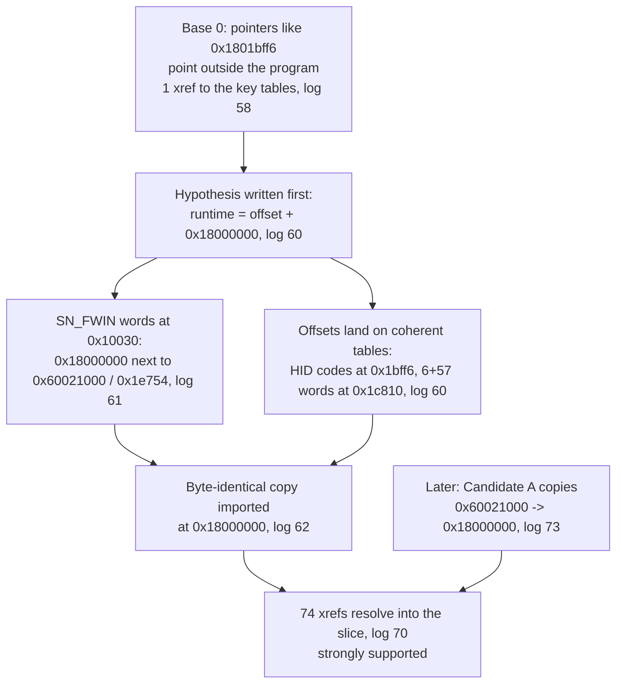

# Lesson 08 — Ghidra, the X-ray machine

> **In one sentence:** Ghidra turns a raw firmware file into instructions, functions and cross-references, but only if you tell it the right processor and the right base address; getting the base wrong made Candidate B's tables invisible until the investigation moved it to `0x18000000`.
>
> **You will learn:**
> - what disassembly and decompilation are, and why the project trusts the **listing** over the decompiler
> - how the firmware slices were imported headless as `ARM:LE:32:Cortex`, and what the `-readOnly -noanalysis` report scripts do
> - what a base address is, why a wrong one breaks every pointer, and how Candidate B was rebased from `0` to `0x18000000`
> - how the vendor-command dispatcher was found by searching for opcode constants, and why a raw `51 21` byte hit meant nothing
> - how the 189-byte translation table and the overlapping KBID windows were recovered, and how "eight `0x86` rows" was corrected
>
> **Time:** ~90 minutes · **Prerequisites:** [Lesson 6](06-the-firmware-file.md), [Lesson 7](07-arm-cortex-m3.md)

## 1. The story (kid version)

Imagine you find an old book written in a language you only half know. You could read it word by word with a dictionary, as you did in Lesson 7. That works for one sentence, but the book has thirty thousand sentences. What you want is a machine that reads the whole thing at once, marks where each chapter starts, and draws arrows from every "see page 212" to page 212.

Ghidra is that machine. Think of it as an X-ray machine for programs. The X-ray picture (the **listing**) shows the real bones: every instruction, exactly as it is. The machine also has an artist who looks at the X-ray and draws a friendly cartoon of what the patient probably looks like (the **decompiler**). The cartoon is easier to read, but the artist sometimes guesses. When the cartoon and the X-ray disagree, you believe the X-ray.

There's one catch. The book's cross-references say things like "see page 1801bff6". If the machine thinks page 1 of the book is page 1, those references point to pages that don't exist, and every arrow goes nowhere. But if you tell the machine "this book's first page is really page 18000000", suddenly every arrow lands on a real table. Choosing that starting page is choosing the **base address**.

**How the analogy maps to the real thing**

| In the story | In the investigation |
|---|---|
| The half-known language | ARM Thumb-2 machine code |
| The reading machine | [Ghidra](00-glossary.md#ghidra) 12.1.2, run headless |
| The X-ray picture | The [listing](00-glossary.md#listing): address, bytes, instruction |
| The artist's cartoon | The [decompiler](00-glossary.md#decompiler)'s C-like output |
| Chapters | [Functions](00-glossary.md#function), named `FUN_<address>` |
| Arrows between pages | Cross-references ("xrefs") |
| "Page 1 is really page 18000000" | The [base address](00-glossary.md#base-address) `0x18000000` |

## 2. Why we needed this

After Lesson 6 the investigation knew the container layout. After Lesson 7 you can decode a few instructions by hand. Neither is enough to answer the open questions of 2026-08-29: where is the code that handles Armoury Crate's `51 21` remap command, and why did remapping a reserved Fn key get an echo but no effect ([Lesson 5](05-talking-to-the-keyboard.md))?

Candidate B alone was analysed into **32,734 instructions in 579 functions** at its first, provisional base (log 45). Nobody reads that by hand. What was needed was a tool that:

- decodes every instruction and follows every branch;
- groups instructions into functions;
- records who reads, writes or calls each address (cross-references);
- and can be scripted, so every result is a saved, reproducible log.

On this machine the obvious lightweight option, GNU `objdump`, has no ARM support (you saw it fail in Lesson 7). Ghidra was not installed. So the first step was a read-only check of what the package manager offered (log 38): Ghidra `12.1.2-2.1` and `jdk21-openjdk 21.0.11.u10-2`. The owner installed them, and log 39 verified the install. Everything after that ran **headless**, from the command line, with no window and no keyboard access.

## 3. The real thing

### 3.1 Disassembly and decompilation

**Disassembly** turns bytes into instructions, one to one. It is exactly what you did by hand in Lesson 7, done for the whole file. Ghidra's listing adds the address, the length, and resolved references:

```
000014a8  movw r0,#0xed08
000014ac  movt r0,#0xe000
000014b0  ldr r0,[r0,#0x0]          refs=[READ->e000ed08]
000014b2  ldr.w sp,[r0,#0x0]
000014b6  ldr r0,[0x000014ec]       refs=[READ->000014ec,PARAM->00001217]
000014b8  blx r0                    refs=[COMPUTED_CALL->00001216]
000014ba  ldr r0,[0x000014f0]       refs=[READ->000014f0]
000014bc  bx r0                     refs=[COMPUTED_JUMP->00000140]
```

**Decompilation** goes further. It tries to rebuild C-like source that would compile to those instructions. For the same function, Ghidra's decompiler produced (log 72):

```c
void CandidateA_Reset_Handler(void)
{
  (*DAT_000014ec)();
                    /* WARNING: Could not recover jumptable at 0x000014bc. Too many branches */
                    /* WARNING: Treating indirect jump as call */
  (*DAT_000014f0)();
  return;
}
```

Compare the two. The decompiler **dropped the four instructions that set the stack pointer**, because C has no way to say "load `sp`". It also turned a jump (`bx r0`) into a call and warned you about it. Neither is a bug in Ghidra. The decompiler is showing you its best C approximation. But if you had read only the decompile, you would never know this function sets up the stack.

That is the project's rule: **listing over decompiler**. Use the decompiler to get your bearings, then confirm anything important in the listing. You will see the rule catch real mistakes in Section 5 and in Lesson 10.

### 3.2 Running Ghidra headless

[ghidra/README.md](../ghidra/README.md) records the environment: Ghidra 12.1.2, JDK 21, processor language `ARM:LE:32:Cortex`, compiler spec `default`. Headless commands use temporary state directories, so the owner's normal Ghidra settings were never touched:

```bash
JAVA_HOME=/usr/lib/jvm/java-21-openjdk \
XDG_CONFIG_HOME=/tmp/falchion-ghidra-config \
XDG_CACHE_HOME=/tmp/falchion-ghidra-cache \
XDG_DATA_HOME=/tmp/falchion-ghidra-data \
ghidra-analyzeHeadless ...
```

An **import** creates a program in a project from a raw slice:

```bash
ghidra-analyzeHeadless "$PWD/ghidra/project-step6" step6 \
  -import "$PWD/ghidra/imports/<slice>" \
  -processor ARM:LE:32:Cortex -loader BinaryLoader -loader-baseAddr <base>
```

Piece by piece:

| Option | Meaning |
|---|---|
| `ghidra/project-step6 step6` | the project folder and project name |
| `-import <slice>` | a file cut out of the firmware, never the original `.bin` |
| `-processor ARM:LE:32:Cortex` | ARM, **L**ittle-**E**ndian, 32-bit, Cortex (Thumb-only) variant |
| `-loader BinaryLoader` | "this is a raw blob, not an ELF or EXE": there are no headers to trust |
| `-loader-baseAddr <base>` | the address the first byte of the slice should have. **The most important choice** |

A **report** then runs a Java script against an existing program without changing it:

```bash
ghidra-analyzeHeadless "$PWD/ghidra/project-step6" step6 \
  -process <slice> -readOnly -noanalysis \
  -scriptPath "$PWD/ghidra/scripts" -postScript FalchionFunctionInventory.java
```

`-readOnly` means Ghidra discards any change when the script ends; the logs show lines like `Discarding changes to the following read-only file` (log 80). `-noanalysis` means "don't re-run the auto-analysers; just run my script on what is already there". The `.java` files under [ghidra/scripts/](../ghidra/scripts/) run inside Ghidra's Java API. They are not firmware, and nothing ever sends them to the keyboard (TIMELINE, "Ghidra setup and first project").

There are two kinds of script, and the difference is a safety rule:

- **Report scripts** (for example `FalchionOpcodeSearch.java`, `FalchionDispatcherReport.java`, `FalchionBootloaderVerifyReport.java`, `FalchionDecompileTargets.java`) print listings, decompiles and xrefs. They are meant for `-readOnly -noanalysis`.
- **Label and seed scripts** (`FalchionSeedEntries.java`, `FalchionApplyProtocolLabels.java`, `FalchionSeedVectors.java`) add names or create functions. They change *only the ignored local project database*, never the source `.bin` ([ghidra/README.md](../ghidra/README.md)).

The Ghidra projects themselves (`ghidra/project/`, `ghidra/project-step6/`), the generated slices (`ghidra/imports/`), and the outputs in `ghidra/decompiles/`, `ghidra/inventories/` and `ghidra/peripherals/` are local analysis products. What gets preserved is the **text**: every report was saved as a numbered log.

### 3.3 The first imports

Log 45's project report shows what the first four programs looked like after analysis:

| Program | Source range (vendor file) | Base | Functions | Instructions |
|---|---|---|---:|---:|
| `bootloader_primary.bin` | `0x01000-0x0ffff` | `0x00000000` | 303 | 17,010 |
| `app_candidate_a.bin` | `0x11000-0x168ab` | `0x00000000` | 94 | 4,161 |
| `app_candidate_b.bin` | `0x21000-0x3f753` | `0x00000000` (provisional) | 579 | 32,734 |
| `ram_image_18038000.bin` | `0x74000-0x7bfff` | `0x18038000` | 54 | 4,598 |

All used `language=ARM:LE:32:Cortex` and `compiler=default` (log 45).

Why these bases? The bootloader and Candidate A each start with a vector table whose reset vector (`0x000002f5`, `0x000014a9`) points *inside the slice* when the slice starts at 0. The RAM image's reset vector `0x180381c1` only makes sense if the slice starts at `0x18038000` (FINDINGS, "Observed image layout"). **Candidate B had no vector table** (it starts with a function prologue), so nothing said where it lived. It was imported at 0 as a placeholder, and the placeholder turned out to be wrong.

### 3.4 Seeding and labels

Ghidra auto-names each function it finds `FUN_<address>`. You can add your own names, called **labels**. The first seed script (log 40) labelled the vector tables and reset handlers, for example:

```
label 00000000 CandidateA_Vector_Table
created function CandidateA_Reset_Handler at 000014a8
```

For Candidate B it did this:

```
created function CandidateB_Entry at 00000000
```

That name was an overclaim. Candidate B *begins* with a valid Thumb function, but "the first function in the slice" is not the same as "the entry point". Nothing (no vector, no call) proved that execution starts there. So the label was corrected (log 44):

```
renamed existing function at 00000000 to CandidateB_Start_Function
```

The corrected name says only what was known: a function starts here. Lesson 10 shows how the real entry was found later, at `0x1800023a`, called from Candidate A (log 80). The rebased program now carries the name `CandidateB_Entry@1800023a` for *that* address, and [ghidra/README.md](../ghidra/README.md) is explicit that "`CandidateB_Start_Function` is a separate provisional label, not the reset/entry".

A later lesson from the same family: a raw import gives Ghidra no reason to disassemble a handler that nothing calls, so vector-table handlers were invisible until `FalchionSeedVectors.java` created a function at each one. That grew the analysed function set **from 80 to 97 per entry image and from 293 to 530 per application** (log 100, [ghidra/README.md](../ghidra/README.md)). What Ghidra *finds* depends on what you *tell* it.

### 3.5 Finding the dispatcher by opcode search

Armoury Crate's commands start with bytes like `0x12`, `0x50`, `0x51`, and `51 21` / `50 55` ([Lesson 5](05-talking-to-the-keyboard.md)). Somewhere, the firmware must compare the first request byte with those numbers. So `FalchionOpcodeSearch.java` searched every function for instructions whose constants are in this list ([ghidra/scripts/FalchionOpcodeSearch.java](../ghidra/scripts/FalchionOpcodeSearch.java)):

```java
private static final long[] TARGETS = {
    0x12L, 0x21L, 0x50L, 0x51L, 0x55L, 0x9fL, 0x2151L, 0x5550L
};
```

`0x2151` and `0x5550` are the byte pairs `51 21` and `50 55` read as little-endian halfwords. The result (log 47) was striking: one function held almost all of them.

```
FUNCTION FUN_00001fbe entry=00001fbe ... callers=[]
  constant=0x12   00002006 cmp r2,#0x12
  constant=0x50   00002018 cmp r2,#0x50
  constant=0x51   0000201c cmp r2,#0x51
  constant=0x55   000023e0 cmp r0,#0x55
                  000024dc cmp r2,#0x55
  constant=0x21   000024b0 cmp r2,#0x21
  constant=0x9f   0000266c cmp r0,#0x9f
                  ...six more cmp r0,#0x9f
```

A single function comparing one register against `0x12`, `0x50` and `0x51` is the shape of a command [dispatcher](00-glossary.md#dispatcher). The dispatcher report (log 48) confirmed it. `FUN_00001fbe` loads a pointer from its literal pool, reads byte 0 of the buffer it points at (`0x1802337c`), and walks a chain of `cmp`/`beq`:

```
00001fc2  ldr r4,[0x00002174]      refs=[READ->00002174]
00001fc4  ldrb r0,[r4,#0x0]        refs=[READ->1802337c]
  ...
00001ff2  cmp r2,#0x52
00001ffc  cmp r2,#0x41
00002002  cmp r2,#0x4
00002006  cmp r2,#0x12
0000200a  cmp r2,#0x22
0000200e  cmp r2,#0x25
00002014  cmp r2,#0x43
00002018  cmp r2,#0x50
0000201c  cmp r2,#0x51
00002020  b 0x0000248e
```

It was labelled `VendorHID_CommandDispatcher`. The `51 21` / `51 22` handler (log 49) then read like a checklist:

```
00002662  ldrb r1,[r4,#0x2]        ; source key byte
00002664  cmp r1,#0xbc
00002666  bhi 0x0000274a           ; source > 0xbc: reject
00002668  ldrb r0,[r4,#0x3]        ; layer byte
0000266a  cbz r0,0x00002672        ; 0x00: base layer
0000266c  cmp r0,#0x9f
0000266e  bne 0x0000274a           ; not 0x9f: reject
00002672  ldrb r2,[r4,#0x4]
00002676  ldrb.w r12,[r4,#0x5]
0000267a  bfi r3,r2,#0x0,#0x8      ; build a 16-bit target from bytes 4 and 5
0000267e  bfi r3,r12,#0x8,#0x8
00002686  cmp r3,#0xbc
00002688  bhi 0x000026a6           ; big targets: special cases below
  ...
000026a6  cmp r2,#0xff
000026aa  cmp r2,#0xc7
000026ae  cmp r2,#0xc8
000026b2  cmp r2,#0xd3
```

Those constants are exactly the rules FINDINGS records: source at most `0xbc`, layer byte `0x00` or `0x9f`, a 16-bit target in bytes 4–5, and special targets `0xff`, `0xc7`, `0xc8`, `0xd3`. There is **no explicit reserved-key rejection** here. That is why a reserved remap could be echoed without taking effect. The real gate is a separate predicate, `IsKeyUnsupportedForLayer` (FINDINGS, "Candidate B vendor-HID and key-policy analysis").

### 3.6 The raw `51 21` byte hit

The search also reported one more thing (log 47):

```
raw_51_21_pair_address=00002c16 containing_function=FUN_00001fbe@00001fbe
```

The bytes `51 21` appear next to each other at Candidate B offset `0x2c16`. Is that a table of commands? No. In Lesson 7 you decoded those two bytes: they are the halfword `0x2151`, the instruction `movs r1,#0x51`. The opcode search listed that very line, `00002c16 movs r1,#0x51`, under constant `0x51`. It is code that loads the number `0x51` into `r1`. It is not a copy of the `51 21` packet (TIMELINE, "Dispatcher identification").

**The lesson: a byte pattern is not a meaning.** In a code region, any two bytes can be half of an instruction. You only know what `51 21` means once you know whether you are looking at code or data, and where the instruction boundaries are.

### 3.7 Base addresses, and why a wrong one breaks every pointer

A **pointer** inside code is just a number. When Candidate B does

```
00001fc2  ldr r4,[0x00002174]      ; the pool word at 0x2174 is 0x1802337c
00001fc4  ldrb r0,[r4,#0x0]        ; READ -> 1802337c
```

it means "read the byte at address `0x1802337c`". In the base-0 program, the slice covered only `0x00000000–0x0001e753`, so `0x1802337c` pointed *outside the program*, at nothing Ghidra could show. That was fine for the request buffer, which really is RAM that only exists at runtime. The problem was that **all** of Candidate B's key-table pointers looked the same way.

Here are the numbers. The script `FalchionRuntimeTableXrefs.java` counted every reference, including literal and data references, into three suspected table regions: `key_translation 0x1801bff6..0x1801c0b2`, `key_index_map 0x1801c37c..0x1801c7af`, and `unsupported_key_lists 0x1801c810..0x1801c90b`. At base 0 (log 58):

```
PROGRAM app_candidate_b.bin
REGION_XREF_COUNT key_translation 1
REGION_XREF_COUNT key_index_map 0
REGION_XREF_COUNT unsupported_key_lists 0
TOTAL_XREF_COUNT 1
```

One reference. The dispatcher was obviously using those tables, but Ghidra couldn't connect it to any bytes.

#### The hypothesis, and the evidence for it

Log 60 wrote the idea down before testing it:

```
HYPOTHESIS
Candidate B runtime base 0x18000000 maps runtime addresses to slice offsets by subtracting 0x18000000.
```

Three independent things supported it:

1. **The firmware header says so.** The `SN_FWIN` words at file `0x10030` are `0x18000000, 0x60021000, 0x0001e754, 0x1a76c116, 0x18000000, 0x60021000, 0x00000000, 0x00000000` (log 61). That is Candidate B's flash address `0x60021000` and length `0x1e754` sitting right next to `0x18000000`.
2. **The subtracted offsets land on coherent data.** `0x1801bff6 - 0x18000000 = 0x1bff6`, and at slice offset `0x1bff6` there is a clean 189-byte table of HID usage codes (log 60):

   ```
   0001bff6: 00 35 1e 1f 20 21 22 23 24 25 26 27 2d 2e 89 2a  .5.. !"#$%&'-..*
   0001c006: 2b 14 1a 08 15 17 1c 18 0c 12 13 2f 30 31 39 04  +........../019.
   ```

   `0x1e` to `0x27` are the HID codes for the keys 1 through 0, and `0x14 0x1a 0x08 0x15 0x17 0x1c` are Q W E R T Y. At `0x1c810`, the offset for `0x1801c810`, there are exactly 6 + 57 32-bit words of HID usages (log 60).
3. **Candidate A copies it there.** Its scatter loader copies `0x1e354` bytes from flash `0x60021000` to RAM `0x18000000` (log 73, [Lesson 10](10-how-it-boots.md)). That came later and "independently confirms" the base (FINDINGS, "Candidate A reset, scatter-load, and RAM base").

#### The rebase

The investigation did **not** re-import the old program. It made a byte-identical copy of the slice and imported *that* at the new base, keeping the base-0 program for audit (log 62):

```
DERIVED_COPY_VERIFICATION
cmp_equal=true
8fe68a13d7a0cd3bf8b4fd0dbe0575c0b7e67c1d4373e8d63970cf248684e668  ghidra/imports/app_candidate_b.bin
8fe68a13d7a0cd3bf8b4fd0dbe0575c0b7e67c1d4373e8d63970cf248684e668  ghidra/imports/app_candidate_b_18000000.bin
...
INFO  Successfully applied "-loader-baseAddr" to "Base Address" (old: "null", new: "0x18000000") (ProgramLoader)
```

The new program's memory block is `ram start=18000000 end=1801e753 size=0x1e754` (log 63). Re-applying the labels hit one snag, which the log records honestly (log 63):

```
renamed 18001f6e FUN_18001f6e -> IsKeyUnsupportedForLayer
missing function at 18001fbe; not labeled
renamed 18000a70 FUN_18000a70 -> VendorHID_SendResponse64
```

The rebased analysis had not created a function at the dispatcher's address, so the label script refused to invent one. Log 64 then seeded it explicitly (`created function VendorHID_CommandDispatcher at 18001fbe`) and re-ran analysis. That run emitted the same single decompiler warning that the base-0 program had produced at `0x24f2` (log 41), now at `0x180024f2` (log 64). Same bytes, same offset, same quirk.

#### After the rebase

Now the same instructions resolve straight into the tables (log 65, quoted in log 66):

```
18002694  ldrb r3,[r2,r3]  owner=VendorHID_CommandDispatcher@18001fbe  refs=[DATA->1801bff6]
180026f4  ldrb r2,[r1,r2]  owner=VendorHID_CommandDispatcher@18001fbe  refs=[DATA->1801c37c]
```

and the policy predicate points at the two lists (log 65):

```
18001f78  movs r2,#0x18
18001f7a  ldr r1,[0x18002170] refs=[READ->18002170,PARAM->1801c810]
  ...
18001f84  movs r2,#0xe4
18001f86  adds r1,#0x18 refs=[PARAM->1801c828]
```

`0x18` is 24 bytes, which is 6 words, and `0xe4` is 228 bytes, which is 57 words. Those are exactly the 6 base-policy and 57 Fn-policy entries. The reference scan over the corrected regions found **74** references (log 70) where the base-0 program found 1.



The evidence level is **strongly supported**, not "proven", in FINDINGS ("Candidate B's runtime base is now strongly supported as `0x18000000`"). The scatter copy in log 73 is what makes it hard to doubt.

### 3.8 The tables that came out

With the right base, FINDINGS could list exact table locations. Each one has three addresses: runtime, slice offset (`runtime - 0x18000000`), and full-file offset (`slice + 0x21000`):

| Runtime | Slice offset | File offset | Contents |
|---:|---:|---:|---|
| `0x1801bff6` | `0x1bff6` | `0x3cff6` | 189-byte source/target translation table |
| `0x1801c37c` | `0x1c37c` | `0x3d37c` | three effective-KBID wire-ID-to-record-index windows |
| `0x1801c50e` | `0x1c50e` | `0x3d50e` | three effective-KBID scan-position maps |
| `0x1801c810` | `0x1c810` | `0x3d810` | 6 base-policy words, then 57 Fn/other-policy words |

The six base-policy words are `e8, 53, 39, 47, e3, e2`. The 57-word Fn list covers the manual's locked function families, including F1–F12, digits, arrows, and vendor code `0xe8` (FINDINGS, "Candidate B runtime mapping and recovered tables"). You will find all of these in the bin in Section 6.

#### 189 bytes, and why

The dispatcher accepts wire IDs `0x00` to `0xbc`. `0xbc` = 188, so there are 189 possible values, and the translation table is 189 (`0xbd`) bytes long: one output code per wire ID (log 68).

#### The KBID windows, and the "eight `0x86` rows" mistake

The data at `0x1801c37c` looked, at first, like a stack of rows. The first-pass KBID report (log 67) split it that way:

```
CONSTANTS base=0x18000000 ... map=0x1801c37c stride=0x86 complete_rows=8 ...
BYTES row_0 address=0x1801c37c length=0x86
BYTES row_1 address=0x1801c402 length=0x86
  ...
BYTES row_7 address=0x1801c726 length=0x86
```

Eight independent 134-byte rows. That reading came from the data's look, and the code disproved it. Three facts from the instructions (logs 68, 69):

1. **Only three selectors exist.** `FUN_180088ea` translates an input ID in `0..25` through a 26-byte table at runtime `0x00004fcd`, which is inside Candidate A at file `0x15fcd`. Its only outputs are `0`, `1` and `4`, and the same function turns `4` into `2`. So the effective KBID is `0..2`.
2. **Each window is 189 bytes, but they start only `0x86` apart.** The dispatcher computes `record_index = byte[0x1801c37c + effective_kbid * 0x86 + wire_source]` with `wire_source` up to `0xbc`. You saw the `* 0x86` done with shifts in Lesson 7: `add.w r3,r2,r2,lsl #1`, `add.w r3,r3,r2,lsl #6`, then `lsl #1` (log 49).
3. **So the windows overlap** by `0xbd - 0x86 = 0x37` (55) bytes, and a separate table at `0x1801c50e` uses a `0x100` stride. Its code references in `FUN_18000466` and `FUN_180057d2` establish that stride (FINDINGS).

```
0x1801c37c                              0x1801c438
|------------- KBID 0 window (0xbd) ------------|
                    0x1801c402                              0x1801c4be
                    |------------- KBID 1 window (0xbd) ------------|
                                        0x1801c488                              0x1801c544
                                        |------------- KBID 2 window (0xbd) ------------|
                                                            0x1801c50e
                                                            |--- scan row 0 (0x100) ---> ...
                                        overlap: 55 bytes shared by KBID 2's tail and scan row 0
```

The corrected record calculation (FINDINGS, "KBID selection and key-index-map structure"):

```text
record_index = byte[0x1801c37c + effective_kbid * 0x86 + wire_source]
record        = 0x180202ac + layer * 0xd84 + record_index * 0x20
```

Log 67 was **kept**, not deleted. The manifest describes it as a "first-pass KBID/table report; its eight-chunk visual split was superseded after code proved overlapping wire windows and a separate scan map" (log 71). One more careful detail: record index `0x4b` appears 67 or 68 times per window. It is a "strong fallback/dummy-record candidate, but its live runtime semantics remain unproven" (FINDINGS).

### 3.9 Listing over decompiler, in practice

The rule from Section 3.1 decided several results in this project:

| Where | What the listing settled | Log |
|---|---|---|
| Candidate A reset handler | the decompile omits the four instructions that set `sp` | 72 |
| Hall actuation compare | "The decision, confirmed against the listing rather than the decompiler": `cmp r3,#0x64` / `bcc` / `cbnz` | 110 |
| Key-map size | ×15 then ×5 is in `rsb ...,lsl #4` / `add.w ...,lsl #2`, the instruction encoding | 110 |
| Entry handoff slot | `ldr r1,[pool]; ldr r1,[r1]; str r0,[r1,#0x1c]` shows VTOR is dereferenced first | 102 |
| Recovery-key threshold | `cmp r5,#0x1e` is tested before the increment, so 31 matches, not 30 | 102 |
| `FUN_00005272` | it is `msr primask,r0`, an interrupt mask, not a scan enable | 120 |

Decompiler warnings are clues, too. `Could not recover jumptable`, `Treating indirect jump as call` and `Removing unreachable block` (logs 72, 75) each mark a place where the C view is an approximation.

### 3.10 The rest of the Ghidra folder

| Path | What it holds |
|---|---|
| [ghidra/README.md](../ghidra/README.md) | environment, import table, bases and their basis, labels, KBID maps, safety |
| [ghidra/scripts/](../ghidra/scripts/) | 37 `Falchion*.java` scripts: reports, seeds, labels, inventories, the peripheral census |
| `ghidra/imports/` | derived slices, named for slot, flash source, destination, length and hash, such as `installed_app_b_slot1_flash21000_dst18000000_len1e380_be463863.bin` |
| [ghidra/decompiles/](../ghidra/decompiles/) | saved listing+decompile+xref dumps, for example `boot_gates.txt`, `boot_handoff.txt`, `app_keymap.txt` |
| `ghidra/inventories/` | one line per function with its real body ranges and hashes (Phase 3) |
| `ghidra/peripherals/` | MMIO access census per program (Phase 5) |
| `ghidra/project/`, `ghidra/project-step6/` | the local Ghidra databases; step 6 used a separate project so the original was never disturbed |

One more trap the README records: Ghidra function bodies are not necessarily contiguous. **15 of 80** functions in Candidate A and **61 of 293** in Candidate B have split bodies, so `entry..entry+size` must never be used as a body (log 99). You can see a split body in log 47: the dispatcher's `body=[[00001fbe, 0000206f] [00002088, 00002099] ...]` has dozens of ranges.

## 4. Decisions and why

| Decision | Why | Alternative rejected | Evidence (log) |
|---|---|---|---|
| Use Ghidra headless with temporary XDG state | Scriptable, reproducible, leaves the owner's GUI settings alone | Interactive clicking with no record; `objdump` (no ARM support here) | logs 38–39, [ghidra/README.md](../ghidra/README.md) |
| Import slices, never the original file | The preserved `.bin` must never change; slices can be hashed and regenerated | Import the whole container | log 62, [ghidra/README.md](../ghidra/README.md) |
| Import Candidate B at 0 provisionally, and say so | There was no vector table to give a base | Guess a base with no evidence | logs 40, 45 |
| Rename `CandidateB_Entry` to `CandidateB_Start_Function` | Nothing proved execution starts at offset 0 | Keep an overconfident label | log 44 |
| Search for opcode constants to find the dispatcher | A dispatcher must compare the command byte with known values | Pattern-match packet bytes like `51 21` in the raw file | logs 47–48 |
| Rebase Candidate B via a byte-identical copy, keeping base 0 | Tests `0x18000000` without destroying the history | Overwrite the provisional program | logs 62–63 |
| Write the rebasing hypothesis down before testing it | Makes the test honest and auditable | Test first, rationalise afterwards | log 60 |
| Correct "eight `0x86` rows" from code, keep log 67 | The selector count and stride come from instructions, not appearance | Delete the wrong report | logs 67–71 |
| Run report scripts `-readOnly -noanalysis` | A report must not change what it reports on | Let reports save to the project | logs 47–80 |

## 5. What went wrong, and how it was caught

**The `CandidateB_Entry` label.**
- *Believed:* offset 0 of Candidate B was its entry point, because a valid function starts there (log 40).
- *True:* Candidate B has no vector table and is entered by a direct call to `0x1800023a` (log 80). Offset 0 is just "a function".
- *Caught by:* the investigation's own evidence audit. The TIMELINE records that "no vector or call path proves that address zero is the true payload entry" (log 44).
- *Lesson:* a label is a claim. Name things for what you know, not for what you hope.

**The raw `51 21` byte hit.**
- *Believed (briefly):* adjacent bytes `51 21` inside Candidate B might be a command table.
- *True:* they are `movs r1,#0x51` at `0x2c16` (log 47).
- *Caught by:* the opcode search listed the same address as an instruction.
- *Lesson:* bytes inside code must be decoded as instructions before they can be read as data.

**Candidate B at base 0.**
- *Believed:* base 0 was a usable provisional base.
- *True:* it hid every key-table reference: 1 xref at base 0 against 74 after the rebase (logs 58, 70). The runtime base is `0x18000000` (strongly supported, logs 60–66, confirmed by log 73).
- *Caught by:* noticing that the dispatcher's pointers all pointed at `0x1801xxxx`, outside the program, and testing a written hypothesis.
- *Lesson:* when every pointer points "outside", the base is probably wrong, not the pointers.

**The eight `0x86` rows.**
- *Believed:* `0x1801c37c` held eight independent 134-byte rows (log 67).
- *True:* three 189-byte windows at `0x86` stride overlapping by 55 bytes, plus a separate three-row `0x100` scan map (logs 68–69).
- *Caught by:* following the code that computes the index, not the data's appearance. The KBID lookup returns only 0, 1 and 4, which is normalised to 0..2.
- *Lesson:* structure comes from the code that reads the data.

**The first binary-pointer search.**
- *Believed:* a shell-based search for pointer bytes had run correctly.
- *True:* its shell escaping was malformed, and log 50 was regenerated "byte-safely" (TIMELINE, "Corrections retained for auditability"). The saved log 50 now uses Perl `pack(H*)`.
- *Lesson:* when you search for bytes, build the needle as bytes, not as shell text.

**A "read-only" script that was not.**
- *Believed:* `FalchionRemoveSeeds.java`'s "superseded, do not use" banner was a safeguard.
- *True:* its `run()` still called `removeFunction()`, `symbol.delete()` and `clearListing()`, and an earlier use of `clearListing` had deleted real code (logs 132–133). Every destructive call was deleted and the script now refuses to run.
- *Lesson:* a warning comment does not make code safe. Only removing the dangerous code does. Lesson 14 tells the whole story.

## 6. Try it yourself

**Read-only walkthrough.** Running Ghidra needs the local projects and a JVM, and even a `-readOnly` run opens the project database. So these exercises use the saved logs and the preserved `.bin`, which is exactly what the logs are for. Run everything from `keyboard/falchion-re/`.

**1. Find the raw `51 21` hit and see what it really is.**

```
$ grep -o 'raw_51_21_pair_address=[^ ]* containing_function=[^ ]*' logs/47-ghidra-candidate-b-opcode-search.txt
raw_51_21_pair_address=00002c16 containing_function=FUN_00001fbe@00001fbe
$ xxd -s 0x23c10 -l 16 dumps/vendor/M605_V01_00_58.bin
00023c10: 0860 0090 6288 5121 54e2 a078 0528 2cd2  .`..b.Q!T..x.(,.
```

Candidate B starts at file `0x21000`, so slice offset `0x2c16` is file `0x23c16`. The `5121` there is the instruction `movs r1,#0x51` (Lesson 7, Exercise 2).

**2. Compare cross-references before and after the rebase.**

```
$ grep -hoE '(PROGRAM app_candidate_b[^ ]*|TOTAL_XREF_COUNT [0-9]+)' logs/58-ghidra-runtime-key-table-xrefs.txt logs/70-ghidra-corrected-key-map-reference-scan.txt
TOTAL_XREF_COUNT 0
TOTAL_XREF_COUNT 0
PROGRAM app_candidate_b.bin
TOTAL_XREF_COUNT 1
TOTAL_XREF_COUNT 0
PROGRAM app_candidate_b_18000000.bin
PROGRAM app_candidate_b_18000000.bin
TOTAL_XREF_COUNT 74
```

The first two zeros are the bootloader and Candidate A, and the zero after Candidate B's 1 is the RAM image. None of those use the key tables. The line to compare is Candidate B: **1 at base 0, 74 at `0x18000000`**.

**3. Follow the label history.**

```
$ grep -o 'created function CandidateB_Entry at [0-9a-f]*' logs/40-ghidra-seed-entries.txt
created function CandidateB_Entry at 00000000
$ grep -o 'renamed existing function at [0-9a-f]* to [A-Za-z_]*' logs/44-ghidra-candidate-b-label-correction.txt
renamed existing function at 00000000 to CandidateB_Start_Function
$ grep -o 'ENTRY 0x1800023a fn=[A-Za-z_@0-9]*' logs/80-ghidra-candidate-b-entry.txt
ENTRY 0x1800023a fn=CandidateB_Entry@1800023a
```

**4. Pull the tables out of the bin with Python.** This converts runtime addresses to file offsets exactly as Section 3.8 describes:

```python
import struct
d = open('dumps/vendor/M605_V01_00_58.bin', 'rb').read()
BASE, FILE_B = 0x18000000, 0x21000          # runtime base, where B starts in the file
def file_of(runtime): return runtime - BASE + FILE_B
pol = struct.unpack_from('<6I', d, file_of(0x1801c810))
print('base policy words:', ' '.join('%02x' % w for w in pol))
print('literal @B+0x29b4 =', hex(struct.unpack_from('<I', d, FILE_B + 0x29b4)[0]))
print('KBID lookup raw  :', sorted(set(d[0x15fcd:0x15fcd + 26])))
for k in range(3):
    s = 0x1801c37c + k * 0x86
    print('KBID %d window 0x%08x..0x%08x' % (k, s, s + 0xbd - 1))
```

Real output:

```
base policy words: e8 53 39 47 e3 e2
literal @B+0x29b4 = 0x1801bff6
KBID lookup raw  : [0, 1, 4]
KBID 0 window 0x1801c37c..0x1801c438
KBID 1 window 0x1801c402..0x1801c4be
KBID 2 window 0x1801c488..0x1801c544
```

The literal at `0x29b4` is the pool word the `51 21` handler loads before indexing the translation table (log 49, `ldr r2,[0x000029b4]`). The window ends match FINDINGS exactly.

**5. See the six base-policy words raw.**

```
$ xxd -s 0x3d810 -l 0x18 dumps/vendor/M605_V01_00_58.bin
0003d810: e800 0000 5300 0000 3900 0000 4700 0000  ....S...9...G...
0003d820: e300 0000 e200 0000                      ........
```

Six little-endian words: `0xe8`, `0x53`, `0x39`, `0x47`, `0xe3`, `0xe2`.

**6. Count where a pointer is stored.** Log 50 searched for the little-endian bytes of `0x1801bff6`. Do it in Python, building the needle as bytes (the lesson of the malformed first search):

```
$ python3 -c "
d = open('dumps/vendor/M605_V01_00_58.bin','rb').read()
needle = (0x1801bff6).to_bytes(4, 'little')
hits = [hex(i) for i in range(len(d)) if d.startswith(needle, i)]
print(needle.hex(), len(hits), hits)"
f6bf0118 11 ['0x239b4', '0x242b0', '0x2474c', '0x24bb4', '0x25998', '0x27a7c', '0x27ee4', '0x28348', '0x28d48', '0x2919c', '0x298b0']
```

Eleven literal-pool copies of the translation table's address, the same eleven file offsets log 50 lists. The first, `0x239b4`, is slice offset `0x29b4`, the literal from Exercise 4.

**7. Check that the table analyzer still reproduces its log.**

```
$ python3 tool/analyze_candidate_b_tables.py | cmp - logs/68-candidate-b-kbid-layout-analysis.txt && echo "identical to log 68"
identical to log 68
```

`cmp` prints nothing when the two are byte-identical. The whole 473-line KBID analysis still comes out exactly the same today.

## 7. Check your understanding

1. Why did Ghidra find only one reference to the key tables in the base-0 Candidate B program?

<details><summary>Answer</summary>

Because the code's pointers are runtime addresses like `0x1801bff6`, and a base-0 program only covers `0x00000000–0x0001e753`. Those pointers pointed outside the program, so Ghidra could not attach them to any bytes. At base `0x18000000` the same pointers land inside the slice, and 74 references resolve (logs 58, 70).
</details>

2. Name the three independent pieces of evidence for the `0x18000000` base.

<details><summary>Answer</summary>

(1) The `SN_FWIN` header words at `0x10030` put `0x18000000` next to B's flash address `0x60021000` and length `0x1e754` (log 61). (2) Subtracting `0x18000000` from the dispatcher's pointers lands on coherent tables inside the slice (log 60). (3) Candidate A's scatter loader copies flash `0x60021000` to RAM `0x18000000` (log 73).
</details>

3. The decompiler output for `CandidateA_Reset_Handler` shows two calls. What does the listing show that the decompile hides?

<details><summary>Answer</summary>

Four instructions that read VTOR (`0xe000ed08`), load the vector table's word 0, and put it into `sp`: `movw`, `movt`, `ldr r0,[r0]`, `ldr.w sp,[r0]`. C has no way to say "set the stack pointer", so the decompiler dropped them (log 72).
</details>

4. Why are the KBID windows 189 bytes long but only `0x86` bytes apart, and what does that imply?

<details><summary>Answer</summary>

Each window must hold one byte for every wire ID `0x00..0xbc` (189 values), but the code advances the window start by `effective_kbid * 0x86`. So adjacent windows overlap by `0xbd - 0x86 = 0x37` = 55 bytes, and the third window's tail shares storage with the start of the separate scan map at `0x1801c50e` (logs 68–69).
</details>

5. What do `-readOnly` and `-noanalysis` protect against?

<details><summary>Answer</summary>

`-readOnly` makes Ghidra discard any change a script made to the program, so a report cannot alter what it reports on. `-noanalysis` stops Ghidra from re-running its auto-analysers, so the script sees exactly the program state that earlier logs describe.
</details>

## 8. Sources

- [../FINDINGS.md](../FINDINGS.md): "Ghidra installation and project status", "Candidate B runtime mapping and recovered tables", "KBID selection and key-index-map structure", "Candidate B vendor-HID and key-policy analysis"
- [../TIMELINE.md](../TIMELINE.md): "2026-08-29 03:22–04:02 — Ghidra setup and first project", "Dispatcher identification", "Candidate B runtime base and exact policy recovery", "Effective-KBID and overlapping key-map recovery", "Corrections retained for auditability"
- [../ghidra/README.md](../ghidra/README.md), [../ghidra/scripts/](../ghidra/scripts/), [../ghidra/decompiles/](../ghidra/decompiles/)
- [../logs/38-ghidra-preinstall-check.txt](../logs/38-ghidra-preinstall-check.txt), [../logs/39-ghidra-install-verification.txt](../logs/39-ghidra-install-verification.txt)
- [../logs/40-ghidra-seed-entries.txt](../logs/40-ghidra-seed-entries.txt), [../logs/41-ghidra-entry-reanalysis.txt](../logs/41-ghidra-entry-reanalysis.txt), [../logs/44-ghidra-candidate-b-label-correction.txt](../logs/44-ghidra-candidate-b-label-correction.txt), [../logs/45-ghidra-synchronized-project-report.txt](../logs/45-ghidra-synchronized-project-report.txt)
- [../logs/47-ghidra-candidate-b-opcode-search.txt](../logs/47-ghidra-candidate-b-opcode-search.txt), [../logs/48-ghidra-candidate-b-dispatcher-report.txt](../logs/48-ghidra-candidate-b-dispatcher-report.txt), [../logs/49-ghidra-candidate-b-key-remap-report.txt](../logs/49-ghidra-candidate-b-key-remap-report.txt), [../logs/50-firmware-pointer-byte-search.txt](../logs/50-firmware-pointer-byte-search.txt)
- [../logs/57-ghidra-runtime-key-table-reference-scan.txt](../logs/57-ghidra-runtime-key-table-reference-scan.txt) through [../logs/71-kbid-layout-analysis-audit.txt](../logs/71-kbid-layout-analysis-audit.txt), especially 58, 60–66, 67–70
- [../logs/72-ghidra-candidate-a-loader-report.txt](../logs/72-ghidra-candidate-a-loader-report.txt), [../logs/73-ghidra-candidate-a-scatter-handler-report.txt](../logs/73-ghidra-candidate-a-scatter-handler-report.txt), [../logs/80-ghidra-candidate-b-entry.txt](../logs/80-ghidra-candidate-b-entry.txt)
- [../logs/99-phase3-review-corrections.txt](../logs/99-phase3-review-corrections.txt), [../logs/100-installed-hardware-interface-map.txt](../logs/100-installed-hardware-interface-map.txt), [../logs/132-provenance-boundary-repair-and-bus-scoped-decode.txt](../logs/132-provenance-boundary-repair-and-bus-scoped-decode.txt), [../logs/133-path-correlated-proof-and-inert-seed-remover.txt](../logs/133-path-correlated-proof-and-inert-seed-remover.txt)
- [../tool/analyze_candidate_b_tables.py](../tool/analyze_candidate_b_tables.py)

[← Previous](07-arm-cortex-m3.md) · [Course home](README.md) · [Next →](09-checksums-and-trust.md)
