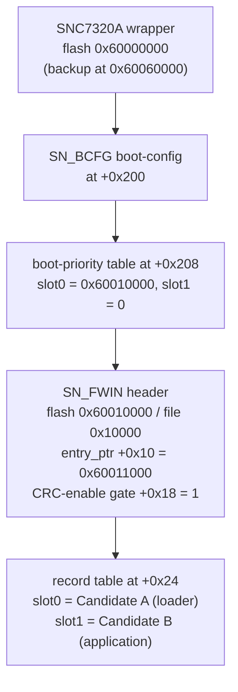
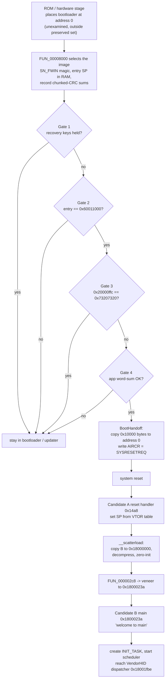

# Lesson 10 — How the keyboard boots

> **In one sentence:** From power-on, a hardware boot stage runs a bootloader that checks four gates, copies the chosen firmware to address 0 and resets into it; that firmware unpacks the application into RAM, calls its `main`, and starts the tasks that make the keyboard work.
>
> **You will learn:**
> - the whole boot chain: `SNC7320A` container → `SN_BCFG` → boot-priority table → `SN_FWIN`, then the copy-and-reset handoff
> - the four boot gates: the recovery-key poll, the fixed entry constant `0x60011000`, the `0x20000ffc` software flag, and the application word-sum
> - what `BootHandoff` does (copy `0x10000` bytes to address 0, then write `AIRCR` to reset), and why VTOR+`0x1c` is not `0xe000ed24`
> - Candidate A's reset handler, `__scatterload`, and the call into Candidate B's `main` at `0x1800023a`
> - the recovery key combination (8 and 6 held, 7 released, plus the strongly-inferred Fn), and every correction the boot analysis made
>
> **Time:** ~90 minutes · **Prerequisites:** [Lesson 7](07-arm-cortex-m3.md), [Lesson 8](08-ghidra.md), [Lesson 9](09-checksums-and-trust.md)

## 1. The story (kid version)

Think of a theatre on opening night. Long before the audience arrives, a stagehand you never see unlocks the building and switches on the work lights. Then the stage manager takes over. The stage manager has a checklist and will not raise the curtain unless every item passes: are the emergency doors clear, is this the right script, has anyone left the "cancel the show" note on the desk, and does the script's last page match its own page count? If all four pass, the stage manager doesn't walk the cast on stage one by one. Instead they photocopy the whole script onto the podium, ring a bell that restarts the whole theatre fresh, and from that fresh start the play runs from page 1.

Once the play starts, the lead actor's first job is to set out the props: unpack the boxes, put each prop where it belongs, and only then say the first line, "welcome to main". After that the play runs itself, scene after scene, until the theatre closes.

The recovery combination is the one thing that stops the show before it starts. If someone is holding down a specific set of seats when the stage manager checks the doors, the manager keeps the house lights up and the stage empty, ready for repairs, instead of raising the curtain.

**How the analogy maps to the real thing**

| In the theatre | In the keyboard |
|---|---|
| The unseen stagehand | The ROM or hardware stage that places the bootloader at address 0 |
| The stage manager | The [bootloader](00-glossary.md#bootloader) |
| The four-item checklist | The four boot gates |
| "Cancel the show" note | The `0x20000ffc` software entry flag |
| Photocopy the script, ring the restart bell | `BootHandoff`: copy to address 0, then reset |
| The lead actor setting out props | Candidate A's [scatter-load](00-glossary.md#scatter-load) |
| The first line, "welcome to main" | Candidate B's `main` at `0x1800023a` |
| People holding specific seats | The recovery key combination |

## 2. Why we needed this

By Lesson 9 the investigation could reproduce every integrity field. But reproducing a checksum only tells you the image is *consistent*. It does not tell you whether the device will *accept and run* an image, or how to recover if a flash goes wrong. Those are boot questions.

The concrete open questions were: what exactly does the bootloader check before it runs an image? Can the entry image be moved? What happens if a modified image is wrong, and is there a way back in? And there was a stubborn puzzle from Lesson 7: the entry image, Candidate A, is linked to run at address 0, but so is the bootloader, and there is only one address 0. How do both run there?

Answering these needed the whole chain read end to end, from the container the bootloader walks (logs 75, 78) through the acceptance gates (log 101) down to the application's first instruction (logs 79–80). And, crucially, it needed to be read from bytes that are **on the device**: log 101 analysed the bootloader out of the installed dump's mirror copy at `0x62000`, proven byte-identical to the vendor bootloader, so the rules come from the real keyboard, not only the vendor file.

## 3. The real thing

### 3.1 The container the bootloader walks

Before it checks anything, the bootloader reads a layered container. `analyze_boot_structures.py` decodes it (Section 6, log 78):

```
CONTAINER primary @flash 0x60000000 (file 0x0)
  wrapper magic=SNC7320A bootloader_ptr=0x60001000 size=0x00010000
  SN_BCFG @+0x200  boot_slots=[0x60010000, 0x00000000]
CONTAINER backup @flash 0x60060000 (file 0x60000)
  wrapper magic=SNC7320A bootloader_ptr=0x60062000 size=0x00010000
  SN_BCFG @+0x200  boot_slots=[0x60010000, 0x00000000]
SN_FWIN @flash 0x60010000 (file 0x10000)
  entry_ptr(+0x10)=0x60011000 crc_gate(+0x18)=0x00000001 entry_initial_SP=0x18036140
  record[0] addr=0x60011000 len=0x000058ac ...
  record[1] addr=0x60021000 len=0x0001e754 ...
```

The chain is:



Two facts fall out immediately (FINDINGS, "Boot container structures and boot gate"):

- **There is no populated second boot slot.** Slot 1 is `0`, and both the primary and backup `SN_BCFG` point at the *same* `SN_FWIN` header. So "Candidate A/B" are not an A/B image pair. They are two *regions* of one firmware: a loader and the application it loads. The redundancy is a backup *bootloader container* at `0x60060000`.
- **The `SN_FWIN +0x18` gate is `1`**, which enables the record CRC checks. A `0` there would skip them.

### 3.2 The selector: `FUN_00008000`

`FUN_00008000` picks the image. Its decompile (log 75) walks the boot-priority table, checks the `SN_FWIN` magic, validates the entry image's initial stack pointer with `FUN_00005240`, then verifies the records with `FUN_0000511c` (the CRC checker from Lesson 9). It returns the entry pointer `0x60011000`.

`FUN_00005240` is the entry-SP check (log 75):

```c
undefined4 FUN_00005240(uint *param_1) {
  uVar2 = *param_1;                       // the entry image's first word = its initial SP
  if (((uVar2 < 0x20000001) || (DAT_00005264 <= uVar2)) &&
      ((uVar2 < 0x18000001) || (DAT_00005268 <= uVar2))) {
    uVar1 = 1;                            // out of range: reject
  } else { uVar1 = 0; }                   // in RAM: accept
  return uVar1;
}
```

It reads the first word at `0x60011000` (here `0x18036140`) and requires it to fall in valid RAM: `0x18000001..0x18040000` or `0x20000001..0x20001000`. An initial stack pointer must point at real RAM, so this is a cheap sanity check that the "image" is actually an image (FINDINGS, "Boot container structures and boot gate").

### 3.3 The four gates

The orchestrator `FUN_00007ec8` jumps to the image only when four gates pass. Its decompile (log 75):

```c
iVar3 = FUN_000029d4();
if ((((iVar3 == 0) && (iVar2 == DAT_00007f98)) &&
     (iVar3 = FUN_00002a44(), iVar3 == 0)) &&
    (iVar3 = FUN_000026d0(0x6c000), iVar3 == 0)) {
  FUN_00000ffc(0);
  FUN_00007fa8(iVar2);
  thunk_EXT_FUN_18010000(0,iVar2,0x10000);
}
```

Log 101 resolved all four. Two are about the *environment* (what the user or the last session did) and two are about the *image* (FINDINGS, "Boot-acceptance conditions fully enumerated"):

| Gate | Kind | Must be | What it checks |
|---|---|---|---|
| 1. `FUN_000029d4` | environment | 0 | the recovery key combination is **not** held (Section 3.7) |
| 2. `iVar2 == DAT_00007f98` | image | true | the selected entry equals the constant **`0x60011000`** |
| 3. `FUN_00002a44` | environment | 0 | the software entry flag at `0x20000ffc` is **not** set |
| 4. `FUN_000026d0(0x6c000)` | image | 0 | the application word-sum over `0x10000..0x7c000` passes |

**Gate 2 is the hardest builder rule.** `DAT_00007f98` is `0x60011000` (log 101). The entry pointer in the `SN_FWIN` header must equal that constant *exactly*, so **the entry image cannot be relocated**. You can change the application, but the loader has to sit where the bootloader expects it.

**Gate 3 is a one-shot software flag.** `FUN_00002a44` reads `0x20000ffc`, compares it with `0x73207320` (the ASCII bytes `" s s"`), and when they match it clears the word and returns 1 (log 101):

```c
bool FUN_00002a44(void) {
  piVar1 = DAT_00002a60;                        // 0x20000ffc
  bVar2 = *DAT_00002a60 == DAT_00002a64;         // == 0x73207320
  if (bVar2) { *DAT_00002a60 = 0; *piVar1 = 0; } // clear it, one-shot
  return bVar2;
}
```

This is how the running application asks to stay in the bootloader: it writes the magic to that RAM word and resets. It is "consistent with the reset-only entry report of logs 87 and 88" (log 101), which is how the live backup in [Lesson 12](12-the-race-and-the-backup.md) got into bootloader mode.

**Gate 4** is the application word-sum from Lesson 9. Log 101 read its base from a bootloader constant (`DAT_0000277c = 0x60010000`), so `FUN_000026d0(0x6c000)` guards exactly `0x10000..0x7c000` with the guard word at `0x7bffc`. No longer assumed; read from the code.

On top of these four, `FUN_00008000` has already enforced the per-container checks: `SN_FWIN` magic, entry initial-SP in RAM, and every non-zero-length record slot's chunked-CRC sum (Lesson 9). The complete boot flow:



### 3.4 The handoff: copy to address 0, then reset

Look again at the three calls the orchestrator makes when the gates pass:

```c
FUN_00000ffc(0);                       // a bare `bx lr`: does nothing on this SoC
FUN_00007fa8(iVar2);                   // park the entry in a vector slot
thunk_EXT_FUN_18010000(0,iVar2,0x10000);  // BootHandoff(dst=0, src=entry, len=0x10000)
```

`FUN_00007fa8` is the four-instruction function from Lesson 8 (log 102):

```
00007fa8  ldr r1,[0x00007fb0]       ; r1 = 0xe000ed08 (the address of VTOR)
00007faa  ldr r1,[r1,#0x0]          ; r1 = VTOR's value = where the vector table is
00007fac  str r0,[r1,#0x1c]         ; table[7] = entry
00007fae  bx lr
```

The entry address is stored at **`*(VTOR) + 0x1c`**, which is word 7 of the vector table (the first Reserved slot), shipped as zero in both images (Lesson 7). It is a scratch variable that survives the coming reset because the vector table is in writable RAM.

`BootHandoff` is a `0x50`-byte routine the bootloader's own scatter table copies from program offset `0xcdfc` to RAM `0x18010000` (it must run from RAM because it is about to overwrite address 0, where the bootloader is executing). Its listing, called as `(dst=0, src=0x60011000, len=0x10000)` (log 101):

```
18010008  msr primask,r4           ; disable interrupts
1801000e  lsrs r2,r2,#0x2          ; length -> word count
18010014  ldr.w r4,[r6,r0,lsl #0x2]  ; copy loop: word from src...
18010018  str.w r4,[r5,r0,lsl #0x2]  ; ...to dst (= address 0)
1801001c  adds r0,r0,#0x1
1801001e  cmp r0,r2
18010020  bcc 0x18010014
18010024  dsb #0xf
18010028  ldr r4,[0x18010048]      ; AIRCR = 0xe000ed0c
1801002a  ldr r4,[r4,#0x0]
1801002c  and r4,r4,#0x700          ; keep PRIGROUP
18010030  ldr r7,[0x1801004c]      ; 0x05fa0000, the vector key
18010032  orrs r4,r7
18010034  adds r4,r4,#0x4           ; + SYSRESETREQ
18010038  str r4,[r7,#0x0]          ; write AIRCR: the chip resets
1801003a  dsb #0xf
18010044  b 0x18010042             ; spin until the reset lands
```

So the transfer of control is **not a branch into the image**. It is a fixed `0x10000`-byte copy from the entry address to address 0, followed by a system reset (Lesson 7 explained why writing `0x05fa0004` to `AIRCR` resets the chip). After the reset, the core fetches its stack pointer and reset vector from address 0, which now holds the copied entry image.

### 3.5 After the reset: Candidate A and `__scatterload`

The reset lands in Candidate A's reset handler at `0x14a8`, which you read in Lessons 7 and 8: it sets `sp` from the vector table, calls the clock/power init `FUN_00001216`, then branches to `0x140` (log 72). `0x140` calls the scatter loader (log 72):

```
00000140  bl 0x00000148            ; __scatterload
00000144  bl 0x000002c8            ; the C-runtime entry
```

**`__scatterload`** (`FUN_00000148`) is ARM's standard startup step. It walks a region-descriptor table at `0x5750`, each entry `(src, dst, size, handler)`, and dispatches to the handler with `bx r3`. The three regions (log 72):

| src | dst | size | handler | kind |
|---|---|---|---|---|
| `0x60021000` | `0x18000000` | `0x1e354` | `0x1d8` | copy |
| `0x6003f354` | `0x1801e354` | `0x0b04` | `0x17c` | decompress ([LZ77](00-glossary.md#lz77)) |
| `0x6003f754` | `0x1801ee58` | `0x172e8` | `0x1f4` | zero-init |

The first region **copies Candidate B from flash `0x60021000` to RAM `0x18000000`**. This is the copy that independently confirmed Candidate B's `0x18000000` base in Lesson 8. The second decompresses the packed USB descriptors, and the third zero-fills the rest of RAM. You can see the copy handler at work in the listing, reading `60021000` and writing `18000000` (log 72):

```
000001dc  ldmia.cs r0!,{r3,r4,r5,r6}   refs=[READ->60021000,...]
000001de  stmia.cs r1!,{r3,r4,r5,r6}   refs=[WRITE->18000000,...]
```

### 3.6 The call into Candidate B's `main`

After `__scatterload`, the reset handler falls into `FUN_000002c8`, the C-runtime entry. Its decompile shows the call across images (log 79):

```c
void FUN_000002c8(void) {
  uVar2 = FUN_000036a8();
  FUN_000002a0(uVar2,extraout_r2);
  thunk_EXT_FUN_1800023a();      // <-- call Candidate B's main
  ...
}
```

`thunk_EXT_FUN_1800023a` is the veneer from Lesson 7 (`movw/movt r12,#0x1800023b; bx r12`). So **Candidate B's true runtime entry is `0x1800023a`**, and its decompile confirms it is the application `main` (log 80):

```c
void CandidateB_Entry(void) {
  _DAT_20000000 = 0;
  ...
  thunk_EXT_FUN_00001560(s__welcome_to_main___180003fb + 1);   // prints "welcome to main"
  ...
  FUN_18012fa4(0x1800004d,s_INIT_TASK_18000414,0x100,0,0x14,0); // create INIT_TASK
  func_0x180136be();                                            // start the scheduler
  do { FUN_1801330c(0xffffffff); } while( true );               // idle loop
}
```

`main` initialises clocks, GPIO and USB, prints the literal `"welcome to main"`, creates the [RTOS](00-glossary.md#rtos) task `INIT_TASK` (entry `0x1800004d`, stack `0x100`, priority `0x14`), starts the scheduler, and settles into the idle loop. From there the keyboard reaches the `VendorHID_CommandDispatcher` at `0x18001fbe` (Lesson 8). The complete chain, end to end (FINDINGS, "Candidate B runtime entry and full boot chain"):

```
ROM/first-stage
  -> bootloader FUN_00007ec8: select + verify + four gates
     -> BootHandoff copies entry to address 0, AIRCR reset
        -> Candidate A reset 0x14a8 -> __scatterload copies B to RAM 0x18000000
           -> FUN_000002c8 -> call B main 0x1800023a ("welcome to main")
              -> RTOS INIT_TASK -> VendorHID dispatcher 0x18001fbe
```

### 3.7 The recovery key combination

Gate 1, `FUN_000029d4`, is the one gate a user can trigger. It runs on **every** boot, after container selection and before the other three gates, so it is the first thing that can block a boot (log 120). Its decompile (log 101):

```c
undefined4 FUN_000029d4(void) {
  for (i = 0; i < 100; i++) {          // warm-up: tick the scan 100 times, discard
    FUN_00005272(1); FUN_00002d4a(); FUN_00005272(0); FUN_00003732(1000);
  }
  streak = 0;
  for (i = 0; i <= 99; i++) {          // then poll up to 100 times
    FUN_00005272(1); FUN_00002d4a(); FUN_00005272(0);
    if (*DAT_00002a40 == 0xa0 && DAT_00002a40[4] == 0x100) {  // the pattern
      if (streak == 0x1e) return 1;    // held long enough: block the boot
      streak++;
    } else streak = 0;
    FUN_00003732(1000);
  }
  return 0;                            // not held: allow boot
}
```

`FUN_00005272` is `msr primask` (interrupt mask, not a scan enable, corrected in log 120), and `FUN_00002d4a` is the bootloader's own scan tick. The buffer at `DAT_00002a40 = 0x18012ac8` is a bitmap of five 32-bit words, fifteen bits each, so bit *b* of word *g* is key index `g*15 + b` (log 120). The pattern `+0x0 == 0xa0` and `+0x10 == 0x100`, tested for exact equality, decodes to three keys pressed and everything else in those two words released ([notes/recovery-keys.md](../notes/recovery-keys.md)):

| | group | position | code | key | evidence |
|---|---|---|---|---|---|
| **DOWN** | 0 | 5 | `0x25` | **8** | observed |
| **DOWN** | 0 | 7 | `0x23` | **6** | observed |
| **DOWN** | 4 | 8 | `0xe8` | strongly inferred to be **Fn** | unresolved |
| must be UP | 0 | 6 | `0x24` | **7** | observed |

Two of the three keys are named with a complete chain: the application's key map at `0x1801c940` gives `0x25` = 8 and `0x23` = 6, and the firmware's own modifier rule at `0x180063f6` proves those values are HID usage IDs, not arbitrary indices (log 120). The key that must stay *up*, between them, is 7. So the combination is "press the outer two of three adjacent number-row keys, 8 and 6, with 7 released" plus a third key.

**The third key is not named.** Code `0xe8` is the only non-HID value in the map. It occurs once, in both layers, sits between Right Control and Right Alt in the bottom row, and no recovered code path ever emits it to the host. On this product that position is Fn, so `0xe8` is **strongly inferred** to be Fn, recorded with an explicit test that forbids "Fn" as a proven answer ([notes/recovery-keys.md](../notes/recovery-keys.md), log 120).

Because each key is its own analog channel (Lesson 15), there is no matrix and no ghosting, so any set of keys can be read at once and the combination is physically holdable. The delays alone total about 200 ms, so you would hold the keys from power-on through roughly the first fifth of a second (log 120). **None of this was tested on hardware.** Gate G1 is marked PARTIAL, and no recovery procedure is claimed.

### 3.8 Address 0: there is no remap

Now the Lesson 7 puzzle can be answered. Both the bootloader and Candidate A are linked at address 0. How? Log 123's answer: **there is no remap. Address 0 is ordinary writable RAM that the software never configures** ([notes/address-zero.md](../notes/address-zero.md)).

Three candidates were tested and two eliminated:

| candidate | verdict |
|---|---|
| a system-control remap register | **eliminated**: across 15 registers and 210 accesses in the `0x45000000` block, not one write stores a base-address-shaped value |
| VTOR plus a copy | **eliminated**: VTOR is read 10 times across four images and written **zero** times |
| a fixed hardware alias | what remains; it requires nothing of the software |

The handoff stub settles it. `FUN_00007ec8` first calls `0x00000ffc`, which is a bare `bx lr`, a no-op hook this SoC needs nothing in. Then `BootHandoff` runs, and its only two literals are `0xe000ed0c` (AIRCR) and `0x05fa0000` (the key). **It configures nothing. Address 0 is already writable when it runs** (log 123). That address 0 is *not* an alias of `0x18000000` is shown by a neat argument: if it were, Candidate A's scatter loader at `0x148` would copy the application over `0x18000000`, which is over itself, while executing from it (log 123). So the code and data windows are distinct memories.

What stays unresolved is the stagehand: what places the *bootloader* at address 0 before any preserved image runs. That is a ROM or hardware stage outside the preserved set, and it does not block a replacement, because a replacement inherits the bootloader rather than replacing it ([notes/address-zero.md](../notes/address-zero.md)).

## 4. Decisions and why

| Decision | Why | Alternative rejected | Evidence (log) |
|---|---|---|---|
| Read the bootloader from the installed dump's mirror | Prove the rules come from bytes on the device, not only the vendor file | Analyse only the vendor file | 101 |
| Read the four gates from the orchestrator's own code | The accept expression is what actually gates the jump | Infer gates from behaviour | 75, 101 |
| Record gate 2's constant `0x60011000` as a hard rule | It is a literal-pool compare with no image input | Assume the entry can move | 101 |
| Classify two gates as environmental | They read RAM and keys, not the image | Call the image alone "acceptable" | 101, 102 |
| Say "the app runs from address zero" is an inference | The copy and reset are observed; what executes after depends on the unresolved alias | State it as fact | 103, 123 |
| Conclude "no remap" from the register census | No base-address store, no VTOR write anywhere | Keep searching for a remap register | 123 |
| Mark recovery G1 PARTIAL and name Fn only as inferred | Two keys have full chains; `0xe8` has a coordinate, not a name | Call `0xe8` "Fn" outright | 120 |

## 5. What went wrong, and how it was caught

**The handoff destination.**
- *Believed:* the entry was parked at `0xe000ed08 + 0x1c = 0xe000ed24` (log 101).
- *True:* `FUN_00007fa8` dereferences VTOR first (`ldr r1,[ptr]; ldr r1,[r1]; str r0,[r1,#0x1c]`), so the entry lands at `*(VTOR) + 0x1c`, word 7 of the vector table. `0xe000ed24` is a different register, SCB SHCSR (log 102).
- *Caught by:* independent review reading the four-instruction listing (log 102).
- *Lesson:* count the `ldr`s through a pointer. Each one is a level of indirection.

**The recovery threshold.**
- *Believed:* the pattern had to hold for 30 samples.
- *True:* `cmp r5,#0x1e` is tested *before* the counter increments, so the return happens on the 31st match (log 102).
- *Caught by:* reading the order of the compare and the increment.
- *Lesson:* off-by-one bugs hide in the order of "test" and "increment".

**"Runs from address zero" stated as fact.**
- *Believed:* the application "runs from address zero" (log 101).
- *True:* the copy to address 0 and the reset are observed, but what executes afterward depends on an unidentified alias that makes address 0 executable, so it is an *inference* (log 103).
- *Caught by:* the round-two review, which downgraded the wording (log 103) and later resolved the alias question as "there is no remap" (log 123).
- *Lesson:* separate the observed mechanism (copy + reset) from the inferred outcome (what runs next).

**The vector table's length, and the 64 KiB fit.**
- *Believed:* the vector table ended at the last fill slot (73 slots), and the entry record fitting in `0x10000` was a proven requirement.
- *True:* the table is 80 slots bounded by the first code address, with a live IRQ63 (log 102); and no bootloader branch tests the record's length, so "keep the image inside the copied window" is a builder *policy*, not a recovered rule (log 103).
- *Caught by:* independent review (logs 102, 103).
- *Lesson:* label a conservative building choice as policy, not as a rule the hardware enforces. Say "necessary, not sufficient" when it is.

**A boot check that reported without checking.**
- *Believed:* the Phase 4 verdict `acceptance_ok` reflected the integrity rules.
- *True:* it checked layout constants but never ran the word-sum, CRCs or SP check, so a corrupted image passed. It was renamed `image_rules_ok` and now folds in every validation check (log 102).
- *Caught by:* the reviewer flipping one application byte and watching the verdict stay True (log 102).
- *Lesson:* a check that never runs the thing it claims to check is worse than no check. And even a correct `image_rules_ok` covers only the two image gates, never the two environmental ones.

## 6. Try it yourself

Run everything from `keyboard/falchion-re/`. Both tools are offline and read-only.

**1. Decode the boot container and its gates.** Check `--help` first.

```
$ python3 tool/analyze_boot_structures.py --help
usage: analyze_boot_structures.py [-h] [--base BASE] [image]
...
$ python3 tool/analyze_boot_structures.py
PROGRAM analyze_boot_structures
...
CONTAINER primary @flash 0x60000000 (file 0x0)
  wrapper magic=b'SNC7320A' bootloader_ptr=0x60001000 size=0x00010000
  b'SN_BCFG\x00' @+0x200  boot_slots=[0x60010000, 0x00000000]
...
SN_FWIN @flash 0x60010000 (file 0x10000)
  entry_ptr(+0x10)=0x60011000 crc_gate(+0x18)=0x00000001 entry_initial_SP=0x18036140
...
  PASS entry pointer equals the bootloader constant
  PASS policy: entry record lies inside the fixed handoff copy window
RESULT known_checks_ok=True checks_run=20 containers_skipped=0
UNRESOLVED Any ROM or first-stage condition ahead of the bootloader is unexamined.
UNRESOLVED What makes address 0 writable is not established, although the bootloader copies the entry window there and resets (log 101).
UNRESOLVED Which physical keys produce the recovery scan pattern FUN_000029d4 matches is not established (log 101).
LIMITATION Passing means the known container constraints are internally consistent. It does not prove an edited image boots.
```

Notice the check named `policy:` and the three `UNRESOLVED` lines. The tool tells you what it does *not* know as clearly as what it does.

**2. Read the four gates.** `analyze_boot_acceptance.py` reads the bootloader out of the device dump. Check its help, then run it:

```
$ python3 tool/analyze_boot_acceptance.py | sed -n '/ACCEPT EXPRESSION/,/GATE 4/p'
ACCEPT EXPRESSION — FUN_00007ec8 jumps only when all four pass
  GATE 1 [environment] recovery key combination
    function: FUN_000029d4
    requirement: must return 0
    evidence: polls the scan buffer at 0x18012ac8 up to 100 times, … 31 consecutive samples: the counter starts at zero and the cmp r5,#0x1e at 0x2a20 is tested before the increment, so the return happens on the 31st match
    blocks boot when: the combination is held at power-on
  GATE 2 [image] selected entry equals the bootloader's constant
    function: iVar2 == DAT_00007f98 (0x60011000)
    ...
```

And its bottom line, which never claims the device would boot the image:

```
$ python3 tool/analyze_boot_acceptance.py | grep -E '^RESULT|^RESULT_MEANING'
RESULT image_rules_ok=True checks_run=28 gates=4 rules=6
RESULT_MEANING image_rules_ok covers only the two IMAGE gates and the integrity checks they rest on. The two environmental gates cannot be evaluated from an image at all, so this is never a statement that the bootloader would accept this image, let alone that it would run.
```

**3. See the entry-pointer constant and the word-sum base straight from the bootloader.**

```
$ python3 tool/analyze_boot_acceptance.py | grep -E 'selected_entry_constant|word_sum_base|ram_entry_magic'
LITERAL ram_entry_magic @prog 0x2a64 = 0x73207320  DAT_00002a64, the magic FUN_00002a44 looks for in RAM
LITERAL selected_entry_constant @prog 0x7f98 = 0x60011000  DAT_00007f98, the value the selected entry must equal before the jump
LITERAL word_sum_base @prog 0x277c = 0x60010000  DAT_0000277c, the base FUN_000026d0 sums from
```

`0x60011000` is gate 2's constant, `0x60010000` is where gate 4's word-sum starts, and `0x73207320` is gate 3's `" s s"` magic.

**4. Confirm the container magics with `xxd`.** The bootloader walks these before any gate:

```
$ xxd -s 0x0 -l 0x10 dumps/vendor/M605_V01_00_58.bin
00000000: 534e 4337 3332 3041 1000 0000 0000 0000  SNC7320A........
$ xxd -s 0x200 -l 0x10 dumps/vendor/M605_V01_00_58.bin
00000200: 534e 5f42 4346 4700 0000 0160 0000 0000  SN_BCFG....`....
$ xxd -s 0x208 -l 8 dumps/vendor/M605_V01_00_58.bin
00000208: 0000 0160 0000 0000                      ...`....
```

`SNC7320A`, then `SN_BCFG`, then the boot-priority table: slot0 = `0x60010000` (little-endian `00 00 01 60`), slot1 = `0`.

**5. See "welcome to main" in the raw image.** The application prints this literal at the top of `main`:

```
$ python3 -c "
d = open('dumps/vendor/M605_V01_00_58.bin','rb').read()
i = d.index(b'welcome to main')
print(hex(i), 'runtime', hex(i - 0x21000 + 0x18000000), d[i:i+16])"
0x213fc runtime 0x180003fc b'welcome to main('
```

The string sits inside Candidate B (which begins at file `0x21000`), at runtime address `0x180003fc`. The decompile of `main` loads `s__welcome_to_main___180003fb + 1`, which is `0x180003fc`, exactly this byte range (log 80). (The `(` after the string is just the next byte in the image, where another string begins.)

## 7. Check your understanding

1. How does the bootloader hand control to the entry image? Is it a branch?

<details><summary>Answer</summary>

No. `BootHandoff` copies a fixed `0x10000` bytes from the entry address (`0x60011000`) to address 0, then writes `AIRCR = 0x05fa0004` to request a system reset. After the reset the core fetches its SP and reset vector from address 0, which now holds the copied entry image (log 101).
</details>

2. Which of the four gates can a user trigger, and which are properties of the image?

<details><summary>Answer</summary>

Gates 1 (recovery keys) and 3 (the `0x20000ffc` software flag) are environmental: the user or the last session sets them. Gates 2 (entry == `0x60011000`) and 4 (application word-sum) are properties of the image. Because two gates are environmental, satisfying every image rule is necessary but not sufficient (log 101).
</details>

3. Why can't the entry image be moved to a different address?

<details><summary>Answer</summary>

Gate 2 compares the selected entry against the constant `0x60011000` (`DAT_00007f98`) with exact equality. Any other entry address fails the gate, so the entry image must sit at `0x60011000` (log 101).
</details>

4. The entry image is linked to run at address 0, but so is the bootloader. How is that possible?

<details><summary>Answer</summary>

Address 0 is ordinary writable RAM that no software configures. There is no remap register (no base-address store in the `0x45000000` block) and VTOR is never written. The bootloader runs at 0, then `BootHandoff` overwrites address 0 with the entry image and resets, so the entry image then runs at 0 (log 123).
</details>

5. Two of the three recovery keys are named "8" and "6". Why is the third called Fn only as an inference?

<details><summary>Answer</summary>

The third key's code is `0xe8`, which is not a HID usage, appears once in both layers, and is never emitted to the host, so its name can't be read from an emit path. It sits between Right Control and Right Alt in the bottom row, which is the Fn position on this product, so Fn is strongly inferred, with an explicit test forbidding "Fn" as a proven answer (log 120).
</details>

6. What is still unresolved about the boot chain?

<details><summary>Answer</summary>

What places the bootloader at address 0 before any preserved image runs (a ROM/hardware stage outside the preserved set); which physical keys exactly produce the recovery pattern beyond the two named ones; and, because two gates are environmental, whether an image that passes every rule would then run correctly (logs 101, 123).
</details>

## 8. Sources

- [../FINDINGS.md](../FINDINGS.md): "Candidate A reset, scatter-load, and RAM base", "Boot container structures and boot gate", "Candidate B runtime entry and full boot chain", "Boot-acceptance conditions fully enumerated (log 101)", "Address 0: there is no remap (log 123)", "The recovery key combination, and gate G1 (log 120)"
- [../TIMELINE.md](../TIMELINE.md): "Boot container structures decoded (roadmap step 2)", "Candidate B runtime entry found (roadmap step 3)", "Step 6 Phase 4: boot-acceptance checks resolved", "There is no remap", "Which keys enter recovery, and gate G1", "Corrections retained for auditability"
- [../logs/72-ghidra-candidate-a-loader-report.txt](../logs/72-ghidra-candidate-a-loader-report.txt), [../logs/73-ghidra-candidate-a-scatter-handler-report.txt](../logs/73-ghidra-candidate-a-scatter-handler-report.txt)
- [../logs/75-ghidra-bootloader-verify-report.txt](../logs/75-ghidra-bootloader-verify-report.txt), [../logs/78-boot-structures.txt](../logs/78-boot-structures.txt), [../logs/79-ghidra-candidate-a-handoff.txt](../logs/79-ghidra-candidate-a-handoff.txt), [../logs/80-ghidra-candidate-b-entry.txt](../logs/80-ghidra-candidate-b-entry.txt)
- [../logs/101-boot-acceptance-resolved.txt](../logs/101-boot-acceptance-resolved.txt), [../logs/102-phase4-and-phase5-review-corrections.txt](../logs/102-phase4-and-phase5-review-corrections.txt), [../logs/103-phase4-prose-and-policy-corrections.txt](../logs/103-phase4-prose-and-policy-corrections.txt)
- [../logs/120-recovery-key-combination.txt](../logs/120-recovery-key-combination.txt), [../logs/123-address-zero-remap.txt](../logs/123-address-zero-remap.txt)
- [../notes/boot-acceptance-conditions.md](../notes/boot-acceptance-conditions.md), [../notes/recovery-keys.md](../notes/recovery-keys.md), [../notes/address-zero.md](../notes/address-zero.md)
- [../tool/analyze_boot_structures.py](../tool/analyze_boot_structures.py), [../tool/analyze_boot_acceptance.py](../tool/analyze_boot_acceptance.py)

[← Previous](09-checksums-and-trust.md) · [Course home](README.md) · [Next →](11-the-bootloader-door.md)
