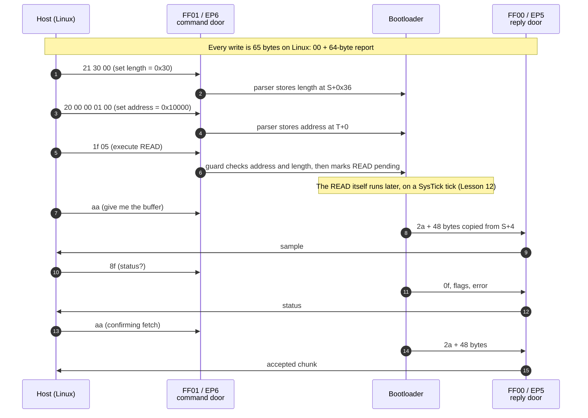

# Lesson 11 — The secret door: the bootloader

> **In one sentence:** The keyboard has a hidden service mode (USB PID `1b7f`) that can read its own application flash in 48-byte pieces, and this lesson shows how the door into that mode was found, opened exactly once on purpose, and spoken to safely.
>
> **You will learn:**
> - why a keyboard needs a separate bootloader mode at all, and why the investigation could get in without risking a brick
> - the one reset-only request that moves the keyboard from PID `1b7e` to PID `1b7f`, and the RAM flag `0x20000ffc = 0x73207320` that makes it work
> - how bootloader messages are framed: query versus action, set address, set length, execute READ, status, and read-back
> - the address guard that limits USB READ to `0x10000..0x7bfff`, in chunks of at most `0x30` bytes
> - the "split channel" surprise: commands go in one door (FF01) and answers come out of another (FF00)
>
> **Time:** ~60 minutes · **Prerequisites:** Lesson 4 (USB and HID), Lesson 10 (how it boots)

---

## 1. The story (kid version)

Picture a big library with one librarian. On a normal day she lends books, answers questions, and keeps the place running. That's the keyboard in **normal mode**: it sends your key presses and listens to Armoury Crate.

Behind the front desk there is a locked back room, the **repair room**. In there a different, much smaller helper can take the books apart and rebind them. The library can't lend books while the repair room is open, so the repair room only opens when someone asks for it with a special password. The password is a note she leaves on her own desk: "tomorrow morning, go to the repair room". Then she goes home (the keyboard resets). Next morning she reads the note, **throws it away**, and goes to the repair room. If you turn the power off and on, the note is already gone, so she goes back to normal work.

Inside the repair room there are two slots in the wall. You push written requests through the left slot ("please photocopy page 65,536"). The answers come back through the right slot. For a while we pushed requests through the left slot and waited for an answer at the **same** slot. Nothing came back. The answer had arrived at the other slot all along.

The repair helper can do three big jobs: rip out pages (erase), write new pages (program), and photocopy pages (read). We only ever asked for photocopies. The first two jobs are behind a second lock, and even then they refuse to touch the helper's own shelf.

### How the analogy maps to the real thing

| In the story | In the keyboard |
|---|---|
| The librarian on a normal day | The application firmware, USB PID `0x1b7e` |
| The repair room | The [bootloader](00-glossary.md#bootloader), USB PID `0x1b7f` |
| The note left on the desk | The magic value `0x73207320` written to RAM address `0x20000ffc` |
| Reading the note and throwing it away | Bootloader function `FUN_00002a44` compares the flag, then clears it |
| Left slot in the wall | Usage page `0xFF01`, interface 0, endpoint 6 (commands) |
| Right slot in the wall | Usage page `0xFF00`, interface 1, endpoint 5 (replies) |
| "Photocopy page N" | Set address, set length, then execute READ (opcode `0x05`) |
| Rip out / write pages | Erase and program: they exist, the ASUS updater uses them, and they were never sent |
| The helper's own shelf | Flash `[0x0, 0x10000)`, the bootloader's own region, which erase and program refuse to touch |

---

## 2. Why we needed this

By the end of Lesson 10 the investigation understood the boot chain from the files ASUS publishes. But there was a hole in the safety plan: **there was no copy of what was actually on this keyboard.**

- The keyboard reports firmware release `bcdDevice 0x0159`, version 1.59 (log 04). A [bcdDevice](00-glossary.md#bcddevice) is the release number a USB device announces about itself.
- The only full image in the repository was `dumps/vendor/M605_V01_00_58.bin`, version **1.00.58**. It is an ASUS reference file, older, and **not** a readback of this unit ([notes/step5-recovery-plan.md](../notes/step5-recovery-plan.md)).
- Any future experiment that writes firmware could go wrong. Without a verified copy of the installed 1.59 image, there would be no guaranteed way back.

So the next question was simple to ask and hard to answer: **can we read the installed firmware out over USB?**

The standard way would be [DFU](00-glossary.md#dfu) (Device Firmware Upgrade). The keyboard doesn't offer it: `dfu-util -l` found nothing (log 16). FINDINGS still opens with that answer: "No standard USB firmware-readback path is exposed in the keyboard's current operating mode."

That left the proprietary route. ASUS ships an updater, and an updater has to talk to *something* on the keyboard to write new firmware. Static analysis of the updater (log 34) found strings such as `Jump to Bootloader`, `Bootloader Version = V`, `Start Erase...` and `Programming Success! (no check checksum)`. It also found `Gaming Keyboard Bootloader2` inside the firmware container itself. **So a service mode existed.** The questions became:

1. How do you ask the keyboard to enter it without doing anything else?
2. Once inside, is there a READ command, and not only erase and program?
3. What exactly do the messages look like?

The alternative, recorded in the recovery plan, was **Approach B**: clip a 3.3 V SPI programmer onto the flash chip U5 and read it directly ([notes/step5-recovery-plan.md](../notes/step5-recovery-plan.md)). That's the gold standard, because it doesn't depend on the keyboard's own firmware. But it means opening the keyboard and handling hardware. Approach A, USB read-back through the bootloader, was "least invasive; recommended first". Approach B has still not been performed.

---

## 3. The real thing

We'll build this up in five layers:

1. what the bootloader is and why it exists
2. the entry request (the note on the desk)
3. the tool that sends it, and the owner-approved entry
4. how messages inside the bootloader are framed, and the READ guard
5. the split channel

### 3.1 Why a bootloader mode exists

A chip can't safely rewrite the program it is running right now. If the power dies halfway, the program is half old and half new, and nothing runs. So small devices keep a second, tiny program that is never rewritten during a normal update. On this keyboard that is the bootloader, which lives in flash `[0x0, 0x10000)`. `0x10000` is 65,536 bytes, which is 64 [KiB](00-glossary.md#kib--mib).

When the bootloader is in charge, the keyboard appears on USB as a **different device**:

| Mode | VID:PID | What the host sees |
|---|---|---|
| Normal (application) | `0b05:1b7e` | 5 HID interfaces (Lesson 4) |
| Bootloader | `0b05:1b7f` | 4 HID interfaces, product string "Gaming Keyboard Bootloader" |

[VID and PID](00-glossary.md#pid--vid) are the two numbers that identify a USB device. `0x0b05` is ASUS. Changing the PID means the keyboard has literally become a different USB device for a while.

This is what `lsusb` showed right after the live entry (log 88, **observed**):

```text
Bus 006 Device 008: ID 0b05:1b7f ASUSTek Computer, Inc.
Gaming Keyboard Bootloader
bcdUSB 2.00
bcdDevice 1.05
...
bNumInterfaces 4
negotiated speed 480 Mbps
```

Notice `bcdDevice 1.05`. The bootloader reports its own release number, not the application's 1.59.

A small detail worth noticing: the static string in the ASUS container is `Gaming Keyboard Bootloader2` (log 34), while the live product string printed by `lsusb` was `Gaming Keyboard Bootloader` (log 88). The course reports both as recorded. Neither lesson depends on the difference.

#### What the bootloader can do

Log 81 decompiled the bootloader's service loop and found three flash operations. Here they are **at the level this course covers**:

| Operation | Execute opcode | Status in this project |
|---|---|---|
| **READ** flash into a reply buffer | `0x05` | Used. Exactly the read path was exercised (logs 91–92). |
| **ERASE** | exists | Never sent. |
| **PROGRAM** | exists | Never sent. |

An [opcode](00-glossary.md#opcode) is the byte that says which command this is.

Two facts about erase and program matter for safety, and the course stops there on purpose:

- **They sit behind an unlock.** The bootloader keeps an "unlocked" flag. Erase and program refuse to run unless an unlock request has been sent first. READ needs no unlock.
- **They sit behind an address guard.** Both handlers require `0xffff < addr < 0x7c000`. That means the bootloader's own region `[0x0, 0x10000)` "is therefore **not** erasable or programmable through these commands" (FINDINGS, "Bootloader write/erase/program protocol"). The helper won't rip out its own shelf.

The ASUS updater's own flow matches: jump to bootloader, re-enumerate as `1b7f`, read the bootloader version, erase page by page, program, read a checksum (log 34, cross-checked in log 81). FINDINGS is explicit: this "maps the write protocol **as statically recovered**; **it does not authorise sending any of these commands**, and none has been sent."

> The exact byte framing of erase, program and unlock is reference material in [FINDINGS.md](../FINDINGS.md), sections "Bootloader write/erase/program protocol" and "Bootloader vendor-HID wire framing (READ path)". This course doesn't repeat it. Everything below is about **reading**.

### 3.2 The note on the desk: the reset-only entry request

How does a running keyboard get into bootloader mode? Log 87 answered that offline, from three independent directions.

#### The application side

Somewhere in the keyboard application (Candidate B), function `FUN_180160d8` receives a 64-byte USB buffer. If the first seven bytes are exactly

```text
7b aa 41 53 55 53 aa
```

it does this (decompiled, log 87):

```c
*(uint32_t *)0x20000ffc = 0x73207320;   // leave the note in RAM
*(uint32_t *)0x40022000 |= 0x8000;
delay(100);
reset();
```

Line by line:

1. `0x20000ffc` is an address in [RAM](00-glossary.md#ram). The code stores the 32-bit value `0x73207320` there. RAM survives a *reset* (the chip restarting) as long as the power stays on, so the value is still there when the bootloader starts.
2. It sets bit `0x8000` in a register at `0x40022000`. (Log 85 lists `0x40022000` as the flash-controller pointer. What this one bit does is not explained in the logs, so the course doesn't guess.)
3. It waits a little.
4. It resets the chip.

Look at those seven bytes as text. `0x41 0x53 0x55 0x53` are the ASCII codes for `A S U S`. The other three bytes, `7b aa ... aa`, frame them. It's a password with a signature in the middle.

#### The bootloader side

When the bootloader starts, `FUN_00002a44` checks for the note. This is the decompiled output saved in log 82:

```c
bool FUN_00002a44(void)
{
  int *piVar1;
  bool bVar2;

  piVar1 = DAT_00002a60;
  bVar2 = *DAT_00002a60 == DAT_00002a64;
  if (bVar2) {
    *DAT_00002a60 = 0;
    *piVar1 = 0;
  }
  return bVar2;
}
```

Log 85 resolved the two literal-pool constants: `DAT_00002a60 = 0x20000ffc` and `DAT_00002a64 = 0x73207320`. (A [literal pool](00-glossary.md#literal-pool) is where ARM code keeps constants next to a function.) So the function reads:

- "Is the word at `0x20000ffc` equal to `0x73207320`?"
- "If yes, **write zero there**, and report yes."

That's the "throw the note away" step. **The flag is one-shot.** The bootloader clears it the moment it sees it. The next reset, or any power cycle, finds zero and boots the application normally. FINDINGS: "if set, it stays in service mode and clears the flag."

You can see the one-shot behaviour in the live record. Between two sessions in log 91, the passive preflight found: "The keyboard had automatically returned to normal mode." Re-entry needed another request, and another approval.

#### The updater side

The official updater builds the same bytes independently. In `peripheral_fwu_pro.exe`, the "Jump to Bootloader" block zero-fills a buffer, then `FUN_004054e0` with selector 4 in the configured `m` mode writes exactly `7b aa 41 53 55 53 aa` into it. "All remaining bytes retain the zero fill. This independently matches the Candidate B receiver." (log 87)

Three sources, one answer. That's the kind of agreement this project wanted before sending anything.

#### Why this request is safe

- **It writes RAM, not flash.** No firmware byte changes.
- **The flag erases itself.** It can't trap the keyboard in bootloader mode forever.
- **A power cycle is a way out.** The recovery plan says so directly: entering bootloader mode is "Reversible: a power-cycle re-verifies and boots the intact app" ([notes/step5-recovery-plan.md](../notes/step5-recovery-plan.md)).
- **The bootloader can't damage itself over USB.** Its region is outside the erase/program address guard (section 3.1).
- **It is different from a plain reset.** There's a separate application command, `0xb0` followed by `"reset"`, that reboots *without* writing the flag (log 87). The tool uses the flag request, because a plain reset would just come back to normal mode.

The recovery plan still called it what it is: "Entering bootloader mode is a real command and a state change (low risk, but it *is* the first control transfer sent to the device)." Low risk isn't zero risk, so it needed the owner's yes.

#### From 64 bytes to 65 bytes on Linux

The application's interface 1 declares a 64-byte input, a 64-byte output, and **no Report ID** (log 87). A HID [report](00-glossary.md#report) normally starts with a Report ID byte that says which kind of report it is. This interface doesn't use one.

On Linux, writing to a [hidraw](00-glossary.md#hidraw) node still expects a first byte for the report number. For an interface with no Report ID, that byte is `00`. Log 87 proved the Windows updater does the same thing: `HidInterruptHandle.dll` allocates `payload_length + 1`, puts the report ID in byte 0, and copies the payload after it. So the exact Linux write is:

```text
00 | 7b aa 41 53 55 53 aa | 57 zero bytes      = 65 bytes
```

`1 + 7 + 57 = 65`. Its [SHA-256](00-glossary.md#sha-256) fingerprint is recorded as `de6cfe16cc4639b2593bdfe86dade88e4e282a9ad6552b5684fbd35ef50506d8`. You'll recompute it yourself in section 6.

### 3.3 The tool, and the day the door was opened

#### `tool/enter_bootloader.py`

The tool is small on purpose. Its docstring says:

> Default mode is a dry run and never opens /dev/hidraw\*. Live mode requires both --run and --acknowledge-reset.

A [dry run](00-glossary.md#dry-run) shows what the tool *would* send without sending anything. Here is what the tool does, according to log 87:

| Safety property | What it means |
|---|---|
| Dry run by default | With no flags, it prints the frame and its hash and exits. |
| **Two** live flags | `--run` alone is refused before any device is selected. You need `--run --acknowledge-reset`. |
| Validates exactly one node | It must be `0b05:1b7e`, usage page `FF00`, 64-byte IN and OUT, no Report ID. |
| Refuses if already in bootloader | If PID `1b7f` is present, it stops. |
| Exactly one allowlisted frame | The 65 bytes above and nothing else. "It contains no generic command builder and no unlock/erase/program/update path." |
| Sends once, no retry | Then closes the node and only *watches* sysfs for PID `1b7f`. |

Two constants at the top of the file carry the whole payload:

```python
PAYLOAD = bytes.fromhex("7b aa 41 53 55 53 aa") + bytes(REPORT_LEN - 7)
HIDRAW_WRITE = b"\x00" + PAYLOAD  # report-number placeholder + payload
```

`REPORT_LEN` is 64, so `bytes(64 - 7)` is 57 zero bytes.

#### The live entry (log 88), **observed**

Log 87 ended with this: "The live transition has not yet been attempted. It remains a real reset/state change and requires explicit informed approval after this evidence is presented."

Log 88 records the approval word for word:

```text
The owner explicitly replied:

  Yes, send the one reset-only bootloader-entry report.
```

Then one command, one write:

```text
python3 tool/enter_bootloader.py --run --acknowledge-reset

payload_len=64
payload=7b aa 41 53 55 53 aa 00 00 ... 00
hidraw_write_len=65
hidraw_write_sha256=de6cfe16cc4639b2593bdfe86dade88e4e282a9ad6552b5684fbd35ef50506d8
validated_node=/dev/hidraw7
action=one reset-only hidraw write; no retry
report_sent=yes
RESULT: bootloader PID 0b05:1b7f observed
```

The keyboard became `0b05:1b7f`. Log 88's verdict: "Live bootloader entry is VALIDATED." It also counted exactly what had and hadn't happened: "Exactly one device-facing report was transmitted in this phase... No bootloader report has been sent."

Here are the bootloader-mode interfaces it recorded:

| Interface | Endpoints | hidraw then | Usage page |
|---|---|---|---|
| 0 | `0x81` IN, `0x06` OUT | `/dev/hidraw6` | `FF01` (vendor) |
| 1 | `0x85` IN, `0x0d` OUT | `/dev/hidraw7` | `FF00` (vendor) |
| 2 | `0x8c` IN | `/dev/hidraw8` | boot mouse |
| 3 | `0x8e` IN | `/dev/hidraw9` | keyboard |

Remember from Lesson 4: an [endpoint](00-glossary.md#endpoint) number with the top bit set (`0x80`) is IN, device to host. `0x85` is endpoint 5 IN. `0x06` is endpoint 6 OUT. Keep those two in mind for section 3.5.

One more observation: the recreated nodes were `crw------- root root`, readable only by root. The assistant made no permission change. Later phases needed the owner to add narrow ACLs by hand, and those ACLs **vanished on every re-enumeration**, because the kernel recreates the device nodes (log 91).

### 3.4 Speaking bootloader: the framing of the read side

Now we're inside. How do you ask for a photocopy?

#### One byte decides: question or action?

Every bootloader message is a 64-byte report. The vendor-HID router `FUN_0000bd40` reads the first byte and decides what kind of message it is. Log 82 saved this decompile:

```c
void FUN_0000bd40(undefined4 param_1)
{
  undefined4 local_4c;
  byte local_48;
  undefined1 auStack_47 [63];

  local_4c = 0;
  FUN_0000aff0(&local_48,&local_4c,param_1,0);
  if ((local_48 & 0x80) == 0) {
    FUN_0000380c(local_48 & 0x7f,auStack_47);
  }
  else {
    FUN_00003740(local_48 & 0x7f);
  }
  return;
}
```

Reading it slowly:

- `local_48` is `report[0]`, the first byte. `auStack_47` is the other 63 bytes.
- `local_48 & 0x80` tests the **top bit**. `0x80` is binary `1000 0000`.
- Top bit **clear**: it's an **action** (OUT). Send the low 7 bits and the payload to the parser `FUN_0000380c`.
- Top bit **set**: it's a **query** (IN). Send the low 7 bits to the responder `FUN_00003740`, which will answer.

So a query code like `0x8f` is `0x80 + 0x0f`: "question number `0x0f`".

#### The read-side messages

These are the only messages the backup tools can build:

| `report[0]` | Kind | Payload | Effect |
|---|---|---|---|
| `0x20` | action | address, 4 bytes, [little-endian](00-glossary.md#little-endian) | set the target address |
| `0x21` | action | length, 2 bytes, little-endian | set the length |
| `0x1f` | action | one opcode byte: `0x05` | execute READ |
| `0x8f` | query | none | "what's your status?" |
| `0xaa` | query | none | "give me the read buffer" |

(FINDINGS lists more action codes, including unlock, load-data and reset. They're outside this course's scope.)

Let's decode a real one. The backup tool's dry run prints this set-address report for address `0x10000`:

```text
set_addr     20 00 00 01 00 00 00 00 ...
```

- `20` = set address.
- `00 00 01 00` = the address, **little-endian**, meaning least significant byte first. Read it backwards: `00 01 00 00`, which is `0x00010000`. That's `0x10000` = 65,536, the start of the application region.

And the length:

```text
set_len      21 30 00 00 00 00 00 00 ...
```

- `21` = set length.
- `30 00` = `0x0030` = 48.

#### How the replies look

The responder `FUN_00003740` writes `resp[0] = query & 0x7f`. So:

- query `0x8f` is answered by `0x0f`
- query `0xaa` is answered by `0x2a`

This is the listing for the two replies we care about, saved in log 85 (section I). A [listing](00-glossary.md#listing) is the raw instructions, which is more trustworthy than decompiled C:

```text
000037b8  ldr r0,[0x00003808]        ; r0 = S (the state block)
000037ba  ldrb.w r0,[r0,#0x38]       ; load flags byte S+0x38
000037be  strb.w r0,[sp,#0x1]        ; resp[1] = flags
000037c2  ldr r0,[0x00003808]
000037c4  ldrb.w r0,[r0,#0x35]       ; load error byte S+0x35
000037c8  strb.w r0,[sp,#0x2]        ; resp[2] = error
...
000037e8  ldr r0,[0x00003808]        ; r0 = S
000037ea  ldrh r2,[r0,#0x36]         ; r2 = length (S+0x36)
000037ec  adds r1,r0,#0x4            ; r1 = S+4, the read buffer
000037ee  add.w r0,sp,#0x1           ; r0 = &resp[1]
000037f2  bl 0x00000512              ; memcpy(resp+1, S+4, length)
...
000037fc  movs r1,#0x40              ; 0x40 = 64 bytes
000037fe  mov r0,sp
00003800  bl 0x00004f7c              ; send the 64-byte reply
```

The comments are this course's reading of the lines. Put together:

**Status reply (`0x0f`)**

| Byte | Contents |
|---|---|
| `resp[0]` | `0x0f` |
| `resp[1]` | flags from `S+0x38`: bit 0 = erase/program busy, bit 1 = READ busy, bit 7 = unlocked |
| `resp[2]` | error from `S+0x35`: `1` address out of range, `2` not unlocked, `3` bad length |

**Read-back reply (`0x2a`)**

| Byte | Contents |
|---|---|
| `resp[0]` | `0x2a` |
| `resp[1 .. 1+length]` | the read buffer at `S+4`, copied for the set length |

That's why the tool's `fetch()` takes `resp[1:1 + length]`. It skips the **response code**. FINDINGS stresses that this is "a protocol field, not a hidraw report-ID prefix". It's easy to confuse the two, because both are "one byte at the front".

(`S` is the bootloader's state block in RAM, at `0x18012a8c`. Lesson 12 draws the whole layout.)

#### The READ address guard

Can you READ anything you like? No. The execute parser checks the address and length **before** it queues the READ. Here's the part of the listing that handles execute-READ, from log 85 section H:

```text
00003950  cmp.w r0,#0x7c000          ; address >= 0x7c000 ?
00003954  bcs 0x00003984             ;   yes -> error 1
00003956  ldr r0,[0x00003a68]
00003958  ldrh r0,[r0,#0x36]         ; length
0000395a  cbz r0,0x00003964          ; length == 0 ?  -> error 3
0000395c  ldr r0,[0x00003a68]
0000395e  ldrh r0,[r0,#0x36]
00003960  cmp r0,#0x30
00003962  ble 0x0000396e             ; length <= 0x30 -> accept
00003964  movs r1,#0x3
00003966  ldr r0,[0x00003a68]
00003968  strb.w r1,[r0,#0x35]       ; error = 3 (bad length)
0000396c  b 0x0000398c
0000396e  ldrb r1,[r4,#0x0]
00003970  ldr r0,[0x00003a68]
00003972  strb.w r1,[r0,#0x34]       ; pending = opcode
00003976  movs r1,#0x0
00003978  strb.w r1,[r0,#0x35]       ; error = 0
0000397c  movs r0,#0x1
0000397e  ldr r1,[0x00003a78]
00003980  str r0,[r1,#0x4]           ; raise the "flash work requested" flag
00003982  b 0x0000398c
00003984  movs r1,#0x1
00003986  ldr r0,[0x00003a68]
00003988  strb.w r1,[r0,#0x35]       ; error = 1 (address out of range)
```

The excerpt starts after the lower-bound test. FINDINGS gives the whole rule: for read, the execute trigger requires

- `0x10000 <= addr <= 0x7bfff`, and
- `0 < length <= 0x30`.

So **USB READ covers only the application region `[0x10000, 0x7c000)`**, in chunks of at most 48 bytes. It can't read the bootloader's own 64 KiB. That's why the backup in Lesson 12 starts at `0x10000` and why its filename says `app_0x10000_0x7bfff`.

Notice one more thing in the listing: an accepted execute **doesn't read flash**. It only writes a pending byte (`S+0x34`) and raises a flag (`W+4`). The actual READ happens later, somewhere else. That single fact is the seed of the whole of Lesson 12.

#### Why the error byte can be trusted

The error byte `S+0x35` is written by this same parser, in the same interrupt that consumed the execute report. So if you read status afterwards, its error byte tells you the truth about **that** execute (log 85 section 6; FINDINGS "What closes it"). The tool aborts on any nonzero error.

#### A picture of one READ exchange



The order of steps 7–15 (sample, then status, then a confirming fetch) isn't decoration. Lesson 12 explains why this order, and only this order, is provably correct.

### 3.5 The split channel

#### What was believed

Log 82 found the `FF01` report descriptor inside the bootloader and concluded that one `FF01` hidraw node carried **both** directions: commands out and replies back. It was a reasonable guess, because most simple vendor channels work that way.

#### What happened

After the entry in log 88, the owner changed the `FF01` node's ACL by hand and approved a minimal four-report probe. The tool at the time opened `/dev/hidraw6` (FF01) for both writing and reading. Log 89 records the result:

```text
python3 tool/probe_bootloader.py --run --acknowledge-volatile-length

validated_node=/dev/hidraw6
action=4 exact reports; 3 queries + volatile set-length; no flash access
ABORT: no response report within 2s
```

**Timeout.** Because the tool's guard advances only after a successful write, the timeout proves it wrote exactly one report, the `0x8f` status query, and stopped. No set-length, no buffer query, no address, no execute.

#### Why it timed out

Log 89 went back to the bootloader's instructions and traced where replies are **sent**:

- `FUN_0000bd40` (the router) receives on **OUT channel 0**.
- `FUN_00004f7c` sends replies on **IN channel 1**.
- `FUN_0000a5c0` initialises IN channels in the order EP1, EP5, EPC, EPE, and OUT channels in the order EP6, EPD, EPF.
- The handler table at `0x00006bf8` holds four IN handlers followed by three OUT handlers, matching those channel indices.

Counting from zero:

```text
IN  channels:  0 -> EP1    1 -> EP5    2 -> EPC    3 -> EPE
OUT channels:  0 -> EP6    1 -> EPD    2 -> EPF

command write : OUT channel 0 -> EP6 -> interface 0 -> usage page FF01
response read : IN  channel 1 -> EP5 -> interface 1 -> usage page FF00
```

Compare that with the endpoint table in section 3.3. Interface 0 has `0x06` OUT. Interface 1 has `0x85` IN. **Commands go in through FF01; answers come out through FF00.** The first probe had been listening at the wrong slot. As log 89 puts it: "The timeout is evidence against single-node routing, not evidence that the bootloader ignored 0x8f."

Log 89 also cross-checked this. It reconstructed the bootloader's decompressed RAM and found both report descriptors, `FF01` at RAM `0x18010068` and `FF00` at RAM `0x180101a8`, matching the live ones. But it's explicit about which evidence is decisive: "The conclusion does not depend on proximity between a descriptor and protocol code; the endpoint/channel instructions above are decisive."

#### The fix

Log 89 changed the host tools:

- `backup_firmware.py` now selects **both** usage pages and refuses if they resolve to the same node.
- `SplitHidrawTransport` opens FF00 read-only **first**, then FF01 write-only. (Log 89 records the order without giving a reason. The natural reading is "be listening before you speak", but that's this course's interpretation.)
- All commands go only to FF01. All reads come only from FF00.
- `probe_bootloader.py` reuses the same selector and transport. Its four-report allowlist didn't change.

#### The corrected probe (log 90), **observed**

The owner was shown the exact four reports and answered "yes". The authorisation "explicitly excluded address, execute-READ, unlock, erase, program, reset, and SPI commands." The raw output:

```text
validated_command_node=/dev/hidraw6 usage_page=0xff01
validated_response_node=/dev/hidraw7 usage_page=0xff00
routing=write FF01/EP6; read FF00/EP5
action=4 exact reports; 3 queries + volatile set-length; no flash access
status_before=0f 00 00 00 00 ... 00
buffer_reply=2a 00 00 00 00 ... 00
status_after=0f 00 00 00 00 ... 00
RESULT=PASS locked=true idle=true error=0 zero_buffer_48=true
FLASH_ACCESS=none
```

What this confirmed, live, for the first time:

- Linux's `00`-prefixed write framing works for bootloader reports.
- Commands are accepted on FF01/EP6, and replies arrive on FF00/EP5.
- `0x8f` → `0x0f` and `0xaa` → `0x2a`, exactly as the static analysis predicted.
- Flags `0` and error `0`: locked, idle, no error.
- The reply buffer held **48 zero bytes**. That matters a lot in Lesson 12.

A small observation, for sharp eyes: in the saved log 90, the `status_before` line has 64 byte values, but the `buffer_reply` and `status_after` lines have **62**. You can count them yourself in exercise 6. A 64-byte report should show 64. This is probably a transcription loss when the output was copied into the log, not a device behaviour, and nothing in the project depends on it. But it's a good reminder to count things instead of trusting how they look.

#### Evidence levels in this lesson

| Claim | Level |
|---|---|
| The entry request, the RAM flag, and the flag being cleared | Statically recovered from three sources (log 87); entry **observed** live (log 88) |
| The router's query/action split and the reply framing | Statically recovered (log 82); **observed** live (log 90) |
| The READ address and length guard | Statically recovered (log 85 listing, FINDINGS) |
| Commands on FF01/EP6, replies on FF00/EP5 | Instruction-level (log 89); **observed** live (log 90) |
| The router runs in USB-interrupt context | **Strong inference** (log 85): "The one unclosed link is the indirect dispatch inside the un-decompiled ISR body" |
| Erase/program require unlock and are guarded to `0xffff < addr < 0x7c000` | Statically recovered (log 81, FINDINGS); **never exercised** |

---

## 4. Decisions and why

| Decision | Why | Alternative rejected | Evidence |
|---|---|---|---|
| Try USB read-back (Approach A) before a hardware SPI read (Approach B) | Least invasive, and no need to open the keyboard | Clip onto U5 first. Still the gold standard, and still not done. | [step5-recovery-plan](../notes/step5-recovery-plan.md) |
| Use the exact updater entry frame, and nothing else | Three independent sources agree on its bytes | A generic "send any report" tool | log 87 |
| Use the flag request, not the plain `0xb0 "reset"` | Only the flag request reaches service mode | Plain reboot, which just returns to normal mode | log 87 |
| Dry run by default, plus two live flags | A single typo can't send anything | One `--run` flag | logs 87, 88 |
| Send once, no retry | A retry loop can repeat a state change you didn't intend | Retry until `1b7f` appears | log 87 |
| Owner approval for every live step | Every device action is a separate decision | Approving "the backup" as one block | logs 88, 90, 91, 92 |
| First bootloader contact is four reports with no address and no execute | Validate the framing before any flash access | Going straight to a READ | logs 89, 90 |
| Never build unlock, erase or program in the backup tools | A tool that can't build them can't send them by mistake | Adding them "for later" | logs 83–86 |
| Treat the timeout as a routing clue, not "the bootloader ignores us" | The instructions showed two channels | Retrying the same node | log 89 |
| Open FF00 read-only, FF01 write-only, as distinct file descriptors | Each direction uses the node the firmware actually routes it to; tests prove writes and reads use different descriptors | One read/write node | log 89 |

---

## 5. What went wrong, and how it was caught

### Mistake 1: "FF01 carries both directions" (log 82)

- **Believed:** the `FF01` descriptor was the whole channel, so one hidraw node would do.
- **True:** commands go to FF01/EP6 and replies come from FF00/EP5.
- **Caught by:** a live probe that timed out after writing exactly one status query (log 89), followed by instruction-level tracing of the channel setup.
- **Lesson:** *a descriptor tells you a channel exists, not which direction your conversation uses.* Log 82's conclusion rested on "descriptor presence alone". Log 89 replaced it with the code that actually wires the endpoints. And because the tool advanced only after each successful write, the failure was **bounded**: one query sent, nothing else.

### Mistake 2: "The READ handler has no address guard"

- **Believed:** an earlier draft said the read handler had no address guard.
- **True:** the guard exists. It lives in the execute trigger, not in `FUN_00003b64`. Read is limited to `0x10000..0x7bfff` with length `1..0x30` (FINDINGS "Correction to an earlier note").
- **Lesson:** *look for a check where the decision is made, not only where the work is done.* The read function itself had no guard because the gate in front of it already did the job.

### Mistake 3: "Erase/program/unlock are unconstructable" (log 83, narrowed in log 84)

The first dry run (log 83) printed:

```text
RESULT dry_run_ok=True  (erase/program/unlock are unconstructable)
```

The correction audit (log 84) narrowed that. Today's dry run says:

```text
safety self-check: PASS (guard rejected every write/unlock/reset form; read reports built)
RESULT dry_run_ok=True guard_rejected_forbidden=True
```

- **Lesson:** *say exactly what the test showed.* The self-check showed that the guard rejected every forbidden form it tried. "Unconstructable" was a bigger claim than that.

### Mistake 4: a sandbox that couldn't see the devices (log 89)

During the passive revalidation, a sandboxed `ls` reported both hidraw nodes as absent. A direct enumeration showed they were there. "It was sandbox visibility, not device re-enumeration."

- **Lesson:** *"I don't see it" can be a fact about your window, not about the world.* Cross-check with a second method before you conclude that the device changed.

### Mistake 5 (not really a mistake): ACLs vanish

After each re-entry the new nodes were root-only again (logs 91, 92). The narrow ACLs the owner had added were gone, because the kernel recreates device nodes on re-enumeration. The investigation never changed permissions itself. It stopped and asked each time.

- **Lesson:** *every reset is a fresh start for permissions too.* Plan for it rather than being surprised.

---

## 6. Try it yourself

All of these are **offline**. None opens `/dev/hidraw*`. Run them from `keyboard/falchion-re/`.

### Exercise 1: rebuild the entry frame and check its fingerprint

```bash
python3 -c '
import hashlib
frame = bytes([0]) + bytes.fromhex("7b aa 41 53 55 53 aa") + bytes(57)
print(len(frame), hashlib.sha256(frame).hexdigest())'
```

Output:

```text
65 de6cfe16cc4639b2593bdfe86dade88e4e282a9ad6552b5684fbd35ef50506d8
```

That matches FINDINGS and logs 87, 88, 91 and 92. Change a single zero to `01` and run it again: the whole hash changes.

### Exercise 2: the entry tool's dry run

```bash
python3 tool/enter_bootloader.py
```

Output:

```text
payload_len=64
payload=7b aa 41 53 55 53 aa 00 00 00 00 00 00 00 00 00 00 00 00 00 00 00 00 00 00 00 00 00 00 00 00 00 00 00 00 00 00 00 00 00 00 00 00 00 00 00 00 00 00 00 00 00 00 00 00 00 00 00 00 00 00 00 00 00
hidraw_write_len=65
hidraw_write_sha256=de6cfe16cc4639b2593bdfe86dade88e4e282a9ad6552b5684fbd35ef50506d8
DRY RUN: no device enumerated or opened; no report sent
```

**Don't add `--run`.** With no flags, it can't touch the keyboard.

### Exercise 3: the four-report probe's dry run

```bash
python3 tool/probe_bootloader.py
```

Output:

```text
MODE=dry-run; no device enumerated or opened
ALLOWED_SEQUENCE
  1: status_before payload=8f 00 00 00 00 00 00 00 ... hidraw_len=65 sha256=0bc11406d998654e519fe04e4104d1ad93d784e74f5999c8ef5f2ea56ba40f20
  2: set_volatile_length payload=21 30 00 00 00 00 00 00 ... hidraw_len=65 sha256=9abb0e19aa8faffbcf0c3ea460e4a3d79b81940669c2a75f5e4f4ee2fafc7339
  3: query_zero_buffer payload=aa 00 00 00 00 00 00 00 ... hidraw_len=65 sha256=693532d476961dfaed884b60feda4f9f12b691bcfdcafa4f69c2f8c1db883e41
  4: status_after payload=8f 00 00 00 00 00 00 00 ... hidraw_len=65 sha256=0bc11406d998654e519fe04e4104d1ad93d784e74f5999c8ef5f2ea56ba40f20
FORBIDDEN=set-address, execute-READ, unlock, load-data, reset, erase, program
```

Notice that reports 1 and 4 have the same hash. They're the same `0x8f` query.

### Exercise 4: the one-block read's dry run

```bash
python3 tool/probe_flash_read.py
```

Output:

```text
MODE=dry-run; no device enumerated or opened
TARGET address=0x10000 length=0x30
  set_len    21 30 00 00 00 00 00 00 ...
  status     8f 00 00 00 00 00 00 00 ...
  data       aa 00 00 00 00 00 00 00 ...
  set_len    21 30 00 00 00 00 00 00 ...
  set_addr   20 00 00 01 00 00 00 00 ...
  exec_read  1f 05 00 00 00 00 00 00 ...
  data       aa 00 00 00 00 00 00 00 ...
  status     8f 00 00 00 00 00 00 00 ...
  data       aa 00 00 00 00 00 00 00 ...
EXECUTE_READ_COUNT=exactly_one
FORBIDDEN=other-address, unlock, erase, program, reset, update
```

Find `set_addr` and decode `00 00 01 00` as little-endian yourself.

### Exercise 5: run the offline tests

The tests use fake devices (`FakeBootloader`, `os.pipe`, temporary sysfs trees) and never open hidraw. They must run from `keyboard/falchion-re/` as modules:

```bash
python3 -m unittest tool.test_enter_bootloader tool.test_probe_bootloader 2>&1 | grep -E '^Ran|^OK|^FAILED'
```

Output:

```text
Ran 19 tests in 0.002s
OK
```

The test run also prints dry-run text from the tools. The `grep` hides it so you only see the summary.

### Exercise 6: count the bytes in log 90

```bash
for k in status_before buffer_reply status_after; do
  grep "^$k=" logs/90-live-split-channel-status-buffer-probe.txt | cut -d= -f2 | wc -w
done
```

Output:

```text
64
62
62
```

That's the small transcription observation from section 3.5.

### Exercise 7: find the entry password in the saved logs

```bash
grep -n 'report_sent\|RESULT: bootloader' logs/88-live-bootloader-entry-and-passive-validation.txt
```

Output:

```text
24:  report_sent=yes
25:  RESULT: bootloader PID 0b05:1b7f observed
```

---

## 7. Check your understanding

1. Why does the bootloader clear `0x20000ffc` as soon as it sees the magic value?
   <details><summary>Answer</summary>So the request is one-shot. The next reset, or a power cycle, finds zero and boots the application normally. The keyboard can't get stuck in service mode because of a stale note. `FUN_00002a44` compares the word with `0x73207320` and writes `0` when it matches (log 82). Log 91 shows the keyboard back in normal mode between sessions.</details>

2. The entry payload is 64 bytes. Why does the Linux write have 65?
   <details><summary>Answer</summary>Linux hidraw expects a report-number byte first. The interface declares no Report ID, so that byte is `00`. Log 87 showed the Windows updater's DLL does the same thing: it allocates `payload_length + 1` and puts the report ID in byte 0.</details>

3. A report starts with `0x8f`. Is it an action or a query, and what code comes back?
   <details><summary>Answer</summary>A query, because the top bit (`0x80`) is set. The responder answers with `0x8f & 0x7f = 0x0f`, followed by the flags byte and the error byte.</details>

4. Could you use the READ command to back up the bootloader region `[0x0, 0x10000)`?
   <details><summary>Answer</summary>No. The execute trigger only accepts READ for `0x10000 <= addr <= 0x7bfff` and length `1..0x30`. Anything else sets error `1` (address) or `3` (length). Only a hardware read of U5 (Approach B) could capture the bootloader.</details>

5. The first probe timed out. Why was that *good news* about the tool's design, and what did it teach about the protocol?
   <details><summary>Answer</summary>The tool advances only after a successful write, so the timeout proved it had sent exactly one harmless status query and nothing more. It also pointed at the real routing: replies come out on FF00/EP5, not on the FF01 node the tool was listening to (log 89).</details>

6. Why do erase and program never threaten the bootloader itself, even in principle?
   <details><summary>Answer</summary>Both handlers require `0xffff < addr < 0x7c000`, which excludes `[0x0, 0x10000)`. They also need a separate unlock. In this project they were never sent at all.</details>

---

## 8. Sources

- [../FINDINGS.md](../FINDINGS.md): "Current answer: can the installed firmware be backed up through USB?", "Bootloader write/erase/program protocol (log 81, cross-checked with log 34)", "Bootloader vendor-HID wire framing (READ path) — logs 82 and 89", "What closes it — corrected handshake, log 86" (force-bootloader entry and the READ guard correction)
- [../TIMELINE.md](../TIMELINE.md)
- [../logs/16-dfu-util-list-direct.txt](../logs/16-dfu-util-list-direct.txt)
- [../logs/34-asus-updater-and-container-static-analysis.txt](../logs/34-asus-updater-and-container-static-analysis.txt)
- [../logs/81-ghidra-bootloader-write-protocol.txt](../logs/81-ghidra-bootloader-write-protocol.txt)
- [../logs/82-ghidra-bootloader-framing.txt](../logs/82-ghidra-bootloader-framing.txt)
- [../logs/83-backup-tool-dryrun.txt](../logs/83-backup-tool-dryrun.txt)
- [../logs/84-correction-audit.txt](../logs/84-correction-audit.txt)
- [../logs/85-bootloader-read-scheduling-analysis.txt](../logs/85-bootloader-read-scheduling-analysis.txt) (sections 1, H, I)
- [../logs/87-bootloader-entry-recovery-and-preflight.txt](../logs/87-bootloader-entry-recovery-and-preflight.txt)
- [../logs/88-live-bootloader-entry-and-passive-validation.txt](../logs/88-live-bootloader-entry-and-passive-validation.txt)
- [../logs/89-bootloader-split-channel-correction.txt](../logs/89-bootloader-split-channel-correction.txt)
- [../logs/90-live-split-channel-status-buffer-probe.txt](../logs/90-live-split-channel-status-buffer-probe.txt)
- [../logs/91-one-block-read-validation.txt](../logs/91-one-block-read-validation.txt)
- [../notes/step5-recovery-plan.md](../notes/step5-recovery-plan.md)
- [../tool/enter_bootloader.py](../tool/enter_bootloader.py), [../tool/test_enter_bootloader.py](../tool/test_enter_bootloader.py)
- [../tool/probe_bootloader.py](../tool/probe_bootloader.py), [../tool/test_probe_bootloader.py](../tool/test_probe_bootloader.py)
- [../tool/probe_flash_read.py](../tool/probe_flash_read.py)
- [../tool/backup_firmware.py](../tool/backup_firmware.py) (`guard`, `build_report`, `fetch`, `SplitHidrawTransport`)

[← Previous](10-how-it-boots.md) · [Course home](README.md) · [Next →](12-the-race-and-the-backup.md)
