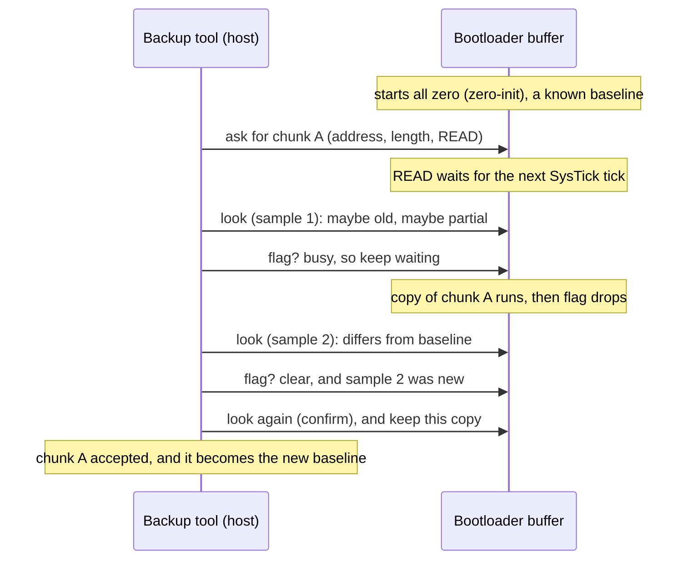

# Lesson 12 — The race condition and the backup

> **In one sentence:** The bootloader's READ happens *later* than the command that asks for it, so the investigation had to prove, step by step, a way of asking that can never return a half-finished answer, and only then read the whole application region three times over.
>
> **You will learn:**
> - what a race condition is, and why this bootloader has one (the RAM blocks T, S and W, the `0x30` buffer cap, and SysTick-gated dispatch)
> - the three wrong beliefs, in order: batched queries (log 84), busy-bit polling (log 85), and status-before-sample (log 86)
> - the zero-init bootstrap and the sample→status→confirm rule, with its proof
> - the leftover risks: a liveness bug, and "nothing else may talk to hidraw"
> - how the one-block read (log 91) and the three-pass backup (log 92) were done, and what the backup does **not** cover
>
> **Time:** ~75 minutes · **Prerequisites:** Lesson 11 (the bootloader door), Lesson 7 (ARM crash course)

---

## 1. The story (kid version)

You're waiting for a letter from your grandma. Every few minutes you run out and look in the mailbox.

One afternoon the carrier is still standing at the mailbox, halfway through putting in a stack of pages. You open the lid, grab what's inside, and run back in. You have **the first half of grandma's letter and the second half of yesterday's newspaper**. You didn't notice, because it's "different from what was there this morning". That's a **race condition**: the answer depends on who gets there first, you or the carrier.

How do you fix it without a clock and without asking the carrier anything clever? You use a rule:

1. Look in the mailbox and remember what you saw.
2. **Then** look down the street. Is the carrier's van gone?
3. If the van is gone *and* what you saw is different from this morning's stuff, go back and take out what's in the mailbox **now**. That second look is the real letter.

Why does this work? If the van was gone *after* your first look and something had changed, the carrier must have come and **finished** before you looked down the street. So the mailbox is complete now and will stay that way.

One more thing: you can only use the rule if you know what "this morning's stuff" was. On a brand-new mailbox, you know it's **empty**. That's your starting point.

### How the analogy maps to the real thing

| In the story | In the keyboard |
|---|---|
| The mailbox | The 48-byte READ response buffer at `S+4` in bootloader RAM |
| The carrier putting pages in | `FUN_00003b64` copying flash into `S+4` |
| The carrier starts on their own schedule | The READ only starts on a SysTick tick, not when you ask |
| The van still in the street | Status flags bit 1 (READ busy) set |
| Grabbing what's in the box | An `0xaa` query ("give me the buffer") |
| Looking down the street | A `0x8f` status query |
| Half letter, half newspaper | 24 new bytes followed by 24 old bytes (log 86) |
| The empty new mailbox | The zero-initialised buffer: 48 zero bytes after startup |
| A neighbour who also sends the carrier | Another program talking to the same hidraw node |

---

## 2. Why we needed this

By log 83 the investigation had a backup tool, `tool/backup_firmware.py`. It knew the READ framing from Lesson 11: set length, set address, execute READ, then ask for the buffer. On paper the full dump is simple (log 83):

```text
region 0x10000..0x7c000  chunks=9216 chunk_max=0x30  bytes=0x6c000
```

`0x6c000` bytes is 442,368 bytes. Divided into `0x30` = 48-byte chunks, that's exactly 9,216 chunks.

But one question kept coming back in each correction pass: **when you ask for the buffer, how do you know it holds the chunk you just requested, complete, and not the previous one or a mixture?**

This had to be answered *before* any live read, for two reasons:

- A wrong backup is worse than no backup. You'd trust it.
- "Three identical passes" don't save you from a systematic error. If the tool always returns the previous chunk, all three passes are wrong in exactly the same way. Log 84 names that risk: "three identical-but-wrong passes would have been accepted."

The alternative would have been to add a fixed delay ("wait 10 ms after each execute"). Log 85 rejected that: "A fixed delay is not recommended and is not used: the tick period is not a static constant in this image."

---

## 3. The real thing

### 3.1 What a race condition is, precisely

A [race condition](00-glossary.md#race-condition) is a bug whose outcome depends on which of two things happens first. Here the two things are:

- **the host** (Linux, our tool) sending the `0xaa` "give me the buffer" query, and
- **the bootloader's main loop** copying flash into that buffer.

These run in different "execution contexts". An [interrupt](00-glossary.md#interrupt-irq) is a hardware signal that makes the CPU pause what it's doing and run a handler. USB reports are handled when a USB interrupt arrives. The READ runs in the main loop. The main loop and the interrupt handler share memory but not a schedule.

### 3.2 The memory layout: T, S and W

Log 85 resolved the bootloader's protocol state by the **values in the literal pools**, not by guessing offsets. There are three RAM objects:

| Base | Contents |
|---|---|
| `T = 0x18011a8c` | `T+0`: 32-bit target address (set by `0x20`). `T+4..T+0x1003`: a `0x1000`-byte buffer used by programming. |
| `S = 0x18012a8c` (exactly `T + 0x1000`) | `S+4..S+0x33`: the **48-byte READ response buffer**. `S+0x34`: pending command. `S+0x35`: error. `S+0x36`: 16-bit length. `S+0x38`: flags. `S+0x39`: a scratch byte nothing reads. |
| `W = 0x18010bd4` | `W+0`: the SysTick tick flag. `W+4`: the "flash work requested" flag. |

The flags byte `S+0x38` holds: bit 0 = erase/program busy, bit 1 = **READ busy**, bit 7 = unlocked.

Log 85 cross-checked the layout three ways instead of assuming it. One example: the READ function takes its address from `*(u32 *)(S - 0x1000)`, which is `T+0`. That only makes sense if `S == T + 0x1000`.

As a picture:

```text
            T = 0x18011a8c                         S = 0x18012a8c
            |                                      |
  RAM:  ... [addr][ 0x1000-byte program buffer ... ][....][ 48-byte READ buffer ][34][35][36 37][38][39] ...
            T+0   T+4                     T+0x1003  S+0   S+4               S+0x33 pend err  len   flags
                                                ^ = S+3
```

#### Why the READ cap is `0x30`

`S+4 + 0x30 = S+0x34`. The buffer ends exactly where the pending byte begins. A READ longer than 48 bytes would overwrite the bootloader's own bookkeeping. **So the cap is the buffer size, not an arbitrary limit** (log 85).

#### The host can't write into the buffer

The only host command that writes into this area is the program-data loader, and its last reachable byte is `T+0x1003 == S+3`, one byte short of the buffer (log 85). So everything that appears at `S+4` was put there by the bootloader's READ. That fact is **F1** in the proof below.

### 3.3 SysTick-gated dispatch: the READ happens later

[SysTick](00-glossary.md#systick) is the ARM core's built-in timer. It fires an interrupt at a steady rate. Here is how an accepted execute turns into a real READ, using listings saved in log 85 section G.

**Step 1: the execute parser only raises a flag.** You saw this in Lesson 11:

```text
00003972  strb.w r1,[r0,#0x34]       ; S+0x34 = pending opcode
0000397c  movs r0,#0x1
0000397e  ldr r1,[0x00003a78]        ; r1 = W
00003980  str r0,[r1,#0x4]           ; W+4 = 1  ("flash work requested")
```

No flash access. Log 85's first fact: the parser "sets S+0x34 and W+4, and never W+0".

**Step 2: the SysTick handler is four instructions long.**

```text
000048d0  movs r0,#0x1
000048d2  ldr r1,[0x000048d8]        ; r1 = W = 0x18010bd4
000048d4  str r0,[r1,#0x0]           ; W+0 = 1  ("a tick happened")
000048d6  bx lr
000048d8  .word 0x18010bd4
```

That's all it does: it sets `W+0`. Log 85 checked every word in the image equal to `0x18010bd4`. This handler is **the only writer of `W+0`**.

**Step 3: the service loop runs its body only when `W+0` is set.**

```text
00003a7c  push {r4,lr}
00003a7e  b 0x00003aa8               ; jump straight to the W+0 test
00003a80  ldr r0,[0x00003ab4]        ; r0 = W
00003a82  ldr r0,[r0,#0x4]           ; W+4 set?
00003a84  cbz r0,0x00003a94          ;   no -> skip
00003a86  cpsid i                    ; interrupts off
00003a88  movs r0,#0x0
00003a8a  ldr r1,[0x00003ab4]
00003a8c  str r0,[r1,#0x4]           ; W+4 = 0
00003a8e  cpsie i                    ; interrupts on
00003a90  bl 0x00002db8              ; do the flash work
...
00003aa8  ldr r0,[0x00003ab4]
00003aaa  ldr r0,[r0,#0x0]           ; W+0 (the tick flag)
00003aac  cmp r0,#0x0
00003aae  bne 0x00003a80             ; only then run the body
00003ab0  pop {r4,pc}
```

The very first thing it does (`b 0x00003aa8`) is test the tick flag. So a set `W+4` on its own does nothing. The work waits for the next tick.

**Step 4: the dispatcher sets busy, reads, clears busy, clears pending.** This is the READ branch of `FUN_00002db8`:

```text
00002dfc  ldr r0,[0x00002e60]        ; r0 = S
00002dfe  ldrb.w r0,[r0,#0x38]
00002e02  bic r0,r0,#0x2
00002e06  adds r0,r0,#0x2
00002e08  ldr r1,[0x00002e60]
00002e0a  strb.w r0,[r1,#0x38]       ; flags bit 1 SET   (READ busy)
00002e0e  bl 0x00003b64              ; the READ: flash -> S+4
00002e12  ldr r0,[0x00002e60]
00002e14  ldrb.w r0,[r0,#0x38]
00002e18  bic r1,r0,#0x2
00002e1c  ldr r0,[0x00002e60]
00002e1e  strb.w r1,[r0,#0x38]       ; flags bit 1 CLEAR
00002e22  movs r1,#0x0
00002e24  strb.w r1,[r0,#0x34]       ; pending = 0
```

`bic r0,r0,#0x2` means "clear bit 1"; `adds r0,r0,#0x2` then sets it. The pair means "force bit 1 on". The two important addresses are `0x00002e0a` (busy set) and `0x00002e1e` (busy clear). **Every write to the buffer happens between them.** That's **F2** in the proof.

**Conclusion (log 85, as corrected by log 86):** an accepted execute waits for the next SysTick tick before the READ starts. The race is **proven possible**.

What the static analysis can and can't tell us about timing:

- `SYST_RVR` (the SysTick reload register) is the constant `0x278d0 - 1 = 161999`, so one tick is 162,000 core clock cycles.
- The **wall-clock** time of a tick is *not* statically determined, because `FUN_00004910` selects the core clock at runtime. The duration of one 48-byte flash transfer isn't recovered either.
- So **no claim is made about how often the race is hit**, only that it can happen.

### 3.4 Three wrong beliefs, in order

This is the heart of the lesson. Each wrong belief was more subtle than the one before.

#### Wrong belief 1 (log 84): "You can send all the requests, then read once"

The first version of the tool queued all five reports for a chunk and then did **one** `read()`. Log 84's correction audit, defect 1, marked FATAL:

> the per-chunk sequence queued all five reports and then performed a single read(), so the 0x8f status reply was consumed as if it were the 0xaa read data. Every chunk would have been wrong and no response was validated at all.

Replies come back in order. If you ask "status?" and "data?" and then read one reply, you get the **status** reply and treat it as data. The fix is in today's `query()`:

```python
def query(transport, sub, expect_code, timeout=RESP_TIMEOUT):
    """One immediate request-response exchange: send, then read its reply.

    Queries are never batched. Sending 0x8f and 0xaa back to back and then
    reading once would consume the status report as if it were read data.
    """
```

And `read_response()` checks that the reply code is the one expected (`0x0f` or `0x2a`) and that the reply is exactly 64 bytes, and raises otherwise.

- **Lesson:** *one question, one answer, checked.*

Log 84 also noted the race for the first time, as **unresolved**: "Nothing recovered proves the service loop has run before the host's first 0x8f."

#### Wrong belief 2 (log 85): "Wait until the busy bit clears, then the data is ready"

Log 84's tool polled status and waited for bit 1 (READ busy) to be clear. That sounds sensible. Log 85 proved it can't work, for a structural reason that needs no timing at all:

> a clear `state+0x38` bit 1 is also exactly what "not started yet" looks like, so **polling bit 1 cannot sequence a READ**.

Think about the timeline. Before the tick, the READ hasn't started: bit 1 is **clear**. During the READ: bit 1 is **set**. After: bit 1 is **clear** again. If you look and see "clear", you can't tell "before" from "after". And the `0x8f` responder never advances the service loop, so asking doesn't make the READ happen sooner. The following `0xaa` can therefore return the **previous** chunk's buffer.

Log 85 removed `wait_read_done()`. It also searched for anything else that would say "done": a counter, an address echo, a completion byte, a sequence number. It found none. The pending byte `S+0x34` would do the job, but "`S+0x34` is exposed by no query."

Log 85 also went too far in its language. It said the race "is the default outcome", that the busy window is "orders of magnitude" shorter than a host round trip, that it lasts "microseconds", and that every chunk after the first "would have" been stale. **Log 86 withdrew all of those.** Log 85 itself had recorded that neither the tick's wall-clock period nor the flash-transfer duration can be determined statically. The defensible result is only this: the race is **proven possible**.

- **Lesson:** *say exactly what you proved, and not a word more.*

#### Wrong belief 3 (log 85's own fix): "Check the status first, then take the data"

Log 85's replacement read the status **before** fetching the data, and accepted any data that looked different from the old buffer. It sounds careful. It isn't.

Go back to the mailbox story. You check the flag and it's down, so nobody is filling the box right now. Then you open the box. But in the moment between checking the flag and opening the box, the carrier could arrive and start filling it. You'd grab it half full: some new letters on top, old letters underneath.

That's exactly what can happen here. The bootloader's READ routine does **not** switch interrupts off while it copies (the erase and program routines do), so the reply to a data request can go out while the buffer is only partly rewritten. A status check taken *before* the fetch says nothing about what happened *during* the fetch.

**The independent reviewer reproduced it:** 24 new bytes followed by 24 old bytes, and the tool accepted them (log 86). The test model at the time couldn't have caught it. `FakeBootloader` replaced the whole buffer in one step, so a half-written buffer simply couldn't happen in the simulation. Log 86 rewrote the fake so it copies gradually and can be interrupted.

- **Lesson:** *a test can only catch a failure the model is able to express.*

### 3.5 The fix, and why it's a proof and not a hope

Log 86 closed the gap with two ideas. Both are written out in full in [FINDINGS.md, "What closes it — corrected handshake, log 86"](../FINDINGS.md). Here they are in words.

**Idea 1: know the starting state for certain.** The bootloader's startup code zero-fills the RAM area that holds the pending byte, the flags, the length, and the `0x30`-byte response buffer (the ARM "zero-init" step you met in [Lesson 10](10-how-it-boots.md)). So a freshly started bootloader has **no pending operation and an all-zero buffer**. The first "old" buffer isn't a guess, it's known. The tool refuses to begin unless the buffer reads back as `0x30` zero bytes.

**Idea 2: put the status check in the right place.** In the mailbox story, this becomes a three-step rule:

1. **Look** in the box (take a sample).
2. **Then** check the flag (status).
3. If the flag is down **and** what you saw differs from the old contents, look **again** and keep *that* second look.

Why does the order matter? The READ routine only writes the buffer while the busy flag is up. So a flag seen *down* is a moment when no copy is in progress. If the sample taken just before it already showed new content, the one copy for this chunk must already have started, and since the flag is now down, it has finished. From then on the buffer holds exactly the new chunk. The second look can't be half-written. **No timing assumption is needed**, only the order of events. That's what makes it a proof.



**Two leftovers, stated honestly (log 86):**

- **A liveness bug, not a correctness bug.** The tool re-sends the READ request if nothing seems to happen, because the bootloader ignores a new request while one is pending. At first it kept re-sending even after new content had appeared, and it could fall into step with the bootloader so it never saw the flag drop. That produced **refusals, never wrong answers**. It now stops re-sending once the content changes.
- **The one gap the protocol can't close.** If some *other* program queued a READ on the same device node, the bootloader would give no sign of it. The only defence is an operating rule: **nothing else may talk to the hidraw node during the dump.** Also, if a new chunk happens to be byte-identical to the previous one, "different from the baseline" can't be observed. The tool then re-bases through an earlier chunk whose content was proven different, and aborts if none exists yet.

### 3.6 From one block to the whole region (logs 91 and 92)

The rule was proved on paper first, then tested small, then used for real. Each live step needed the owner's separate approval.

**One block (log 91).** Exactly one 48-byte READ at `0x10000`. It came back as a complete `SN_FWIN` header. Bytes `0x00..0x2b` matched the vendor 1.00.58 file. The word at `0x2c` differed: `85 24 55 7d` on the keyboard versus `7a c1 75 5e` in the vendor image. That was the first hard evidence that the installed firmware's records differ from the vendor file.

**The whole application region (log 92).** Three separate, complete passes over `[0x10000, 0x7c000)` were **byte-identical**, each with SHA-256
`fc6128ab089e4fd712b172c54cd88b7f28476b55bdac688134e052281ded637b`.
The accepted file is 442,368 bytes (`0x6c000`):
[`dumps/device/ROG_Falchion_Ace_HFX_installed_bcdDevice_1.59_app_0x10000_0x7bfff.bin`](../dumps/device/ROG_Falchion_Ace_HFX_installed_bcdDevice_1.59_app_0x10000_0x7bfff.bin).
Both record checksums, the application word-sum, and all the applicable boot-structure checks passed. At the time of log 92 that was 12 checks. The analyzer now runs 14, because log 101 added two ([Lesson 10](10-how-it-boots.md)).

**What the backup is NOT (dumps/device/README.md):**

| Covered | Not covered |
|---|---|
| The application region `[0x10000, 0x7c000)` | The primary bootloader region `[0x0, 0x10000)`, which USB READ can't reach |
| The mirrored bootloader copy inside it at `[0x61000, 0x71000)` (Lesson 13) | The rest of the 4 MiB U5 flash chip |
| | Any storage inside the SNC73270 itself |

It's still the right backup for the risk that matters most. The bootloader's erase and program paths can only reach this same range ([Lesson 11](11-the-bootloader-door.md)), so anything a USB update could damage is inside what was saved.

---

## 4. Decisions and why

| Decision | Why | Alternative rejected | Evidence |
|---|---|---|---|
| One request, one answer, checked each time | Batched reads confused a status reply with data | Queue everything, then read once | log 84 |
| Stop using the busy bit to sequence reads | "Clear" means both "not started" and "finished" | Poll until bit 1 clears | log 85 |
| Start only from a known all-zero buffer | Zero-init makes the first baseline a fact | Assume the buffer is stale or unknown | log 86 |
| Sample → status → confirm | Proves completeness with no timing assumption | Status → sample (the reviewer's counterexample broke it) | log 86 |
| Don't over-read into the hidden pending byte | Every workable length breaks the flash engine or the length field | Read past `0x30` to see `S+0x34` | log 85 |
| Validate one block before the whole region | Smallest possible live test of the rule | Go straight to a full dump | log 91 |
| Three identical passes plus structural checks | One pass can't show it's repeatable | Accept a single pass | log 92 |

## 5. What went wrong, and how it was caught

| Believed | True | Caught by | Lesson |
|---|---|---|---|
| Queries can be batched | The status reply was consumed as data (fatal) | log 84 audit | one question, one answer |
| A clear busy bit means the data is ready | It also means "not started" | log 85 static proof | read the code, not the name |
| "The race is the default… microseconds" | Timing can't be determined statically, so it's only "proven possible" | log 86 | don't overclaim |
| Status-then-sample is safe | 24 new + 24 old bytes accepted | independent reviewer (log 86) | test the test |
| `FakeBootloader` models the device | It couldn't express a half-written buffer | log 86 | a model limits what tests can find |
| Log 83 showed a live refusal | Log 83 was a dry run only | log 84 | say exactly what ran |

## 6. Try it yourself

All offline. Run from `keyboard/falchion-re/`.

**1. Check the backup's fingerprint.** `SHA256SUMS` lists a bare filename, so run it from inside the folder:

```bash
cd dumps/device && sha256sum -c SHA256SUMS; cd ../..
```

```text
ROG_Falchion_Ace_HFX_installed_bcdDevice_1.59_app_0x10000_0x7bfff.bin: OK
```

**2. Re-check the backup's integrity yourself.**

```bash
python3 tool/analyze_candidate_integrity.py --base 0x10000 dumps/device/ROG_Falchion_Ace_HFX_installed_bcdDevice_1.59_app_0x10000_0x7bfff.bin | tail -8
python3 tool/analyze_boot_structures.py --base 0x10000 dumps/device/ROG_Falchion_Ace_HFX_installed_bcdDevice_1.59_app_0x10000_0x7bfff.bin | tail -5
```

```text
  bootloader: SKIP (region absent from this partial image)
  application: stored=0x2d7486db calc=0x2d7486db match=True
  PASS SN_FWIN magic
  PASS record[0] checksum
  PASS record[1] checksum
  PASS application word-sum

RESULT integrity_checks_ok=True
RESULT known_checks_ok=True checks_run=14 containers_skipped=1
UNRESOLVED Any ROM or first-stage condition ahead of the bootloader is unexamined.
…
LIMITATION Passing means the known container constraints are internally consistent. It does not prove an edited image boots.
```

The bootloader word-sum shows `SKIP` because the dump doesn't contain the primary bootloader region. Note `checks_run=14`.

**3. See the first difference log 91 found.** The dump starts at logical `0x10000`, so its file offset `0x2c` is logical `0x1002c`:

```bash
xxd -s 0x2c -l 4 dumps/device/ROG_Falchion_Ace_HFX_installed_bcdDevice_1.59_app_0x10000_0x7bfff.bin
xxd -s 0x1002c -l 4 dumps/vendor/M605_V01_00_58.bin
```

```text
0000002c: 8524 557d                                .$U}
0001002c: 7ac1 755e                                z.u^
```

**4. Run the offline test suite for the backup tools.** It uses `FakeBootloader` and never opens a device:

```bash
python3 -m unittest tool.test_backup_firmware tool.test_probe_flash_read 2>&1 | grep -E '^(Ran|OK|FAILED)'
```

```text
OK: 3 identical passes; wrote /tmp/tmpn2g_04wh/dump.bin
…
Ran 83 tests in 1.167s
OK
```

The `OK: 3 identical passes` lines come from simulated backups against `FakeBootloader`, written to temporary files. No device is involved.

**5. Read the proof in the original.** Open [FINDINGS.md](../FINDINGS.md) at "What closes it — corrected handshake, log 86" and match each sentence to the mailbox steps in section 3.5.

## 7. Check your understanding

1. Why can't "the busy bit is clear" tell you the READ has finished?
<details><summary>Answer</summary>Clear is also the state before the READ starts. Dispatch waits for a SysTick tick, so right after you ask, the bit is clear because nothing has begun yet (log 85).</details>

2. What was wrong with checking the status *before* taking the sample?
<details><summary>Answer</summary>A whole READ can start during the fetch, and the READ routine doesn't mask interrupts, so the reply can be half new and half old. A status taken before the fetch says nothing about what happened during it (log 86).</details>

3. Why is the zero-init step important to the proof?
<details><summary>Answer</summary>It makes the first baseline a known fact, an all-zero buffer with nothing pending, instead of an unknown (log 86).</details>

4. The backup matched three times. Name two things it still doesn't contain.
<details><summary>Answer</summary>The primary bootloader region [0x0, 0x10000), and the rest of the 4 MiB U5 flash (also any internal MCU storage).</details>

5. Why is an app-region-only backup still useful for recovery?
<details><summary>Answer</summary>The bootloader's erase and program paths can only reach [0x10000, 0x7c000), the same range that was saved.</details>

## 8. Sources

- [FINDINGS.md](../FINDINGS.md): "Bootloader READ scheduling — log 85", "What closes it — corrected handshake, log 86"
- [TIMELINE.md](../TIMELINE.md): "Bootloader READ scheduling resolved (log 85)", "Correction: the first fix was wrong too (log 86)", 2026-09-02 entries
- [logs/83-backup-tool-dryrun.txt](../logs/83-backup-tool-dryrun.txt), [84](../logs/84-correction-audit.txt), [85](../logs/85-bootloader-read-scheduling-analysis.txt), [86](../logs/86-bootloader-read-handshake-correction.txt), [91](../logs/91-one-block-read-validation.txt), [92](../logs/92-full-app-region-backup.txt)
- [dumps/device/README.md](../dumps/device/README.md), [dumps/device/SHA256SUMS](../dumps/device/SHA256SUMS)
- [notes/step5-recovery-plan.md](../notes/step5-recovery-plan.md)
- [tool/backup_firmware.py](../tool/backup_firmware.py), [tool/test_backup_firmware.py](../tool/test_backup_firmware.py), [tool/probe_flash_read.py](../tool/probe_flash_read.py)

[← Previous](11-the-bootloader-door.md) · [Course home](README.md) · [Next →](13-installed-vs-vendor.md)
