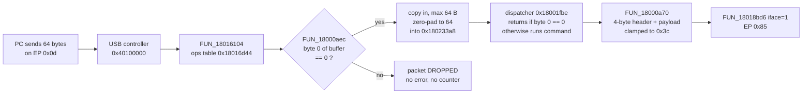

# Lesson 14 — Inside the firmware I: tasks and USB

> **In one sentence:** With a verified copy of the installed firmware in hand, the investigation mapped which hardware the code touches, found the code that no call graph could see, unpacked a compressed block that turned out to be the keyboard's whole USB identity, and traced how USB messages flow in and out.
>
> **You will learn:**
> - how to read the 80-slot vector table, and why a repeated "fill" value is not the end of it
> - what an MMIO census is, and why it gives a *lower bound*, not a complete list
> - why a call graph is blind to pointer tables and to RTOS tasks passed in registers
> - how the firmware's own LZ77 decompressor was translated and run offline, with a worked example you can do by hand
> - how the USB descriptors are stored, built and routed, including a mailbox that drops packets silently
> - how four rounds of correction (logs 131–134) took apart the first pointer-table result, and what each round teaches
>
> **Time:** ~90 minutes · **Prerequisites:** Lessons 4, 7, 8, 10, 13

---

## 1. The story (kid version)

Imagine a huge office building. You have a perfect photocopy of every page inside it (that's the backup from Lesson 12). Now you want to know **who works there and how the post gets delivered.**

First you look at the **doorbell panel** by the front door. It has 80 buttons. Some are wired to a real person's desk. Most are wired to the same "nobody home" desk. That panel is the *vector table*.

Next you try to find everyone by following the **phone directory**: "Alice calls Bob, Bob calls Carol." You find a few people, but most offices look empty. Why? Because in this building a lot of people are reached a different way. Some are listed on a **pinned notice board** ("in an emergency, call desk 26"). Others are simply **told verbally** by the manager on day one: "You, go sit at desk 499." Neither shows up in the phone directory. The directory is the *call graph*; the notice board is a *pointer table*; the verbal instruction is a task entry *passed in a register*.

In the basement there is a **vacuum-packed box**. Nobody had opened it, because at night the building unpacks it automatically. When you unpack it yourself, using the building's own instructions, you find the building's **letterhead**: its name, its address, its official ID numbers. That box is the *compressed descriptor region*.

Finally, the post room has a **single pigeonhole** for incoming letters. If a new letter arrives while the old one is still sitting there, the post clerk just throws the new one away. No note, no complaint. That's the *vendor channel mailbox*.

**How the analogy maps to the real thing**

| In the story | In the keyboard |
|---|---|
| Doorbell panel with 80 buttons | The vector table at entry-image `0x0..0x140`: 80 slots (log 100) |
| "Nobody home" desk | The fill value `0x000014df` in unused slots |
| Phone directory | Ghidra's call graph, walked from the vector-table roots |
| Pinned notice board | A table of function pointers in memory |
| Manager telling someone where to sit | An RTOS task entry passed to the create function in a register (log 106) |
| Vacuum-packed box | Scatter region 1: `0x400` compressed bytes unpacked to `0xb04` bytes at boot (log 105) |
| Letterhead in the box | The USB/HID descriptor set: VID `0x0b05`, PID `0x1b7e`, "ASUSTeK", "ROG FALCHION ACE HFX" |
| Post room | The USB device controller at `0x40100000` (log 107) |
| Single pigeonhole | The vendor RX buffer `0x180233a8`, one slot, byte 0 is the busy flag |

---

## 2. Why we needed this

By the end of [Lesson 13](13-installed-vs-vendor.md) the investigation had two things it could trust: a byte-exact, verified dump of the installed 1.59 firmware (log 92), and a function-by-function match between that dump and the vendor 1.00.58 file (logs 96, 98). What it did **not** have was a map of *how the running keyboard works*. Which hardware does the code poke? Which functions actually run? Where do USB messages go?

The plan called this **Phase 5**. It was split into subphases:

- **Log 100** was a first pass: decode the vector table and census every hardware access.
- **Phase 5A** (logs 104–106) attacked reachability: most of the application's functions had no known caller.
- **Phase 5B** (log 107) traced USB.

The alternative was to jump straight to the interesting parts: keys, magnets, lights. But without knowing *what calls what*, every later claim ("this function runs every tick", "this buffer is sent to the PC") would rest on guesswork. So the investigation built the map first.

One constraint shaped everything: **there is no SNC73270 reference manual in this repository.** The chip's vendor peripherals have no public names. So the rule from log 100 onward is: describe a hardware block only by *what the code does to it*, and use names only from the ARMv7-M architecture, which is the same on every Cortex-M3 (log 100).

---

## 3. The real thing

### 3.1 The vector table: 80 slots, one fill value

A [vector table](00-glossary.md#vector-table) is a list of 32-bit [words](00-glossary.md#word) at the very start of an ARM image. Word 0 is the initial [stack pointer](00-glossary.md#stack-pointer-sp). Word 1 is the [reset handler](00-glossary.md#reset-handler). Every word after that is the address of the code to run when a particular [interrupt](00-glossary.md#interrupt-irq) fires.

Here are the first 32 bytes of the installed entry image (Candidate A), read straight from the file:

```
00000000: 6861 0318 a914 0000 bf20 0000 af10 0000  ha....... ......
00000010: cf0f 0000 d314 0000 d514 0000 0000 0000  ................
```

Remember [little-endian](00-glossary.md#little-endian): the bytes `68 61 03 18` are the number `0x18036168`. Reading four bytes at a time:

| slot | bytes | value | meaning |
|---|---|---|---|
| 0 | `68 61 03 18` | `0x18036168` | initial SP, inside RAM |
| 1 | `a9 14 00 00` | `0x000014a9` | Reset. Bit 0 is set, which means [Thumb](00-glossary.md#thumb-2) code at `0x14a8` |
| 2 | `bf 20 00 00` | `0x000020bf` | NMI handler at `0x20be` |
| 3 | `af 10 00 00` | `0x000010af` | HardFault handler at `0x10ae` |
| 4 | `cf 0f 00 00` | `0x00000fcf` | MemManage at `0xfce` |
| 5 | `d3 14 00 00` | `0x000014d3` | BusFault at `0x14d2` |
| 6 | `d5 14 00 00` | `0x000014d5` | UsageFault at `0x14d4` |
| 7 | `00 00 00 00` | `0` | reserved by the architecture |

(Values from [notes/installed-hardware-interfaces.md](../notes/installed-hardware-interfaces.md).)

**How big is the table?** An ARMv7-M vector table has **no terminator**. There is no "end" marker. So the investigation bounded it by the first code address: the table runs from `0x0` to `0x140`. `0x140` = 320 bytes, and 320 ÷ 4 = **80 slots**: 16 core vectors plus 64 external interrupts (log 100).

Most external slots hold the same value, `0x000014df`. That repeated value is a **fill**: it marks a slot as unused. It does *not* end the table. The proof is the very last slot:

```
00000130: 0000 0000 0000 0000 0000 0000 d10a 0000  ................
```

At offset `0x13c` sits `d1 0a 00 00` = `0x00000ad1`, a Thumb pointer to a function at `0x0ad0` that nothing calls. That's exactly what a handler reached only through the vector table looks like. It's `IRQ63`, and it is live (log 100).

Counting the 80 words: 49 hold the fill value, 11 are zero, and the rest are real handlers. **Nine external interrupts are live** (log 100):

| IRQ | value | lives in |
|---|---|---|
| IRQ3 | `0x000014bf` | entry image |
| IRQ6 | `0x18016f6f` | application |
| IRQ31 | `0x18019f2d` | application |
| IRQ32 | `0x18019f37` | application |
| IRQ36 | `0x180106bf` | application |
| IRQ37 | `0x180106cb` | application |
| IRQ38 | `0x180000e5` | application |
| IRQ48 | `0x1801ac27` | application |
| IRQ63 | `0x00000ad1` | entry image |

Notice something strange: the table lives in the entry image, but seven of the handlers live in the application at `0x18xxxxxx`. Those addresses only become valid after the [scatter-load](00-glossary.md#scatter-load) copies the application into RAM ([Lesson 10](10-how-it-boots.md)). The entry image owns the doorbell panel; the application owns most of the desks.

**Evidence level.** The 80-slot extent and the live IRQ63 are **strongly inferred**, not observed. The tool says why: the bound falls on a 16 + 64 boundary, and the highest NVIC enable word the software touches covers IRQ32..IRQ63, but no document for this exact chip states the interrupt count. "A table of fewer than 64 external slots followed by unrelated data would look the same from the image alone" (tool output of `map_hardware_interfaces.py`; log 113).

### 3.2 The MMIO census: what the code does to hardware

[MMIO](00-glossary.md#mmio) means hardware registers that appear at memory addresses. Writing to `0xe000ed0c`, for example, talks to the ARM core's reset controller, not to memory.

A **census** is a count of every place the code reads or writes such an address. Log 100 built one with a Ghidra script, `FalchionPeripheralMap.java`, that records every load and store whose base register Ghidra's constant propagation could resolve.

Here's what the census found, checked as predicates rather than just asserted (log 100):

- Software enables **exactly IRQ6 and IRQ38** through the [NVIC](00-glossary.md#nvic) enable registers, and both hold real handlers in the table. Two independent parts of the image agree.
- The **NMI handler requests a system reset**: it writes [AIRCR](00-glossary.md#aircr) with `0x05fa0004`. `0x05fa` is the architectural "key", and the low bits ask for a reset.
- **A preemptive scheduler's mechanism is present**: SysTick writes `ICSR` `0x10000000` (PENDSVSET), and the PendSV vector is populated. *What* it schedules is not established.
- The **HardFault handler reads `CFSR`, `MMFAR` and `BFAR`**, the architectural fault registers, so it reports faults instead of just hanging.
- Two identical unnamed blocks at **`0x40008000` and `0x40009000`** are each written `0x5afa0000`, with `0x5afa55aa` at `+0xc`, on the reset path. That's a magic-key-protected register pair, duplicated. (Lesson 15 shows these are watchdogs, and how that conclusion was corrected.)
- Reset-path register `0x4002f004` is written `0x60021000`, which is exactly SN_FWIN record slot 1's address ([Lesson 9](09-checksums-and-trust.md)).
- The unnamed block at **`0x40100000`** is the one IRQ6 serves. Log 100 counted 19 registers and 126 accesses; the regenerated note now shows 20 registers and 139 accesses ([notes/installed-hardware-interfaces.md](../notes/installed-hardware-interfaces.md)). It is the application's main peripheral. Section 3.6 shows how it was finally named.

Three rules keep the census honest:

1. **Behaviour is separated from identity.** A block is described by what is done to it. With no manual, an address with no positive evidence is classified `unknown`. Log 102 corrected an early version that labelled every unknown space as `vendor-mmio`.
2. **Classification is per address, not per 1 MiB block.** That is what lets a single access at `0x18037224`, just past the proven RAM end `0x18036168`, show as `unknown` instead of RAM.
3. **The census is a lower bound.** An access is only counted when constant propagation resolved its base register. If the base arrives in a register from somewhere else, the access is invisible. Keep this rule in mind. In Lesson 15 it trips the investigation up badly.

Log 100 was explicit that it was a **first pass**: "Five of the plan's seven analysis areas are not covered and one is only partial." Nothing in it supported any claim about keys, magnets, lights or storage.

### 3.3 Reachability, and why the call graph is blind

A [function](00-glossary.md#function) is **reachable** if some chain of calls leads to it from a starting point we trust. The starting points ("roots") here are the vector-table entries. Log 100 walked the call graph breadth-first out of those roots.

First surprise: in a raw binary import, Ghidra doesn't disassemble a handler that nothing calls. So none of the handler addresses existed as functions, and every root failed. The fix was to **seed** both releases from their own vector tables. That grew the function set from 80 to 97 per entry image and from 293 to 530 per application (log 100).

Second surprise: even then, **only 51 of the application's 530 functions** had any context (log 104). Why so few?

Because a call graph only sees calls whose target is written in the instruction. ARM has two common ways to call something *without* that:

```
; A direct call: the graph sees it.
bl    0x18012fd0              ; target is part of the instruction

; An indirect call through a table: the graph does not.
ldr   r3, [r0, #0xc]          ; load a pointer out of a structure
blx   r3                      ; call whatever it points at
```

and

```
; A task entry passed in a register: the graph does not see it either.
ldr   r0, =0x00000499         ; the entry point is just a number in r0
bl    create_task             ; the RTOS will call r0 later, on its own
```

In both cases the target is **data**, not an instruction operand. Phase 5A was about finding that data.

#### Phase 5A, step 1: pointer tables (log 104)

`tool/find_pointer_tables.py` looked for runs of **at least three Thumb pointers at a constant stride**, each targeting an even address at or above the image's first code address. That "code floor" mattered: without it, ordinary structure words with bit 0 set produced targets like `0x00000004`, which the first cut of the tool duly reported (log 104).

It found five runs, in both releases:

| image | location | stride | entries |
|---|---|---|---|
| entry | `0x1404` | 16 | 8 |
| entry | `0x5680` | 24 | 3 |
| app | `0x18016d44` | 4 | 26 |
| app | `0x18017d08` | 4 | 6 |
| app | `0x18018ce8` | 4 | 12 |

Two things looked like strong evidence: 25 of the 44 application entries were already-known functions, and the vendor tables sat at exactly `-0x2c` from the installed ones, the same shift Phase 3 had measured another way. Seeding the targets took application reachability from **51 to 138 of 573** (log 104).

Hold on to that table. **Two of those five rows turned out not to be tables at all**, and in the end none of the five was accepted as a root. Section 3.7 tells that story.

### 3.4 The decompressed region: unpacking the vacuum-packed box

Phase 3 had found that Candidate A's scatter-load table has one region with a different handler, `__scatterload_decompress`: **flash `0x3f380` (`0x400` compressed bytes) → RAM `0x1801e380` (`0xb04` bytes)** (log 105). `0xb04` = 2,820 bytes that exist in **no dump**, because the chip only creates them in RAM at boot. Any pointer table in there was invisible.

#### The decoder is the firmware's own

The investigation didn't guess the compression format or borrow a generic library. It **translated the firmware's own handler**: the `0x5c` bytes at Candidate A program offset `0x17c..0x1d8`. Those bytes have SHA-256 `582c4804…6ae0` and are **byte-identical in both releases**. The tool refuses to run if the handler it finds hashes to anything else (log 105).

The handler, as recorded in the tool's docstring (from log 73), with `r0` = source, `r1` = destination, `r2` = length:

```
    add   r2,r1              ; r2 = end of output
    mov   r12,#0             ; the zero-fill byte
  token:
    ldrb  r3,[r0],#1         ; control byte
    ands  r4,r3,#7           ; literal field
    it eq / ldrb r4,[r0],#1  ;   0 means "take the next byte instead"
    asrs  r5,r3,#4           ; copy field
    it eq / ldrb r5,[r0],#1  ;   0 means "take the next byte instead"
    subs  r4,r4,#1           ; so N literals means N-1 bytes
    beq   +                  ;
    ldrb/strb loop           ; emit r4 literal bytes
    tst   r3,#8              ; bit 3 selects back-reference or zero fill
    ittt ne / ldrb r4        ;   set: distance byte follows,
       add r5,#2             ;        copy length is field+2,
       sub r4,r1,r4          ;        source is dst-distance
    else: strb r12 loop      ;   clear: emit `field` zero bytes
    cmp   r1,r2 / bcc token  ; until the output is full
```

This is a member of the [LZ77](00-glossary.md#lz77) family: a mix of plain **literal** bytes and [back-references](00-glossary.md#back-reference) ("copy what I wrote a moment ago"). Each token starts with one **control byte**, split into fields:

```
 bit:   7 6 5 4   3   2 1 0
       [ copy  ] [B] [ lit ]
         |        |     |
         |        |     +-- literal field (0 means: read the next byte instead)
         |        +-------- 1 = back-reference, 0 = zero fill
         +----------------- copy field (0 means: read the next byte instead)
```

Three rules were **read off instructions**, and each would be wrong under a generic guess (log 105):

1. **A literal field of N emits N−1 bytes.** The `subs r4,r4,#1` runs *before* the literal loop.
2. **A back-reference emits field+2 bytes, one at a time.** The `add r5,#2` sets the count, and the copy is a byte-by-byte `strb`. So an *overlapping* reference repeats what it has just written.
3. **With bit 3 clear, the copy field is a count of zero bytes**, not a copy.

#### A tiny worked example (made up for teaching)

These five bytes are **not** from the firmware. They're a toy input chosen to exercise the rules. You'll feed the same bytes to the real decoder in exercise 3.

Input: `3b 41 42 01 …`

Token 1, control byte `0x3b` = binary `0011 1011`:

- literal field = low 3 bits = `011` = 3 → emits **3 − 1 = 2** literal bytes: `41 42` ("A", "B")
- bit 3 = `1` → back-reference
- copy field = top 4 bits = `0011` = 3 → emits **3 + 2 = 5** bytes
- the next byte, `01`, is the distance: copy from 1 byte back

Now watch the overlap. The output so far is `A B`. The copy starts 1 byte back, at `B`, and writes one byte at a time:

```
output: A B            copy from 1 back -> B
output: A B B          copy from 1 back -> B   (the B it just wrote)
output: A B B B
output: A B B B B
output: A B B B B B
output: A B B B B B B  5 bytes copied: done
```

Result: `ABBBBBB`, 7 bytes, from 4 input bytes. A generic decoder that copied the 5 bytes as one block would have read past the end of the output and got it wrong. The real decoder agrees with the hand trace (exercise 3):

```
(b'ABBBBBB', 4, {'tokens': 1, 'literal_bytes': 2, 'copy_bytes': 5, 'zero_bytes': 0})
```

Zero fill works the same way, except nothing is copied. A control byte of `0x31` would mean: literal field 1 → 0 literal bytes; bit 3 clear → zero fill; copy field 3 → three `00` bytes.

#### The real result

Run on both releases, the decoder produces exactly the `0xb04` bytes the scatter descriptor declares (log 105):

```
RELEASE installed
  source=flash 0x3f380..0x3f780 (0x400 bytes)
  destination=0x1801e380 declared_length=0xb04
  produced=0xb04 consumed=0x3fd zero_padding=3
  tokens=254 literal_bytes=569 copy_bytes=968 zero_bytes=1283
```

It consumed `0x3fd` of `0x400` compressed bytes, not all of them. Section 5 explains why that first looked like a failure and wasn't.

#### What was in the box

**The region is the USB / HID descriptor set**: initialised read-write data, not code. It was identified by reading the decoded bytes (log 105):

| offset | content |
|---|---|
| `+0x0008` | HID [report descriptor](00-glossary.md#report-descriptor) `05 01 09 06 a1 01 …` (Generic Desktop, Keyboard, LED page) |
| `+0x0284` | `05 0b 7e 1b 59 01`: idVendor `0x0b05`, idProduct `0x1b7e`, [bcdDevice](00-glossary.md#bcddevice) `0x0159` |
| `+0x0850` | `ASUSTeK` |
| `+0x0882` | `ROG FALCHION ACE HFX` |
| `+0x08ec` | `hid driver` |
| `+0x09a4` | `Sonix HID` |

Read `+0x0284` byte by byte: `05 0b` is little-endian `0x0b05`, ASUS's vendor ID. `7e 1b` is `0x1b7e`, the normal-mode product ID. `59 01` is `0x0159`, version 1.59.

Why is that convincing? **The decoder was given no vendor ID, no product ID and no version.** The project had recorded `0b05:1b7e`, bcdDevice 1.59, from sysfs back in log 04, long before this decode. And the vendor image decodes to `0x0158` at the same offset, matching its filename `M605_V01_00_58.bin`. That's **external corroboration**, not just a decoder agreeing with itself (log 105). The two independently decoded regions differ in only 45 of 2,820 bytes, and 35 of the 39 differing words differ by exactly the `0x2c` shift Phase 3 measured.

#### The control that says "this measurement proves nothing"

One tempting shortcut was to ask Ghidra: "what fraction of this region disassembles as valid Thumb-2?" A high rate would seem to say "it's code". The investigation measured it, **and measured a control alongside it** (log 105):

| input | Thumb-2 decode rate |
|---|---|
| `0xb04` bytes of seeded pseudorandom noise | 95.53% |
| known code, entry image | 97.93% |
| known code, application | 97.13% |
| the reconstructed region (vendor / installed) | 98.44% / 98.72% |

The region, which is data, decodes at a *higher* rate than real code. Even random noise gets 95.53%. Thumb-2 is so dense that nearly any bytes decode as *something*. **The rate supports nothing**, and log 105 says so in those words. Without the control, "98.7% valid Thumb-2" would have sounded like proof.

The region holds no pointer table under 5A's rule. Five isolated pointers exist; three of them, beside the `hid driver` and `Sonix HID` strings, name addresses where Ghidra already had functions (`0x18018afc`, `0x18018af0`, `0x18018a28`). They were admitted as roots on that weaker agreement, and reachability rose from 138 to **146 of 573** (log 105). Those three are still recorded as "weaker than" the other evidence (log 131).

### 3.5 Tasks passed in registers (log 106)

An [RTOS](00-glossary.md#rtos) task is a function the scheduler runs as its own little program, with its own stack. You create one by calling a primitive and **handing it the entry address in a register**. That address is stored in no table and no initialised data, so every byte survey was blind to it. Finding it needed **data flow**: follow the value into the register at each call site.

First, a premise had to be fixed. Log 80's decompile, the source of `FUN_18012fa4(0x1800004d,"INIT_TASK",…)`, had been taken from `ghidra/imports/app_candidate_b_18000000.bin`, whose SHA-256 `8fe68a13…` is the **vendor** slice. So every address in log 80 is a vendor address. The installed primitive was *derived*, not assumed: vendor `0x18012fa4` → installed `0x18012fd0`, identical body, the measured `+0x2c` (log 106).

Then the call shape was **read off the primitive's code**, not guessed from the name string. The initialiser allocates `stack << 2` bytes, copies at most `0x10` name bytes, clamps the priority to `0xe`, and uses `0xf − priority` as the ready-list index. So the call is:

```
create(entry, name, stack_words, argument, priority, out_handle)
```

Constant propagation at all five call sites resolved every argument. **Five tasks, identical in both releases** (log 106):

| # | name | entry (installed) | stack | priority | created at | by |
|---|---|---|---|---|---|---|
| 0 | `INIT_TASK` | `0x1800004d` | 256 words / 1024 B | 20 → 14 (clamped) | `0x18000348` | main |
| 1 | `OEM_MAIN_SERVICE_TASK` | `0x00000499` | 4096 words / 16384 B | 10 | `0x1800007e` | `INIT_TASK` |
| 2 | `IDLE` | `0x180136cb` | 60 words / 240 B | 0 | `0x180136fe` | — |
| 3 | `Tmr Svc` | `0x1801414d` | 380 words / 1520 B | 2 | `0x180141ca` | — |
| 4 | `usbd_wdt` | `0x18015c85` | 256 words / 1024 B | 1 | `0x18015e8a` | — |

"Stack 256 words" means 256 × 4 = 1024 bytes. The priority 20 is more than the maximum `0xe` = 14, so the primitive clamps it.

#### One task runs code in the other image

Look at row 1. `OEM_MAIN_SERVICE_TASK`'s entry is **`0x499`**, not a `0x18xxxxxx` address. It's loaded from the [literal pool](00-glossary.md#literal-pool) word at `0x180003b0`. `0x498` lies inside Candidate A's `0x0..0x58ac`, the **entry image**. So the application's RTOS creates a task whose code lives in the other image: the mirror of log 79's finding that Candidate A calls into Candidate B (log 106).

This was accepted on four grounds: the pointer's data-flow provenance, a standard Thumb prologue that is byte-identical in both releases, eight instructions decoding cleanly, and Ghidra creating a function there. It was **not** accepted on Ghidra's `isValidSubroutine`, which returns false for every span still stored as undefined data. That disagreement is reported alongside, so it stays visible (log 106). This one task, it turns out, is the keyboard's heartbeat. Lesson 15 follows it.

#### An independent cross-check

`INIT_TASK`'s second instruction loads `*(0x18000394)` = `0x1801e604` and passes it to `FUN_18018b70`. And `0x1801e604` = `0x1801e380 + 0x284`: the decompressed region's base plus exactly the offset where log 105 found the VID/PID/bcdDevice. Log 105 found that offset from the *content*; this reaches it from the *instruction stream*, independently (log 106).

#### A new baseline, not an improvement

Seeding changed the number of functions, so the old and new figures don't share a denominator (log 106):

| | before (log 105) | after (log 106) |
|---|---|---|
| entry image | 91 of 101 | **101 of 114** |
| application | 146 of 573 | **281 of 616** |

281 is not "135 more than 146". The bottom number moved too. Log 106 records it as a new baseline.

Two more findings from log 106:

- **No task reaches a vendor peripheral.** Every vendor block is reached only from main's initialisation, from IRQ6, or from the entry image. The five tasks reach RAM and the ARM core block, as far as the call graph shows.
- **The residue is enumerated, not explained away.** 121 callerless application functions remained. The four largest, including log 80's dispatcher `0x18001fbe` at 3,146 instructions, had **zero** references of any kind. 81 register-target branches were unresolved. The possible mechanisms were listed as open, and none was asserted.

### 3.6 USB: stored, built and routed (log 107)

#### The report descriptors are stored verbatim

All five HID report descriptors sit next to each other in the decoded region, `+0x008..+0x282` (log 107):

| iface | offset | length | host evidence | strength |
|---|---|---|---|---|
| 0 | `+0x008` | 68 | hidraw0 raw bytes (log 09) | byte-identical |
| 1 | `+0x04c` | 34 | hidraw1 raw bytes (log 09) | byte-identical |
| 2 | `+0x06e` | 182 | hidraw2 raw bytes (log 09) | byte-identical |
| 3 | `+0x124` | 23 | hidraw3 raw bytes (log 09) | byte-identical |
| 4 | `+0x13b` | 327 | lsusb's *parsed* items (log 15) | well-formed, 155 items matching item for item |

Interface 4 was unbound on the host, so no raw bytes for it were ever captured. Its descriptor was located structurally. The HID item walk consumes exactly 327 bytes and yields 155 items that match lsusb's listing one for one. That's strong evidence, but it's an item comparison, not a byte comparison, and no byte-identity is claimed (log 108).

#### The other descriptors are built

The device, configuration, interface, HID-class and endpoint [descriptors](00-glossary.md#descriptor) appear in **no** image. The investigation didn't stop at "not found". It **recovered the builder** (log 107):

1. `INIT_TASK` passes region+`0x284` to `FUN_18018b70`.
2. `FUN_18018b70` checks that `bNumInterfaces` is 1..5 (its own error string is `"USBD_HID: error Invalid struct"`) and copies `0x8c` bytes to RAM `0x1803435c`.
3. `FUN_18018082` walks that table with a `0x18` stride, adding `0x12` bytes per interface plus `7` per endpoint on top of a 9-byte header.

The keyboard has 5 interfaces and 6 endpoints (1 + 2 + 1 + 1 + 1). So:

```
  9                     header
+ 5 x 0x12 = 5 x 18 =  90   one block per interface
+ 6 x 7              =  42   one block per endpoint
-----------------------------
                        141 = 0x8d
```

**141 = `0x008d`, exactly the `wTotalLength` the host reported** when it enumerated the keyboard (log 107). The builder's arithmetic, fed the firmware's own table, reproduces a number measured from outside.

The table layout was read off the builder's field offsets: `idVendor` `+0x00`, `idProduct` `+0x02`, `bcdDevice` `+0x04`, attribute bits `+0x10`, `bMaxPower/2` `+0x11`, `bNumInterfaces` `+0x12`, then interface records at `+0x14`, stride `0x18`. The tool's checks confirm every field against the host ([notes/usb-routing.md](../notes/usb-routing.md)):

```
PASS — bMaxPower matches the host configuration descriptor (250 units = 500 mA)
PASS — the stored attribute bits are the host's minus the mandatory 0x80 (stored 0x20 vs host 0xa0)
PASS — wTotalLength recomputed from the table equals the host's (built 141 (0x8d) vs host 141)
```

#### `0x40100000` is the USB device controller, named from its own strings

This is the one vendor block the project **names**, and it isn't named by guessing. Its accessors carry the firmware's own strings (log 107):

- `Vector_IRQ6` contains `send usbd_ep0_Queue error` and `send usbd_irq_Queue error`;
- the block's other accessors carry `USB_PM_Rs`, `USB_PM_Ct`, `Wake-up` and `usbd_wdt`.

IRQ6's register base literal is `0x40100018`, which accounts for every `0x401xxxxx` access the census had attributed to it, with nothing left over. The handler ends by pending PendSV, handing work to the scheduler rather than doing it inside the interrupt.

One more thing: the USB core and the controller driver have **no static call path between them**. They are joined only by the pointer tables `0x18018ce8`, `0x18016d44` and `0x18017d08` (log 107).

#### The routing map

([notes/usb-routing.md](../notes/usb-routing.md); an [endpoint](00-glossary.md#endpoint) address with the top bit set, `0x80`, points IN, toward the PC.)

| endpoint | iface | dir | bytes | purpose | confidence | required |
|---|---|---|---|---|---|---|
| `0x00` | — | control | 64 | control transfers, incl. GET_DESCRIPTOR | observed | **yes** |
| `0x81` | 0 | IN | 8 | boot keyboard report | strongly-inferred | **yes** |
| `0x85` | 1 | IN | 64 | vendor `0xFF00` response | observed | no |
| `0x0d` | 1 | OUT | 64 | vendor `0xFF00` command | observed | no |
| `0x8c` | 2 | IN | 21 | consumer/system controls plus a vendor event collection | strongly-inferred | no |
| `0x8e` | 3 | IN | 19 | NKRO bitmap | strongly-inferred | no |
| `0x0f` | 4 | OUT | 64 | LampArray (see Lesson 16: this routing was wrong) | strongly-inferred | no |

**The minimal USB keyboard is EP `0x00` plus EP `0x81`**: the control endpoint and the 8-byte boot report. Interfaces 1–4 are extras. Each is one table record and one `bNumInterfaces` byte (log 107).

#### The vendor channel: a single-slot mailbox that drops packets

This is the path Armoury Crate's commands take ([Lesson 5](05-talking-to-the-keyboard.md)). Exactly two functions touch the RX buffer `0x180233a8` (log 107):



Byte 0 of the buffer is **both the command byte and the busy flag**. `FUN_18000aec` rejects anything of 4 bytes or fewer, zero-pads short frames to 64, and writes **only when byte 0 is zero**. If a second packet arrives before the dispatcher has finished the first, it is **dropped silently**. There's no error path, no counter and no second slot.

The reply direction has the same blind spot. `FUN_18018bd6` can return three distinct errors: bad interface index, endpoint not open, endpoint busy. **`FUN_18000a70` ignores all three**, so a lost response is invisible to the command layer. No DMA is visible here; both directions are CPU copies (log 107).

Why does this matter? A tool that fires commands too quickly can lose some with no sign of failure. That's worth knowing before anyone writes a configuration tool.

#### A side question: one core or two?

The SONiX SNC7320-series product brief says the series has **dual Cortex-M3 cores**. It was supplied by the owner and recorded in [notes/references.md](../notes/references.md); it was **not fetched** by the tooling, and no register identity in this project is assigned from it (log 104).

So: do the several images mean two cores? Log 104's answer was **neither shown nor excluded** ([notes/dual-core-question.md](../notes/dual-core-question.md)). The bootloader-to-entry-image handoff and the entry-image-to-application handoff are both sequential stages on one core, with one vector table. The better candidate was a RAM image at flash `0x74000..0x7c000` (runtime `0x18038000`) with its own vector table, reachable from no record and no scatter region. Nothing found yet started it. Lesson 15 picks this thread up: log 113 found what starts it, and it turned out to own the magnets.

#### What log 107 left open

`bEndpointAddress` for all six endpoints appears nowhere, in the table or in any image. The OUT endpoints' `bInterval` of 4 is also absent. `iSerial` names a string that wasn't located. The producers of the scan, media and lighting reports weren't traced; they're the subjects of Lessons 15 and 16.

### 3.7 Taking Phase 5A apart: logs 131 to 134

A lot of later work had been done after Phase 5A: log 104 is dated 2026-09-04, log 131 is dated 2026-09-20 ([TIMELINE.md](../TIMELINE.md)). Then an independent review challenged the entry image's `0x1404` "table". That began four rounds of correction.

#### Round 1 (log 131): two "tables" were not tables

**`0x1404` is eight printf format strings.** Here are the raw bytes of the entry image:

```
000013e0: 496e 7374 7263 7574 696f 6e3a 2030 7825  Instrcution: 0x%
000013f0: 3038 580d 0a00 0000 5230 3a20 2020 3078  08X.....R0:   0x
00001400: 2530 3858 0d0a 0000 5231 3a20 2020 3078  %08X....R1:   0x
00001410: 2530 3858 0d0a 0000 5232 3a20 2020 3078  %08X....R2:   0x
```

(The misspelling "Instrcution" is the firmware's own.) Each record is 16 bytes: `"Rn:   0x%08X"`, then carriage return `0d`, line feed `0a`, then two zero pad bytes. So the word at the end of every record is `0d 0a 00 00`, which reads little-endian as **`0x00000a0d`**. That has the Thumb bit set and points at an even address in the image, eight times, at a perfect 16-byte stride. **86% of the span is printable text** (log 131).

Worse, `0x00000a0c` isn't a function entry; it's the *middle* of one (`0xa02` is a `push {r4,lr}` and `0xa16` its `pop {r4,pc}`). Log 104 seeded `PtrTarget_00000a0c` there, Ghidra disassembled something, and the resulting "function" was then cited as evidence the address was a function. That's a **circular argument**, and log 131 unwound it.

**`0x5680` is a powers-of-ten table.** Read as 12-byte records starting at `0x5674` (log 131):

| address | field 0 | mantissa | value |
|---|---|---|---|
| `0x5674` | `0x4002` | `0xa000000000000000` | 10^1 |
| `0x5680` | `0x4005` | `0xc800000000000000` | 10^2 |
| `0x568c` | `0x400c` | `0x9c40000000000000` | 10^4 |
| `0x5698` | `0x4019` | `0xbebc200000000000` | 10^8 |
| `0x56a4` | `0x4034` | `0x8e1bc9bf04000000` | 10^16 |

Field 0 is an exponent, not an address. Only the odd ones (`0x4005`, `0x4019`, …) have bit 0 set, which is why the detector found a 24-byte stride through every *other* 12-byte record. The block is preceded by the digit tables `0123456789ABCDEF@0X` a print routine uses. Log 131 first called these "x87 long doubles"; log 132 withdrew that wording (this is ARM firmware) and settled on "library-specific extended-precision powers-of-ten records".

**The new rule** separates three things log 104 had collapsed into one:

1. **pointer-shaped run**: the old shape rule, reported and nothing more;
2. **validated table**: a run whose words code actually *reads* and then calls through;
3. **eligible root**: a validated table, and nothing else.

A run whose span is 75% or more printable text is rejected before anything else is considered.

#### Round 2 (log 132): provenance, and a repair that deleted real code

A second independent review found that log 131's own consumer scanner matched a store to an indirect call **only by structure-field offset**, on a register map that was never reset between functions. Offsets `0x0`, `0x4`, `0x8`, `0xc` occur in most structures, so "agreement" was arithmetic, not evidence. With **object identity** required, and a per-function data flow, **no run in either image is dispatch-proven**, and application reachability fell from 281 to **206 of 616** (log 132).

The second blocker was worse. Log 131's script `FalchionRemoveSeeds.java` removed the false functions and called `clearListing(body)`, expecting reanalysis to rebuild the surroundings. It can't: a routine nothing references is never disassembled again, so **clearing it deleted it**. The damage (log 132):

- `0x000009fc..0x00000a6e` became 114 undefined bytes: the real routine that contained `0xa0c` was gone;
- with it, the write of `0x3f` to `0xe000ef00` (architecturally NVIC_STIR, which triggers IRQ 63) vanished from the census;
- `FUN_00003dd8` was left ending mid-routine at `0x4004`.

The repair was a **rebuild**, not a patch: fresh re-imports, then the legitimate seeds replayed in historical order. The orphan routine was defined at its real boundary, read off the instruction stream:

```
9fa  b    0x90e            <- the previous routine ends here
9fc  ldr  r1,[0x00000b68]  <- THE ENTRY: r1 is set here...
9fe  ldr  r2,[0x00000b80]  <- ...and r2 here...
a02  push {r4,lr}          <- ...and only now is the frame set up
a04  add  r1,r0            <- ...and r1 is used, so the entry cannot be 0xa02
a26  str  r0,[r1,#0x0]     <- the 0xe000ef00 write, r0 = 0x3f
a44  pop  {r4,pc}          <- the real end; body 0x9fc..0xa46
```

It's named `Orphan_000009fc`: real code that nothing calls. It is a function, it is not a root, and it reports as unreached.

#### Round 3 (log 133): each branch supplied half a proof

A third review found three more ways to manufacture a root, none of which the real images happened to trigger. The main one: installs and dispatches were collected independently, so a function with the install in one arm of an `if` and the call in the *other* arm reported "proven", with **no execution path doing both**. The fix is a second data-flow pass: a dispatch counts only against installs still live *at that instruction*, reached along a real path with no call in between. The "whole-table proof" (one called field makes every field callable) was **deleted**, not disabled (log 133).

#### Round 4 (log 134): two names for one address

Log 133's rule only invalidated an install when a later store used the *same* `(object, field)` name. But two different names can point to the same four bytes. `("abs", 0x18000200)+4` and `("abs", 0x18000204)+0` are the same word, and a pointer read from memory could point anywhere. The new rule compares **byte intervals**, and treats anything read through memory as "may alias" (log 134). That's the cautious choice: "a false root is worse than a false negative."

#### What survived

After all four rounds, the numbers are: **entry 96 of 141, application 206 of 616, no table root in either image** (log 134). Here's the current tool output:

```
IMAGE entry base=0x00000000 size=0x58ac code_floor=0x140
  REJECTED 0x00001404..0x00001478 stride=16 entries=8
  CANDIDATE 0x00005680..0x000056b4 stride=24 entries=3
IMAGE app base=0x18000000 size=0x1e380 code_floor=0x18000000
  CANDIDATE 0x18016d44..0x18016dac stride=4 entries=26
  CANDIDATE 0x18017d08..0x18017d20 stride=4 entries=6
  CANDIDATE 0x18018ce8..0x18018d18 stride=4 entries=12
RESULT runs=5 validated=0 rooted=0 new_targets=0
```

What did **not** change matters just as much. The later handler-level work (polling rate, profile format, command map, actuation) was built from decompiled handler bodies and captures, **not from reachability counts**. Reachability was a search aid, never a premise, so none of those results is withdrawn (log 131). **Phase 5 reachability stays explicitly incomplete**: 410 application functions unreached, 161 of them callerless (log 133).

---

## 4. Decisions and why

| Decision | Why | Alternative rejected | Evidence (log) |
|---|---|---|---|
| Describe vendor blocks by behaviour only | No SNC73270 reference manual exists here | Naming blocks from the series product brief | 100, 104 ([notes/references.md](../notes/references.md)) |
| Bound the vector table by the first code address | ARMv7-M tables have no terminator | Stopping at the last fill slot (lost IRQ63) | 100, 102 |
| Seed each release from its **own** vector table | Raw imports never disassemble uncalled handlers | Seeding one release and assuming the other | 100 |
| Translate the firmware's own decompress handler, and hash-check it | A generic LZ77 guess gets N−1, field+2 and zero fill wrong | Using an off-the-shelf ARM library decoder | 105 |
| Identify the region by content, with an external check (VID/PID/bcdDevice) | The decoder was told none of those values | Trusting a Thumb-2 decode rate | 105 |
| Report the decode rate *with* a random-noise control | Noise decodes at 95.53%, so the rate alone is meaningless | Quoting "98.7% valid Thumb-2" bare | 105 |
| Recover task entries by data flow at each call site | Entries live in registers, not in any table | Another byte survey | 106 |
| Treat 281/616 as a new baseline | Seeding changed the denominator | Calling it "+135 functions" | 106 |
| Name `0x40100000` as USB only from its own strings | Correlation is not identification | Naming it from access patterns | 107 |
| Rebuild the Ghidra project instead of patching | `clearListing` deleted real code | Another destructive clean-up script | 132 |
| Fail closed on possible aliasing | A false root is worse than a false negative | Keeping installs unless the exact same name is overwritten | 134 |

---

## 5. What went wrong, and how it was caught

**The vector table was cut short.**
- *Believed:* the table ended at the last fill slot: 73 slots.
- *True:* there's no terminator; it's 80 slots, and `IRQ63` at `0x13c` is live.
- *Caught:* in review of Phase 5 (log 102).
- *Lesson:* don't invent an end marker the format doesn't have.

**Unknown spaces were labelled `vendor-mmio`.**
- *Believed:* anything that isn't RAM or ARM core is a vendor peripheral.
- *True:* with no evidence, the honest label is `unknown`, per address.
- *Caught:* log 102.
- *Lesson:* "not X" is not evidence for "Y".

**"The decoder consumed the compressed source exactly."**
- *Believed:* all `0x400` bytes would be used.
- *True:* the compressed length is stored nowhere. It was *derived* from the end of record 1, which is word-aligned, so 2 or 3 zero pad bytes are expected.
- *Caught:* the check failed (`0x3fd` of `0x400`). It was replaced by two stronger checks: the consumed length rounds up to the derived length, **and** every unconsumed byte is zero (log 105).
- *Lesson:* when a check fails, ask whether the premise was wrong. Then replace it with a check of the real invariant, never a looser tolerance.

**Log 80's addresses were vendor addresses.**
- *Believed:* the `INIT_TASK` decompile described the installed firmware.
- *True:* it came from the vendor slice (`8fe68a13…`).
- *Caught:* checking the file hash before building on it (log 106).
- *Lesson:* always know which file an address came from.

**Interface 4 was called byte-identical.**
- *Believed:* all five report descriptors matched the host byte for byte.
- *True:* no raw bytes for interface 4 exist in the repository; only an item comparison is possible.
- *Caught:* at the reviewer's direction (log 108).
- *Lesson:* a claim can't be stronger than the evidence you actually have on disk.

**The `0x1404` and `0x5680` "tables".**
- *Believed:* pointer-shaped runs, backed by Ghidra finding "functions" at their targets.
- *True:* format strings and floating-point exponents; the "functions" existed only because the seed created them.
- *Caught:* an independent review challenged `0x1404` (log 131).
- *Lesson:* shape is not meaning. And never cite as evidence something your own tool created.

**The one-byte function.**
- *Believed:* nothing. `FUN_000040b2` was a 1-byte function, and no one asked why.
- *True:* a false seed had cut a 10-byte veneer in half.
- *Caught:* log 131. "Its absurd size was a standing signal nobody read."
- *Lesson:* absurd numbers are clues. Stop and read them.

**The consumer scanner and the destructive repair.**
- *Believed:* offset matching proved dispatch; `clearListing` would cleanly remove bad seeds.
- *True:* offsets match by coincidence; `clearListing` deleted a real routine and a real NVIC write.
- *Caught:* a second independent review (log 132).
- *Lesson:* a fix is also code, and it needs the same scrutiny as the thing it fixes.

**Half-proofs and aliases.**
- *Believed:* an install and a dispatch anywhere in the image proved a root; only the same name could overwrite an install.
- *True:* the two had to lie on one real path; two names can denote one address.
- *Caught:* a third review (log 133), then two reproductions confirmed before any change (log 134).
- *Lesson:* test your checker on synthetic cases that *should* fail. The real images never triggered these bugs, which is exactly why they survived.

**A stale peripheral map.**
- *Believed:* the entry-image maps were current.
- *True:* they hadn't been regenerated since log 106, so 21 seeds were missing and six accesses belonged to phantom functions.
- *Caught:* while regenerating for log 131. Accesses went from 206 to 313.
- *Lesson:* generated files go stale. Check they're current before you quote them.

---

## 6. Try it yourself

All of these read files only. Run them from `keyboard/falchion-re/`.

**1. Reconstruct the decompressed region.** First look at the options, then run it without `--write` (which would write into `ghidra/imports/`; the decoded files are already there).

```
$ python3 tool/reconstruct_decompress.py --help
usage: reconstruct_decompress.py [-h] [--write] [--out OUT] [--json]
…
options:
  -h, --help  show this help message and exit
  --write     write the regions into the ignored import area
  --out OUT
  --json
```

```
$ python3 tool/reconstruct_decompress.py
PROGRAM reconstruct_decompress
PURPOSE reconstruct Candidate A's decompressed scatter region offline
HANDLER Candidate A program 0x17c..0x1d8 sha256=582c480472872687b56e13f46ba6bbfb754d0449964344206bb23def06f56ae0
…
RELEASE installed
  image_sha256=fc6128ab089e4fd712b172c54cd88b7f28476b55bdac688134e052281ded637b
  handler_sha256=582c480472872687b56e13f46ba6bbfb754d0449964344206bb23def06f56ae0 matches=True
  source=flash 0x3f380..0x3f780 (0x400 bytes)
  destination=0x1801e380 declared_length=0xb04
  produced=0xb04 consumed=0x3fd zero_padding=3
  tokens=254 literal_bytes=569 copy_bytes=968 zero_bytes=1283
  output_sha256=501f818f584da7927c5568eb2618b4f965a31dcec5d739d3ef19e2e11d9d308d
  usb_identity_at=+0x284
  name=installed_decompressed_region1_flash3f380_dst1801e380_len00b04_501f818f.bin
  PASS the handler is the one this decoder was translated from — 582c…6ae0
  PASS output length equals the scatter descriptor — 0xb04 vs 0xb04
  PASS the decoder consumed the compressed stream to a word boundary — consumed 0x3fd, rounds up to 0x400, source is 0x400
  PASS every unconsumed byte is zero padding — 3 byte(s): 00 00 00
  PASS no output byte was produced past the declared length
  PASS the decoded bytes carry this device's USB identity — idVendor=0x0b05 idProduct=0x1b7e bcdDevice=0x0159 at +0x284
…
```

**2. Look inside the box with `xxd`.** Confirm the saved file matches the hash the tool just printed, then find the identity.

```
$ F=ghidra/imports/installed_decompressed_region1_flash3f380_dst1801e380_len00b04_501f818f.bin
$ sha256sum $F
501f818f584da7927c5568eb2618b4f965a31dcec5d739d3ef19e2e11d9d308d  ghidra/imports/installed_decompressed_region1_flash3f380_dst1801e380_len00b04_501f818f.bin
$ xxd -s 0x8 -l 0x10 $F
00000008: 0501 0906 a101 0508 1500 2501 1901 2905  ..........%...).
$ xxd -s 0x280 -l 0x10 $F
00000280: c0c0 0000 050b 7e1b 5901 0000 0000 0000  ......~.Y.......
$ xxd -s 0x850 -l 0x40 $F
00000850: 4153 5553 5465 4b00 0000 0000 0000 0000  ASUSTeK.........
00000860: 0000 0000 0000 0000 0000 0000 0000 0000  ................
00000870: 0000 0000 0000 0000 0000 0000 0000 0000  ................
00000880: 0000 524f 4720 4641 4c43 4849 4f4e 2041  ..ROG FALCHION A
$ strings -n 6 $F | tail -4
ASUSTeK
ROG FALCHION ACE HFX
hid driver
Sonix HID
```

On the `0x280` line, find `05 0b 7e 1b 59 01`. It starts at `0x284`, four bytes into the line.

**3. Decode the toy example with the real decoder.** This imports the tool's `decompress()` function and feeds it the made-up bytes from section 3.4.

```
$ python3 -c "
import sys; sys.path.insert(0,'tool'); import reconstruct_decompress as r
print(r.decompress(bytes([0x3b,0x41,0x42,1,0x20]),7))"
(b'ABBBBBB', 4, {'tokens': 1, 'literal_bytes': 2, 'copy_bytes': 5, 'zero_bytes': 0})
```

The `4` means it consumed four input bytes; the fifth (`0x20`) was never needed. Try the zero-fill token too:

```
$ python3 -c "
import sys; sys.path.insert(0,'tool'); import reconstruct_decompress as r
print(r.decompress(bytes([0x31]),3))"
(b'\x00\x00\x00', 1, {'tokens': 1, 'literal_bytes': 0, 'copy_bytes': 0, 'zero_bytes': 3})
```

**4. Count the vector table yourself.**

```
$ A=ghidra/imports/installed_app_a_slot0_flash11000_dst00000000_len058ac_f093979a.bin
$ python3 -c "
import struct
d=open('$A','rb').read(); w=struct.unpack('<80I',d[:0x140])
from collections import Counter; c=Counter(w); print(len(w), hex(c.most_common(1)[0][0]), c.most_common(1)[0][1], w.count(0))
print([ (i-16,hex(v)) for i,v in enumerate(w) if i>=16 and v not in (0,0x14df)])"
80 0x14df 49 11
[(3, '0x14bf'), (6, '0x18016f6f'), (31, '0x18019f2d'), (32, '0x18019f37'), (36, '0x180106bf'), (37, '0x180106cb'), (38, '0x180000e5'), (48, '0x1801ac27'), (63, '0xad1')]
```

80 slots, fill `0x14df` in 49 of them, 11 zeros, and exactly the nine live IRQs from section 3.2.

**5. See the "table" that was really text.**

```
$ xxd -s 0x13e0 -l 0x40 $A
000013e0: 496e 7374 7263 7574 696f 6e3a 2030 7825  Instrcution: 0x%
000013f0: 3038 580d 0a00 0000 5230 3a20 2020 3078  08X.....R0:   0x
00001400: 2530 3858 0d0a 0000 5231 3a20 2020 3078  %08X....R1:   0x
00001410: 2530 3858 0d0a 0000 5232 3a20 2020 3078  %08X....R2:   0x
```

Find `0d 0a 00 00` at `0x1404` and `0x1414`. Read as a little-endian word, it is `0x00000a0d`.

**6. Harvest the tasks.**

```
$ python3 tool/harvest_task_entries.py
PROGRAM harvest_task_entries
PURPOSE recover task entry points passed to the RTOS creation call in a register, which no pointer-table survey can see
CALL_SHAPE create(entry, name, stack_words, argument, priority, out_handle) — read off the initialiser's own code, not assumed
…
RELEASE installed
  PRIMITIVE 0x18012fd0 FUN_18012fd0 body=18012fd0..18013025 callers=5
  TASK #0 'INIT_TASK' entry=0x1800004d program=app stack=256w/1024B priority=20->14(clamped) ready_index=1 arg=0x0
  …
  TASK #1 'OEM_MAIN_SERVICE_TASK' entry=0x00000499 program=entry stack=4096w/16384B priority=10 ready_index=5 arg=0x0
      created at 0x1800007e by 0x1800004c, no handle stored
      target decoded=8 prologue=push_{r1,r2,r3,lr} defined=True as=Task_OEM_MAIN_SERVICE_TASK
      ACCEPTED=True
  …
  RESULT tasks=5 accepted=5 rejected=0
```

Note `program=entry` on task #1. That's the task whose code lives in the other image.

**7. Rebuild the configuration descriptor length.**

```
$ python3 tool/map_usb_routing.py | grep -n "wTotalLength\|RESULT"
9:  wTotalLength rebuilt from the table = 141 (0x8d)
44:      basis:   Vector_IRQ6 carries the firmware's own string 'send usbd_ep0_Queue error'; FUN_18018082's size arithmetic reproduces the host's wTotalLength exactly
53:  PASS wTotalLength recomputed from the table equals the host's — built 141 (0x8d) vs host 141
75:RESULT routing_ok=True checks=27
```

Now do the sum on paper: 9 + 5 × 18 + 6 × 7.

**8. See the pointer-table verdicts today.**

```
$ python3 tool/find_pointer_tables.py | grep -E "^IMAGE|REJECTED|CANDIDATE|RESULT"
IMAGE entry base=0x00000000 size=0x58ac code_floor=0x140
  REJECTED 0x00001404..0x00001478 stride=16 entries=8
  CANDIDATE 0x00005680..0x000056b4 stride=24 entries=3
IMAGE app base=0x18000000 size=0x1e380 code_floor=0x18000000
  CANDIDATE 0x18016d44..0x18016dac stride=4 entries=26
  CANDIDATE 0x18017d08..0x18017d20 stride=4 entries=6
  CANDIDATE 0x18018ce8..0x18018d18 stride=4 entries=12
IMAGE ram base=0x1801e380 size=0xb04 code_floor=0x18000000
RESULT runs=5 validated=0 rooted=0 new_targets=0
```

---

## 7. Check your understanding

1. The value `0x000014df` appears in 49 vector slots. Why doesn't the table end at the last one?
<details><summary>Answer</summary>An ARMv7-M vector table has no terminator. The fill value only marks a slot unused. The table is bounded by the first code address (<code>0x140</code>, so 80 slots), and slot IRQ63 at <code>0x13c</code>, after the last fill, holds a live handler <code>0x00000ad1</code> (logs 100, 102).</details>

2. Decode by hand: control byte `0x2a`, followed by `58 01`, with an output length of 5. What comes out? (Toy input, not firmware.)
<details><summary>Answer</summary><code>0x2a</code> = <code>0010 1010</code>. Literal field = 2, so 2 &minus; 1 = <b>1</b> literal: <code>58</code> ("X"). Bit 3 is set, so it's a back-reference. Copy field = 2, so 2 + 2 = <b>4</b> bytes, from distance <code>01</code>. The copy repeats the X it keeps writing: <code>XXXXX</code>. The real decoder agrees: <code>(b'XXXXX', 3, {'tokens': 1, 'literal_bytes': 1, 'copy_bytes': 4, 'zero_bytes': 0})</code>.</details>

3. Why is finding `05 0b 7e 1b 59 01` at `+0x284` strong evidence the decoder is right?
<details><summary>Answer</summary>The decoder was never told the vendor ID, product ID or version. Those values were recorded independently from sysfs in log 04. The vendor image also decodes to <code>0x0158</code>, matching its own filename. That's external corroboration, not internal consistency (log 105).</details>

4. Ghidra decodes the region as 98.72% valid Thumb-2. Why doesn't that suggest it's code?
<details><summary>Answer</summary>The control: random noise decodes at 95.53% and real code at 97.13–97.93%. Thumb-2 is so dense that almost anything decodes, so the rate distinguishes nothing at this size (log 105).</details>

5. Why could no pointer-table survey ever find `OEM_MAIN_SERVICE_TASK`?
<details><summary>Answer</summary>Its entry <code>0x499</code> is handed to the RTOS create primitive in a register, loaded from a literal-pool word. It isn't stored in any table or in initialised data. Only data flow at the call site recovers it (log 106).</details>

6. What happens if Armoury Crate sends two vendor commands faster than the firmware can process them?
<details><summary>Answer</summary><code>FUN_18000aec</code> writes into the single RX slot only when byte 0 is zero. While the first command is unprocessed, the second is dropped silently, with no error path, counter or second slot. A dropped reply is also invisible, because <code>FUN_18000a70</code> ignores all three errors from <code>FUN_18018bd6</code> (log 107).</details>

---

## 8. Sources

- [../FINDINGS.md](../FINDINGS.md): "Installed hardware and runtime interface map (log 100)", "Phase 5A: function-pointer tables and reachability (log 104)", "Phase 5A: the decompressed region (log 105)", "Phase 5A: task entries and the new baseline (log 106)", "Phase 5B: USB ownership, endpoints and report routing (log 107)", "Phase 5A corrected: false tables and root eligibility (log 131)", "Phase 5A corrected again: provenance and repaired boundaries (log 132)", "Phase 5A corrected a third time: path-correlated proof (log 133)", "Phase 5A corrected a fourth time: alias invalidation (log 134)"
- [../TIMELINE.md](../TIMELINE.md): "Corrections retained for auditability"
- [../logs/100-installed-hardware-interface-map.txt](../logs/100-installed-hardware-interface-map.txt)
- [../logs/102-phase4-and-phase5-review-corrections.txt](../logs/102-phase4-and-phase5-review-corrections.txt)
- [../logs/104-phase5a-pointer-tables-and-reachability.txt](../logs/104-phase5a-pointer-tables-and-reachability.txt)
- [../logs/105-decompressed-region-reconstruction.txt](../logs/105-decompressed-region-reconstruction.txt)
- [../logs/106-phase5a-task-entries-and-new-baseline.txt](../logs/106-phase5a-task-entries-and-new-baseline.txt)
- [../logs/107-phase5b-usb-routing.txt](../logs/107-phase5b-usb-routing.txt)
- [../logs/108-phase5b-prose-correction.txt](../logs/108-phase5b-prose-correction.txt)
- [../logs/131-pointer-root-and-windows-capture-tooling-corrections.txt](../logs/131-pointer-root-and-windows-capture-tooling-corrections.txt)
- [../logs/132-provenance-boundary-repair-and-bus-scoped-decode.txt](../logs/132-provenance-boundary-repair-and-bus-scoped-decode.txt)
- [../logs/133-path-correlated-proof-and-inert-seed-remover.txt](../logs/133-path-correlated-proof-and-inert-seed-remover.txt)
- [../logs/134-pointer-alias-invalidation.txt](../logs/134-pointer-alias-invalidation.txt)
- [../notes/installed-hardware-interfaces.md](../notes/installed-hardware-interfaces.md)
- [../notes/usb-routing.md](../notes/usb-routing.md)
- [../notes/references.md](../notes/references.md)
- [../notes/dual-core-question.md](../notes/dual-core-question.md)
- [../tool/find_pointer_tables.py](../tool/find_pointer_tables.py)
- [../tool/reconstruct_decompress.py](../tool/reconstruct_decompress.py)
- [../tool/harvest_task_entries.py](../tool/harvest_task_entries.py)
- [../tool/map_hardware_interfaces.py](../tool/map_hardware_interfaces.py)
- [../tool/map_usb_routing.py](../tool/map_usb_routing.py)

[← Previous](13-installed-vs-vendor.md) · [Course home](README.md) · [Next →](15-inside-keys-and-magnets.md)
