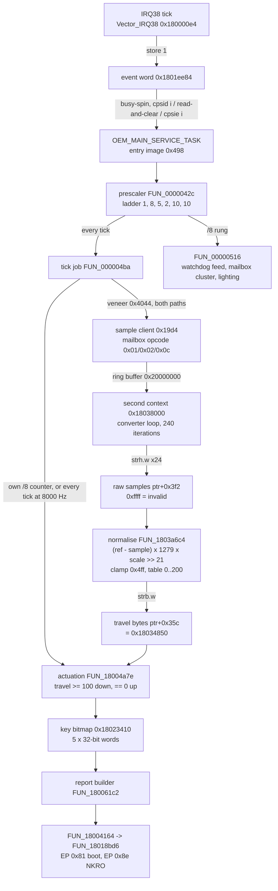

# Lesson 15 — Inside the firmware II: keys and magnets

> **In one sentence:** The investigation traced how a press on a magnetic key becomes a bit in a USB report: a tick wakes the main task, a second hidden program measures every key and converts the reading into a travel number from 0 to 200, and the application turns that number into "down", "up" or "hold".
>
> **You will learn:**
> - how a magnet and a Hall sensor turn "how far is the key pressed?" into a number
> - the whole pipeline, from the IRQ38 tick to the report buffers, with every address
> - how the raw sample is normalised with `(reference − sample) × 1279 × scale >> 21` and a 1280-byte travel curve
> - the actuation rule (`>= 100` down, `== 0` up, 1..99 hold) and the 5 × 15 = 75 key layout
> - how calibration works, why it always fails toward "released", and why nothing is saved
> - the watchdogs, the second execution context, and the dependency gate a custom firmware must pass
>
> **Time:** ~90 minutes · **Prerequisites:** Lessons 1, 7, 10, 14

---

## 1. The story (kid version)

Hold a fridge magnet near a compass and the needle moves. Bring it closer and the needle moves more. A **Hall sensor** is an electronic compass: the closer a magnet, the bigger the change in a small voltage it produces ([Hall effect](00-glossary.md#hall-effect)). Every key on this keyboard has a magnet in it. So the chip doesn't just learn "pressed" or "not pressed". It learns **how far** the key has gone down.

A voltage isn't a number yet. A converter measures the voltage and writes down a number, like a thermometer that shows "72" instead of a coloured bar ([ADC](00-glossary.md#adc)). Now imagine a school nurse who measures every child's height every morning. Each child is a little different, so the nurse keeps a card for each one: "Sam, standing tall = 5600; Sam, crouched down = 3500." To turn today's measurement into "how far down is Sam?", the nurse compares it to Sam's own card and reads the answer off a chart. That card is **calibration**, and the chart is the **travel curve**.

Then a teacher looks at the answer. "More than halfway down? Sam is sitting. Right at the top? Sam is standing. Anywhere in between? Leave Sam's status as it was." That rule stops Sam flickering between "sitting" and "standing" if he wobbles around the halfway mark. That's the **hold band**.

The surprising part of this story: the nurse doesn't work in the main building at all. There's a **second, separate program** in its own office. The main program slides it a note saying "here is the address of my notebook" and the nurse writes the measurements straight into it. That's why nobody found the nurse for a long time.

**How the analogy maps to the real thing**

| In the story | In the keyboard |
|---|---|
| Magnet and compass | Magnet in each key, Hall sensor on the board |
| Measuring the height | The converter loop: 240 write-strobe-readback iterations (log 118) |
| Sam's card | Per-key `reference`, `floor` and `scale` (log 121) |
| The chart | A 1280-byte monotonic table, values 0..200 (log 119) |
| "How far down" | A travel byte per key at pointer+`0x35c` (logs 110, 119) |
| Teacher's rule | `travel >= 100` down, `travel == 0` up, 1..99 unchanged (log 110) |
| The nurse's separate office | The second execution context at `0x18038000` (logs 113, 118) |
| "Here's my notebook's address" | Mailbox opcode `0x0d` carrying `0x180344f4` (log 119) |
| Morning bell | IRQ38, the periodic tick (log 109) |

---

## 2. Why we needed this

[Lesson 14](14-inside-tasks-and-usb.md) ended with the USB side traced: the descriptors, the endpoints, the vendor mailbox. But log 107 left the **producers** open. Who fills the 8-byte boot report? Where do key presses come from?

That mattered for a practical reason. The long-term goal was an offline-built custom firmware ([Lesson 18](18-commands-and-building.md)). Before anyone could say what such a firmware must do, the investigation needed a **dependency gate**: a list of every service the original firmware provides, each classified as *must implement*, *must neutralize*, *may omit*, or *unresolved*. Keys and magnets were the biggest unknown on that list.

The work ran over several logs:

| log | question | outcome |
|---|---|---|
| 109 (5C) | What drives scanning, and how do reports get built? | Traced from IRQ38 to the report buffers; stopped at a per-key array with no producer |
| 110 (5D) | How does travel become a key press? | Actuation recovered; **acquisition not found** |
| 113 (5G) | Watchdogs, clocks, faults, multicore; the final gate | Second execution context found; Hall acquisition a **blocker** |
| 114 | (correction) | The watchdogs *are* fed |
| 118 | What does the second context own? | Converter loop found; gate **narrowed, not closed** |
| 119 | Does sample data cross the mailbox? | Yes; the Hall acquisition gate is **closed** |
| 121 | Where does calibration come from? | Hard-coded defaults, drift tracking, **nothing persisted** |
| 127 | (later, polling rate) | A period for IRQ38, and the `/8` bypass at 8000 Hz |

The alternative, which the investigation refused, was to assume a standard "key matrix" design and fill the gaps from other keyboards. Log 109 states it plainly: "no contact-matrix model is asserted."

---

## 3. The real thing

### 3.1 The big picture

Here is the whole pipeline as it stands after log 127. Each box is explained below.



Two things are unusual. The chain **crosses between images** three times (application → entry image → application, plus the second context). And it has **two different divide-by-eights**, which is easy to mix up. Section 3.3 separates them.

### 3.2 From tick to task (log 109)

The heartbeat is **IRQ38**. Log 100 had recorded that software enables exactly two interrupts, IRQ6 and IRQ38. IRQ6 is USB (log 107). IRQ38 is the periodic tick. Its handler, from the listing (log 109):

```
180000e4  push {r4,lr}
180000e8  bl   0x180123ea          ; read channel 0's flag
180000ec  lsls r0,r0,#0x1f         ; test bit 0
180000ee  beq  0x18000106
180000f4  bl   0x1801242e          ; clear it
180000f8  ldr  r1,[0x180003cc]     ; = 0x1801ee84
180000fc  str  r0,[r1,#0x0]        ; event word = 1
18000100  ldrh r1,[r0,#0x0]        ; *(0x1801e380) += 1
18000104  strh r1,[r0,#0x0]        ;   a 16-bit tick counter at region+0
```

Line by line: check that the timer's flag is set, clear it, then write `1` into the **event word** at `0x1801ee84`. `Vector_IRQ38` is the **only** writer of that word in either image, found by exhaustive cross-reference (log 109). `0x1801ee84` is the very first word of the zero-init region.

On the other side is `OEM_MAIN_SERVICE_TASK`, the task from Lesson 14 whose code lives in the entry image at `0x498`, with a 16 KiB stack and priority 10. It doesn't wait on an RTOS queue. It **busy-spins**. When it sees the flag, it does `cpsid i` (interrupts off), read-and-clear, `cpsie i` (interrupts on). Masking interrupts around the read and the clear means a tick can't sneak in between them and get lost (log 109).

One subtlety, recorded as a limitation: the flag is a **level** set to 1, not a counter. Two ticks arriving before one drain look the same as one. The separate 16-bit tick counter is not consulted by the drain loop (log 109).

### 3.3 The prescaler ladder, and the two divide-by-eights

A **prescaler** divides a fast tick into slower ones, like a clock's seconds hand driving the minutes hand. `FUN_0000042c` in the entry image runs once per drained event (log 109):

```
0000042e  bl 0x000004ba            ; EVERY tick, before any counter
00000432  ldr r4,[0x00000494]      ; counters at 0x1801e690 = region+0x310
00000436  adds r0,r0,#0x1 ; cmp r0,#0x8 ; blt   -> /8   bl 0x00000516
00000448  adds r0,r0,#0x1 ; cmp r0,#0x5 ; bcc   -> /5   bl 0x0000057a
00000458  adds r0,r0,#0x1 ; lsls r0,r0,#0x1f     -> /2   0x0000057c / 0x0000057e
00000470  adds r0,r0,#0x1 ; cmp r0,#0xa ; bcc   -> /10  bl 0x00000580
00000480  adds r0,r0,#0x1 ; cmp r0,#0xa ; bcc   -> /10
```

So the ladder is **1, 8, 5, 2, 10, 10**: every tick, then every 8th, then every 5th of those, and so on. These are **ratios read off compare constants** (`#0x8`, `#0x5`, `#0xa`). They are observed. What they are *not* is a rate.

Now the two divide-by-eights:

1. **The ladder's `/8` rung, `FUN_00000516`.** It feeds a watchdog (section 3.9), and through veneers `0x40d0`, `0x40f8` and `0x4116` it drives the mailbox cluster and the lighting (logs 114, 121, 122).
2. **The tick job's own `/8` counter, inside `FUN_000004ba`.** `FUN_000004ba` runs on *every* tick (rung "1"), and keeps a private counter that gates the actuation compare and the report builder.

Here is `FUN_000004ba` as log 127 byte-confirmed it:

```
4cc  ldr    r0,[pc,#0xe4]    -> *(0x5b4) = 0x1801e810
4ce  ldr    r0,[r0]
4d0  cmp    r0,#0x1
4d2  bne    0x4f4             not active -> skip the block
4d4  ldr    r0,[pc,#0xe0]    -> *(0x5b8) = 0x18021de0   (the profile block)
4d6  ldrb.w r0,[r0,#0x4f8]    THE POLLING-RATE FIELD
4da  and    r1,r0,#0xf        THE INDEX
4de  ldr    r0,[pc,#0xdc]    -> *(0x5bc) = 0x1801e6a4
4e0  cmp    r1,#0x3           <<< THE BYPASS TEST
4e2  beq    0x4fc             index 3 -> RUN EVERY TICK
4e4  ldrb   r1,[r0]
4e6  adds   r1,r1,#0x1
4e8  uxtb   r1,r1
4ea  strb   r1,[r0]
4ec  cmp    r1,#0x8           <<< THE DIVIDE-BY-EIGHT
4ee  beq    0x4fc
4f0  bl     0x4044            otherwise: SAMPLE FETCH ONLY
4f4  pop.w  {r4,lr}
4f8  b.w    0x404e            FUN_1800417e, on every tick
4fc  movs   r1,#0x0
4fe  strb   r1,[r0]           reset the /8 counter
500  bl     0x4058            FUN_180045b6
504  bl     0x4044            the sample fetch
508  bl     0x4062            FUN_18004a7e, ACTUATION COMPARE
50c  bl     0x406c            FUN_180057fe
510  bl     0x4076            FUN_180061c2, REPORT BUILDER
514  b      0x4f4
```

Read it as a small flowchart:

- If the polling-rate index is **3** (8000 Hz), jump straight to the "full" block **every tick**.
- Otherwise count to **8**. On the 8th tick, run the full block. On the other seven, fetch samples only.
- Either way, `FUN_1800417e` (the 21-byte EP `0x8c` sender) runs every tick.

So the **sample fetch (veneer `0x4044`) is on both paths**, at `0x4f0` and at `0x504`. "Hall acquisition is never slowed by the polling rate" (log 127). Only the decision-and-report block is gated.

This refines two earlier logs. Logs 110 and 119 said the actuation comparison runs on IRQ38's tick divided by 8. That is true at 1000 Hz and **false at 8000 Hz**, where it runs every tick. Both logs had scoped the claim to "inside the branch gated by that job's own /8 counter", which is exactly the branch the rate bypasses (log 127; [TIMELINE.md](../TIMELINE.md) corrections table). [Lesson 17](17-polling-rate.md) tells the full polling-rate story.

### 3.4 The sample fetch: a mailbox to a second program

Veneer `0x4044` points at `0x180049a4`, four bytes that Ghidra had never disassembled, which are `b.w 0x1801be22`: the sample client's veneer. That leads to entry-image client `0x19d4`, which sends mailbox opcode `0x01`, `0x02` or `0x0c` (log 119, [notes/sample-flow.md](../notes/sample-flow.md)).

A [mailbox](00-glossary.md#mailbox) here is a ring buffer in shared memory (log 118):

| address | role | owner |
|---|---|---|
| `0x20000000` | head index | the client (entry image) |
| `0x20000004` | tail index | the second context |
| `0x20000008` | 8 records of `0x2c` bytes | shared |

The client fills a record, writes the opcode into byte 0, advances the head modulo 8, and **spins until the tail catches up**. The server dispatches record byte 0 through a 16-entry `tbb` jump table, 10 of whose opcodes have handlers ([notes/second-context.md](../notes/second-context.md)).

#### How the second context was found (log 113)

`CandidateB_Main`, the application's startup, does this (log 113):

1. loads `0x60074000` (a flash address),
2. clears `0x20000000`,
3. calls entry-image `0x1f50` through a veneer (`movw r12,#0x1f51`, decoded by hand), whose first register work is a read-modify-write of `0x45000100`,
4. then **spins until `0x20000000` holds `0x12345678`**.

That magic token appears in exactly two places in the whole repository: the application's expected-value literal, and **inside the `0x18038000` image at `+0x3214`**. So a second execution context is started at boot and waited for (log 113). Later, log 118 found the server side: the instruction at `0x1803af96` writes `0x12345678` to the head word **once**, as a "server is up" signal, before that same word becomes the head index. That's why the application waits for it and then writes zero.

#### What the second context is (log 118)

- **Byte-identical in 1.00.58 and 1.59.** Across flash `0x74000..0x7bfff` the releases differ in exactly four bytes, and all four are the application region's word-sum at `0x7bffc` that happens to fall in the range.
- **A service payload, not an application.** Its reset handler reads [VTOR](00-glossary.md#vtor), loads SP from it, runs one init function and falls into an endless command loop. No scheduler, no USB, no storage.
- **Its own 73-entry vector table**, 57 external slots, 56 sharing one default handler. Only **IRQ3** has its own.
- **Three MMIO windows only it touches**: `0x40040000` (98 accesses, from one init function), `0x40018000` and `0x4001c000`.
- **484 of its 837 accesses have an unresolved base**, so every negative about it is "not resolved", not "absent".

**Two contexts, one core or two?** The *mechanism* is settled: two contexts, a ring buffer, a start register, separate vector tables. The *silicon* is not: whether they run at the same time is **unresolved**. The client spins while waiting, which fits a second core *and* a single core switching at the spin ([notes/dual-core-question.md](../notes/dual-core-question.md)).

#### How the application hands over its notebook (log 119)

At boot, `FUN_18000136` (called from `CandidateB_Main`) sends opcode **`0x0d`** with record field `+4` = `*(0x1801ed6c)` = **`0x180344f4`**, the base of the application's own per-key structure. The second context saves it, and can then write **any offset of it directly**. No response record is needed (log 119):

| offset | written by | direction | content |
|---|---|---|---|
| `+0x1e4` | client `0x1acc`, opcode `0x0b` | app → second | channel selection |
| `+0x27a` | client `0x1a36`, opcode `0x07` | app → second | per-key fault counter (both sides touch it) |
| `+0x2c6` | `FUN_1803a6c4` | second → app | 75 uint16, the clamped raw value |
| `+0x35c` | `FUN_1803a6c4` | second → app | **75 travel bytes**, `0x18034850` |
| `+0x3f2` | `FUN_1803901c` | second → app | **75 uint16 raw samples** |
| `+0x72c` | client `0x1b7c`, opcode `0x0f` | app → second | five-group drive table |

`0x180344f4 + 0x35c = 0x18034850`. That's exactly the travel array log 110 had found and could not trace. Its address appears in **no aligned word of any image**, because the second context only learns it at run time from the mailbox. That's why log 110's search was correct and still found nothing (log 119).

### 3.5 Inside the second context: from voltage to travel byte

#### Step 1: the converter loop (log 118)

`FUN_1803ae58` and `FUN_1803af28` iterate **240 times**: write a 16-bit word to `0x40018000`, strobe `0x4001b000` with `0x7c` then `0`, read `0x40019000`, and store to the in-image array `0x1803c828` ([notes/sample-flow.md](../notes/sample-flow.md)). The register addresses are **fixed**. Only the data written changes. So this is a *multiplexed* converter interface, one set of registers selecting many channels, rather than one register per channel (log 118).

The converter's registers are **not named**. They carry no units. "Converter loop" is as far as the evidence goes.

#### Step 2: staging, validation and delivery (log 119)

`FUN_1803901c` reads a derived in-image array at `0x1803c5b2` and checks each entry with a two-field XOR test, substituting a default when it fails. Then it stores the samples into application RAM with **24 unrolled** `strh.w rX,[pointer + key*2, #0x3f2]` instructions.

At init, opcode `0x0d` also runs a `memset` of 150 bytes of `0xff` over `pointer+0x3f2`. 75 keys × 2 bytes = 150. So every sample starts as **`0xffff`**, the **sentinel** meaning "no valid sample yet". (A sentinel is a special value that means "nothing here".)

#### Step 3: normalisation (logs 119, 121)

`FUN_1803a6c4` turns each raw sample into a travel byte:

```
delta  = reference[key] - sample
value  = (delta * 1279 * scale[key]) >> 21
value  = min(value, 0x4ff)            ; clamp at 1279
travel = table[value]                 ; 1280-byte table at 0x1803be86
store travel at pointer + 0x35c + key
```

`>> 21` means "shift right 21 bits", which is dividing by 2^21 = `0x200000` = 2,097,152.

Log 119 could not explain the `1279`, the `scale` or the `>> 21`. Log 121 did, by finding where `scale` comes from:

```
scale = 0x200000 / (reference - floor)
```

Put that into the formula and the `0x200000` cancels the `>> 21`:

```
value = 1279 * (reference - sample) / (reference - floor)
```

That's just "**what fraction of the way from released to fully pressed is this key, on a scale of 0 to 1279?**" The scale isn't a magic number. It's the reciprocal of this key's measured span (log 121).

#### Step 4: the travel curve (log 119)

The table at `0x1803be86` identifies itself by three independent properties (log 119):

1. It is exactly **1280 bytes**: the clamp bound `0x4ff` + 1.
2. It is **monotonic non-decreasing**: it never goes down.
3. Its range is **0..200**: exactly twice log 110's actuation threshold of 100.

Sampled every 64th entry: `[0, 49, 74, 95, 108, 119, 129, 137, 145, 151, 158, 162, 167, 171, 175, 180, 184, 188, 193, 199]` ([notes/sample-flow.md](../notes/sample-flow.md)). Notice it rises steeply at first, then flattens. It's a curve, not a straight line. Log 110 had recovered `travel >= 100` without knowing the scale. Now we know: the scale is 0..200, with actuation at the midpoint.

#### A worked example with the boot defaults

The boot defaults are instruction immediates (log 121): reference `0x15e0` = 5600, floor `0xdac` = 3500, scale `0x3e6` = 998. Check the formula: 5600 − 3500 = 2100, and `0x200000` / 2100 = 2,097,152 / 2100 = 998.64…, which truncates to **998 = `0x3e6`**. Three independently written constants agree (log 121).

Now some **sample values we made up** to see the arithmetic. They aren't measurements; this only runs the recovered formula and reads the real table out of the second-context image (exercise 3 reproduces it):

| sample (made up) | reference − sample | value | table[value] = travel | decision |
|---|---|---|---|---|
| 5600 | 0 | 0 | 0 | up |
| 5000 | 600 | 365 | 126 | down (≥ 100) |
| 4550 | 1050 | 639 | 157 | down |
| 4000 | 1600 | 973 | 180 | down |
| 3500 | 2100 | 1278 | 200 | down |

The last row is what log 121 recorded: "full travel then converts to 1278, where the travel curve reads 200 — its maximum."

**What this does not tell us:** the physics. The numbers carry no unit. Nobody knows how many millimetres of key travel 2100 counts is, the sensor's polarity, or its noise. "The CONTRACT is recovered; the physics is not" (log 121).

### 3.6 Calibration: learned every boot, saved never (log 121)

The per-key arrays live in the second context's RAM ([notes/calibration-flow.md](../notes/calibration-flow.md)):

| array | address | type | role |
|---|---|---|---|
| `reference` | `0x1803ca08` | u16[75] | the released-end baseline |
| `floor` | `0x1803caa0` | u16[75] | the pressed-end reference |
| `scale` | `0x1803cd90` | u32[75] | `0x200000 / span` |

All three are **zero in the image**. That rules out a stored default table. A scan of every literal-pool word pointing into the calibration block finds **exactly four functions**: an initialiser, a runtime tracker, the converter (read-only), and a settle-timer helper. No mailbox handler and no storage path appears. So "sent by the app" and "loaded from storage" both fall away (log 121).

The lifecycle:

| stage | when | what |
|---|---|---|
| **boot defaults** | once, at second-context startup | reference `0x15e0`, floor `0xdac`, scale `0x3e6` for all 75 keys |
| **settling** | the first **600 conversion passes** | calibration updates from every valid sample, and **every travel byte is forced to 0** |
| **drift tracking** | every pass after that | the reference drifts in steps of 5 and 10 behind consecutive-sample gates with an 8-sample average; the floor is pulled toward observed minima; scale is recomputed on every change |
| **persistence** | never | discarded at power-off; rebuilt from the same defaults next boot |

**There is no recalibrate command.** The initialiser has one caller (the service loop's startup), the tracker has one (the converter). No mailbox opcode and no vendor HID command reaches either, so "there are no command bytes to recover" (log 121).

#### Every failure falls toward "released"

This is a property of the code, not a hope (log 121):

- **Sentinel first.** The `0xffff` sample is compared *before* the subtraction, so `reference − 0xffff` never happens. The key is skipped and no travel byte is produced.
- **Settling.** For the first 600 passes every travel byte is 0. An uncalibrated keyboard emits no keystrokes, so it can't emit wrong ones.
- **Sanity window.** Samples outside `0x80..0x2329` are ignored by the tracker's guard.
- **Implausibly low samples.** Fifteen samples below `0xfa` flag the key and reset its floor to the default. That counter lives in the *application's* structure at `+0x27a`, so it's the one calibration-adjacent value both sides can see.

The 600 passes are a **count, not a duration**. Log 121 recorded it that way because IRQ38's period was unknown then.

### 3.7 Actuation: travel byte to key bit (log 110)

Back in the application, `FUN_18004a7e` reads the travel bytes. The decision, **confirmed against the [listing](00-glossary.md#listing)**, not just the decompiler:

```
180057a8  ldrb r3,[r3,r2]        ; key_id = keymap[...]
180057aa  cbz  r3,0x180057d0     ; key id 0 -> skip
180057ac  cmp  r3,#0xd3
180057ae  beq  0x180057d0        ; key id 0xd3 -> skip
180057b2  ldrb r3,[r3,r4]        ; travel = travel_bytes[linear]
180057b4  cmp  r3,#0x64          ; <-- the threshold is 100
180057b6  bcc  0x180057c2        ; below -> the clear/hold branch
180057ba  ldr.w r3,[r6,r0,lsl #0x2]
180057be  orrs r3,r1             ; at or above -> SET the key's bit
```

(From `tool/model_hall_actuation.py`'s docstring.) `0x64` = 100. So:

```
travel >= 100        -> key down
travel == 0          -> key up
1 <= travel <= 99    -> UNCHANGED   (the hold band)
key id 0x00 or 0xd3  -> skipped
```

The hold band comes from **control flow**: the below-100 branch tests for zero first, and if the value isn't zero it jumps to the loop's end, so neither the "set" nor the "clear" store runs. It stops a key chattering across the threshold. Log 110 calls it "the closest thing to hysteresis in the recovered code" and deliberately doesn't name it after any feature.

#### The key layout is in the instruction encoding

```
18005798  rsb   r3,r3,r3, lsl #0x4   ; x * 15
1800579c  add.w r3,r3,r3, lsl #0x2   ; (x * 15) * 5 == x * 75 == x * 0x4b
```

`rsb r3,r3,r3,lsl #4` computes `(x << 4) − x` = 16x − x = **15x**. `add.w r3,r3,r3,lsl #2` computes `x + 4x` = **5x**. Together, ×75. The same stride appears as `adds r1,#0x4b`, `mov.w r12,#0xf`, and the outer bound `cmp r5,#0x5`. So the key map is **5 groups × 15 = 75 entries per layer**, the first physical-side dimension the project proved (log 110).

Careful: 15 is the **stride**, not the number of active keys per group. The inner loop compares against a runtime word at region+`0x55c`, which the initialised image leaves zero (log 110). The model refuses to guess it.

#### The per-key actuation setting

A 7-bit field at `+8` of a `0x20`-byte per-key record, with bit 15 selecting it over a global default, clamped `< 2 → 0`, `2..4 → v − 2`, `≥ 5 → 3` (log 110). Log 110 wrote the record address as `0x180202d8 + profile*0xd84 + index*0x20`; log 125's format work later identified `0xd84` as the stride between the two keymap *layers* ([notes/profile-format.md](../notes/profile-format.md)). The confidence for the field is **strongly-inferred** (decompiler); the clamp is **observed** (listing).

A second branch reports `travel / 5` with the key ID instead of a binary state (strongly-inferred, log 110).

#### A timeout scaled by the polling rate (log 127)

Log 127 found four identical sites in `FUN_18004a7e` that read a byte called the **multiplier** at `0x1801e736` (= key-state struct `0x1801e734` + 2):

```
180053c0  ldrb.w r2,[lr,#0x22]        ; a per-key byte parameter
180053c4  ldrb   r0,[r0,#0x2]         ; THE MULTIPLIER, 1 << index
180053ca  add.w  r0,r0,r0,lsl #2      ; x5
180053ce  lsls   r0,r0,#0x1           ; x2  -> x10
180053d0  muls   r2,r0,r2             ; parameter x 10 x multiplier
180053d2  ldr.w  r0,[r12,r4,lsl #2]   ; a per-key 32-bit counter
180053d6  cmp    r2,r0
```

The counter counts ticks. So `parameter × 10 × multiplier` is a **timeout measured in ticks**. At index 0 the multiplier is 1 and the job runs every 8 ticks; at index 3 it's 8 and the job runs every tick. `multiplier × divisor` is 8 in both states, so the per-key parameter means the same real time either way: **10 ms per unit** (log 127). Which user feature this timeout belongs to is **unresolved**.

### 3.8 From key bitmap to USB

`FUN_18004a7e` writes the **key-state bitmap** at `0x18023410`: five 32-bit words (one per group, one bit per position), with a previous-state partner at `+0x810` (log 110). The edge detector `FUN_18005a88` XORs previous and current to find changes.

`FUN_180061c2` is the report builder. It's the only function that touches the boot or NKRO buffer, and it both builds and sends, so there's no hand-off to synchronise (log 109). The buffers, with log 110's corrections applied ([notes/scan-pipeline.md](../notes/scan-pipeline.md)):

| buffer | size | interface | endpoint |
|---|---|---|---|
| `0x1801e7c8` (region+`0x448`) | 8 B | 0 | EP `0x81` boot keyboard |
| `0x18023c20` | 19 B | 3 | EP `0x8e` NKRO bitmap |
| `0x18023c33` | 4 B | 2 | EP `0x8c` consumer control |
| (pad byte `0x18023c37`) | 1 B | — | — |
| `0x18023c38` | 5 B | 2 | EP `0x8c` mouse, Report ID 4 |
| `0x18023c3d` | 2 B | 2 | EP `0x8c` system control, Report ID 2 |

The NKRO report is **152 bits** (Report Size 1 × Report Count `0x98`), which is exactly the 19-byte packet the host enumerated. That comes from the report descriptor's own items. Rows, columns and the total key count are **unresolved** (log 109). The 189-entry wire-ID table is *not* a key count, and a test asserts it never appears as one.

Sending goes `FUN_180061c2` → `FUN_18004164` → `FUN_18018bd6`, the same transmit function Lesson 14 mapped to the endpoints.

### 3.9 The watchdogs (logs 113, 114, 118)

A [watchdog](00-glossary.md#watchdog) is a timer that resets the chip unless software "feeds" it regularly. It rescues a frozen program. Lesson 14 found two identical blocks, `0x40008000` and `0x40009000`, unlocked with `0x5afa` "magic key" values on the reset path.

Log 113 claimed exactly one function touches them and nothing feeds them. **Both claims were false** (log 114, at the reviewer's direction). `FUN_000021fe` is a **call-through base selector**: selector 0 returns `0x40008000`, selector 1 returns `0x40009000`. Every caller's store therefore has a base that arrives in a register, and is **invisible to a per-function MMIO census**. That's the lower-bound rule from Lesson 14, biting.

There are **three** access paths (log 114):

| path | blocks | trigger | writes | census-visible |
|---|---|---|---|---|
| reset disable `FUN_00001216` | **both** | once, at reset | key `0x5afa55aa` → `+0xc`; `0x5afa0000` → `+0` | yes |
| **periodic feed** `FUN_00000516` → `FUN_00002148(0,0xff)` | `0x40008000` | **every 8 ticks** of IRQ38 | `0x5afa00ff` → `+8`; key → `+0xc` | **no** |
| **NMI acknowledge** `Vector_NMI` | `0x40008000` | on NMI, when bit 2 of `+0` is set | `0x5afa0003` → `+0`; key → `+0xc`; counter++ | **no** |

`FUN_00000516` is the prescaler ladder's `/8` rung from section 3.3, so the feed rides the tick chain. When the NMI counter reaches its limit, `Vector_NMI` writes AIRCR `0x05fa0004`, a system reset. The limit's power-on value at region+`0xa85` is **1**, so the first acknowledged NMI also resets. Nothing ever passes selector 1, so in the two analysed images `0x40009000` is touched only once, by the reset disable (log 114).

Log 118 then corrected the *scope* of that last sentence: the second-context image also writes `0x5afa0000` to `+0` and `0x5afa55aa` to `+0xc` of **both** blocks. "Touched once in the whole firmware" had only been true of the two analysed images.

The `usbd_wdt` task sounds like a watchdog feeder. It isn't: its whole 12-function closure reaches only ICSR (`0xe000ed04`), the RTOS yield. "Had the name been taken as evidence, this phase would have concluded the opposite" (log 113).

Calling these blocks *watchdogs* is **inference**, not identification. It's consistent with the product brief's "two watchdogs", and the tool records "the watchdog conclusion is inference, not identification" ([notes/platform-dependencies.md](../notes/platform-dependencies.md)).

### 3.10 The dependency gate

Log 113 partitioned seventeen services. The classes (log 113; [notes/platform-dependencies.md](../notes/platform-dependencies.md)):

- **must-implement**: a replacement must provide it, and each names a consumer that fails without it;
- **must-neutralize**: a replacement must deal with it deliberately. Ignoring it inherits unknown behaviour; for example, "main SPINS FOREVER on the mailbox token";
- **may-omit**: can be left out, but **only with a proven safe idle state**;
- **unresolved**: a blocker, "not permission to omit".

How the gate moved:

| after | must-implement | must-neutralize | may-omit | unresolved | change |
|---|---|---|---|---|---|
| log 113 | 6 | 3 | 5 | 3 | Hall acquisition, RGB, clock frequency are blockers |
| log 119 | 6 | 4 | 5 | 2 | Hall acquisition moves from unresolved to must-neutralize (the counts follow from that one move) |
| log 121 | 6 | 5 | 5 | 2 | new `calibration` service, must-neutralize |

Why is Hall acquisition *must-neutralize*, not *must-implement*? Because a replacement doesn't reimplement it. It hands the second context a pointer and consumes what appears. "The gate is satisfied by **inheriting vendor code**" (log 119). The same reasoning applies to calibration: "respect the settling window, never ... implement or shortcut it" (log 121).

The current state, as the tool prints it:

```
PASS every class is populated, so the gate is a real partition — must-implement=6; must-neutralize=5; may-omit=5; unresolved=2
RESULT gate_ok=True checks=21 blockers=2
```

The two blockers left are **RGB** (Lesson 16) and the **clock frequency**.

#### Evidence levels for the rate, exactly

This is where it's easiest to overstate, so here it is precisely:

- **Log 109:** the ladder ratios are **observed**; the absolute period is **unresolved**.
- **Log 119:** "The absolute rate is still unresolved; a ratio is not a frequency, and a test forbids wording that turns one into the other."
- **Log 127:** **IRQ38 = 8000 Hz (125 µs), strongly-inferred.** At polling index 0, log 126 measured a 1 ms report grid, which the host's polling can't produce, and the tick job runs the report stage every 8th tick there. `8 × T = 1 ms → T = 125 µs`. It's strongly inferred rather than observed because it assumes the report stage makes at most one new report per invocation.
- **The `clock_frequency` service stays unresolved.** One derived period is not a clock configuration: no crystal, PLL or divider register is recovered. The dependency map deliberately does not state the number; it lives in `notes/polling-rate-reader.json` (log 127).

---

## 4. Decisions and why

| Decision | Why | Alternative rejected | Evidence (log) |
|---|---|---|---|
| Don't assert a contact-matrix model | No scan-shaped MMIO block exists; the device is Hall-effect | Filling the gap from other keyboards | 109 |
| Confirm the threshold against the listing, not the decompiler | The decompiler is a guess | Trusting decompiled C | 110 |
| Make `active_positions` a required argument in the model | The firmware reads it from a runtime word; 15 is only the stride | Defaulting to 15 | 110 |
| Don't name `0x40022000` or any ADC | Shape is correlation; no ADC-shaped block exists in either image | Calling a PWM-shaped bank "PWM" | 110 |
| Treat a task name (`usbd_wdt`) as a lead, not evidence | Its closure touches no watchdog block | Concluding it feeds the watchdog | 113 |
| Import and analyse the `0x18038000` image | It was started and waited for, and owned something the app didn't | Declaring the acquisition unknowable | 113, 118 |
| Classify acquisition and calibration as must-neutralize | A replacement inherits them; it can't re-derive the physics | must-implement | 119, 121 |
| Forbid Hz wording until a measurement exists | A ratio is not a frequency | Quoting a guessed clock | 109, 119, 127 |
| Keep `clock_frequency` unresolved even after log 127 | One derived period is not a register map | Marking it resolved | 127 |

---

## 5. What went wrong, and how it was caught

**The report buffers were called contiguous (log 109).**
- *Believed:* the three RAM buffers were one contiguous block, and the 5-byte one was "system control".
- *True:* there's a one-byte pad at `0x18023c37`; the 5-byte buffer is the **mouse** report (ID 4); system control is the 2-byte buffer at `0x18023c3d`.
- *Caught:* log 110, recorded there rather than by editing log 109.
- *Lesson:* check each buffer length against its report descriptor. The tool now does ("every interface-2 buffer length equals its report's descriptor size").

**The "per-key halfword array" (log 109).**
- *Believed:* `0x18023410` held 16-bit per-key values, suggesting analog samples.
- *True:* it's the key-state **bitmap**, five 32-bit words, with a previous-state partner at `+0x810`.
- *Caught:* log 110.
- *Lesson:* a plausible story ("Hall-effect means 16-bit samples") can hide a simpler truth.

**"Nothing feeds the watchdogs" (log 113).**
- *Believed:* one function touches the blocks, and they're never fed.
- *True:* a base-selector hides two more paths from the census: a periodic feed every 8 ticks and an NMI acknowledge.
- *Caught:* at the reviewer's direction (log 114). Log 114 admits: "I then made an absolute claim that depended on the census being complete."
- *Lesson:* a census that reports one writer is evidence of one *visible* writer.

**"Block `0x40009000` is touched once in the whole firmware" (log 114).**
- *True:* only in the two analysed images; the second context also writes both blocks.
- *Caught:* log 118.
- *Lesson:* state the scope of every negative.

**"The second context does not deliver samples" (log 118).**
- *Believed:* its converter results stay in its own RAM; the gate is narrowed, not closed.
- *True:* the delivery is a direct write through the pointer handed over by opcode `0x0d`, at `+0x3f2` and `+0x35c`.
- *Caught:* log 119 traced both sides of the mailbox.
- *Lesson:* log 118's statement was honest about its limit ("narrowed, not closed"), which is what let log 119 close it cleanly.

**Actuation "on IRQ38 divided by 8" (logs 110, 119).**
- *True:* at 8000 Hz the compare runs every tick; the rate bypasses the tick job's own `/8`.
- *Caught:* log 127, while hunting the polling-rate reader.
- *Lesson:* both logs had scoped their claim to one branch. Careful scoping turned a potential error into a refinement.

**The Hall model's stale rows.** `notes/hall-actuation.md` (generated by `model_hall_actuation.py`) still lists calibration and filtering as "unresolved" and says the bytes are "already scaled". Those rows describe what log 110 could see. Log 121's calibration map is the later record. Keep that in mind when reading the model's output in the exercise.

---

## 6. Try it yourself

All offline. Run from `keyboard/falchion-re/`.

**1. Run the actuation model and its self-check.**

```
$ python3 tool/model_hall_actuation.py
PROGRAM model_hall_actuation
PURPOSE Phase 5D — Hall-effect actuation behaviour

PIPELINE STATUS
  acquisition        observed — the second execution context (log 119)
  calibration        unresolved
  filtering          unresolved
  position_travel    unresolved — the bytes are already scaled
  comparison         observed
  per_key_state      observed
  hid                observed (log 109)

RECOVERED CONSTANTS
  actuate_at                 100
  actuation_clamp            {'high': 5, 'low': 2, 'max': 3}
  actuation_field_mask       127
  group_stride               15
  layer_stride               75
  outer_groups               5
…
THE DECISION, as recovered:
  travel >= 100        -> key down
  travel == 0          -> key up
  1 <= travel <= 99    -> UNCHANGED (hold band)
  key id 0x00 or 0xd3  -> skipped before any comparison
…
$ python3 tool/model_hall_actuation.py --check
RESULT reports_current=True stale=0
```

**2. Run its tests.**

```
$ python3 -m unittest tool/test_model_hall_actuation.py
.........................................
----------------------------------------------------------------------
Ran 41 tests in 0.144s

OK
```

**3. Walk one key through time.** This calls the model's `actuate()` with a sequence of travel values, as if you pressed a key and let it go.

```
$ python3 -c "
import sys; sys.path.insert(0,'tool'); import model_hall_actuation as m
down=False
for t in [0,40,99,100,150,99,50,1,0]:
    down=m.actuate(t,down); print(f'travel={t:3d} -> {\"DOWN\" if down else \"up\"}')
print([m.clamp_actuation(v) for v in range(8)])
"
travel=  0 -> up
travel= 40 -> up
travel= 99 -> up
travel=100 -> DOWN
travel=150 -> DOWN
travel= 99 -> DOWN
travel= 50 -> DOWN
travel=  1 -> DOWN
travel=  0 -> up
[0, 0, 0, 1, 2, 3, 3, 3]
```

Look at `99`: on the way down it leaves the key **up**, on the way back it leaves it **down**. Same number, different result. That's the hold band. Even `1` keeps the key down; only an exact `0` releases. The last line is the clamp for raw settings 0..7.

**4. A whole scan pass.** This uses a made-up key map of all `1`s, except position 2, which gets the skip ID `0xd3`.

```
$ python3 -c "
import sys; sys.path.insert(0,'tool'); import model_hall_actuation as m
key_map=[1]*75; key_map[2]=0xd3
travel=[0]*75; travel[0]=120; travel[1]=50; travel[2]=200; travel[16]=100
bits=m.scan_pass(travel,key_map,[0]*5,active_positions=15)
print([bin(b) for b in bits])
travel[0]=40; travel[16]=0
bits2=m.scan_pass(travel,key_map,bits,active_positions=15)
print([bin(b) for b in bits2]); print(m.edge_words(bits2,bits))
try: m.scan_pass(travel,key_map,[0]*5)
except TypeError as e: print('TypeError:',e)
"
['0b1', '0b10', '0b0', '0b0', '0b0']
['0b1', '0b0', '0b0', '0b0', '0b0']
[0, 2, 0, 0, 0]
TypeError: scan_pass() missing 1 required positional argument: 'active_positions'
```

Pass 1: key 0 (120) is down, key 1 (50) stays up, key 2 is skipped even at 200, and key 16 (group 1, position 1) is down, so group 1's word is `0b10`. Pass 2: key 0 drops to 40 but **stays down** (hold band); key 16 drops to 0 and releases. The edge detector's XOR shows exactly one change, in group 1. The last line shows the model refusing to guess the active count.

**5. Read the real travel curve and run the normaliser by hand.** The table lives at `0x1803be86` in the second-context image, which starts at `0x18038000`, so the file offset is `0x3e86`.

```
$ python3 -c "
d=open('ghidra/imports/ram_image_18038000.bin','rb').read(); lut=d[0x3e86:0x3e86+1280]
print(len(d), lut[::64], lut[1278], lut[1279], max(lut), all(a<=b for a,b in zip(lut,lut[1:])))
ref,floor=0x15e0,0xdac; scale=0x200000//(ref-floor); print(ref,floor,ref-floor,scale,hex(scale))
for s in [5600,5000,4550,4000,3500]:
    v=((ref-s)*1279*scale)>>21; v=min(v,0x4ff); print(s,v,lut[v])
"
32768 b'\x001J_lw\x81\x89\x91\x97\x9e\xa2\xa7\xab\xaf\xb4\xb8\xbc\xc1\xc7' 200 200 200 True
5600 3500 2100 998 0x3e6
5600 0 0
5000 365 126
4550 639 157
4000 973 180
3500 1278 200
```

Python prints the table slice as bytes: `\x00` = 0, `1` = `0x31` = 49, `J` = `0x4a` = 74, `_` = `0x5f` = 95. Those match the note's sampled values. `True` confirms the table never goes down, and `998 0x3e6` confirms the default scale.

**6. See the calibration and sample-flow tools agree.**

```
$ python3 tool/map_calibration_flow.py | grep -n "998\|LUT"
26:  0x200000/2100 = 998 vs hard-coded 998  -> True
27:  full travel raw 1278 -> LUT 200 (max 200)
$ python3 tool/map_sample_flow.py | grep -n "1280\|monotonic\|CLOSED\|RESULT"
39:  0x1803be86 length 1280 (= clamp 0x4ff + 1: True)
40:  monotonic True, range 0..200, threshold 100
48:HALL GATE  CLOSED  (was: narrowed, not closed (log 118))
…
109:RESULT sample_flow_ok=True checks=28
```

**7. Read the dependency gate.**

```
$ python3 tool/map_platform_dependencies.py | grep -n "===\|RESULT"
35:  === MUST-IMPLEMENT ===
60:  === MUST-NEUTRALIZE ===
85:  === MAY-OMIT ===
107:  === UNRESOLVED ===
156:RESULT gate_ok=True checks=21 blockers=2
```

---

## 7. Check your understanding

1. A key's travel byte goes 0 → 60 → 120 → 60 → 0. What is the key's state after each value?
<details><summary>Answer</summary>up (0), up (60 is in the hold band, so it stays up), down (120 ≥ 100), down (60 holds the previous state), up (only exactly 0 releases) (log 110).</details>

2. Why couldn't log 110 find what writes the travel array, even though its search was correct?
<details><summary>Answer</summary>The writer is the second execution context, and it learns the array's address only at run time, from mailbox opcode <code>0x0d</code> carrying <code>0x180344f4</code>. So the address <code>0x18034850</code> appears in no aligned word of any image, and the writer wasn't in either analysed image (log 119).</details>

3. With the boot defaults, show that the scale really is 998, and explain what the `>> 21` is for.
<details><summary>Answer</summary>Span = <code>0x15e0</code> − <code>0xdac</code> = 5600 − 3500 = 2100. <code>0x200000</code> / 2100 = 998 (integer division) = <code>0x3e6</code>, the hard-coded default. Since scale = 2^21 / span, the <code>>> 21</code> cancels the 2^21, leaving 1279 × (reference − sample) / span: a 0..1279 position (log 121).</details>

4. Why is a freshly powered-on keyboard unable to type phantom keys while it calibrates?
<details><summary>Answer</summary>For the first 600 conversion passes every travel byte is forced to 0, and 0 means "up". Sentinel samples (<code>0xffff</code>) are skipped before the subtraction, and out-of-window samples are ignored. Every failure resolves to "released" (log 121).</details>

5. Log 113 said nothing feeds the watchdogs. What was wrong, and why couldn't the census see it?
<details><summary>Answer</summary><code>FUN_000021fe</code> returns the block base (<code>0x40008000</code> or <code>0x40009000</code>) to its callers, so their stores have a base in a register that constant propagation can't resolve. Two paths were invisible: a feed every 8 ticks from <code>FUN_00000516</code>, and an NMI acknowledge that resets after one strike (log 114).</details>

6. Is it correct to say "IRQ38 runs at 8000 Hz"?
<details><summary>Answer</summary>Only with its evidence level: <b>strongly-inferred</b> (log 127), derived from a measured 1 ms report grid at index 0 and the tick job's divide-by-8, under the assumption of at most one new report per invocation. Before log 127 the rate was unresolved (logs 109, 119), and the clock configuration is still unresolved.</details>

---

## 8. Sources

- [../FINDINGS.md](../FINDINGS.md): "Phase 5C: scan scheduling and the scan-to-HID flow (log 109)", "Phase 5D: Hall actuation recovered, acquisition not (log 110)", "Phase 5G and the Phase 5 final dependency gate (log 113)", "The second execution context: what it owns (log 118)", "The Hall acquisition gate is closed (log 119)", "The calibration lifecycle (log 121)", "The polling-rate reader, and a period for IRQ38 (log 127)"
- [../TIMELINE.md](../TIMELINE.md): "Corrections retained for auditability"
- [../logs/109-phase5c-scan-scheduling.txt](../logs/109-phase5c-scan-scheduling.txt)
- [../logs/110-phase5d-hall-acquisition.txt](../logs/110-phase5d-hall-acquisition.txt)
- [../logs/113-phase5g-and-final-dependency-map.txt](../logs/113-phase5g-and-final-dependency-map.txt)
- [../logs/114-phase5g-watchdog-correction.txt](../logs/114-phase5g-watchdog-correction.txt)
- [../logs/118-second-context-image-analysis.txt](../logs/118-second-context-image-analysis.txt)
- [../logs/119-mailbox-client-and-sample-flow.txt](../logs/119-mailbox-client-and-sample-flow.txt)
- [../logs/121-calibration-lifecycle.txt](../logs/121-calibration-lifecycle.txt)
- [../logs/127-polling-rate-reader.txt](../logs/127-polling-rate-reader.txt)
- [../notes/scan-pipeline.md](../notes/scan-pipeline.md)
- [../notes/hall-actuation.md](../notes/hall-actuation.md)
- [../notes/platform-dependencies.md](../notes/platform-dependencies.md)
- [../notes/second-context.md](../notes/second-context.md)
- [../notes/sample-flow.md](../notes/sample-flow.md)
- [../notes/calibration-flow.md](../notes/calibration-flow.md)
- [../notes/dual-core-question.md](../notes/dual-core-question.md)
- [../tool/map_scan_pipeline.py](../tool/map_scan_pipeline.py)
- [../tool/model_hall_actuation.py](../tool/model_hall_actuation.py)
- [../tool/test_model_hall_actuation.py](../tool/test_model_hall_actuation.py)
- [../tool/map_second_context.py](../tool/map_second_context.py)
- [../tool/map_sample_flow.py](../tool/map_sample_flow.py)
- [../tool/map_calibration_flow.py](../tool/map_calibration_flow.py)
- [../tool/map_platform_dependencies.py](../tool/map_platform_dependencies.py)

[← Previous](14-inside-tasks-and-usb.md) · [Course home](README.md) · [Next →](16-settings-lights-saving.md)
