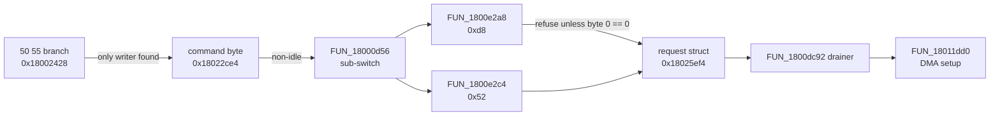

# Lesson 16 — Settings, lights and saving

> **In one sentence:** The investigation traced how a "save" command is queued rather than executed, how the RGB lighting protocol reaches a frame buffer but never visibly reaches hardware, and how the keyboard's settings are laid out and checksummed, using an Armoury Crate decode as a Rosetta stone.
>
> **You will learn:**
> - why the `50 55` commit is only nine instructions with no call, and where the real work happens
> - the one-deep storage request struct, its six request primitives, and why "matches JEDEC" is recognition, not proof
> - how to prove a custom firmware *cannot* erase settings, and exactly where that proof stops
> - how LampArray lighting travels over control transfers into a 6 × 17 × 3 frame buffer, and why all-zero does not prove "LEDs off"
> - the stored settings map (five regions, six profiles), the 16-bit additive checksum, and the profile block's fields
> - how profile 3's decoded Armoury Crate settings (effect 8, blue `0,0,255`) confirmed the format
>
> **Time:** ~80 minutes · **Prerequisites:** Lessons 4, 5, 9, 14, 15

---

## 1. The story (kid version)

Imagine a restaurant. You tell the waiter, "Please save my usual order for next time." The waiter doesn't run to the filing cabinet. He writes "SAVE" on a sticky note, puts it on the kitchen's order spike, and walks away. Later, the kitchen manager sees the note, fills in a request form ("file this in drawer 3"), and hands it to a clerk. There is only **one** request tray. If the tray is full, the manager waits. The clerk is the only person who actually touches the filing cabinet.

Now the lights. The restaurant has a big sign made of 102 little coloured bulbs in a 6-by-17 grid. Customers can send notes saying "make bulb 12 blue". A worker updates a **drawing** of the sign on a sheet of paper, then copies the drawing onto a second sheet. After that, the sheets disappear out of a back door. Nobody has seen who picks them up. If the drawing is blank, does the sign go dark? You'd think so. But what if the sign is wired backwards, so "blank" means "every bulb on"? You can't tell without seeing the sign's wiring.

Finally, the filing cabinet. Each customer's card has a total written in the corner: add up every number on the card, keep only the last four hex digits. If the total doesn't match, the card is thrown away and a fresh default card is written. There's also a trick. The total is "stamped" with the customer's table number, so a card filed in the wrong drawer won't pass.

**How the analogy maps to the real thing**

| In the story | In the keyboard |
|---|---|
| "Save my order" | Vendor command `50 55`, the commit (Lesson 5) |
| Sticky note on the spike | Command byte `0x18022ce4` set to 4 (log 111) |
| Kitchen manager | State machine `FUN_18000d56` (log 111) |
| One request tray | One-deep request struct at `0x18025ef4` (log 111) |
| The clerk | `FUN_1800dc92`, then a DMA setup in `FUN_18011dd0` (log 111) |
| The sign's drawing | The 306-byte frame buffer at `0x1802505e` (log 112) |
| The second sheet | The shadow buffer at `0x18024f2c` (log 122) |
| Back door nobody watches | The data path leaves the analysed images (log 122) |
| Wired backwards | A common-anode LED part behind an inverting stage (log 112) |
| Total in the corner | `sum16`, a 16-bit additive checksum (log 125) |
| Stamped with the table number | Checksum ANDed with `(profile | 0xfff0)` (log 125) |

---

## 2. Why we needed this

After Lesson 15 the dependency gate had three services still in question on this side of the firmware:

- **persistence**: could a custom firmware accidentally erase or corrupt the owner's saved settings?
- **RGB**: could a custom firmware simply leave the lights out, safely?
- **the settings format**: what exactly is stored, and is it protected by a checksum?

The first question was urgent for safety. A test firmware that damages stored settings would be a bad result even if the keyboard still worked. The investigation had a choice. It could try to *implement* safe saving, which needs the whole format and the storage medium. Or it could *prove the negative*: show that a firmware which avoids a small set of things cannot reach an erase at all. Log 111 chose the proof, because the evidence could support that and could not support the other.

The RGB question was the same kind of question: "is omitting it safe?" The format question came last (log 125), when the owner supplied a decoded Armoury Crate profile to check against.

---

## 3. The real thing

### 3.1 The `50 55` commit only queues (log 111)

Lesson 5 introduced `50 55` as the command Armoury Crate sends to save settings. Log 111 traced it **statically**. No command was built or sent. The bytes `0x50` and `0x55` appear only as values the firmware compares against in its own listing.

In the vendor [dispatcher](00-glossary.md#dispatcher) at `0x18001fbe`, opcode `0x50` branches to `0x18002110`, and inside that branch the subcommand test is:

```
180023de  ldrb r0,[r4,#0x1]       ; request byte 1
180023e0  cmp  r0,#0x55
180023e2  beq  0x18002428         <- THE COMMIT
```

The commit target, **complete**. It's nine instructions, and not one of them is a call (log 111):

```
18002428  ldr    r0,[0x180025a0]  ; *(0x180025a0) = 0x18022c60
1800242a  adds   r0,#0x84
1800242c  ldrb   r1,[r0,#0x0]
1800242e  cmp    r1,#0x4
18002430  beq    0x18002508       ; already 4 -> skip; the commit is idempotent
18002432  strb.w r12,[r0,#0x0]    ; r12 = 4, from `mov.w r12,#0x4` at 0x18001fea
18002436  strb   r5,[r0,#0x8]     ; a sub-selector
18002438  ldrb   r1,[r0,#0x9]
1800243a  bic    r1,r1,#0xc       ; clear two flag bits
1800243e  b      0x18002420
```

Line by line:

1. Load the address of a state struct, `0x18022c60`.
2. Add `0x84`. The command byte is at `0x18022c60 + 0x84` = `0x18022ce4`.
3. Read it. If it's already 4, skip. Sending `50 55` twice does no extra harm (**idempotent**).
4. Store 4 into the command byte, and a sub-selector at `+8`.
5. Clear two flag bits at `+9`, and branch back to the dispatcher's common exit.

For contrast, the neighbouring `0x60` subcommand at `0x18002440` *does* call (`bl 0x1800072c`, `bl 0x18000584`). So the missing call is a property of this branch, not a gap in the disassembly (log 111).

**Answer: the commit queues work.** It sets a byte and returns.

### 3.2 Two hops to hardware, through a one-deep request struct

`FUN_18000d56` is a state machine that switches on that command byte (`*(0x18000e7c)` = `0x18022ce4`, confirmed from the raw literal pool). Its erase sub-switch (log 111):

```
case 1:  if (FUN_1800e272() == 0) FUN_1800e2a8(0x320000);
case 2:  if (FUN_1800e272() == 0) FUN_1800e2c4(0x330000);
case 3:  if (FUN_1800e272() != 0) return;  FUN_1800e2c4(0x340000);
case 4:  if (FUN_1800e272() != 0) return;
         iVar14 = (uint)*(byte *)(iVar14 + 0x1f) * 0x4000 + 0x320000;
```

Here is `FUN_1800e2a8` in full:

```
1800e2a8  ldr  r1,[0x1800e3c0]    ; *(0x1800e3c0) = 0x18025ef4
1800e2aa  ldrb r2,[r1,#0x0]
1800e2ac  cbz  r2,0x1800e2b2
1800e2ae  movs r0,#0x0            ; busy -> refuse
1800e2b0  bx   lr
1800e2b2  movs r2,#0xd8           ; <- the opcode byte
1800e2b4  strb r2,[r1,#0x0]
1800e2b6  str  r0,[r1,#0xc]       ; <- the address
1800e2b8  movs r0,#0x0
1800e2ba  strb r0,[r1,#0x19]
1800e2bc  movs r0,#0x1
1800e2be  strb r0,[r1,#0x8]
1800e2c0  strb r0,[r1,#0x18]      ; <- pending = 1
1800e2c2  bx   lr
```

It doesn't erase anything either. It **fills in a form**: the request struct at `0x18025ef4`. If byte 0 of the struct is non-zero, a request is already outstanding and the function refuses. So there's **one request at a time**: no queue, no journal, no sequence number.

Log 125 found the rest of the family. There are **six request primitives**, byte-identical apart from the opcode each stores, all filling the same struct (log 125):

| primitive | opcode | label in log 125 |
|---|---|---|
| `FUN_1800e344` | `0x02` | PROGRAM |
| `FUN_1800e368` | `0x03` | READ |
| `FUN_1800e2fc` | `0x22` | WRITE |
| `FUN_1800e2e0` | `0x20` | — |
| `FUN_1800e2a8` | `0xd8` | (log 111) |
| `FUN_1800e2c4` | `0x52` | (log 111) |

`FUN_1800e368` also stores a buffer and a length, which extends the struct map (log 125):

```
0x18025ef4 request struct
  +0x00  opcode        (non-zero = busy)
  +0x04  buffer        (log 125)
  +0x08  flag
  +0x0c  address
  +0x10  length        (log 125)
  +0x18  pending
  +0x19  cleared
```

The opcodes aren't decoded by hand. `tool/map_profile_format.py` searches each primitive for `movs rD,#imm8` immediately followed by `strb rD,[rB,#0]`, and a test feeds it bytes *without* the idiom and requires it to find nothing (log 125).

#### "Matches JEDEC" is recognition, not proof

`0xd8` and `0x52` match the standard JEDEC SPI-NOR command codes for 64 KiB and 32 KiB block erase. Log 125 notes that all six opcodes are recognisable JEDEC SPI-NOR opcodes. It's very tempting to write "so the settings are on the external U5 [SPI](00-glossary.md#spi) flash chip".

The project doesn't, because **recognition is not proof**. What the code demonstrably does is put those bytes into a struct that a DMA path consumes. `FUN_1800dc92` drains the struct, and hardware contact happens only five calls later, in `FUN_18011dd0`, a DMA setup that bounds-checks its source against `0x18000000` and touches `0x40020008`–`0x4002001c` and `0x45000000/0c/54`. **No function in the 36-strong storage cluster touches MMIO at all** (log 111). No SPI controller register was identified.

So internal MCU storage, the external U5 SPI NOR, and a RAM mirror all remain consistent. `0x40020000` and `0x45000000` stay **unnamed**. A test even asserts that the tool's emitted model contains no part number, no bus name, and not the word JEDEC (log 125).

### 3.3 The omission proof, and its scope (log 111)

Safe *saving* can't be implemented from this evidence: the medium is unknown. But safe *not saving* can be argued. Here's the chain (log 111):



1. The only routes into an erase are `FUN_1800e2a8` and `FUN_1800e2c4`.
2. Both are called only from the sub-switch that runs when `0x18022ce4` is non-idle.
3. The only writer of that byte in the traced set is the `0x50` branch.
4. Both primitives refuse unless the request struct's opcode byte is zero.

Therefore: **a custom firmware that never writes `0x18022ce4`, never fills `0x18025ef4`, never calls those two functions and never dispatches `0x50/0x55` cannot reach an erase** (log 111).

**The scope.** The argument holds *within the traced set*. `FUN_18000d56` and `FUN_1800dc92` are both callerless in the application call graph, so the context that runs them isn't established, and a second writer of the command byte outside the traced set isn't excluded. Log 111 says it directly: "The proof is conditional, and the condition is not proven."

When log 125 later recovered the save path, the proof survived: the write path uses the same funnel, one command byte and one request struct.

### 3.4 Lights: the LampArray route (log 112)

Interface 4 speaks [LampArray](00-glossary.md#lamparray), the standard HID lighting page `0x59`. Lesson 14's routing table sent it through the 64-byte OUT endpoint `0x0f`. **That was wrong.**

All thirteen Main items in interface 4's 327-byte report descriptor are **Feature** items. It declares no Output report at all. So LampArray runs over [control transfers](00-glossary.md#control-transfer), as `GET_REPORT` / `SET_REPORT` [feature reports](00-glossary.md#feature-report) on endpoint 0, and the OUT endpoint carries none of it (log 112). Phase 5B's route was real; it just pointed at the wrong endpoint.

The six reports, sizes measured from the descriptor's items, names taken from the page `0x59` specification ([notes/rgb-lamparray.md](../notes/rgb-lamparray.md)):

| ID | spec name | payload + ID | firmware |
|---|---|---|---|
| 1 | LampArrayAttributesReport | 22 + 1 | GET |
| 2 | LampAttributesRequestReport | 2 + 1 | SET |
| 3 | LampAttributesResponseReport | 28 + 1 | GET |
| 4 | LampMultiUpdateReport | 50 + 1 | SET |
| 5 | LampRangeUpdateReport | 9 + 1 | SET |
| 6 | LampArrayControlReport | 1 + 1 | SET |

The route, end to end (log 112):

```
FUN_180184b6   0xa101 GET_REPORT / 0x2109 SET_REPORT, type 3, capped at 64 bytes
  -> indirect call through *(0x1801ebb8)
FUN_18008f12   installed by FUN_18008f4a during INIT_TASK
  -> bRequest 1 -> FUN_1800ffaa   report IDs 1, 3
  -> bRequest 9 -> FUN_18010102   report IDs 2, 4, 5, 6
FUN_1800c132(row, column, channels) -> the frame buffer
```

`0xa101` and `0x2109` are the standard USB `bmRequestType`/`bRequest` pairs for HID class GET and SET, and "type 3" is Feature. The GET handler returns `0x17` = 23 bytes for report 1, which is exactly 22 payload + 1 ID from the descriptor walk: the same number from two independent directions (log 112).

A lamp is addressed by **LampId**, translated to a `(row, column)` pair through a 2-byte-per-lamp coordinate table. Every LampId is bounds-checked against the active configuration's lamp count before it is applied (log 112).

### 3.5 The frame buffer

Read off `FUN_1800c132`'s listing (log 112):

| property | value | evidence |
|---|---|---|
| address | `0x1802505e` (zero-init) | `ldr r0,[0x1800c428]` |
| geometry | **6 × 17 × 3 = 306 bytes**, 102 cells | `cmp r0,#0x6` / `cmp r1,#0x11`, `row*17` then `*3` |
| channel order | **red, green, blue** at offsets 0, 1, 2 | three `strb` in that order |
| width | 8 bits per channel | `ldrb` / `strb` |
| intensity | `(channel × intensity) >> 8` | `muls` then `lsrs #0x8` |
| out of range | **dropped silently** | both `bcs` jump to the return |

`0x11` = 17 and 6 × 17 = 102 cells, × 3 bytes = 306 = `0x132`. So the cell for row *r*, column *c* starts at `0x1802505e + (r × 17 + c) × 3`, and its three bytes are R, G, B.

The intensity formula scales each channel. The tool checks it: `(255*255)>>8 = 254`, `(255*128)>>8 = 127` ([notes/rgb-lamparray.md](../notes/rgb-lamparray.md)). Full brightness on a full channel gives 254, not 255, because `>> 8` divides by 256.

#### How many LEDs? From evidence, not marketing

The lamp count comes from a table the handler indexes at `0x0000500c`, which is in the **entry image**, not the application. Eight 8-byte records; the first byte of each is the count (log 112):

```
record 0: 54 1b 7b d1 2e df 04 01   count = 84
record 1: 55 1b 7b d1 2e df 04 01   count = 85
record 2: 59 1b 7b d1 2e df 04 01   count = 89
record 3: 17 10 32 04 73 01 02 00   count = 23
record 4: 25 16 32 04 73 01 02 00   count = 37
record 5: 33 1c 32 04 73 01 02 00   count = 51
record 6: 41 22 32 04 73 01 02 00   count = 65
record 7: 4f 28 32 04 73 01 04 00   count = 79
```

`0x54` = 84, `0x59` = 89, `0x17` = 23, and so on. Eight configuration variants from 23 to 89 lamps, **every one ≤ the frame's 102 cells**. The tool asserts that. The 6 × 17 grid is a *software* layout. Whether the LEDs are physically wired as a matrix, a chain or something else is **not established** (log 112). The handler picks a record by a `kind` index (`*(byte *)(DAT_18010140 + kind*8)`); which variant this keyboard's `kind` selects is not stated in the sources.

#### Double buffering and timing (log 122)

Log 112 recorded "no second buffer or swap was found". Log 122 found both:

- **Double buffering.** `FUN_1800aab0` copies **306 bytes** from the live frame `0x1802505e` to a shadow at `0x18024f2c`, exactly one frame (`0x132` bytes) below, gated on bits 4 and 5 of `0x1801e6b7`, then tail-calls `FUN_180089a8`. Five functions read the shadow.

  ```
  tst r0,#0x30 / beq skip ; memcpy(frame - 0x132, frame, 0x132) ; strb #0 ; b.w FUN_180089a8
  ```

- **Frame timing.** All three lighting roots are called from `FUN_00000516`, the prescaler ladder's divide-by-8 job from Lesson 15, through veneers `0x40d0`, `0x40f8` and `0x4116`. The lights ride **IRQ38 / 8**, the same job that feeds the watchdog. The absolute frame rate stays **unresolved** in log 122.

(Double buffering means drawing on one sheet while the other is being displayed, so the viewer never sees a half-drawn picture.)

### 3.6 Why all-zero does not prove "LEDs off"

Here's the heart of the RGB problem. The dependency gate's rule (Lesson 15) says a service is **may-omit** only with a **proven safe idle state**.

**Half of it is provable.** The frame buffer is in the zero-init region, and `FUN_1800c132` is its only writer. A firmware that never calls it leaves an **all-zero frame, by construction** (log 112).

**The other half is not.** What does the LED hardware do with an all-zero frame? That depends on the driver, and the driver is unidentified.

Think about a single RGB LED. It has three tiny LEDs inside, and they can share a common connection:

- **Common cathode**: the shared leg goes to ground. Driving a colour pin *high* lights it. Zero means off.
- **Common anode**: the shared leg goes to the supply. Driving a colour pin *low* lights it. Zero volts on the pin means **on**.

Add an inverting driver stage in between and the relationship can flip again. Log 112 put it precisely: "a common-anode part behind an inverting stage would read all-zero as full brightness." Nothing recovered excludes that.

Log 122 hunted for the driver and tightened the negative:

- The lighting subsystem is an **exhaustive closure** of 42 application functions plus 3 entry-image library routines, and it resolves **zero** peripheral accesses. The same closure resolves plenty of RAM, so the census is working.
- Its 657 unresolved accesses are not a hidden driver. The tool's tally is "112 stack, 54 indexed, 396 parameter": locals, array indexing with a known base, and pointers passed in by callers ([notes/rgb-driver-hunt.md](../notes/rgb-driver-hunt.md)).
- Four candidate transports are individually eliminated: the second execution context, the `0x40022000` bank, log 111's DMA setup, and the `0x40100000` USB block.

An output-enable line, a brightness register and a driver reset would all be MMIO writes, and the closure contains none. So "there is nothing to inspect, not something unrecognised" (log 122). **RGB stays unresolved**, because "tighter ignorance is not the safe-idle proof the move requires." It's one of the two blockers left on the gate. A mask ROM was never searched and can't be, so a ROM-resident driver isn't excluded, only unevidenced.

### 3.7 The settings format (log 125)

Log 111 had recorded the format's magic, version, length, checksum, defaults and migration as **not recovered**. That was correct for the erase branch it traced. But the same state machine `FUN_18000d56` has **save** and **load** branches, and those compute a checksum and call the write and read primitives (log 125).

#### The RAM blocks are contiguous

```
0x180202d8  0xd84   keymap bank, layer 0
0x1802105c  0xd84   keymap bank, layer 1
0x18021de0  0x81c   THE PROFILE BLOCK      (= bank + 2*0xd84, so code reaches it as "layer 2")
0x180225fc  0x664   macro block
0x18022c60          the request-state struct log 111 traced
```

plus `0x1801e6d0` (16-byte device header), `0x18024f0c` (32-byte global block) and `0x1801fef8` (`0x3e0`-byte block D). Check the arithmetic: `0x180202d8 + 2 × 0xd84` = `0x180202d8 + 0x1b08` = `0x18021de0`. That's why the profile block was hiding: code reaches it as if it were "layer 2" of the keymap (log 125).

#### The stored map: five regions, six profiles

Every base is a literal in the listings (log 125):

| region | range | formula | record |
|---|---|---|---|
| profile settings | `0x2000..0x8000` | `0x2000 + profile*0x1000` | `0x81c` |
| wear-levelled store | `0x1c000..0x20000` | four fixed 4 KiB banks, two A/B pairs | 16/32/1/2 B |
| macros | `0x20000..0x320000` | `0x20000 + profile*0x80000 + slot*0x1000` | `0x664` |
| keymap banks | `0x320000..0x338000` | `0x320000 + profile*0x4000 + layer*0x1000` | `0xd84` |
| block D | `0x340000..0x346000` | `0x340000 + profile*0x1000` | `0x3e0` |

Six profiles throughout. Try one: profile 5's settings are at `0x2000 + 5 × 0x1000` = `0x7000`, and the region ends at `0x8000`, so six profiles (0..5) fit exactly. The five regions don't overlap each other, and the macro region ends exactly where the keymap region begins (log 125).

The **wear-levelled store** keeps small items (the 16-byte device header, the 32-byte global block, and two more) in A/B bank pairs. A bank is live when its first four bytes are neither `0xffffffff` nor `0`. Compaction copies each item's newest record to the other bank and zeroes the old bank's head. A never-written item reads back as `0xff` fill with `FR_fail` ([notes/profile-format.md](../notes/profile-format.md)). "Wear levelling" means spreading writes around so no single spot of flash wears out first.

#### The checksum: a 16-bit additive sum

`FUN_180088fe` is twelve halfwords: `ldrb r4,[r3,r2]` / `add r0,r4` / `uxth r0,r0` in a loop. `ldrb` loads a byte, `add` adds it, and `uxth` keeps only the low 16 bits. So it's a **16-bit additive sum of bytes, not a CRC** (log 125). Compare [Lesson 9](09-checksums-and-trust.md): the bootloader uses [CRC-32](00-glossary.md#crc) and 32-bit [word-sums](00-glossary.md#word-sum); the settings use something simpler still.

The tool's implementation is one line:

```python
def sum16(data):
    return sum(data) & 0xFFFF
```

`& 0xFFFF` keeps the low 16 bits, which is what `uxth` does. The tool checks that it wraps rather than saturates: `sum16(0xff * 0x1000) == 0xf000`. 4096 × 255 = 1,044,480 = `0xff000`, and the low 16 bits are `0xf000`.

Every stored block carries its checksum in its **first halfword**, over the rest of the block. **There is no magic value anywhere.** Validity is the erased-pattern test (`0xffff`) plus the checksum (log 125).

#### The stamp: `& (profile | 0xfff0)`

For the profile block, the stored value is not the plain sum:

```
stored = sum16(blob+2, 0x4b0) & (profile | 0xfff0)
```

`profile | 0xfff0` is `0xfff0`, `0xfff1`, … `0xfff5` for profiles 0..5. ANDing with it keeps the top 12 bits of the sum and **only the low bits where the profile number has a 1**. So a block written for one profile doesn't validate in another, unless the low nibbles happen to agree. It's the closest thing to a slot identifier in the format; there is no other (log 125).

A small example, worked in exercise 3. Suppose a sum is `0x324`:

| profile | mask | `0x324 & mask` |
|---|---|---|
| 0 | `0xfff0` | `0x320` |
| 3 | `0xfff3` | `0x320` |
| 5 | `0xfff5` | `0x324` |

The low nibble `4` is binary `0100`. Profile 5 is `0101`, which shares that bit, so the `4` survives. Profiles 0 and 3 don't have bit 2 set, so it's cleared. Note that profiles 0 and 3 produce the *same* stamp here, which is why the text above says "unless the nibbles agree".

#### The profile block, `0x81c` bytes

(log 125, [notes/profile-format.md](../notes/profile-format.md))

| offset | size | field |
|---|---|---|
| `+0x000` | 2 | checksum A = `sum16(blob+2, 0x4b0) & (profile \| 0xfff0)` |
| `+0x002` | 2 | flags; bit 15 marks region B valid |
| `+0x004` | `0xd0` | ten lighting slots, sizes 15/27/38 |
| `+0x0d4` | `0x1ee` | key table, layer 0: 247 uint16 |
| `+0x2c2` | `0x1ee` | key table, layer 1 |
| `+0x4b0` | 2 | written `0x14` plus a bitfield; role not recovered |
| `+0x4b2` | `0x46` | five 14-byte selectable rows, copied from ROM `0x1801bfca` |
| `+0x4f8` | 2 | version stamp, copied from ROM `0x1801bfbc`; low 4 bits = polling-rate index (log 126) |
| `+0x4fa` | 2 | checksum B = `sum16(blob+0x4fc, 0x2c0)` |
| `+0x4fc` | `0x2c0` | region B: checksummed, **not decoded** |
| `+0x7bc` | `0x60` | tail: covered by **neither** checksum, **not decoded** |

The layout is **arithmetically closed**, and the tool asserts each piece: the ten slots tile `0x04..0xd3` exactly (`0x04 + 0xd0 = 0xd4`); two key tables end exactly where checksum A's coverage ends (`0xd4 + 2 × 0x1ee = 0x4b0`); and the block ends `0x60` bytes past checksum B's run.

The `+0x4f8` row shows a later refinement. Log 125 read it as a version stamp. Log 126 found that its low four bits also carry the polling-rate index, and that's consistent because `+0x4f8` is covered by **neither** checksum (A runs `+0x002..+0x4b1`, B runs `+0x4fc..+0x7bb`) (FINDINGS, log 126). The entry image's tick job reads exactly this byte in Lesson 15 (`ldrb.w r0,[r0,#0x4f8]`).

**The lighting record, 15 bytes:** `effect`, `brightness` (default 100), one unnamed byte, two `0xff` bytes, `r`, `g`, `b`, six zero bytes (log 125). Note the colour order again: red, green, blue.

#### Versioning and defaults

At boot the 16-byte device header is read back and its first word compared against the firmware's own version word at `0x1801e6d0`. **Equal**: adopt the stored header, including the current profile index at byte `+6`. **Different**: keep only what still agrees and **re-stamp** the header and global block. That's the migration step (log 125).

**Validation failure means defaults, not a factory image.** An erased block (`0xffff`) and a checksum mismatch take the same route: defaults are rebuilt in RAM by per-section initialisers (`FUN_1800072c` key tables, `FUN_18000466`/`FUN_18000584` per-key records, `FUN_180005c6` block D, `FUN_1800075a` lighting), and a diagnostic string is logged. **There is no second copy and no factory image** (log 125). The one exception is the wear-levelled store, with its A/B banks.

#### What a save writes

In order, each stage retried up to three times (log 125):

1. stage the device header and global block into the wear-levelled store;
2. recompute checksum A (and B when flags bit 15 is set), then write the **whole** `0x81c` profile block;
3. the four macro records;
4. each `0xd84` keymap bank with its checksum;
5. block D.

**The vendor response is sent only after the last stage completes**, which independently explains the historical capture's "reply ~220 ms later" (log 125).

### 3.8 The Rosetta stone: profile 3

The owner supplied a decoded Armoury Crate profile, `notes/ac-profile3-decoded.json`. On its own that's just a list of settings. What makes it a **Rosetta stone** (a text you can read that unlocks one you can't) is that it's **profile 3**, and two firmware ROM tables are indexed by exactly that number (log 125).

The decoded file says:

```
lighting.keyboard.effectID        "8"
lighting.keyboard.brightness      "100"
lighting.keyboard.backgroundColor {'key': '1', 'r': '0', 'g': '0', 'b': '255'}
lighting.keyboard.pattern.singleColor [{'key': '1', 'r': '0', 'g': '0', 'b': '255'}]
performance.pollingRate           "3"
```

And the firmware's ROM says (read from the installed application slice; exercise 4):

```
0x1801bfbe:  04 02 06 08 09 03        default lighting slot per profile
                      ^^ profile 3 -> 8
0x1801c010:  ff ff ff | ff 00 00 | ff 00 ff | 00 00 ff | 00 ff 00 | ff ff 00
             prof 0     prof 1     prof 2     prof 3 -> (0, 0, 255)
```

- `0x1801bfbe + 3` = **8**, and the decode's `effectID` is `"8"`. So the decode's "effect ID" is the firmware's **lighting slot index**, not a field inside the record.
- `0x1801c010 + 3 × 3` = **(0, 0, 255)**, and the decode's single colour and background colour are both blue `(0,0,255)`.

The tool reads both tables from the image, and a test moves each table pointer and requires the match to break (log 125). That rules out a match by coincidence of the test itself.

Field by field, the investigation kept three honest grades (log 125):

| grade | fields |
|---|---|
| **exact** | `effectID`, `brightness` (100), `singleColor`, `analogTrigger.actuation` (10, global word bits 9..15, range 1..40), `rapidTriggerPress`/`Release` (2, bits 20..22 and 17..19, range 1..6), per-key `actuation` (record `+0x08`, bit 15 selects the override) |
| **structural** | `direction`/`random` (both map to a `0xff` byte, and which is which isn't established), `lever.functionStatusList` (five rows, contents not decoded), `currentFunctionId` (agrees, but both are zero), `keyboardButton` (the two-layer count matches; 68, 136 and 189 match none of 247 or 75) |
| **unmatched** | `lighting.keyboard.speed`, `customPattern` (seven entries against six default triples) |

`performance.pollingRate` was listed as unmatched in log 125. Log 126 matched it to `+0x4f8` bits 0..3, so `"3"` means 8000 Hz. The generated `notes/profile-format.md` still shows log 125's "unmatched" row; FINDINGS and TIMELINE record the later match. A table with no unmatched rows would suggest fields had been forced, and the tool checks that at least one stays unmatched.

**Proven persisted:** lighting, key mappings, performance settings (global and per-key), the current profile index, macros, block D. **Proven RAM-only:** the per-key Hall calibration (log 121).

The owner's sentence, *"lighting configuration persists across hosts because it is committed to the external flash profile region through the commit path"*, was judged **correct in substance, imprecise in two places**. The handler only sets a byte, and a state machine does the work. And "the profile region" is five regions: lighting rides at `0x2000 + profile*0x1000`, not in the `0x320000` keymap region. "External flash" remains **unproven** (log 125).

### 3.9 A correction to log 111: "disjoint" did not generalise

Log 111 reassured the reader that the ranges the commit path may modify start at `0x320000` and are **disjoint from the bootloader's application region `0x10000..0x7c000`**. For the three erase targets it had traced, that was true.

Log 125's full map reaches down to `0x2000`. The wear-levelled banks (`0x1c000..0x20000`) and the macro region (`0x20000..0x320000`) are **numerically inside** `0x10000..0x7c000`. Are they the same address space as the bootloader's region? That can't be settled while the medium is unidentified. So the reassurance was **withdrawn**, not qualified: "the disjointness reassurance must not be relied on" (log 125).

What survived is what actually matters: log 111's *omission* proof rests on reachability through one command byte and one request struct, not on addresses. The dependency map's `persistence` service now carries the withdrawal as its evidence boundary ([notes/platform-dependencies.md](../notes/platform-dependencies.md)).

---

## 4. Decisions and why

| Decision | Why | Alternative rejected | Evidence (log) |
|---|---|---|---|
| Trace the commit statically; construct no command | Sending `50 55` would modify real storage | Replaying the commit to watch it | 111 |
| Prove "omit all writes" instead of implementing persistence | The medium and (then) the format were unknown | Writing a save routine from a guess | 111 |
| State the omission proof's condition explicitly | Two functions are callerless; a second writer isn't excluded | Calling the proof unconditional | 111 |
| Keep `0xd8`/`0x52` as "matches JEDEC", unnamed | Recognition is not proof; no SPI register was found | Naming the U5 flash as the medium | 111, 125 |
| Re-route LampArray to control transfers | All 13 Main items are Feature; no Output report exists | Keeping Phase 5B's EP `0x0f` route | 112 |
| Take the LED count from the entry-image table | Evidence, not marketing | A product-page LED count | 112 |
| Keep RGB unresolved after log 122 | All-zero buffer ≠ proven dark hardware | Omitting RGB as "probably off" | 112, 122 |
| Decode the opcodes with an idiom search plus an anti-vacuity test | The six primitives don't share one offset | Reading one fixed offset | 125 |
| Grade Armoury Crate fields exact / structural / unmatched | Two zeros agreeing is weak; forced matches would hide gaps | Declaring every field matched | 125 |
| Withdraw log 111's disjointness, keep its omission proof | The address claim didn't generalise; the reachability proof did | Qualifying the reassurance | 125 |

---

## 5. What went wrong, and how it was caught

**"The settings format was NOT RECOVERED" (log 111).**
- *Believed:* no magic, version, length or checksum exists on the path.
- *True:* correct for the erase branch, which constructs nothing. The save and load branches of the same state machine compute a 16-bit checksum and issue read/write requests.
- *Caught:* log 125, while matching the Armoury Crate decode.
- *Lesson:* a negative is only as wide as the code you looked at. Say which branch.

**"Two request primitives, both erases" (log 111).**
- *True:* there are six, and the extra ones reveal the buffer and length fields.
- *Caught:* log 125.
- *Lesson:* when you find one function, look for its siblings.

**The disjointness reassurance (log 111).**
- *Believed:* everything the path may modify is above `0x320000`, away from the application region.
- *True:* the full map has regions numerically inside `0x10000..0x7c000`; whether they share an address space is unknown.
- *Caught:* log 125. The timeline says: "One correction, and it goes the wrong way for comfort."
- *Lesson:* reassurances deserve the same scrutiny as alarms.

**LampArray on the OUT endpoint (log 107).**
- *Believed:* EP `0x0f` carries lighting.
- *True:* all six reports are Feature reports over control transfers; the OUT endpoint carries none of it.
- *Caught:* log 112, by reading the descriptor's Main items.
- *Lesson:* check what the descriptor *declares*, not what an endpoint's position suggests.

**"No double buffering; frame timing not recovered" (log 112).**
- *True:* `FUN_1800aab0` swaps into a shadow one frame below, and all three lighting roots ride the prescaler's divide-by-8 job.
- *Caught:* log 122, using the veneer mechanism logs 119–121 had established.
- *Lesson:* a new technique found for one question (veneers into the entry image) can reopen old ones.

**`+0x4f8` "is the version stamp" (log 125).**
- *True:* it's the version stamp *and* the polling-rate index in bits 0..3. Refined, not withdrawn.
- *Caught:* log 126.
- *Lesson:* two readings of one field can both be right. Check why they're compatible (here: neither checksum covers it).

**`profile_diff.snapshot_diff` reported added and removed files backwards.** A file only in the new snapshot was reported as removed. Fixed with tests asserting the full result for added, removed, changed and unchanged files (log 132).
- *Lesson:* even a "boring" helper needs a test with a known answer.

---

## 6. Try it yourself

All offline. Run from `keyboard/falchion-re/`.

**1. Look at the format tool, then run it.**

```
$ python3 tool/map_profile_format.py --help
usage: map_profile_format.py [-h] [--json] [--write] [--check]

Recover the settings/profile format, using the decoded Armoury Crate

options:
  -h, --help  show this help message and exit
  --json
  --write
  --check
```

Don't use `--write`; it regenerates the notes. Run it plain:

```
$ python3 tool/map_profile_format.py
FALCHION ACE HFX — SETTINGS / PROFILE FORMAT
Static and offline. This module never speaks to the device and constructs no command.

RUNTIME BLOCKS
  0x1801e6d0  0x0010  device_header
  0x180202d8  0x0d84  keymap_layer0
  0x1802105c  0x0d84  keymap_layer1
  0x18021de0  0x081c  profile_block
  0x180225fc  0x0664  macro_block
  0x18024f0c  0x0020  global_block
  0x1801fef8  0x03e0  block_d

STORED MAP
  0x002000..0x008000  profile_settings 0x2000 + profile * 0x1000
  0x01c000..0x020000  small_store      four fixed 4 KiB banks, two A/B pairs
  0x020000..0x320000  macros           0x20000 + profile * 0x80000 + slot * 0x1000
  0x320000..0x338000  keymap_banks     0x320000 + profile * 0x4000 + layer * 0x1000
  0x340000..0x346000  block_d          0x340000 + profile * 0x1000

PROFILE BLOCK 0x18021de0, 0x81c bytes
  +0x000  0x0002  checksum_a        observed         sum16(blob+2, 0x4b0) masked with (profile | 0xfff0)
  +0x002  0x0002  flags             observed         bit 15 marks region B valid; the save path also sets 1 << lighting_slot for slots below 10
  +0x004  0x00d0  lighting_slots    observed         10 variable-length records; sizes [15, 27, 38]
…
ARMOURY CRATE MATCH TABLE
  exact      lighting.keyboard.effectID                   profile block slot index -> +0x0b6
  exact      lighting.keyboard.brightness                 lighting slot record +0x01
  exact      lighting.keyboard.pattern.singleColor        lighting slot record +0x05..+0x07
  structural lighting.keyboard.direction                  lighting slot record +0x03
…
$ python3 tool/map_profile_format.py --check
RESULT reports_current=True stale=0
```

**2. Compute a `sum16` yourself, with plain Python and with the tool.**

```
$ python3 -c "
import sys; sys.path.insert(0,'tool'); import map_profile_format as p
data=bytes([0x01,0x02,0x03,0xff]); print(hex(sum(data)), hex(p.sum16(data)))
print(hex(p.sum16(b'\xff'*0x1000)))"
0x105 0x105
0xf000
```

`0x01 + 0x02 + 0x03 + 0xff` = 1 + 2 + 3 + 255 = 261 = `0x105`. It fits in 16 bits, so nothing is cut off. The second line is the wrap check: 4096 bytes of `0xff` add up to `0xff000`, and only `0xf000` survives.

**3. Stamp a checksum with a profile number.**

```
$ python3 -c "
import sys; sys.path.insert(0,'tool'); import map_profile_format as p
d=b'Falchion'; s=p.sum16(d); print(list(d), hex(s))
for prof in (0,3,5): print(prof, hex(p.checksum_a_stamp(s,prof)))"
[70, 97, 108, 99, 104, 105, 111, 110] 0x324
0 0x320
3 0x320
5 0x324
```

Add the eight numbers yourself: 70 + 97 + 108 + 99 + 104 + 105 + 111 + 110 = 804 = `0x324`. Then AND with `0xfff0`, `0xfff3`, `0xfff5`.

**4. Read the Rosetta-stone tables out of the firmware.** The application slice starts at `0x18000000`, so ROM `0x1801bfbe` is file offset `0x1bfbe`.

```
$ B=ghidra/imports/installed_app_b_slot1_flash21000_dst18000000_len1e380_be463863.bin
$ xxd -s 0x1bfbe -l 6 $B
0001bfbe: 0402 0608 0903                           ......
$ xxd -s 0x1c010 -l 18 $B
0001c010: ffff ffff 0000 ff00 ff00 00ff 00ff 00ff  ................
0001c020: ff00                                     ..
```

In the first line, byte 3 (counting from 0) is `08`. In the second, bytes 9, 10, 11 are `00 00 ff`: blue.

**5. Compare with the decoded Armoury Crate profile.** The file starts with a byte-order mark, hence `utf-8-sig`.

```
$ python3 -c "
import json;d=json.load(open('notes/ac-profile3-decoded.json',encoding='utf-8-sig'))
print(list(d.keys())); k=d['lighting']['keyboard']; print({x:k[x] for x in k if x!='pattern'} ); print(k.get('pattern',{}).get('singleColor'), k.get('pattern',{}).get('backgroundColor'))
print(d.get('performance'))"
['nationCode', 'button', 'lighting', 'performance', 'lever']
{'effectID': '8', 'colorType': 'Single', 'backgroundType': 'Off', 'backgroundColor': {'key': '1', 'r': '0', 'g': '0', 'b': '255'}, 'singleMulti': '0', 'brightness': '100', 'analogEffect': '0', 'speed': '1', 'direction': '-1', 'random': '-1', 'width': '-1', 'default': True}
[{'key': '1', 'r': '0', 'g': '0', 'b': '255'}] None
{'pollingRate': '3'}
```

`effectID` 8 matches ROM byte 3 of `0x1801bfbe`; `r 0, g 0, b 255` matches `0x1801c010 + 9`.

**6. Read the lamp-count table.**

```
$ A=ghidra/imports/installed_app_a_slot0_flash11000_dst00000000_len058ac_f093979a.bin
$ python3 -c "
d=open('$A','rb').read()
for i in range(8): r=d[0x500c+8*i:0x5014+8*i]; print(i, r.hex(' '), 'count =', r[0])"
0 54 1b 7b d1 2e df 04 01 count = 84
1 55 1b 7b d1 2e df 04 01 count = 85
2 59 1b 7b d1 2e df 04 01 count = 89
3 17 10 32 04 73 01 02 00 count = 23
4 25 16 32 04 73 01 02 00 count = 37
5 33 1c 32 04 73 01 02 00 count = 51
6 41 22 32 04 73 01 02 00 count = 65
7 4f 28 32 04 73 01 04 00 count = 79
```

Every count is at most 102, the number of cells in a 6 × 17 frame.

---

## 7. Check your understanding

1. Why doesn't sending `50 55` directly erase or write anything?
<details><summary>Answer</summary>Its branch at <code>0x18002428</code> is nine instructions with no call. It stores 4 into the command byte <code>0x18022ce4</code> and returns. The state machine <code>FUN_18000d56</code> later fills the one-deep request struct at <code>0x18025ef4</code>, and a drainer and DMA setup do the hardware work (log 111).</details>

2. The erase opcodes `0xd8` and `0x52` match JEDEC SPI-NOR codes. Why does the project still not say the settings live on the U5 flash chip?
<details><summary>Answer</summary>Recognising a number is not proof of what consumes it. The code puts the bytes into a struct that a DMA path uses; no SPI controller register was identified, and no function in the storage cluster touches MMIO. Internal storage, external SPI NOR and a RAM mirror all remain consistent (logs 111, 125).</details>

3. What exactly must a custom firmware avoid to be unable to reach an erase, and what is the proof's weak point?
<details><summary>Answer</summary>Never write <code>0x18022ce4</code>, never fill <code>0x18025ef4</code>, never call <code>FUN_1800e2a8</code>/<code>FUN_1800e2c4</code>, never dispatch <code>0x50/0x55</code>. The weak point: the argument holds within the traced set. <code>FUN_18000d56</code> and <code>FUN_1800dc92</code> are callerless, so a second writer of the command byte outside the traced set is not excluded (log 111).</details>

4. The frame buffer is provably all zero if RGB is omitted. Why isn't that enough to classify RGB as may-omit?
<details><summary>Answer</summary>What the LEDs do with zeros depends on the unidentified driver's polarity. A common-anode part behind an inverting stage would show all-zero as full brightness. The lighting closure resolves no MMIO at all, so there's nothing to inspect (logs 112, 122).</details>

5. Where is red for row 1, column 2 of the frame?
<details><summary>Answer</summary>Cell index = 1 × 17 + 2 = 19. Byte offset = 19 × 3 = 57 = <code>0x39</code>. Red is at <code>0x1802505e + 0x39</code> = <code>0x18025097</code>, green one byte later, blue one after that (geometry and channel order from log 112).</details>

6. Why does the Armoury Crate decode count as strong evidence rather than just "the numbers look right"?
<details><summary>Answer</summary>It is profile 3, and two independent ROM tables indexed by the profile number give exactly the decoded values: slot 8 at <code>0x1801bfbe + 3</code> and <code>(0, 0, 255)</code> at <code>0x1801c010 + 9</code>. A test moves each table pointer and requires the match to break (log 125).</details>

---

## 8. Sources

- [../FINDINGS.md](../FINDINGS.md): "Phase 5E: the nonvolatile commit path (log 111)", "Phase 5F: RGB / LampArray routing (log 112)", "The RGB driver hunt: a tighter negative, and two recoveries (log 122)", "The settings/profile format, recovered against the Armoury Crate decode (log 125)", "The polling-rate protocol, from the wire (log 126)"
- [../TIMELINE.md](../TIMELINE.md): "Corrections retained for auditability"
- [../logs/107-phase5b-usb-routing.txt](../logs/107-phase5b-usb-routing.txt)
- [../logs/111-phase5e-nonvolatile-settings.txt](../logs/111-phase5e-nonvolatile-settings.txt)
- [../logs/112-phase5f-rgb-lamparray.txt](../logs/112-phase5f-rgb-lamparray.txt)
- [../logs/122-rgb-driver-hunt.txt](../logs/122-rgb-driver-hunt.txt)
- [../logs/125-profile-format.txt](../logs/125-profile-format.txt)
- [../logs/132-provenance-boundary-repair-and-bus-scoped-decode.txt](../logs/132-provenance-boundary-repair-and-bus-scoped-decode.txt)
- [../notes/nonvolatile-writes.md](../notes/nonvolatile-writes.md)
- [../notes/rgb-lamparray.md](../notes/rgb-lamparray.md)
- [../notes/rgb-driver-hunt.md](../notes/rgb-driver-hunt.md)
- [../notes/profile-format.md](../notes/profile-format.md)
- [../notes/ac-profile3-decoded.json](../notes/ac-profile3-decoded.json)
- [../notes/platform-dependencies.md](../notes/platform-dependencies.md)
- [../tool/map_nonvolatile_writes.py](../tool/map_nonvolatile_writes.py)
- [../tool/map_rgb_lamparray.py](../tool/map_rgb_lamparray.py)
- [../tool/map_rgb_driver_hunt.py](../tool/map_rgb_driver_hunt.py)
- [../tool/map_profile_format.py](../tool/map_profile_format.py)
- [../tool/profile_diff.py](../tool/profile_diff.py)

[← Previous](15-inside-keys-and-magnets.md) · [Course home](README.md) · [Next →](17-polling-rate.md)
