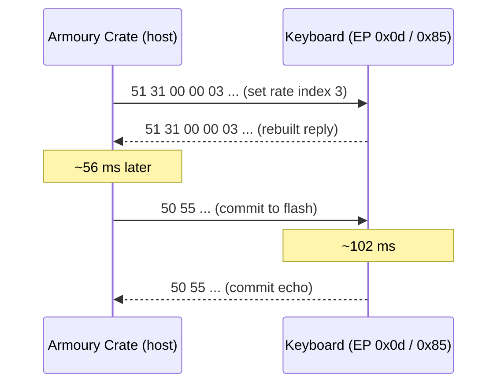
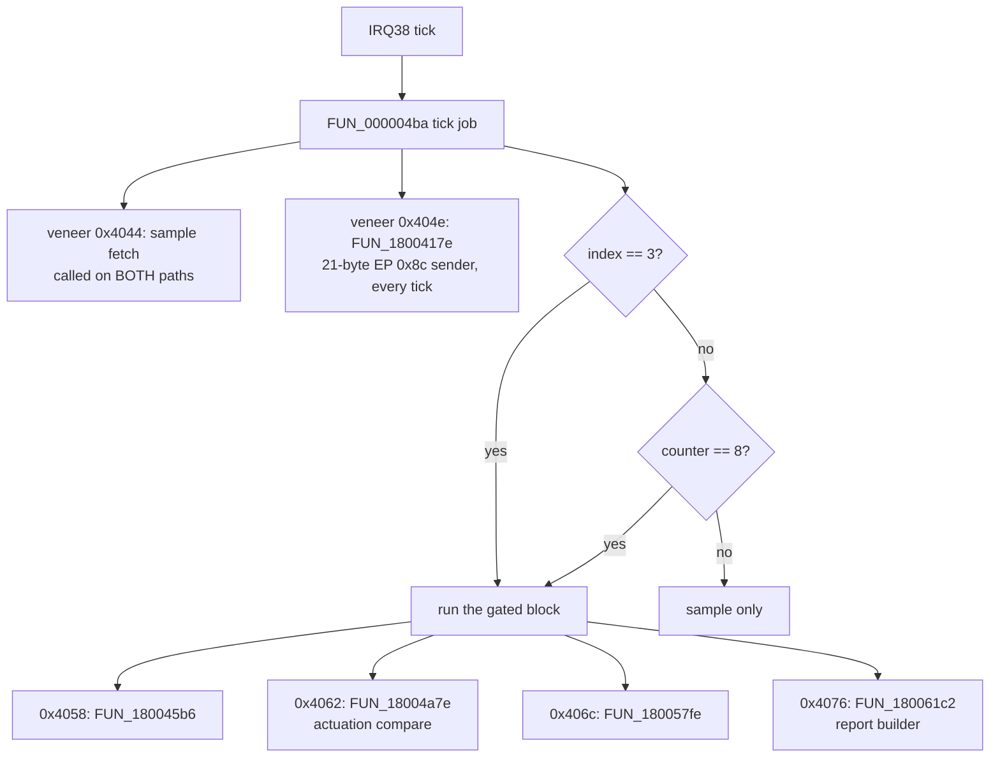

# Lesson 17 — The polling rate

> **In one sentence:** Armoury Crate sets the polling rate with a two-byte command, `51 31`, carrying a one-byte index, and the investigation measured what that index means from the *timing* of the keyboard's own reports, then found the hidden code that turns it into a real clock period.
> **You will learn:**
> - what "polling rate" means, and why the host and the keyboard each have their own part in it
> - how the `51 31` command is laid out, byte by byte, and why only 1000 Hz and 8000 Hz exist in Armoury Crate 6.5.7.0
> - how report timestamps on a 1 ms grid and a 125 µs grid turned "the owner remembers starting at 1000" into a measurement
> - how the firmware stores the rate, where the reader hid, and why three careful searches could not see it
> - why patching the handler to accept 2000 Hz and 4000 Hz would make the keyboard *worse*
> - the mistakes along the way: a zsh quirk, a miscounted enumeration, and a prediction that did not come true
>
> **Time:** ~75 minutes · **Prerequisites:** Lesson 4, Lesson 5, Lesson 7, Lesson 15, Lesson 16

---

## 1. The story (kid version)

Imagine a classroom. The teacher walks up and down the rows asking "Does anyone have a question?" She walks very fast: she passes every desk eight times every millisecond. She never gets tired, and she never changes speed.

One student sits at a desk with a notepad. When the student has something to say, they write it on a note and hold it up. The teacher can only collect a note that is already written. If there is no new note when she walks past, she just keeps walking.

Now the interesting part. The student can be told to write notes at one of two speeds. In **slow mode** the student is only allowed to write a fresh note once every millisecond, so even though the teacher walks past eight times, she only finds a new note on every eighth pass. In **fast mode** the student writes a fresh note every time the teacher might walk past. The teacher's walking speed is the same in both modes. **What changes is how often the student has something new ready.**

That is exactly what the keyboard's polling-rate setting does. And here is the detective trick of this lesson: if you write down the exact moment the teacher collects each note, you can tell which mode the student was in without asking anyone. In slow mode, every collection lands on a whole millisecond. In fast mode, collections land on every eighth-of-a-millisecond tick.

### How the analogy maps to the real thing

| In the story | In the keyboard |
|---|---|
| The teacher walking the rows | The computer (the USB host) asking endpoint `0x81` for a report |
| Eight passes every millisecond | `bInterval = 1` at high speed, which means one poll every 125 µs ([bInterval](00-glossary.md#binterval)) |
| The student's notepad | The keyboard's report builder |
| "Slow mode": a fresh note once per millisecond | Index 0 = 1000 Hz |
| "Fast mode": a fresh note on every pass | Index 3 = 8000 Hz |
| Being told which mode to use | The `51 31` command from Armoury Crate |
| Writing down the moment each note is collected | The timestamps in the USB capture `captures/02-polling-rate.pcap` |
| The school bell that sets the student's pace | IRQ38, the tick inside the keyboard ([Interrupt](00-glossary.md#interrupt-irq)) |

---

## 2. Why we needed this

By log 124 the investigation understood a great deal about the inside of the keyboard, but almost nothing about it carried **units**. Every timing fact was a ratio: IRQ38 divided by eight, by five, by two, by ten. Nobody knew how fast IRQ38 itself ticked. A setting that says "1000 Hz" looked like the perfect anchor: if you could follow the setting to the tick, you would finally know what one tick was worth in real time.

Log 124 tried to follow it from the firmware side and **could not** ([notes/polling-rate.md](../notes/polling-rate.md)):

- The saved Armoury Crate profile carried `performance.pollingRate = "3"`, an index and nothing else.
- All five candidate consumers were tested. The prescaler ladder was **eliminated** (its divisors are instruction-stream immediates), the mailbox was **eliminated**, the descriptor's `bInterval` was **eliminated as the runtime mechanism**, and a timer register was left **unresolved, not eliminated**, because no timer block had been identified anywhere.
- No index-to-Hz table existed in any of the four images.

Log 124 was careful about what its negative meant. It was a negative about **the firmware's consumers, not about the protocol**. `notes/protocol.md` already listed `SetPollingRate` and `GetPollingRate` as host HAL method names with no captured opcode. So a polling-rate command very probably existed on the wire; nobody had ever captured it being sent (log 124).

Log 124 also wrote down a tempting coincidence and refused to claim it: endpoint `0x81` has `bInterval = 1` (125 µs, 8000 Hz), endpoint `0x8e` has `bInterval = 4` (1 ms, 1000 Hz), and `8000 / 8 = 1000`. It called this "a **consistency, not a measurement**", and recorded it "so a future step can test it rather than inherit it" (log 124).

The alternative to more static digging was a **capture**: have the owner change the rate in Armoury Crate on Windows while USBPcap recorded the bus. That is what happened next. The owner took the capture with `USBPcapCMD.exe -d \\.\USBPcap3 -A --inject-descriptors …` and deliberately used **no address filter**, in case a rate change made the keyboard re-enumerate onto a new address ([captures/02-polling-rate-owner-facts.txt](../captures/02-polling-rate-owner-facts.txt)). The analysis instructions were written in advance as [PROMPT-polling-rate-analysis.md](../PROMPT-polling-rate-analysis.md), with a covering note, [NOTE-to-paste-with-prompt.md](../NOTE-to-paste-with-prompt.md).

---

## 3. The real thing

### 3.1 Only two rates exist in Armoury Crate 6.5.7.0

The prompt planned four changes: `1000 → 2000 → 4000 → 8000`. That turned out to be impossible. The owner's facts file says so in capitals:

```
ARMOURY CRATE 6.5.7.0 ON THIS HOST EXPOSES ONLY TWO VALUES: 1000 Hz and 8000 Hz.
There is no 2000 and no 4000 option in the UI.
```

The owner checked again on a fully updated, rebooted install: "there weren't 2k 4k polling rate options, just 1k and 8k" ([captures/02-polling-rate-owner-facts.txt](../captures/02-polling-rate-owner-facts.txt)). So the owner toggled between 1000 and 8000 many times instead: "i change a lot of times, they were more than the ones you told me."

Later in this lesson you will see that the *firmware* also only accepts two values, and that its timing gate only knows two states. So the UI is not hiding something the keyboard can do today. It shows exactly what the shipped firmware implements.

The capture file's basic facts, from the facts file and log 126:

| fact | value |
|---|---|
| primary file | `captures/02-polling-rate.pcap` (the original written by USBPcapCMD) |
| sha256 | `a6e860be5192ce942b95441ed2e75bef1ff41c5e87c98ba56747a0148ac45d54` |
| second file | `captures/02-polling-rate.pcapng` (an `editcap` format conversion only) |
| frames | 232530 over 473.772421 s |
| Armoury Crate | 6.5.7.0 |
| keyboard firmware | bcdDevice 1.59, unchanged (verified on the Windows host) |
| anchor method | traffic landmarks: **no wall-clock stamps were recorded** |

### 3.2 Finding the keyboard among its neighbours

A USB capture records the whole root hub, not just one device. This one held seven device addresses ([notes/polling-rate-protocol.md](../notes/polling-rate-protocol.md)):

| address | device | frames | subject |
|---|---|---|---|
| 1 | `174c:3074` | 6 | |
| 2 | `1532:00e6` | 44986 | |
| 3 | `0b05:19af` | 185372 | |
| 4 | `13d3:3614` | 6 | |
| 5 | `174c:2074` | 12 | |
| 6 | `0b05:1b7e` | 14 | **yes** |
| 7 | `0b05:1b7e` | 2134 | **yes** |

The keyboard is [VID:PID](00-glossary.md#pid--vid) `0b05:1b7e`. It shows up **twice**: address 6 before a deliberate replug and address 7 after it. Another ASUS device, `0b05:19af`, produced almost 80% of all frames. Because `--inject-descriptors` worked, every address resolved to a VID:PID read off the wire, so "which traffic is the keyboard's" rests on **identity, not on traffic shape** (log 126).

### 3.3 The command: `51 31`, index at byte 4

The vendor channel is interface 1, usage page `0xFF00`, 64-byte reports with no report ID, sent to the keyboard on endpoint `0x0d` (interrupt OUT) and answered on endpoint `0x85` (interrupt IN), exactly the transport log 107 had predicted (log 126). The whole vendor conversation in the capture is **74 requests and 74 replies**.

Twenty of those requests start with `51 31`. They come in **exactly two** 64-byte forms:

```
count  bytes 0..4        bytes 5..63
  14   51 31 00 00 00    59 zero bytes
   6   51 31 00 00 03    59 zero bytes
```

The two forms differ at **one byte out of 64**. Here is the layout, from [notes/polling-rate-protocol.md](../notes/polling-rate-protocol.md):

```
byte:  0    1    2  3    4         5..63
      51   31   00 00   <index>   00 ...
      |    |    |  |    |
      |    |    |  |    +-- the rate index (0 or 3 on the wire)
      |    |    +--+------- a zero 16-bit field
      |    +--------------- subcommand 0x31 = 49
      +-------------------- opcode 0x51 = 81, the "configuration write" family
```

The reply on `0x85` is `51 31 00 00 <index>` and the rest zero. It *looks* like a copy of the request, but it is not. The firmware rebuilds it: `FUN_18000a70` builds the frame from `&request[4]` with length 1, which is why it happens to match byte for byte (log 126).

**Every one of the twenty writes is followed by a `50 55` commit**, the command that saves settings to flash. In this capture the gaps were (log 126):

```
write -> 50 55 request:  48.9 .. 76.7 ms   (median ~56 ms)
50 55 -> its echo:      101.5 .. 116.4 ms  (median ~102 ms)
```

`notes/protocol.md` had recorded the `50 55` reply as "~220 ms later". Log 126 recorded the ~102 ms here as an observation, **not** as a correction, because this is a different Armoury Crate version and the capture cannot see how much data was being saved.



> **Never send.** The protocol note lists `50 55` and every `51 xx` write as **owner approval required**, and forbids constructing any erase, program, unlock, reset or SPI framing. The course only *reads* these bytes out of a capture ([notes/polling-rate-protocol.md](../notes/polling-rate-protocol.md)).

### 3.4 Twenty writes, twelve windows

Here are all twenty writes, with the time in seconds since the capture started and the value of byte 4 (log 126):

```
297.110=00  312.187=03  314.256=00  315.198=00  316.533=00  316.994=00
317.234=00  317.434=00  317.716=00  317.967=00  318.198=00  322.023=03
339.029=00  358.093=03  379.571=00  404.046=03  416.655=00  425.323=03
438.991=00  449.616=03
```

Notice the run of nine `00` writes between 314.256 and 318.198. That is one value written over and over, not a change. If you collapse repeats of the same value, you get **twelve windows that alternate perfectly**, six per value:

```
 1  297.110..312.187  0x00      7  379.571..404.046  0x00
 2  312.187..314.256  0x03      8  404.046..416.655  0x03
 3  314.256..322.023  0x00      9  416.655..425.323  0x00
 4  322.023..339.029  0x03     10  425.323..438.991  0x03
 5  339.029..358.093  0x00     11  438.991..449.616  0x00
 6  358.093..379.571  0x03     12  449.616..473.772  0x03
```

Why the nine rapid writes happened is **undetermined**. Log 128 later added a real negative: with every `0x51` subcommand enumerated, all nine are `51 31` index 0 and nothing else, so they are not a batch of other settings.

### 3.5 What kind of number is byte 4?

The prompt listed several possible encodings. The observed values `0x00` and `0x03` rule most of them out on their own (log 126):

| encoding | 1000 Hz would be | 8000 Hz would be | seen? |
|---|---|---|---|
| Hz / 1000 | `0x01` | `0x08` | no |
| raw Hz, little-endian 16-bit | `e8 03` | `40 1f` | no, bytes 5–6 are zero |
| a two-entry index | `0x00` | `0x01` | no |
| a **four-entry index** with only the ends reachable | `0x00` | `0x03` | **yes** |

(`0x3e8` = 1000 and `0x1f40` = 8000 in decimal, stored low byte first, see [little-endian](00-glossary.md#little-endian).)

Before the capture, the owner had written exactly this down as a prediction to test: "`0x00 / 0x03` → a 4-ENTRY index (0..3) with only 0 and 3 reachable from this UI … it would make `notes/ac-profile3-decoded.json`'s `"pollingRate": "3"` mean 8000 Hz" ([captures/02-polling-rate-owner-facts.txt](../captures/02-polling-rate-owner-facts.txt)). The covering note insisted it be treated as a hypothesis, "not as a result". The wire agreed with it. So the old profile's `"3"` now means **8000 Hz** (log 126).

But which value is 1000 Hz? Without wall-clock stamps, the only answer so far was "the owner says they started at 1000". That is the next section.

### 3.6 Measuring the rate from the timing of reports

Here is the key idea, built up slowly.

**Step 1: what the host does.** Endpoint `0x81` (the boot keyboard report) has `bInterval = 1`. On a high-speed bus that means the host asks it for data **every 125 µs**, eight times per millisecond. That is the teacher walking the rows.

**Step 2: what the device does.** If the keyboard only has a new report ready once per millisecond, the host's question will be answered "nothing new" seven times out of eight. Reports can then only *arrive* on whole-millisecond marks, even though the host is asking eight times as often.

**Step 3: the measurement.** Take two key reports in a row, and measure the gap between them. Ask two questions:

- Is the gap close to a whole number of milliseconds (within 50 µs)?
- Is the gap close to a whole number of 125 µs steps (within 12.5 µs)?

Each acceptance window is one tenth of its grid. If gaps were random, they would pass the 1 ms test 10% of the time (100 µs out of every 1000 µs) and the 125 µs test 20% of the time (25 µs out of every 125 µs). Those are the **chance levels**.

This is a *phase* measurement, so it does not matter how fast the owner typed. The owner was typing "1 2 3" with rollover, which produced gaps short enough to be useful (log 126).

**Step 4: the result.** Gaps were never measured across a rate change:

| endpoint | index | gaps | on the 1 ms grid | on the 125 µs grid |
|---|---|---|---|---|
| `0x81` | 0 | 121 | 85.1% | 90.9% |
| `0x81` | 3 | 229 | 12.2% | 90.0% |
| `0x8c` | 0 | 121 | 82.6% | 83.5% |
| `0x8c` | 3 | 229 | 13.1% | 88.6% |

Read it row by row:

- **Index 0** sits on the millisecond grid 85% of the time, against a 10% chance level. It also sits on the 125 µs grid, because every whole millisecond is also a whole number of 125 µs steps. The 1 ms grid is a *subset* of the fine one.
- **Index 3** sits on the millisecond grid only 12% of the time, which is chance. But 90% of the same gaps sit on the 125 µs grid.
- Two **independent** endpoints agree: `0x81` (interface 0's 8-byte boot report) and `0x8c` (interface 2's 21-byte report).

So **index 0 = 1000 Hz and index 3 = 8000 Hz, measured on the wire**, not assumed from memory. The 1 ms test is the one that separates the states, by roughly seven to one (log 126).

Log 126 also checked that the result is not carried by one burst of typing. Per window on `0x81`: window 3 (`0x00`) 62.5%, window 4 (`0x03`) 14.9%, window 5 (`0x00`) 88.6%, window 6 (`0x03`) 10.8%, window 12 (`0x03`) 7.0%. The other seven windows had no typing and are recorded as silent rather than filled in.

And it checked that the test itself can say "no": the grid predicate is fed a synthetic 1 ms train and must accept it, and a synthetic 125 µs train and must **reject** it on the millisecond grid. A test that says "yes" to everything would fail that (log 126).

### 3.7 A by-product: the bus really is high speed

Log 107 had *asserted* that the keyboard runs at USB high speed. Log 124 flagged that it was inheriting that claim instead of deriving it. This capture derives it.

On a full-speed bus, the host polls a `bInterval = 1` interrupt endpoint once per 1 ms frame, so two completions can only be a whole number of milliseconds apart. But index 3 contains gaps of **1.752, 2.120 and 2.876 ms**. Those cannot happen at full speed. **High-speed operation is now demonstrated, not inherited** (log 126).

### 3.8 Why there was no packet-rate "staircase"

The facts file predicted something else. It said the changes would be visible as "an 8x step in packets per second on the keyboard's IN endpoint … a staircase: high(?) → 1000 → 8000 → 1000 → 8000".

**They do not appear.** An idle HID keyboard sends nothing. The host asks every 125 µs, and the keyboard answers "nothing new" unless a key changed. So the packet *count* is set by typing, not by the rate. The rate is only visible in packet *timing*, which is what Section 3.6 used (log 126). Log 126 recorded the failed prediction as a finding. The measurement it forced turned out to be a better anchor than a staircase would have been.

### 3.9 No re-enumeration

Did changing the rate make the keyboard disconnect and reconnect? The capture says **no** (log 126):

- Exactly one real `GET_DESCRIPTOR(device)` in 473 seconds, at the deliberate replug (frame 76117 at t=185.087648).
- No device address above 7 anywhere.
- The keyboard holds address 7 across all twelve windows.
- All 402 control transfers to the subject lie inside a 0.73-second burst after the replug; the first rate change is over 110 seconds later.
- The owner heard no reconnect chime.

The mechanism does not need re-enumeration. The host already polls endpoint `0x81` every 125 µs in both states; the rate only changes how often the device has a new report.

There is a consequence, stated rather than guessed: **the capture holds no post-change configuration descriptor**, so whether any `bInterval` would change is **not answered**. What it does hold is the *pre-change* descriptor, read off the wire at frame 76126:

```
0x81,0x85,0x0d,0x8c,0x8e,0x0f | 1,1,4,1,4,4 | 8,64,64,21,19,64
wTotalLength 0x008d
```

That confirms log 107 on three points at once: its rebuilt `wTotalLength` of 141 (`0x8d`), its IN intervals 1/1/1/4, and the two OUT intervals (`0x0d` and `0x0f`) both being 4 (log 126).

### 3.10 The handler inside the firmware: `0x18002b2e`

Now the firmware side. The vendor [dispatcher](00-glossary.md#dispatcher) `FUN_18001fbe` selects opcode `0x51` with `cmp r2,#0x51` at `0x1800201c`, and subcommand `0x31` with `cmp r2,#0x31` at `0x180024d2`. That leads to the handler at `0x18002b2e` ([notes/polling-rate-protocol.md](../notes/polling-rate-protocol.md)).

First, the raw bytes. The installed application slice in `ghidra/imports/` is loaded at `0x18000000`, so file offset `0x2b2e` is address `0x18002b2e`:

```
00002b2e: 2179 0329 01d0 0029 19d1 c14a b2f8 f804  !y.)...)...J....
00002b3e: 61f3 0300 a2f8 f804 00f0 0f01 06fa 01f0  a...............
00002b4e: bd49 0870 bda0 19f0 10f9 231d 0022 3121  .I.p......#.."1!
```

Thumb-2 instructions are stored little-endian, 16 bits at a time ([Thumb-2](00-glossary.md#thumb-2)). So `21 79` is the halfword `0x7921`, which is `ldrb r1,[r4,#0x4]`, and `03 29` is `0x2903`, which is `cmp r1,#0x3`. Here is the whole listing with comments:

```
18002b2e  ldrb   r1,[r4,#0x4]     ; r4 = 0x180233a8, the vendor request buffer
18002b30  cmp    r1,#0x3
18002b32  beq    0x18002b38
18002b34  cmp    r1,#0x0
18002b36  bne    0x18002b6c        ; anything but 0 or 3 leaves the handler
18002b38  ldr    r2,[0x18002e40]   ; *(0x18002e40) = 0x18021de0, the profile block
18002b3a  ldrh.w r0,[r2,#0x4f8]
18002b3e  bfi    r0,r1,#0x0,#0x4   ; the index into bits 0..3
18002b42  strh.w r0,[r2,#0x4f8]
18002b46  and    r1,r0,#0xf
18002b4a  lsl.w  r0,r6,r1          ; r6 = 1, set once at 0x18001fd6
18002b4e  ldr    r1,[0x18002e44]   ; *(0x18002e44) = 0x1801e736
18002b50  strb   r0,[r1,#0x0]      ; the expanded multiplier, as a byte
18002b52  adr    r0,[0x18002e48]   ; the string "=S_PR_U"
18002b54  bl     0x1801bd78        ; the firmware's own logger
18002b58  adds   r3,r4,#0x4
18002b5a  movs   r2,#0x0
18002b5c  movs   r1,#0x31
18002b5e  str    r6,[sp,#0x0]      ; response payload length = 1
18002b60  b      0x180030c4        ; movs r0,#0x51 ; bl SendResponse64
```

Line by line, in plain words:

1. **`ldrb r1,[r4,#0x4]`**: read request byte 4, the index. `r4` holds the request buffer's address for the whole dispatcher.
2. **`cmp #3` / `beq` / `cmp #0` / `bne`**: accept only 3 or 0. Anything else, **including 1 and 2**, jumps out without changing anything.
3. **`ldr r2,[0x18002e40]`**: load a pointer from the [literal pool](00-glossary.md#literal-pool). The bytes at file offset `0x2e40` are `e0 1d 02 18`, which read little-endian as `0x18021de0`, the **profile block**.
4. **`ldrh.w` / `bfi #0,#4` / `strh.w`**: read the halfword at profile block `+0x4f8`, insert the index into its **low four bits**, and write it back. `bfi` means "bit field insert". A four-bit field can hold 0 to 15.
5. **`and r1,r0,#0xf`**: take the low four bits back out.
6. **`lsl.w r0,r6,r1`**: shift 1 left by the index. So index 0 gives 1, and index 3 gives `1 << 3` = 8. This is the **multiplier**.
7. **`strb` to `0x1801e736`**: cache the multiplier as one byte. The literal at `0x2e44` is `36 e7 01 18` = `0x1801e736`.
8. **`adr r0,[0x18002e48]` / `bl 0x1801bd78`**: pass a string to the firmware's logger. The bytes at `0x2e48` are `3d 53 5f 50 52 5f 55 00`, the ASCII text **`=S_PR_U`** with a zero terminator. This is the firmware's own name for the command.
9. The last five lines build and send a one-byte reply with opcode `0x51` and subcommand `0x31`.

Combined with the measurement, the multiplier's unit is **1000 Hz**: multiplier 1 is 1000 Hz and multiplier 8 is 8000 Hz. That is also where the table's middle rows come from:

| index | multiplier `1 << index` | rate | how known |
|---|---|---|---|
| 0 | 1 | 1000 Hz | **measured on the wire** |
| 1 | 2 | 2000 Hz | derived from the firmware's `1 << index`; **not observed** |
| 2 | 4 | 4000 Hz | derived from the firmware's `1 << index`; **not observed** |
| 3 | 8 | 8000 Hz | **measured on the wire** |

Note carefully: the four-entry reading rests on `bfi`'s four-bit field, the `0xf` mask and the `1 << index` expansion, **not** on the handler accepting 1 or 2. It does not accept them ([notes/polling-rate-protocol.md](../notes/polling-rate-protocol.md)).

### 3.11 Where the rate is saved: profile block `+0x4f8`

Log 125 had read profile block `+0x4f8` as the **version stamp** copied from ROM `0x1801bfbc`. Log 126 **refined** that without withdrawing it: the halfword is the version stamp *and*, in its low four bits, the polling-rate index.

Why is that consistent? Because of log 125's own checksum map. The profile block has two [checksums](00-glossary.md#checksum): A covers `+0x002..+0x4b1`, and B covers `+0x4fc..+0x7bb`. The field at `+0x4f8` falls **between** them, covered by neither. Writing four bits there invalidates neither sum (log 126). Log 128 later added that the polling-rate index is the **only** writable field covered by no checksum; eight other writable fields are all covered.

```
profile block 0x18021de0
+0x002 ........................ +0x4b1   +0x4f8   +0x4fc ........................ +0x7bb
|<------- checksum A covers -------->|    |rate|   |<------- checksum B covers -------->|
                                          bits 0..3
```

The field survives storage. On profile load, `FUN_18000d56` at `0x1800153a` does the identical expansion into the same byte: `ldrb.w r1,[r7,#0x4f8]; and r1,r1,#0xf; lsl.w r1,r0,r1; strb r1,[r2]` (log 126).

### 3.12 A read-back command nobody had found: `12 15`

`notes/protocol.md` had carried the HAL name `GetPollingRate` with no opcode since the earliest work. Log 126 found it in the dispatcher: query `12 15`, handler at `0x18002254`. It reads profile block `+0x4f8`, masks with `0xf`, and returns the index in reply byte 4. It writes nothing.

Confidence: **strongly inferred**. The handler is read out of the instruction stream and reaches the same field the set handler writes, but Armoury Crate never sent `12 15` in this capture, so no reply was ever observed (log 126).

### 3.13 "Six writers, no reader", and why three searches were blind

Log 126 went looking for whatever *reads* the multiplier byte at `0x1801e736`. It ran three independent searches, and showed each one was not blind:

1. an **aligned-word search** of all fifteen imported images for the 32-bit value `0x1801e736`;
2. a **displacement search** over every region pointer within 4095 bytes below it (two apparent hits were rejected on inspection);
3. a **`movw`/`movt` search** for code building the address from two halves.

Result: **six writers and no reader** (log 126). Log 126 was careful to say this was **not** evidence the device ignores the byte, because the wire shows it obeying.

Log 127 found the reader, and the reason is simple once you see it. `0x1801e736` is **`0x1801e734 + 2`**. And `0x1801e734` is the key-state struct that log 109 had recorded twelve report-range functions loading from a literal pool. A reader that says "load the byte at base plus 2" looks like this:

```
ldr  r0,[pc,#...]    ; r0 = 0x1801e734   <- the literal in the pool is 0x1801e734
ldrb r0,[r0,#0x2]    ; read 0x1801e734 + 2 = 0x1801e736
```

The literal pool holds `0x1801e734`, not `0x1801e736`. **No literal equal to the address exists**, so every search for the address comes back empty. All three searches were correct, and all three were looking for the wrong byte shape (log 127).

The answer had been sitting in the repository since log 100: the Ghidra **peripheral census** in `ghidra/peripherals/`, which resolves `base + offset` into a target address. One grep finds it:

| dir | instruction | function | base | off |
|---|---|---|---|---|
| read | `0x180053c4` | `FUN_18004a7e` | `0x1801e734` | 2 |
| read | `0x180054ac` | `FUN_18004a7e` | `0x1801e734` | 2 |
| read | `0x18005534` | `FUN_18004a7e` | `0x1801e734` | 2 |
| read | `0x180055a2` | `FUN_18004a7e` | `0x1801e734` | 2 |
| write | `0x1800117e` `0x18001548` `0x180018f8` `0x18001ece` | `FUN_18000d56` | `0x1801e736` | 0 |
| write | `0x18002b50` | `FUN_18001fbe`, the `51 31` handler | `0x1801e736` | 0 |
| write | `0x18007a1e` | **no function body**, a profile-apply path | `0x1801e736` | 0 |

Four reads, one function: **`FUN_18004a7e`, the actuation compare**, which logs 110 and 119 had already placed in the tick chain. The census shows five of the six writers; the sixth is in code Ghidra never put inside a function, and only log 126's byte search sees it. **Neither method is sufficient alone** ([notes/polling-rate-reader.md](../notes/polling-rate-reader.md)).

As log 127 put it: log 126 asked "where does the constant appear?"; the right question was "what does the census say about the address?".

### 3.14 What the reader does with the multiplier: a ×10×multiplier timeout

All four read sites run the same arithmetic (log 127):

```
180053c0  ldrb.w r2,[lr,#0x22]        ; a per-key byte parameter
180053c4  ldrb   r0,[r0,#0x2]         ; THE MULTIPLIER, 1 << index
180053ca  add.w  r0,r0,r0,lsl #2      ; x5
180053ce  lsls   r0,r0,#0x1           ; x2  -> x10
180053d0  muls   r2,r0,r2             ; parameter x 10 x multiplier
180053d2  ldr.w  r0,[r12,r4,lsl #2]   ; a per-key 32-bit counter
180053d6  cmp    r2,r0                ; has the counter reached it?
```

Let's decode the clever middle part. `add.w r0,r0,r0,lsl #2` means `r0 = r0 + (r0 << 2)` = `r0 + 4·r0` = `5·r0`. Then `lsls r0,r0,#1` doubles it: `10·r0`. So the code computes **parameter × 10 × multiplier** without a multiply instruction for the ×10.

The counter it compares against is a tick counter, bumped once per invocation:

```
18005488  ldr.w  r3,[r8,r4,lsl #2]
1800548c  adds   r3,r3,#0x1
1800548e  str.w  r3,[r8,r4,lsl #2]
```

So the multiplier is **a scale on a tick-denominated timeout, not a divisor**. The parameter comes from `0x180202d8 + layer*0xd84 + key*0x20 + 0x22`. `0x361 × 4 = 0xd84` is log 125's keymap-bank layer stride and `0x20` is its record size, so the array is identified. The `+0x20`/`+0x22` fields lie outside what log 125 mapped and **are not named** (log 127). (Log 128 later showed the `+0x22` timeout drives a dual-role key; Lesson 18 covers that.)

Why would you scale a timeout by the rate? Because if the tick job runs eight times more often, a counter reaches any given number eight times sooner. Multiplying the threshold by 8 keeps the **real** time the same. That tells you the tick rate must change with the setting, and the multiplier is not what changes it. So where does it change?

### 3.15 Where the period is really set: the entry image's tick job

In the **other** image. `FUN_000004ba` is the entry image's tick job, the one logs 109, 110 and 119 traced. It reads the profile block's rate field **directly** (log 127):

```
     4d4: ldr    r0,[pc,#0xe0]   ; -> 0x18021de0, THE PROFILE BLOCK
     4d6: ldrb.w r0,[r0,#0x4f8]  ; the polling-rate field
     4da: and    r1,r0,#0xf      ; the index
     4de: ldr    r0,[pc,#0xdc]   ; -> 0x1801e6a4, the /8 counter
     4e0: cmp    r1,#0x3         ; <-- THE BYPASS TEST
     4e2: beq    0x4fc           ;     index 3 -> run EVERY tick
     4e4: ldrb   r1,[r0]
     4e6: adds   r1,r1,#0x1
     4ea: strb   r1,[r0]
     4ec: cmp    r1,#0x8         ; <-- the divide-by-eight
     4ee: beq    0x4fc
     4f0: bl     0x4044          ;     otherwise: sample only
```

You can see the bytes yourself in the entry image (Exercise 4): at `0x4e0` the bytes are `03 29 0b d0`, which are `cmp r1,#0x3` (`0x2903`) and `beq` (`0xd00b`).

In plain words: **if the index is 3, run the decision stage on every tick. Otherwise, count ticks and run it only on every eighth.** This is a **two-way branch**, not a ladder and not a table:

| index | divisor |
|---|---|
| 0 | 8 |
| 1 | 8 |
| 2 | 8 |
| 3 | 1 |

What sits behind the gate, and what does not ([notes/polling-rate-reader.md](../notes/polling-rate-reader.md)):



Two consequences matter a lot:

- **Hall acquisition is never slowed by the polling rate.** The sample fetch (veneer `0x4044`) runs on both paths. Only the decision and report stage is gated.
- The tick job is **byte-identical in both firmware releases**, and the vendor application carries the same four multiplier reads at `0x1801e70a`, the independently measured relocation of the struct.

### 3.16 A period for IRQ38, at last

Here is the reasoning, and why it uses the **slow** state (log 127):

- At index 3, reports arrive on a 125 µs grid. But the host polls every 125 µs anyway, so a 125 µs grid there could just be the host's schedule. It proves nothing on its own.
- At index 0, reports arrive on a **1 ms** grid, while the host is still polling every 125 µs. The host cannot create a 1 ms grid, so the millisecond must come from the **device**.
- The gate says index 0 runs the report stage on every eighth tick.
- So 8 ticks = 1 ms, and one tick is **T = 125 µs**. **IRQ38 = 8000 Hz.**

Now the fast state becomes a **prediction** instead of a fit: divisor 1 gives 125 µs, and log 126 measured 125 µs.

Confidence: **strongly inferred, not observed**. The gate is read from the instruction stream, and the 1 ms grid is measured on the wire, but combining them also assumes the report stage makes **at most one new report per invocation**. That assumption is the whole gap. It would be refuted by a report stage that coalesced reports, or by a second ungated producer for endpoint `0x81` ([notes/polling-rate-reader.md](../notes/polling-rate-reader.md)).

This confirms log 124's `8000 / 8 = 1000` lead, which it had recorded as "a consistency, not a measurement … written down so a future step can test it." This was that step, and the lead held.

The two sites together give a lovely cross-check:

| index | divisor | multiplier | job period | invocations/unit | real time/unit |
|---|---|---|---|---|---|
| 0 | 8 | 1 | 1 ms | 10 | **10 ms** |
| 3 | 1 | 8 | 125 µs | 80 | **10 ms** |

`multiplier × divisor` is 8 in both reachable states, so the per-key parameter means **10 ms per unit at either rate**. Two unrelated code sites, in two different images, agree on one rate model, and neither was used to derive the other (log 127).

The dependency map's `clock_frequency` entry stays **unresolved**. One derived period is not a register map: no crystal value, PLL multiplier or divider register was recovered. The number lives in `notes/polling-rate-reader.json`, deliberately not in the dependency map (log 127).

### 3.17 Would 2000 Hz and 4000 Hz work if we patched the handler? No.

The owner asked this question directly. The answer is **no**, and it is the opposite of what the first reading suggested (log 127).

Suppose you patched the two compares at `0x18002b30` and `0x18002b34` so the handler accepted 1 and 2. Then:

- The entry image's gate is `cmp r1,#3`. Indices 1 and 2 **fail** it and take the divide-by-eight path, so reports would still come out at the **1000 Hz** cadence.
- But the multiplier would become 2 or 4, so `FUN_18004a7e` would stretch every per-key timeout by 2× or 4×.

The keyboard would be **worse**, in a way a user would feel (hold and tap timings too long) and a wire capture would not show.

Really getting the middle rates would need **two sites in two images**: the dispatcher's compares **and** the divider selection in the **entry** image at `0x4e0`/`0x4ec`. The entry image is the one the bootloader selects and verifies, which is a materially different risk class.

And yet the arithmetic is already four-rate capable. A divisor of `8 >> index` pairs exactly with the existing multiplier `1 << index`: their product is 8 for all four indices, so the parameter would stay in 10 ms units at 1000, 2000, 4000 and 8000 Hz. Together with the four-bit field and its bound of 3, log 127 calls this "the strongest available evidence that four rates were designed and two were shipped." `bInterval` is already 1, so no descriptor change would be needed. **Not verifiable offline:** whether the CPU has enough headroom at the intermediate rates. **Nothing was patched.**

### 3.18 What a custom firmware must reproduce

The reader note ends with a checklist for anyone replacing the application ([notes/polling-rate-reader.md](../notes/polling-rate-reader.md)):

- sample on **every** tick;
- gate the actuation compare and the report builder **together**;
- leave the 21-byte endpoint `0x8c` sender ungated;
- scale every tick-denominated timeout by the same factor, or hold and tap timings move when the user changes the rate;
- keep `bInterval` at 1.

### 3.19 Still unresolved

From FINDINGS (logs 126, 127): whether the `51 31` write alone applies the rate or the `50 55` commit is needed (U4); the `bInterval` question after a change; the one-report-per-invocation assumption; the clock configuration; the names of the `+0x20`/`+0x22` fields; CPU headroom at 2000/4000 Hz; what sets `*(0x1801e810)`, the word that gates the whole tick job; whether the 10 ms parameter is user-facing; and the meanings of `12 03`, `12 07`, `12 08`, `12 12` and `12 16` as of log 126 (log 128 later gave four of `notes/protocol.md`'s five "meaning unknown" queries a meaning; see Lesson 18).

Why is U4 still open? Fourteen key reports do land between a write and its commit, but **never two in a row**, and only a consecutive pair gives a gap you can grade. Twelve of the fourteen also follow a write of the value the device already held (log 126).

---

## 4. Decisions and why

| Decision | Why | Alternative rejected | Evidence (log) |
|---|---|---|---|
| Capture with no `--devices` address filter | A rate change might re-enumerate the keyboard onto a new address | Filter to the known address, which would have dropped a re-enumeration at the worst moment | facts file, log 126 |
| Treat the `.pcap` as primary evidence | It is the file USBPcapCMD wrote; the `.pcapng` is only a conversion | Analyse the conversion | facts file |
| Anchor the index-to-Hz mapping on report timing | No wall-clock stamps existed, and the owner's memory cannot carry a protocol document | Trust the stated order "1000, 8000, 1000, 8000" | log 126 step 4 |
| Label 2000 and 4000 Hz "derived, not observed" | Armoury Crate cannot send indices 1 and 2, and the handler rejects them | State all four rates as fact | logs 126, 127 |
| Record "no re-enumeration" as a first-class fact | A negative is still a protocol fact the owner's app needs | Omit it for being a negative | log 126 |
| Do not infer the post-change `bInterval` | No post-change descriptor exists in the capture | Assume it stays 1,1,1,4,1 | log 126 |
| Leave `clock_frequency` unresolved in the dependency map | One derived period is not a register map | Write "8000 Hz" into the map | log 127 |
| Answer the 2000/4000 question "no" | The entry image's gate is a two-way branch | Answer "yes" from the ×10 arithmetic alone | log 127 |
| Invert log 124's "nothing frame-shaped" rule for log 126's JSON | The deliverable exists to carry exact command bytes; instead every write is flagged `owner_approval_required` and read-only queries are shown *not* to carry the flag | Keep a rule that cannot hold, or drop it silently | log 126 (TIMELINE) |

---

## 5. What went wrong, and how it was caught

### The owner's prediction of an 8× staircase
- **Believed:** the rate changes would show up as a staircase in packets per second ([facts file](../captures/02-polling-rate-owner-facts.txt)).
- **True:** an idle HID keyboard emits almost nothing, so packet counts follow typing, not the rate.
- **Caught by:** looking for the staircase and not finding it; log 126 recorded "that prediction is worth recording as failed".
- **Lesson:** a failed prediction is a result. Here it pushed the analysis to packet *timing*, which gave a real measurement.

### The owner's "`usb.data_fragment` returns EMPTY"
- **Believed:** that field is always empty on this capture.
- **True:** it is empty on the vendor endpoints, but on TShark 4.7.3 it carries the short `SET_REPORT` payloads on 90 control transfers.
- **Caught by:** log 126 re-verifying every field name on its own tshark build, as the covering note asked.
- **Lesson:** the check was **scoped** to the vendor endpoints rather than loosened. A true statement about part of the data is not a true statement about all of it.

### Two enumerations that were really one
- **Believed:** the first pass counted **two** enumerations.
- **True:** only one. USBPcap's `--inject-descriptors` synthesises descriptor frames at t=0 for devices already plugged in, and by `bRequest` and `bDescriptorType` alone they look identical to a real read.
- **Caught by:** a check. The fix excludes t=0 frames, **keeps** them in the JSON under `injected_at_t0`, and a test requires the injected set to be strictly larger than the real one (log 126).
- **Lesson:** when you exclude something, keep it visible, so the exclusion can never quietly hide a real event.

### The zsh `set -- $iv` mistake
- **Believed:** an ad-hoc shell check said "no report lands between a write and its commit".
- **True:** fourteen reports do land there. In **zsh**, `set -- $iv` does **not** split an unquoted variable into words (bash does), so every interval was compared against one malformed bound and every window returned zero.
- **Caught by:** the tool's own test, which failed and contradicted the shell result (log 126).
- **Lesson:** the corrected finding was *sharper* than the false one: no two **consecutive** reports land there, so U4 is blocked by the absence of a pair, not the absence of reports. A third version of the test was also wrong, claiming all fourteen followed a no-op write; two follow the real change at t=314.2555, so the test and the prose now say twelve and two. Exercise 3 lets you see the zsh behaviour yourself.

### "Six writers and no reader"
- **Believed:** nothing reads `0x1801e736` (log 126).
- **True:** `FUN_18004a7e` reads it four times as `key_state+2`.
- **Caught by:** log 127 grepping the peripheral census, which had been in the tree since log 100.
- **Lesson:** a search can be correct and still blind. Ask what shape the evidence would take, not only where a constant appears. Log 126 had scoped its negative carefully ("not evidence the device ignores it"), which is why the correction did not contradict it.

### The sixth writer's owner
- **Believed:** log 126 attributed the write at `0x18007a1e` to `FUN_18007030`.
- **True:** that address lies in code with **no function body**; log 126 had mapped it to the nearest preceding function entry.
- **Caught by:** log 127 comparing the census (which only sees functions) with the byte search.
- **Lesson:** "nearest function above" is a guess, and it fails whenever a literal pool sits far from its owner.

### "2000 and 4000 would work if the handler accepted them"
- **Believed:** the investigation's own first reading, from the generic `1 << index` and ×10 arithmetic.
- **True:** the entry image's `cmp r1,#3` gate is two-way, so indices 1 and 2 would report at 1000 Hz with timeouts 2× and 4× too long.
- **Caught by:** reading the entry image's tick job before answering (log 127: "I nearly answered 'yes' from the ×10 arithmetic alone").
- **Lesson:** a mechanism that *could* support something is not proof the whole path does. Follow every site that touches the value.

### "The actuation comparison runs on IRQ38's tick divided by 8"
- **Believed:** logs 110 and 119.
- **True:** at 1000 Hz, yes; at 8000 Hz it runs on **every** tick. Both logs had scoped their claim to "inside the branch gated by that job's own /8 counter", which is exactly the branch the rate bypasses (log 127).
- **Lesson:** careful scoping turns a would-be error into a refinement.

### A check that was too broad, in log 124
- **Believed:** "no polling-rate command appears in the observed wire record", implemented as "the word 'polling' does not appear in `protocol.md`".
- **True:** the word appears twice, and both mentions list `SetPollingRate`/`GetPollingRate` as HAL names never captured.
- **Caught by:** the check failing (log 124, TIMELINE).
- **Lesson:** the check was narrowed to the parsed command table, and a second check was added asserting the HAL fact, rather than loosening the first one away.

### A test that was right to fail
- In log 127, refining the dependency map broke `test_no_frequency_is_claimed_anywhere`, which bans any "`<number> Hz`" from that map's report. The test was right. The boundary now **points** at `notes/polling-rate-reader.json` instead of stating the number, and the existing test was not touched (log 127, TIMELINE).

---

## 6. Try it yourself

All of these only read files. Run them from `keyboard/falchion-re/`. None of them touches the keyboard.

### Exercise 1: list the `51 31` frames with tshark

If `tshark` is installed (here it reports `TShark (Wireshark) 4.7.3.`), filter the capture to the keyboard's post-replug address, the OUT endpoint, and payloads starting `51 31`. The `awk` just pulls out byte 4:

```bash
tshark -r captures/02-polling-rate.pcap \
  -Y 'usb.device_address==7 && usb.endpoint_address==0x0d && usbhid.data[0:2]==51:31' \
  -T fields -e frame.number -e frame.time_relative -e usbhid.data \
  | awk '{printf "%7s  t=%8.3f  %s  index=%s\n", $1, $2, substr($3,1,12), substr($3,9,2)}'
```

Real output:

```
 142443  t= 297.110  513100000000  index=00
 149897  t= 312.187  513100000300  index=03
 150977  t= 314.255  513100000000  index=00
 151361  t= 315.198  513100000000  index=00
 151907  t= 316.533  513100000000  index=00
 152107  t= 316.994  513100000000  index=00
 152217  t= 317.234  513100000000  index=00
 152315  t= 317.434  513100000000  index=00
 152443  t= 317.716  513100000000  index=00
 152557  t= 317.966  513100000000  index=00
 152661  t= 318.198  513100000000  index=00
 154482  t= 322.023  513100000300  index=03
 163187  t= 339.029  513100000000  index=00
 172249  t= 358.093  513100000300  index=03
 182287  t= 379.571  513100000000  index=00
 193912  t= 404.046  513100000300  index=03
 203863  t= 416.655  513100000000  index=00
 208683  t= 425.323  513100000300  index=03
 215355  t= 438.991  513100000000  index=00
 220736  t= 449.616  513100000300  index=03
```

Twenty frames, matching Section 3.4. (Log 126 rounds the third one to 314.256; the raw time is 314.2555.) Now check that every reply on `0x85` is the same two shapes, and that there are twenty commits:

```bash
tshark -r captures/02-polling-rate.pcap \
  -Y "usb.device_address==7 && usb.endpoint_address==0x85 && usbhid.data[0:2]==51:31" \
  -T fields -e usbhid.data | cut -c1-10 | sort | uniq -c
tshark -r captures/02-polling-rate.pcap \
  -Y "usb.device_address==7 && usb.endpoint_address==0x0d && usbhid.data[0:2]==50:55" | wc -l
```

```
     14 5131000000
      6 5131000003
20
```

### Exercise 2: the project's own decoder

`tool/decode_capture.py` only reads a capture file (its `--help` says: "Read-only and offline. Captures are evidence: they are opened for reading only and never modified. NO DEVICE IS ACCESSED"). It finds the subject by VID:PID off the wire, never by a hard-coded address:

```bash
python3 tool/decode_capture.py captures/02-polling-rate.pcap
```

Real output (trimmed):

```
CAPTURE captures/02-polling-rate.pcap
SUBJECT 0b05:1b7e at bus 3 address 6; bus 3 address 7
FILTER ((usb.bus_id==3 && usb.device_address==6) || (usb.bus_id==3 && usb.device_address==7)) && (usb.endpoint_address==0x0d || usb.endpoint_address==0x85) && usb.data_len==64
REPORTS 148 out=74 in=74 unique=28

 frame      time  dir  len  first 16 bytes
 76627    185.573  OUT   64B  12 14 02 00 00 00 00 00 00 00 00 00 00 00 00 00  (rest zero)
 76628    185.574  IN    64B  12 14 02 00 30 32 34 30 38 30 36 30 30 31 36 37  (rest zero)
 …
142443    297.110  OUT   64B  51 31 00 00 00 00 00 00 00 00 00 00 00 00 00 00  (rest zero)
142444    297.111  IN    64B  51 31 00 00 00 00 00 00 00 00 00 00 00 00 00 00  (rest zero)
142467    297.165  OUT   64B  50 55 00 00 00 00 00 00 00 00 00 00 00 00 00 00  (rest zero)
142510    297.268  IN    64B  50 55 00 00 00 00 00 00 00 00 00 00 00 00 00 00  (rest zero)
149897    312.187  OUT   64B  51 31 00 00 03 00 00 00 00 00 00 00 00 00 00 00  (rest zero)
149898    312.188  IN    64B  51 31 00 00 03 00 00 00 00 00 00 00 00 00 00 00  (rest zero)

OUT opcode histogram (first two bytes):
  12 00  x5
  …
  50 55  x20
  51 31  x20
```

Things to notice: 74 out and 74 in; the `12 14` reply's bytes `30 32 34 30 38 30 36 30 30 31 36 37` are ASCII for the model string `024080600167`; and the first `51 31` → `50 55` pair is 55 ms apart (297.110 → 297.165).

### Exercise 3: the zsh word-splitting trap

This reproduces the *shell behaviour* behind the log-126 mistake, using the first window's bounds as sample text. It does not touch the capture:

```bash
zsh  -c 'iv="297.110 312.187"; set -- $iv; echo "zsh: $# argument(s); first=[$1]"'
bash -c 'iv="297.110 312.187"; set -- $iv; echo "bash: $# argument(s); first=[$1]"'
zsh  -c 'iv="297.110 312.187"; set -- ${=iv}; echo "zsh with \${=iv}: $# argument(s); first=[$1]"'
```

```
zsh: 1 argument(s); first=[297.110 312.187]
bash: 2 argument(s); first=[297.110]
zsh with ${=iv}: 2 argument(s); first=[297.110]
```

In zsh, `$1` became the whole string "297.110 312.187", which is not a number, so every comparison against it was wrong. Your login shell is zsh, so this trap applies to you.

### Exercise 4: see the handler and the gate in the raw bytes

```bash
F=ghidra/imports/installed_app_b_slot1_flash21000_dst18000000_len1e380_be463863.bin
xxd -s 0x2b2e -l 0x34 $F      # the 51 31 handler
xxd -s 0x2e40 -l 8 $F         # its two literals
xxd -s 0x2e48 -l 8 $F         # the string it logs
F2=ghidra/imports/installed_app_a_slot0_flash11000_dst00000000_len058ac_f093979a.bin
xxd -s 0x4d4 -l 0x1e $F2      # the entry image's tick-job gate
```

```
00002b2e: 2179 0329 01d0 0029 19d1 c14a b2f8 f804  !y.)...)...J....
00002b3e: 61f3 0300 a2f8 f804 00f0 0f01 06fa 01f0  a...............
00002b4e: bd49 0870 bda0 19f0 10f9 231d 0022 3121  .I.p......#.."1!
00002b5e: 0096 b0e2                                ....
00002e40: e01d 0218 36e7 0118                      ....6...
00002e48: 3d53 5f50 525f 5500                      =S_PR_U.
000004d4: 3848 90f8 f804 00f0 0f01 3748 0329 0bd0  8H........7H.)..
000004e4: 0178 491c c9b2 0170 0829 05d0 03f0       .xI....p.)....
```

Find `03 29` (`cmp r1,#3`) in both images, `e0 1d 02 18` (the profile block `0x18021de0`), `36 e7 01 18` (the multiplier byte `0x1801e736`), and `08 29` (`cmp r1,#8`, the divide-by-eight). In the handler, `f8 04` appears twice: that is the `0x4f8` offset inside `ldrh.w`/`strh.w`.

### Exercise 5: the "one grep" that found the reader

```bash
grep -h "target=0x1801e736" ghidra/peripherals/*.txt
```

```
ACCESS target=0x1801e736 width=1 dir=read instr=180053c4 func=18004a7e base=r0@0x1801e734 off=2 stored=unknown
ACCESS target=0x1801e736 width=1 dir=read instr=180054ac func=18004a7e base=r12@0x1801e734 off=2 stored=unknown
ACCESS target=0x1801e736 width=1 dir=read instr=18005534 func=18004a7e base=r0@0x1801e734 off=2 stored=unknown
ACCESS target=0x1801e736 width=1 dir=read instr=180055a2 func=18004a7e base=r12@0x1801e734 off=2 stored=unknown
ACCESS target=0x1801e736 width=1 dir=write instr=1800117e func=18000d56 base=r1@0x1801e736 off=0 stored=unknown
ACCESS target=0x1801e736 width=1 dir=write instr=18001548 func=18000d56 base=r2@0x1801e736 off=0 stored=unknown
ACCESS target=0x1801e736 width=1 dir=write instr=180018f8 func=18000d56 base=r1@0x1801e736 off=0 stored=unknown
ACCESS target=0x1801e736 width=1 dir=write instr=18001ece func=18000d56 base=r1@0x1801e736 off=0 stored=unknown
ACCESS target=0x1801e736 width=1 dir=write instr=18002b50 func=18001fbe base=r1@0x1801e736 off=0 stored=unknown
```

Look at the `base=` column: the reads use `0x1801e734` with `off=2`. That is the whole reason the literal searches were blind. Count the writes: five, not six. The sixth (`0x18007a1e`) is in code with no function, so the census cannot see it.

### Exercise 6: check that the generated notes are current

```bash
python3 tool/map_polling_rate.py --check
python3 tool/map_polling_rate_protocol.py --check
python3 tool/map_polling_rate_reader.py --check
```

```
RESULT reports_current=True stale=0
RESULT reports_current=True stale=0
RESULT reports_current=True stale=0
```

Each tool regenerates its note in memory from the evidence and compares it with the file in `notes/`. "Current" means the note still says exactly what the evidence produces.

---

## 7. Check your understanding

**1. The host polls endpoint `0x81` every 125 µs at both settings. So what does the polling-rate setting actually change?**

<details><summary>Answer</summary>

How often the **device** has a new report ready. At index 0 the report stage runs on every eighth tick (every 1 ms); at index 3 it runs on every tick (every 125 µs). The host's schedule is the same in both states, which is also why no re-enumeration is needed (logs 126, 127).
</details>

**2. Why is the 1 ms grid test, not the 125 µs test, the one that tells the two states apart?**

<details><summary>Answer</summary>

Every whole millisecond is also a whole number of 125 µs steps, so the 1 ms grid is a subset of the 125 µs grid. Both states pass the 125 µs test (90.9% and 90.0% on `0x81`). Only index 0 passes the 1 ms test (85.1% against 12.2%, with a 10% chance level) (log 126).
</details>

**3. Three searches for readers of `0x1801e736` found none. Why, and what found them?**

<details><summary>Answer</summary>

Every reader loads the base `0x1801e734` from a literal pool and then reads `[base,#2]`. No literal equal to `0x1801e736` exists, so aligned-word, displacement and `movw`/`movt` searches for the address cannot see them. The Ghidra peripheral census resolves `base + offset` into a target, and one grep of it showed four reads in `FUN_18004a7e` (log 127).
</details>

**4. What does the `×10×multiplier` in `FUN_18004a7e` achieve?**

<details><summary>Answer</summary>

It keeps a per-key timeout constant in **real time** when the tick rate changes. At index 0 the job runs every 1 ms with multiplier 1; at index 3 every 125 µs with multiplier 8. `multiplier × divisor` is 8 in both, so one unit of the parameter is 10 ms at either rate (log 127).
</details>

**5. If you patched the `51 31` handler to accept index 2, what would happen, and why?**

<details><summary>Answer</summary>

Reports would still come out at 1000 Hz, because the entry image's gate is `cmp r1,#3`, a two-way branch, so index 2 takes the divide-by-eight path. The multiplier would become 4, so every per-key timeout would be 4× too long. You would also need to change the entry image's divider at `0x4e0`/`0x4ec`, a different risk class (log 127).
</details>

**6. Why is "IRQ38 = 8000 Hz" labelled strongly inferred and not observed?**

<details><summary>Answer</summary>

The gate and the 1 ms grid are each observed, but combining them assumes the report stage makes at most one new report per invocation. That is not separately proven; a coalescing report stage or a second ungated producer for `0x81` would refute it (log 127).
</details>

---

## 8. Sources

- [../FINDINGS.md](../FINDINGS.md), sections "The polling-rate path: no consumer, no units (log 124)", "The polling-rate protocol, from the wire (log 126)", "The polling-rate reader, and a period for IRQ38 (log 127)"
- [../TIMELINE.md](../TIMELINE.md), entries for logs 124, 126, 127, and "Corrections retained for auditability"
- [../logs/124-polling-rate-path.txt](../logs/124-polling-rate-path.txt)
- [../logs/126-polling-rate-capture-analysis.txt](../logs/126-polling-rate-capture-analysis.txt)
- [../logs/127-polling-rate-reader.txt](../logs/127-polling-rate-reader.txt)
- [../PROMPT-polling-rate-analysis.md](../PROMPT-polling-rate-analysis.md)
- [../NOTE-to-paste-with-prompt.md](../NOTE-to-paste-with-prompt.md)
- [../captures/02-polling-rate-owner-facts.txt](../captures/02-polling-rate-owner-facts.txt)
- [../notes/polling-rate.md](../notes/polling-rate.md)
- [../notes/polling-rate-protocol.md](../notes/polling-rate-protocol.md)
- [../notes/polling-rate-reader.md](../notes/polling-rate-reader.md)
- [../tool/map_polling_rate.py](../tool/map_polling_rate.py)
- [../tool/map_polling_rate_protocol.py](../tool/map_polling_rate_protocol.py)
- [../tool/map_polling_rate_reader.py](../tool/map_polling_rate_reader.py)
- [../tool/decode_capture.py](../tool/decode_capture.py)

[← Previous](16-settings-lights-saving.md) · [Course home](README.md) · [Next →](18-commands-and-building.md)
