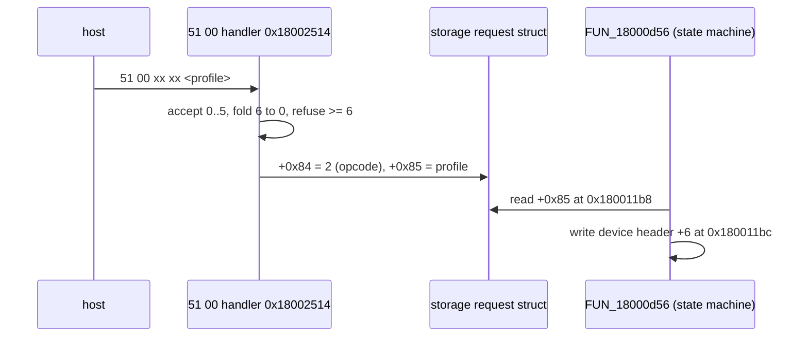
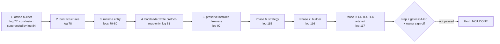

# Lesson 18 — The command map and building firmware

> **In one sentence:** The investigation read every command the keyboard's firmware will accept straight out of its dispatcher, chose the safest way to change the firmware, built an offline tool that refuses every unsafe patch, and produced a first modified image stamped `UNTESTED` that has never been flashed.
> **You will learn:**
> - the full vendor command surface: 17 top-level opcodes, 24 `0x51` subcommands and 10 `0x12` queries, and how much of it is really understood
> - how the firmware's own handler names (`=S_PR_U`, `=KC_S,T_A`, `S_ST_DEF` …) were harvested from the binary
> - why "Path A" (small controlled patches) was chosen over "Path B" (a new application), and what the dangerous recovery case is
> - how the offline builder works: two adapters, no `--base` flag, dependency order, and fourteen refusal classes
> - how the product string became `UNTESTED FALCHION FW`, and why a patch inside a compressed stream must only touch literals nothing copies later
> - why nothing was flashed, and what the step 7 risk plan requires first
>
> **Time:** ~75 minutes · **Prerequisites:** Lesson 5, Lesson 9, Lesson 10, Lesson 14, Lesson 16, Lesson 17

---

## 1. The story (kid version)

Imagine a very old library with a front desk. People slide request slips under the window. Each slip starts with a code: "12" means "please tell me something", "51" means "please change something", "50 55" means "write it in the permanent ledger". The librarian behind the window checks the code against a list pinned to the wall and walks to the right shelf.

For a long time we only knew the codes we had *seen* people use. Then we realised we could simply read the list pinned to the wall. Even better, next to many entries the librarian had scribbled a nickname in her own handwriting, like "S_PR_U" or "S_ST_DEF". We still did not know what every entry meant, but now we knew **how many** there were and **which** ones we understood.

Next, we wanted to change one word in the library's welcome sign. Two options: carefully repaint one word on the existing sign (Path A), or build a brand-new sign from scratch (Path B). A new sign sounds exciting, but we did not know how to make the lights inside it work. So we repainted one word. And before touching the real sign, we built a perfect copy in the workshop, repainted the copy, and had a second person check it with their own ruler. The copy says "UNTESTED" on it in big letters. It is still in the workshop.

### How the analogy maps to the real thing

| In the story | In the keyboard |
|---|---|
| The front desk | The vendor-HID [dispatcher](00-glossary.md#dispatcher) at `0x18001fbe` |
| A request slip's code | The [opcode](00-glossary.md#opcode) byte and subcommand byte of a 64-byte report |
| The list pinned to the wall | The dispatcher's chain of `cmp` instructions |
| Nicknames in the librarian's handwriting | Strings like `=S_PR_U` that handlers pass to the firmware's logger |
| Repainting one word | Path A: a byte patch of the USB product string |
| Building a new sign | Path B: a clean-room application |
| The workshop copy | The four images in `generated/`, each named `UNTESTED` |
| A second person with their own ruler | `tool/verify_patched_region.py`, which imports nothing from the builder |

---

## 2. Why we needed this

Two threads meet in this lesson.

**Thread 1: building.** By log 115 the investigation had a container parser, the installed-versus-vendor comparison, a code map, the boot gates, and six service models (USB routing, scanning, Hall actuation, the nonvolatile write path, lighting, platform dependencies). The final gate had classified seventeen services: six must-implement, three must-neutralize, five may-omit and three unresolved ([notes/development-strategy.md](../notes/development-strategy.md)). The step 6 plan now asked three things in order: decide the strategy (Phase 6, log 115), build a general offline builder (Phase 7, log 116), and produce a first experimental artefact (Phase 8, log 117).

**Thread 2: the command surface.** `notes/protocol.md` had carried a six-row command table since the earliest work, with a "still unknown" list naming actuation, rapid trigger, dead zone, speed tap, profile switch and polling rate as HAL methods with no opcode. Log 126 decoded the polling rate from a capture (Lesson 17). Log 128 "stopped waiting for captures and read the dispatcher's compare sites directly", and log 130 closed almost all of what was left (TIMELINE).

The alternative for thread 2 was to keep capturing Armoury Crate on Windows, one setting at a time. That works only for commands Armoury Crate sends, and tells you nothing about the rest.

---

## 3. The real thing

### 3.1 The dispatcher's shape

Every vendor command arrives as a 64-byte report on interface 1. The dispatcher reads byte 0 (the opcode) and compares it against a list of constants. Two registers are set once at dispatcher entry and never reassigned, and they make every handler readable (log 128):

| register | value | meaning | set at |
|---|---|---|---|
| `r4` | `0x180233a8` | the request buffer | `0x18001fc2` |
| `r7` | `0x1801e6d0` | the device header | `0x18001fee` |

So `[r4,#4]` is always "request byte 4", and `[r7,#6]` is **the current profile** in every handler that indexes a per-profile structure.

### 3.2 Seventeen top-level opcodes

The dispatcher accepts **17** top-level opcodes, each at a compare site pinned byte for byte, and the same seventeen compares exist in both firmware releases ([notes/vendor-command-map.md](../notes/vendor-command-map.md)):

| opcode | compare at | handler | decoded |
|---|---|---|---|
| `0x52` | `0x18001ff2` | `0x180028e0` | no |
| `0x41` | `0x18001ffc` | `0x180028e2` | no |
| `0x04` | `0x18002002` | `0x18002052` | no |
| `0x12` | `0x18002006` | `0x18002066` | **yes** |
| `0x22` | `0x1800200a` | `0x180020e4` | no |
| `0x25` | `0x1800200e` | `0x180022be` | no |
| `0x43` | `0x18002014` | `0x180020e8` | no |
| `0x50` | `0x18002018` | `0x18002110` | no |
| `0x51` | `0x1800201c` | `0x1800248e` | **yes** |
| `0xb0` | `0x18002022` | `0x180039ea` | no |
| `0x53` | `0x1800202a` | `0x18002112` | no |
| `0x54` | `0x1800202e` | `0x18002114` | no |
| `0x71` | `0x18002032` | `0x18003954` | no |
| `0x73` | `0x18002038` | `0x18003a2e` | no |
| `0xc0` | `0x18002040` | `0x18002116` | no |
| `0xfa` | `0x18002044` | `0x18003a70` | no |
| `0xfd` | `0x1800204a` | `0x180040a4` | no |

Only `0x12` (queries) and `0x51` (configuration writes) are opened; the rest are "located and nothing more" ([notes/vendor-command-map.md](../notes/vendor-command-map.md)). Of the unopened ones, `0x22`, `0x25` and `0x50` have historical meanings from `notes/protocol.md` (the `22 01` and `25 00`/`25 01` handshakes and the `50 55` commit), "and the rest have none" (log 128).

> **A counting puzzle you can check yourself.** Log 128 and FINDINGS both say "**eleven** top-level opcodes are not opened at all". But log 128's own list after that sentence names **fifteen**: `0x04, 0x22, 0x25, 0x41, 0x43, 0x50, 0x52, 0x53, 0x54, 0x71, 0x73, 0xb0, 0xc0, 0xfa, 0xfd`, which is exactly 17 − 2. The project documents do not explain the difference. This course reports the list as written and does not guess which number was intended. (Lesson 19 is about exactly this kind of thing.)

### 3.3 The confidence labels

Before the tables, the labels. The map uses four, and every row carries one ([notes/vendor-command-map.md](../notes/vendor-command-map.md)):

| label | means |
|---|---|
| `wire-proven` | observed in log 126's capture **and** decoded from the handler |
| `static-handler-proven` | the handler's reads, ranges and stores are read out of the instruction stream; no capture exercised it |
| `static-located-only` | the compare site and handler entry are proven; **the semantics are not established** |
| `hal-name-only` | `notes/protocol.md` names a HAL method and nothing attaches an opcode to it |

Coverage of the 34 `0x51` and `0x12` subcommands moved like this:

| after | wire-proven | static-handler-proven | static-located-only |
|---|---|---|---|
| log 128 | 9 | 12 | 13 |
| log 130 | 9 | 24 | **1** (`51 52`) |

As log 128 put it: "A surface that is bounded is not a surface that is understood."

### 3.4 The ten `0x12` queries (read-only)

None of these writes device state ([notes/vendor-command-map.md](../notes/vendor-command-map.md)):

| sub | handler | confidence | what it returns |
|---|---|---|---|
| `0x00` | `0x1800209a` | wire-proven | eight bytes of the device header. The capture's `59 00 01 00 06 00 03 00` = firmware 1.59 in the first two bytes and **profile 3 in byte 6** |
| `0x03` | `0x180020be` | wire-proven | echo only, one payload byte |
| `0x05` | `0x180020ca` | static-handler-proven | one byte from `0x1801ee90+0xc` and a constant `0xff`; never sent by Armoury Crate |
| `0x07` | `0x180020ea` | wire-proven | the constant 1 |
| `0x08` | `0x180020f6` | wire-proven | 1 or 0 from bits `0x30` of the byte at `0x1801e6b7`, a state flag |
| `0x12` | `0x18002118` | wire-proven | two reply shapes; the capture's `01 01` is its **failure** branch |
| `0x13` | `0x1800211a` | static-handler-proven | the same body as `12 12` entered two instructions earlier, a second mode |
| `0x14` | `0x180021d4` | wire-proven | multiplexed on byte 2; byte 2 = 2 returns the ASCII model string `024080600167` |
| `0x15` | `0x18002254` | static-handler-proven | **GET POLLING RATE** (Lesson 17) |
| `0x16` | `0x1800226c` | wire-proven | 1 if device header byte 7 equals `0xb5`, else 0; the capture saw 0 |

Notice `12 00`. That reply had been in the record since the earliest protocol notes, and nobody had noticed it carried the current profile. It independently agrees with `notes/ac-profile3-decoded.json` being profile 3 (log 128).

### 3.5 The twenty-four `0x51` subcommands (all writes)

Every one writes device state, and every one is **owner-approval-required** ([notes/vendor-command-map.md](../notes/vendor-command-map.md)). Summarised:

| sub | handler | confidence | what it does |
|---|---|---|---|
| `0x00` | `0x18002514` | static-handler-proven | **profile switch, indirect**: accepts 0..5 with 6 folded to 0, posts a request |
| `0x0c` | `0x18002d8e` | static-handler-proven | when request bytes 2–3 are 0, stores 1000 (`0x3e8`) into `0x1801e6c8`; what the 1000 counts is unknown |
| `0x18` | `0x18002c9a` | static-handler-proven | named `=MS_A`; writes a live copy and a shadow copy `0x198` apart |
| `0x20` | `0x1800253e` | static-handler-proven | key-remap family |
| `0x21` | `0x18002662` | **wire-proven** | **set Fn-layer key binding** (the historical capture) |
| `0x22` | `0x18002662` | static-handler-proven | shares `0x21`'s handler entry |
| `0x23` | `0x180027d6` | static-handler-proven | named `=KC_S,T_A`; record `+0x04` = 1, plus `+0x0e`/`+0x0f` |
| `0x24` | `0x1800289a` | static-handler-proven | record `+0x04` = 2, so the mode byte is at least four-valued |
| `0x2c` | `0x18002970` | static-handler-proven | device header `+5` and a storage request |
| `0x2d` | `0x18002aca` | static-handler-proven | **lighting**, profile block `+0x02`, calls `FUN_1800075a` |
| `0x31` | `0x18002b2e` | **wire-proven** | **polling rate** (Lesson 17) |
| `0x42` | `0x18003310` | static-handler-proven | global block `+0x18`, wear-levelled write |
| `0x4f` | `0x18002b62` | static-handler-proven | **per-key actuation**, record `+0x08` bits 0..6 plus bit-15 override |
| `0x50` | `0x180026ec` | static-handler-proven | **all-key actuation**, global bits 9..15 |
| `0x51` | `0x180026ea` | static-handler-proven | stores `0x3c` at `0x1801e7b8`; consumer unknown |
| `0x52` | `0x180026e8` | **static-located-only** | five paths of opaque constants; the one this work could not decode |
| `0x53` | `0x180026e6` | static-handler-proven | per-key record `+0x0a` update |
| `0x54` | `0x180026e4` | static-handler-proven | record `+0x0a` bits 14..15, a 2-bit mode |
| `0x55` | `0x18002dc6` | static-handler-proven | named `=TEMP1_S_KC`/`=TEMP2_S_KC`; a validated **pair** of key codes |
| `0x56` | `0x18002dca` | static-handler-proven | **settings factory default**, named `S_ST_DEF`; the only command that reinitialises block D |
| `0x57` | `0x18002cda` | static-handler-proven | the shared per-key writer tail, both layers |
| `0x58` | `0x18002dc8` | static-handler-proven | **all-key rapid trigger**, global bits 20..22 / 17..19 |
| `0x59` | `0x18002dcc` | static-handler-proven | **per-key rapid trigger**, record `+0x06`/`+0x07` bits 0..2 plus `0x80` override |
| `0x90` | `0x18002d0e` | static-handler-proven | named `SC_S_A`; two untraced setters |

### 3.6 A symmetric family, confirmed from two directions

Log 130's best result was four commands the firmware built as two symmetric pairs:

| command | field | log 125's independent record |
|---|---|---|
| `51 50` all-key actuation | global word bits 9..15 | "bits 9..15 actuation 1..40" |
| `51 4f` per-key actuation | record `+0x08` bits 0..6 + bit-15 override | "rec+0x08 uint16, bit 15 override, bits 0..6 actuation, 1..40" |
| `51 58` all-key rapid trigger | global bits 20..22 / 17..19 | "bits 20..22 press, 17..19 release, 1..6, default 2" |
| `51 59` per-key rapid trigger | record `+0x06`/`+0x07` bits 0..2 + `0x80` override | "rec+0x06 bit 7 override, bits 0..2 press, 1..6, default 2" |

`0x58` and `0x59` are **one helper** called with a mode flag: `bl 0x1800f948` at `0x1800334c` (mode 0) and `0x1800338c` (mode 1). The helper carries log 125's range check and default right in the instruction stream: `cmp #6` at `0x1800f976`, `movs r2,#2` at `0x1800f97c`. Log 125 had recovered every one of these fields **from the storage side**. Log 130 recovered them **from the command side**. Two analyses in opposite directions produced one map (log 130).

Even so, `51 50` is offered as the **strongest HAL match** to `SetActuation_AllKey`, "a match rather than the command's name" (log 128).

### 3.7 The firmware names its own handlers

Many handlers load a short string with `adr` and pass it to the logger, just like the polling-rate handler's `=S_PR_U` (Lesson 17). Log 130 harvested them all: `=KC_S,T_A`, `=ES_A`, `=S_PR_U`, `=TEMP1_S_KC`, `=TEMP2_S_KC`, `S_ST_A`, `S_ST_DEF`, `=S_ST_SW`, `SC_S_A`, `=MS_A`, plus `KL_D_A`/`KL_E_A` and an `FT_*` cluster in the still-unopened opcode range. Five of the twelve new decodes are anchored by one (log 130).

They "had been in the image since the first import" (log 130). Exercise 3 finds them with `strings`.

### 3.8 Profile switching: indirect, not absent

The profile selection byte `0x1801e6d6` has **exactly two writers**, both in the storage state machine `FUN_18000d56` (`0x180011bc`, and `0x18001df8` storing 0 on factory default). The dispatcher never writes it in any of its 13 accesses. So "profile switching is Fn-key only" looked likely. It is not ([notes/vendor-command-map.md](../notes/vendor-command-map.md)):



The wire numbers profiles **1..6 (0 an alias for 6)** while the firmware indexes **0..5**. Which branch a switch takes inside `FUN_18000d56` is **not established** (log 128).

### 3.9 Macros, block D, and the dual-role timer

- **Macros are not device-only.** `0x180035dc` writes the macro block's header and clears 400 bytes of body. The filter above it routes HID usages `0x39`, `0x47`, `0x53`, `0xe2` and `0xe8` down a separate path, which reads as a *recording* filter. Entry format and which subcommand reaches the writer are **not established** (log 128).
- **Block D has no USB writer** except the factory default `51 56`. Log 130 showed its arithmetic closes exactly: a 2-byte checksum, then two tables of 247 two-byte entries. `4 + 2 × 0x1ee = 0x3e0`, the declared size. (`0x1ee` = 494 = 247 × 2.) 247 comes from the reader's loop bound, `cmp r1,#0xf7` at `0x1800585a` (`0xf7` = 247). **No Armoury Crate field is matched to it**, because matching on size alone is the resemblance rule this project forbids.
- **The `+0x22` per-key timeout (Lesson 17) is a dual-role key.** On expiry, the record's halfword at `+0x20` is appended to a bank at `0x18024000 + k*600`. So holding a key long enough emits a different code. Confidence strongly inferred. **No HAL name is assigned**: `ChangeKey_ModTap`, `ChangeKey_Toggle`, `ChangeKey_DKS` and `SetSpeedTap` all describe hold-to-emit behaviour, and nothing recovered distinguishes them (logs 128, 130).

### 3.10 The bank double-buffer correction

Log 128 called `0x18024000 + k*600` "a per-layer output ring", reading `k` as the layer. Log 130 **withdrew** that. The report builder `FUN_180061c2` computes the same stride from **two different** indices (struct `+0x80` and `+0x7c`) and compares the two banks entry by entry at `0x18006094`, `0x1800609c`, `0x180060a4`. That is a **current/previous double buffer**, and `k` is a bank selector (log 130).

```
0x18024000 + 0*600   bank A   <- "current"  (index at struct +0x80)
0x18024000 + 1*600   bank B   <- "previous" (index at struct +0x7c)
report builder: diff A vs B entry by entry -> what changed since last report
```

### 3.11 HAL names with no carrier

Of the HAL method names in `notes/protocol.md`, log 130 records six with a carrier at strongly inferred, seven with a plausible one as a hypothesis, and **ten with no plausible carrier** among the 34 located commands: both `SetDeadZone` variants, `ResetSpeedTap`, `IsDefaultProfile`, both `WriteMacroFlash` variants, all four lever methods, `SetKeyLog` and `GetKeyStats`. Either they live behind the still-unopened top-level opcodes (where `KL_D_A`/`KL_E_A` and `FT_*` sit, "which is suggestive"), or they are not implemented on this model. **Nothing decides which** (log 130).

### 3.12 Phase 6: choosing Path A or Path B

Now the building thread. The architecture decision record is [notes/development-strategy.md](../notes/development-strategy.md), generated from one data model by `tool/report_development_strategy.py`.

| | Path A: controlled patching | Path B: clean-room application |
|---|---|---|
| idea | keep the vendor loader and application, change a narrowly understood byte range | keep the boot path, supply a newly built application record |
| toolchain | none beyond the existing offline builder | a full Cortex-M3 toolchain, linker script, vector table, container writer |
| hardware dependencies | inherits all of them, working | must satisfy all of them from scratch, three unresolved |
| vendor-derived code | nearly all | none, by construction |
| debugging | none on the device | none on the device |

**Decision: Path A first, for offline format validation only; Path B not yet. Status: decided** (log 115).

The interesting part is the *reason*. The plan had tied Path B to "once the platform map is credible", and by then it was credible. But credibility was not the **binding constraint**. The binding constraint was that **nothing in either analysed image produced a key reading**. A clean-room application "could initialise, tick, enumerate, build reports and transmit them, and every key would read as released forever" (log 115).

The ADR is honest about Path A too: "Path A validates format knowledge, it does not produce our own firmware."

(The ADR was later regenerated as gates moved. It now records the Hall acquisition gate as **satisfied by log 119**, with the note that the gate is satisfied by *inheriting* vendor code, which is exactly what Path B exists to avoid, and the address-0 gate as satisfied by log 123. The clock configuration and a decided watchdog policy remain.)

#### The dangerous recovery case

This is the most important safety idea in the lesson ([notes/development-strategy.md](../notes/development-strategy.md)):

- A **rejected** image is not the dangerous case. It leaves the device in bootloader mode, which is recoverable.
- The dangerous case is an image that is **checksum-correct and still does not enumerate**. It passes the boot gate, so the device leaves bootloader mode, and the application that would normally accept "go to bootloader" is not working. The remaining documented route back is a recovery key combination whose physical keys log 101 recorded as unresolved.

#### No on-device debugging

"There is no on-device debugging available today: no trace, no console, no working breakpoint path. Every iteration is therefore blind: the only signal is whether the device enumerates afterwards." The ADR calls this "the single strongest argument for Path A first", because it makes a small reversible change far more attractive than a large one (log 115).

#### Choosing the first target

Seven targets were judged against Phase 8's criteria (a fully understood path, a small bounded change, no clock/watchdog/flash-write/calibration/USB-boot/recovery effect, an observable result, exact original-byte assertions and a rollback). **Two pass, five fail** ([notes/development-strategy.md](../notes/development-strategy.md)):

| target | verdict | why |
|---|---|---|
| the USB product string | **pass, ranked first** | path from ASCII to string descriptor traced end to end (logs 105, 107); touches nothing else; the bootloader's own identity is separate |
| one ordinary key-policy table entry | pass, ranked second | direct byte change, no compression; ranked lower because some historical KBID mappings are unverified |
| the Hall actuation threshold | fail | the input scale is unknown, and changing actuation is a calibration effect |
| the application's USB VID/PID | **fail**, "the target that looks safest and is not" | the route back to recovery addresses the app by its current identity, so changing it is a recovery effect |
| the NMI watchdog escalation limit | fail | directly alters watchdog escalation |
| LampArray behaviour | fail | the driver that consumes the frame buffer is not identified |
| anything in the bootloader region | fail | outside the writable range and the backup; excluded absolutely |

### 3.13 Phase 7: the offline builder

`tool/build_offline_image.py` is a new module. `tool/build_modified_image.py` was **left unchanged** so that log 77's result stays reproducible (log 116).

#### Two adapters, and why there is no `--base` flag

Remember from Lesson 8 that loading code at the wrong base address makes every pointer wrong. The builder does not let you choose one. It picks an **adapter** by matching the source file's SHA-256 **and** size against an [allowlist](00-glossary.md#allowlist):

| adapter | base | size | what it is |
|---|---|---|---|
| `vendor-1.00.58-full` | `0x00000` | `0x7c000` | the whole ASUS image |
| `installed-1.59-application` | `0x10000` | `0x6c000` | the USB read-back of the installed application region (Lesson 12) |

"There is no `--base` flag, so a wrong base cannot be supplied; a test asserts the string appears nowhere in the module" (log 116). Every offset you give is a **logical flash offset**, translated through the adapter's base.

#### The address-space bug

The first draft refused **every** patch as "outside every record". Why? The record table stores addresses with the `0x60000000` flash-window base:

```
slot 0: addr=0x60011000 len=0x058ac dst=0x18000000
slot 1: addr=0x60021000 len=0x1e754 dst=0x18000000
```

The draft compared a logical offset like `0x3f66f` against `0x60021000` directly, so nothing ever fit. The fix: translation happens **once**, in `active_records()`, which returns spans in logical offsets, and nothing downstream ever sees a raw address field. This was "the third time this project has found the same address-space slip, after logs 110 and 114" (log 116).

#### Dependency order: CRC first, word-sum last

Lesson 9 introduced the two integrity mechanisms. The builder recomputes them in a fixed order (log 116):

1. each affected record's chunked-CRC sum at `record+0x8` (for the application record, the field is at `0x1003c`);
2. the backup-bootloader word-sum at `0x70ffc`, **only** if a reviewed policy ever permits changing `[0x61000,0x71000)`. No such policy exists, so this path is present and **unreachable by default**;
3. the application word-sum at `0x7bffc`, **last**.

Why last? Because the word-sum covers `[0x10000,0x7bffc)`, and that range **contains** the CRC field at `0x1003c`:

```
0x10000                    0x1003c                                  0x7bffc
|--- SN_FWIN header ---|..| CRC |.......... record payloads ..........| SUM |
|<------------------ word-sum covers all of this ------------------->|
```

If you computed the word-sum first and then updated the CRC, the word-sum would be stale. A test asserts that containment, then checks the stored value against an **independent** reimplementation written from `zlib` and `struct`, sharing no code with the builder, "so a common bug cannot hide" (log 116).

The primary-bootloader word-sum at `0x0fffc` is in neither list. On an installed source it is reported **unavailable**, never approximated, and it rides along in every manifest's unresolved risks.

#### No-op round trips

A `--noop` build applies no patch but still **recomputes** the application word-sum. Both no-op builds come back byte-identical to their sources, "because recomputing a correct sum reproduces the same bytes, which is what makes the byte-identity result meaningful rather than a bypass" (log 116). You will reproduce this in Exercise 1.

#### Fourteen refusal classes

Every one was exercised from the command line; each gives a clean one-line `RESULT` and leaves **zero files** behind (log 116):

| # | refused | example message (log 116) |
|---|---|---|
| 1 | primary bootloader | patch at `0x2000`: touches the primary bootloader region |
| 2 | backup bootloader | patch at `0x62000`: touches the backup bootloader region |
| 3 | SN_FWIN header | patch at `0x10000`: touches the SN_FWIN header |
| 4 | record table | patch at `0x10028`: touches the record table metadata |
| 5 | record checksum field | patch at `0x1003c`: touches the record table metadata |
| 6 | a word-sum field itself | patch at `0x7bffc`: touches the application word-sum field itself |
| 7 | outside every record | patch at `0x79000`: does not lie wholly inside one active record's payload |
| 8 | past the image end | patch at `0x900000`: outside the adapter's range |
| 9 | overlapping patches | patch at `0x3f670` overlaps the patch at `0x3f66f` |
| 10 | wrong original bytes | expected original bytes `aa` but the source holds `52` |
| 11 | missing original bytes | the form is `OFFSET=ORIGINALHEX:REPLACEMENTHEX` and the original bytes are mandatory |
| 12 | `--noop` with a patch | `--noop` takes no patches |
| 13 | an unallowlisted source | not an allowlisted mutation source |
| 14 | output collision | already exists; refusing to overwrite |

Rules 10 and 11 deserve a sentence: **you must say what bytes you expect to overwrite**. If the file does not hold exactly those bytes, the build stops. That protects against patching the wrong file or the wrong offset.

**The builder contains no device code**, and that is tested: thirteen device-shaped patterns are scanned for, an anti-vacuity test proves the detector fires on known-bad strings, and imports are checked against an allowlist. Its final line always reads `construction only; acceptance is NOT claimed` (log 116).

### 3.14 Phase 8: the product-string artefact

#### Finding the target

The USB product string sits at region+`0x882` in **both** releases. Only the compressed source's flash address differs, by a measured `0x2c`. The replacement ([notes/artefact-validation.md](../notes/artefact-validation.md)):

```
before:  R  O  G     F  A  L  C  H  I  O  N     A  C  E     H  F  X
after:   U  N  T  E  S  T  E  D     F  A  L  C  H  I  O  N     F  W
index:   0  1  2  3  4  5  6  7  8  9 10 11 12 13 14 15 16 17 18 19
```

Both are 20 bytes, uppercase ASCII and spaces, and the new name identifies itself as a test build. Look at index 18: **`F` in both strings**. Remember that; it matters in Section 5.

In hex, the patch the manifest records is:

```
original     52 4f 47 20 46 41 4c 43 48 49 4f 4e 20 41 43 45 20 48 46 58
replacement  55 4e 54 45 53 54 45 44 20 46 41 4c 43 48 49 4f 4e 20 46 57
```

#### Why a compressed-stream patch is delicate

Lesson 14 showed that the USB descriptors live in an [LZ77](00-glossary.md#lz77)-style compressed region that is unpacked at boot. A compressed stream mixes two kinds of token:

- **literals**: "output these bytes as they are";
- **[back-references](00-glossary.md#back-reference)**: "copy N bytes from D bytes earlier in the output".

Here is a toy example (not from the firmware) of why that matters:

```
tokens:    LIT "AB"   COPY(dist=2, len=2)
output:    A B        A B            -> "ABAB"

patch the literal "A" -> "X":
output:    X B        X B            -> "XBXB"   two bytes changed, not one!
```

A same-length replacement inside a compressed stream is only safe if **two** things hold (log 117):

1. every replaced stream byte is a **literal**, not a distance, count or control byte (patching one of those would change the token structure);
2. **no later back-reference reads** from the output positions the patch changes (otherwise the change spreads).

#### The token-level literal proof

`tool/verify_patched_region.py` decodes the stream with **per-output-byte provenance**: for every output byte it records whether it came from a literal (and which stream offset), a copy (and from where), or a zero fill ([notes/artefact-validation.md](../notes/artefact-validation.md)):

| release | provenance | stream offsets | flash offsets | later reads |
|---|---|---|---|---|
| installed | all `literal` | `0x31b..0x32e` | `0x3f69b..0x3f6ae` | **0** |
| vendor | all `literal` | `0x31b..0x32e` | `0x3f66f..0x3f682` | **0** |

The stream positions are identical; the flash addresses are `0x2c` apart (`0x3f69b − 0x3f66f = 0x2c`). The token structure is unchanged: 254 tokens (installed) and 253 (vendor), identical boundaries and control bytes, identical consumption, and the produced length is still `0xb04` (log 117).

Both **failure modes** were also demonstrated, on a synthetic stream small enough to check by hand: a patched literal that a later back-reference copies changes **two** output bytes and is detected, and corrupting a control byte changes the token structure. "Without those, a validator that only ever passes would prove nothing" (log 117, TIMELINE).

#### Independent validation: 38 checks

The validator **imports nothing from either builder**, and a test asserts that. It re-decodes with its own decoder written from the log-105 rules and recomputes both integrity fields from `zlib` and `struct` directly. **38 checks, all pass** (19 per release) ([notes/artefact-validation.md](../notes/artefact-validation.md)).

#### The four artefacts

All live in the git-ignored `generated/` directory, each with a manifest, every filename carrying `UNTESTED`:

| file | sha256 (first 12) | recomputed |
|---|---|---|
| `installed-1.59-application_noop_UNTESTED_fc6128ab089e.bin` | `fc6128ab089e` | word-sum `0x2d7486db` |
| `installed-1.59-application_productstring_UNTESTED_96f6157868da.bin` | `96f6157868da` | CRC `0xb5661320`, word-sum `0x30fcff70` |
| `vendor-1.00.58-full_noop_UNTESTED_6d410ee0a54f.bin` | `6d410ee0a54f` | word-sum `0x5d27c5a9` |
| `vendor-1.00.58-full_productstring_UNTESTED_fda342b393a7.bin` | `fda342b393a7` | CRC `0xd49f3d6f`, word-sum `0x507d3ff0` |

(Values read from `generated/*.manifest.json`.) Notice that each no-op file's hash equals its source's hash: `fc6128ab…` is the installed dump and `6d410ee0…` is the vendor image.

#### The rollback

The rollback is the **no-op build of the same source**, byte-identical to it for both adapters. "That is stronger than a copy: it is produced by the same builder through the same recompute path, so it also demonstrates the pipeline introduces no drift" (log 117).

#### What is not claimed

**Booting is not claimed.** "The phase succeeds because the builder and an independent validator agree on structure, and for no other reason." The runtime effect is **inferred** from logs 105 and 107, so "a host would display a different name" is an expectation, not a result (log 117).

### 3.15 Why nothing was flashed: the step 7 risk plan

[notes/step7-live-experiment-risk-plan.md](../notes/step7-live-experiment-risk-plan.md) opens with: "**Status: DRAFT FOR OWNER REVIEW. THIS DOCUMENT AUTHORIZES NOTHING.**" It exists because "'Exists and validates offline' is not 'safe to flash'."

It models three failure cases:

| case | risk | what happens |
|---|---|---|
| 1. image rejected | LOW | device stays in bootloader mode and can be re-flashed. This rests on decompiled logic (logs 75, 78, 101) and **has never been live-tested**, so it is recorded as an assumption |
| 2. checksum-correct but does not enumerate | **HIGH, the binding risk** | the USB route back is gone; the remaining route is the recovery key poll `FUN_000029d4` |
| 3. power loss mid-erase or mid-program | MEDIUM | degrades to Case 1, under the same unproven assumption |

And six hard gates, **all** of which must pass before any flash:

| gate | requirement | status in the plan |
|---|---|---|
| G1 | physical recovery keys resolved | **PARTIAL (log 120)**: two keys named as `8` and `6` with `7` held released; the third is vendor code `0xe8`, only strongly inferred to be the Fn position |
| G2 | artefact frozen | the image is named by SHA-256 and rebuilt byte-identically |
| G3 | hardware recovery decision | no SPI programmer or SWD probe exists; the owner must decide in writing. "If G1 fails, stop" |
| G4 | write tool exists and is reviewed | **today there is no host tool that sends erase/program** |
| G5 | environment | direct motherboard port, stable power, no suspend, a written checklist |
| G6 | abort conditions rehearsed | the decision tree in §6 of the plan |

Even the sequencing is fixed: the **no-op** build flashes first, to prove entry, unlock, erase, program, checksum-readback and re-enumeration against a known-good image. The product-string build is considered only after that completes cleanly. The sign-off box at the bottom of the plan is empty.

### 3.16 The roadmap, in one picture

FINDINGS "Firmware modification roadmap (offline-first)" orders the work so "everything with device risk comes last":



Log 77's original wording ("passes every integrity field the bootloader checks … proving the checks are live") **overstated** the result. It showed the fields are *reproducible offline*, not that a rebuilt image boots (FINDINGS roadmap, log 84).

---

## 4. Decisions and why

| Decision | Why | Alternative rejected | Evidence (log) |
|---|---|---|---|
| Read the command surface from the dispatcher | Captures only show what Armoury Crate sends | Wait for more captures | log 128 |
| Label every row with one of four confidences, and report coverage as a figure | "A surface that is bounded is not a surface that is understood" | A single "decoded" column | logs 128, 130 |
| Keep `51 52` as `static-located-only` | Promoting it would be "vibes-based" | Guess from its constants | log 130 |
| Assign no HAL name to the dual-role timer | Four HAL names fit and nothing distinguishes them | Pick the most likely name | logs 128, 130 |
| Path A first, Path B not yet | Nothing in either image produced a key reading; no on-device debugging | Path B once the map was credible | log 115 |
| Reject the USB VID/PID as a target | Changing identity is a recovery effect | "It is just two numbers" | log 115 |
| Write a new builder, leave `build_modified_image.py` alone | Keeps log 77 reproducible | Rewrite the old one | log 116 |
| Choose the adapter by hash and size, no `--base` | A wrong base cannot be supplied | A `--base` option | log 116 |
| Recompute CRC first, word-sum last | The word-sum covers the CRC field | Any order | log 116 |
| Require original bytes in every patch | Stops patching the wrong file or offset | Replacement bytes only | log 116 |
| Validate with a module that imports nothing from the builder | A shared bug cannot hide | Re-run the builder's own checks | log 117 |
| Use the no-op build as the rollback | Proves the pipeline adds no drift | A plain file copy | log 117 |
| Flash nothing | Step 7 gates are not passed and no write tool exists | Flash the no-op to "see what happens" | step 7 plan |

---

## 5. What went wrong, and how it was caught

### "19 differ" when the check expected 20
- **Believed:** the first validation run demanded 20 differing decoded bytes.
- **True:** 19 differ, because both strings have `F` at position 18.
- **Caught by:** the check failing on a correct artefact (log 117).
- **Lesson:** the invariant is **containment**, not a count. The check was replaced by "no decoded byte outside the intended span changed" plus "19 differ + 1 coincide = 20", rather than loosened to accept either number. "A count check would have passed for the wrong reason on some other string."

### The address-space bug
- **Believed:** a record's address field could be compared with a logical offset.
- **True:** record fields carry the `0x60000000` flash base, so every patch was refused.
- **Caught by:** the builder refusing everything during development (log 116).
- **Lesson:** translate between address spaces in exactly one place. This was the third time the project hit this class of bug, after logs 110 and 114.

### "Five of" six services
- **Believed:** the Phase 6 ADR said evidence was in hand for "five of" the six must-implement services, and listed five.
- **True:** all six; it had omitted the control endpoint, which the dependency map records as `observed` with two citations.
- **Caught by:** a rider at the start of log 116.
- **Lesson:** an off-by-one, "not a judgement". It contradicted both the model it summarised and the log beside it, "which is a good argument for generating prose from the model wherever possible".

### "A per-layer output ring"
- **Believed:** log 128 read `0x18024000 + k*600` as indexed by layer.
- **True:** a current/previous double buffer indexed by two struct fields (log 130).
- **Lesson:** one index in an address expression does not tell you what the index *means*. Look at every place the stride is computed.

### "The dispatcher's handlers are anonymous"
- **True:** at least eleven load their own names, and the strings had been there since the first import (log 130).
- **Lesson:** harvest the cheap evidence first. A `strings` pass would have found them months earlier.

### Six instruction encodings cited from memory
- In log 128's first draft, six cited encodings were wrong. The byte-level assertions caught every one before anything was written, and one of them was also why a vendor-release check had failed 16/17 (log 128).
- **Lesson:** pin citations to the image bytes; do not transcribe them.

### An unscoped census query
- "Block D has no USB writer" failed reporting **five** writers, because the query ran across six Ghidra exports and the vendor application shares the `0x18000000` base. Scoping to one export fixed it, and an anti-vacuity test asserts the scoped result is strictly smaller (log 128).

### A coverage test that became the wrong shape
- Log 128's `test_most_of_the_table_is_admitted_undecoded` asserted more than ten located-only rows. After log 130 only one remained. Deleting the test would have removed its discipline, so it was rewritten to assert that the coverage figure **equals** the real number of undecoded rows, and it pins `51 52` by name (log 130).

### Log 77's overclaim
- "Proving the checks are live" was withdrawn by log 84: the builder showed the fields are reproducible, not that an image boots (FINDINGS roadmap). This is why every later artefact says "acceptance is NOT claimed".

---

## 6. Try it yourself

All offline. The builder writes **only** into the `--out` directory you give it, so point it at a scratch directory under `/tmp/claude-1000/`, **never** into the repository. It never opens the source for writing.

### Exercise 1: a no-op build, and compare with the manifest

```bash
S=/tmp/claude-1000/falchion-build      # any scratch directory outside the repo
mkdir -p $S
python3 tool/build_offline_image.py \
  --source dumps/device/ROG_Falchion_Ace_HFX_installed_bcdDevice_1.59_app_0x10000_0x7bfff.bin \
  --noop --out $S/noop
```

Real output (the run used a scratch directory in the session's `/tmp/claude-1000/…` area):

```
PROGRAM build_offline_image
PURPOSE Phase 7 — offline construction only. No device code.

ADAPTER installed-1.59-application base=0x10000
SOURCE  fc6128ab089e4fd712b172c54cd88b7f28476b55bdac688134e052281ded637b
OUTPUT  installed-1.59-application_noop_UNTESTED_fc6128ab089e.bin
        sha256=fc6128ab089e4fd712b172c54cd88b7f28476b55bdac688134e052281ded637b
PATCHES 0
RECOMPUTED 1
  application_word_sum at 0x7bffc = 0x2d7486db
WORD SUMS
  application: available
  backup_bootloader: available
  primary_bootloader: unavailable
VALIDATIONS 18
  failed: none
UNRESOLVED RISKS
  - This build is not evidence that the image will boot. No device was accessed and no execution was observed.
  - the primary_bootloader word-sum is unavailable for this adapter: it is neither verified nor recomputed, and any operation that would require changing it is refused
  …

RESULT built=1 (construction only; acceptance is NOT claimed)
```

Now compare with the source and with the committed manifest:

```bash
cmp $S/noop/*.bin dumps/device/ROG_Falchion_Ace_HFX_installed_bcdDevice_1.59_app_0x10000_0x7bfff.bin && echo noop-identical-to-source
sha256sum $S/noop/*.bin generated/installed-1.59-application_noop_UNTESTED_fc6128ab089e.bin
grep output_sha256 generated/installed-1.59-application_noop_UNTESTED_fc6128ab089e.manifest.json
```

```
noop-identical-to-source
fc6128ab089e4fd712b172c54cd88b7f28476b55bdac688134e052281ded637b  …/noop/installed-1.59-application_noop_UNTESTED_fc6128ab089e.bin
fc6128ab089e4fd712b172c54cd88b7f28476b55bdac688134e052281ded637b  generated/installed-1.59-application_noop_UNTESTED_fc6128ab089e.bin
  "output_sha256": "fc6128ab089e4fd712b172c54cd88b7f28476b55bdac688134e052281ded637b",
```

The builder *recomputed* the word-sum and got the same bytes back.

### Exercise 2: rebuild the product-string artefact yourself

Use the exact patch from the manifest (offset `0x3f69b`, original bytes, replacement bytes):

```bash
python3 tool/build_offline_image.py \
  --source dumps/device/ROG_Falchion_Ace_HFX_installed_bcdDevice_1.59_app_0x10000_0x7bfff.bin \
  --patch 0x3f69b=524f472046414c4348494f4e2041434520484658:554e5445535445442046414c4348494f4e204657 \
  --label productstring --out $S/ps
```

```
ADAPTER installed-1.59-application base=0x10000
SOURCE  fc6128ab089e4fd712b172c54cd88b7f28476b55bdac688134e052281ded637b
OUTPUT  installed-1.59-application_productstring_UNTESTED_96f6157868da.bin
        sha256=96f6157868dae85b63232781e61842a0421979052e4bb2394efb9f7118a93080
PATCHES 1
  0x3f69b 524f472046414c4348494f4e2041434520484658 -> 554e5445535445442046414c4348494f4e204657
RECOMPUTED 2
  record_chunked_crc at 0x1003c = 0xb5661320
  application_word_sum at 0x7bffc = 0x30fcff70
…
VALIDATIONS 18
  failed: none
```

The hash `96f6157868da…` matches `generated/` exactly. Now list which bytes differ from the no-op build (converted to logical offsets by adding the `0x10000` base):

```bash
cmp -l $S/ps/*.bin $S/noop/*.bin | awk '{printf "0x%x ", $1-1+0x10000}'; echo
```

```
0x1003c 0x1003d 0x1003e 0x1003f 0x3f69b 0x3f69c 0x3f69d 0x3f69e 0x3f69f 0x3f6a0 0x3f6a1 0x3f6a2 0x3f6a3 0x3f6a4 0x3f6a5 0x3f6a6 0x3f6a7 0x3f6a8 0x3f6a9 0x3f6aa 0x3f6ab 0x3f6ac 0x3f6ae 0x7bffc 0x7bffd 0x7bffe 0x7bfff
```

Read it: four bytes of CRC at `0x1003c`, **19** string bytes (`0x3f6ad` is missing, because that is the coinciding `F`), and four bytes of word-sum at `0x7bffc`. Nothing else changed. That is 4 + 19 + 4 = 27.

### Exercise 3: watch the builder refuse

```bash
python3 tool/build_offline_image.py \
  --source dumps/device/ROG_Falchion_Ace_HFX_installed_bcdDevice_1.59_app_0x10000_0x7bfff.bin \
  --patch 0x3f69b=00:55 --out $S/bad
python3 tool/build_offline_image.py \
  --source dumps/device/ROG_Falchion_Ace_HFX_installed_bcdDevice_1.59_app_0x10000_0x7bfff.bin \
  --patch 0x10010=00:55 --out $S/bad2 | tail -1
python3 tool/build_offline_image.py \
  --source dumps/device/ROG_Falchion_Ace_HFX_installed_bcdDevice_1.59_app_0x10000_0x7bfff.bin \
  --noop --out $S/noop | tail -1
```

```
RESULT built=0 refused=patch at 0x3f69b expected original bytes 00 but the source holds 52
RESULT built=0 refused=patch at 0x10010: touches the SN_FWIN header; does not lie wholly inside one active record's payload
RESULT built=0 refused=installed-1.59-application_noop_UNTESTED_fc6128ab089e.bin already exists; refusing to overwrite
```

Three refusal classes: wrong original bytes (`0x52` is `R`, the first letter of "ROG"), SN_FWIN header (with a second, independent reason), and output collision. `ls $S/bad` afterwards reports "No such file or directory": nothing was left behind.

### Exercise 4: run the independent validator

`tool/verify_patched_region.py` with no flags only reads (`--write` would regenerate the notes; do not use it):

```bash
python3 tool/verify_patched_region.py
```

Real output (trimmed):

```
PROGRAM verify_patched_region
PURPOSE Phase 8 — independent validation of the patched artefact
NOTE This module imports nothing from the builder.

TARGET the USB product string at region+0x882
  'ROG FALCHION ACE HFX' -> 'UNTESTED FALCHION FW'

RELEASE installed
  artefact  installed-1.59-application_productstring_UNTESTED_96f6157868da.bin
            sha256=96f6157868dae85b63232781e61842a0421979052e4bb2394efb9f7118a93080
  rollback  installed-1.59-application_noop_UNTESTED_fc6128ab089e.bin
            sha256=fc6128ab089e4fd712b172c54cd88b7f28476b55bdac688134e052281ded637b
  source    sha256=fc6128ab089e4fd712b172c54cd88b7f28476b55bdac688134e052281ded637b
  region    flash 0x3f380..0x3f780  tokens=254  consumed=0x3fd
  literals  stream 0x31b..0x32e  flash 0x3f69b..0x3f6ae
  propagation reads: 0
  decoded diff: 19 bytes changed, 1 coincided, 0 outside the span
  record CRC 0xb5661320  word-sum 0x30fcff70
    PASS the artefact filename carries UNTESTED
    PASS the rollback build is byte-identical to the source — sha256 fc6128ab089e4fd7
    …
    PASS every patched output byte is a LITERAL in the token stream — literal
    PASS NO later back-reference reads from the patched output range — zero reads
    PASS NO decoded byte outside the intended span changed — zero bytes outside 0x882..0x896
    PASS every differing byte is accounted for by the replacement — 19 differ, 1 coincide (0x894), 20 = 20 total
    …
    PASS the word-sum's covered range contains the record CRC field — so a reversed dependency order would have left it stale
…
RESULT verified=True checks=38
ACCEPTANCE NOT CLAIMED. This validates structure only. Nothing here is evidence that any image boots, and no device was accessed.
```

Note `0x894` = `0x882 + 18`: the coinciding `F` again. And the record CRC `0xb5661320` agrees with the builder's value from Exercise 2, computed by different code.

### Exercise 5: find the firmware's own handler names

```bash
F=ghidra/imports/installed_app_b_slot1_flash21000_dst18000000_len1e380_be463863.bin
strings -a -t x -n 4 $F | grep -E ' (=?(KC_S,T_A|ES_A|S_PR_U|TEMP[12]_S_KC|S_ST_A|S_ST_DEF|S_ST_SW|SC_S_A|MS_A))$'
```

```
   29cc =KC_S,T_A
   2e38 =ES_A
   2e48 =S_PR_U
   32b4 =TEMP1_S_KC
   32c0 =TEMP2_S_KC
   32d4 S_ST_A
   32dc S_ST_DEF
   32ec =S_ST_SW
   32f8 SC_S_A
   3308 =MS_A
```

The offsets are file offsets; add `0x18000000` for the runtime address. `=S_PR_U` at `0x2e48` is the string the polling-rate handler loads with `adr r0,[0x18002e48]` (Lesson 17). `S_ST_DEF` at `0x32dc` is the string the factory-default handler `51 56` loads with `adr` at `0x180031e2` ([notes/vendor-command-map.md](../notes/vendor-command-map.md)).

### Exercise 6: check the generated notes are current

```bash
python3 tool/map_vendor_commands.py --check
python3 tool/report_development_strategy.py --check
python3 tool/verify_patched_region.py --check
```

```
RESULT reports_current=True stale=0
RESULT reports_current=True stale=0
RESULT reports_current=True stale=0
```

Finally, clean up your scratch directory when you are done: `rm -rf $S`.

---

## 7. Check your understanding

**1. The command map lists 34 `0x51`/`0x12` subcommands. Why is "we located all of them" not the same as "we understand all of them"?**

<details><summary>Answer</summary>

Locating means the compare site and handler entry are proven. Understanding means the handler's reads, ranges and stores are traced. After log 128, 13 of 34 were located only; after log 130, one (`51 52`) still is, and every top-level opcode other than `0x12` and `0x51` is still unopened (logs 128, 130).
</details>

**2. What was the binding constraint that kept Path B off the table in log 115?**

<details><summary>Answer</summary>

Nothing in either analysed image produced a key reading, so a clean-room application would enumerate and send reports but every key would read as released forever. Map credibility was not the constraint (log 115).
</details>

**3. Why is a checksum-correct image that does not enumerate more dangerous than a rejected one?**

<details><summary>Answer</summary>

A rejected image leaves the device in bootloader mode, where it can be re-flashed. A checksum-correct image passes the boot gate and leaves bootloader mode, and the "go to bootloader" command lives in the application, which no longer works. The remaining route is a recovery key combination whose keys were unresolved at log 115 and are only partially resolved by log 120 (log 115, step 7 plan).
</details>

**4. Why must the builder compute the record CRC before the application word-sum?**

<details><summary>Answer</summary>

The word-sum covers `[0x10000,0x7bffc)`, which contains the CRC field at `0x1003c`. Computing the word-sum first and then changing the CRC would leave the word-sum stale (log 116).
</details>

**5. The product string lives inside a compressed stream. What two things must be true before a same-length replacement is safe?**

<details><summary>Answer</summary>

Every replaced stream byte must be a literal (not a distance, count or control byte), and no later back-reference may read from the output positions the patch changes. The provenance decoder showed all twenty bytes are literals and zero later reads touch them, in both releases (log 117).
</details>

**6. The first validation expected 20 changed bytes and found 19. What was fixed: the artefact or the check? Why?**

<details><summary>Answer</summary>

The check. Both strings have `F` at position 18, so only 19 bytes differ. The real invariant is containment ("no byte outside the span changed"), with an explicit "19 differ + 1 coincide = 20" accounting, not a count (log 117).
</details>

---

## 8. Sources

- [../FINDINGS.md](../FINDINGS.md), sections "Phase 6: the development strategy is decided (log 115)", "Phase 7: the offline builder (log 116)", "Phase 8: the first offline experimental artefact (log 117)", "The vendor command surface, recovered statically (log 128)", "Closing the static remainder of the command map (log 130)", "Firmware modification roadmap (offline-first)"
- [../TIMELINE.md](../TIMELINE.md), entries for logs 115, 116, 117, 128, 130, and "Corrections retained for auditability"
- [../logs/115-phase6-development-strategy.txt](../logs/115-phase6-development-strategy.txt)
- [../logs/116-phase7-offline-builder.txt](../logs/116-phase7-offline-builder.txt)
- [../logs/117-phase8-first-experimental-artefact.txt](../logs/117-phase8-first-experimental-artefact.txt)
- [../logs/128-vendor-command-map.txt](../logs/128-vendor-command-map.txt)
- [../logs/130-command-map-completion.txt](../logs/130-command-map-completion.txt)
- [../notes/development-strategy.md](../notes/development-strategy.md)
- [../notes/vendor-command-map.md](../notes/vendor-command-map.md)
- [../notes/artefact-validation.md](../notes/artefact-validation.md)
- [../notes/step7-live-experiment-risk-plan.md](../notes/step7-live-experiment-risk-plan.md)
- [../tool/build_offline_image.py](../tool/build_offline_image.py)
- [../tool/verify_patched_region.py](../tool/verify_patched_region.py)
- [../tool/build_modified_image.py](../tool/build_modified_image.py)
- [../tool/map_vendor_commands.py](../tool/map_vendor_commands.py)
- [../tool/report_development_strategy.py](../tool/report_development_strategy.py)
- `../generated/*.manifest.json` (git-ignored; present locally)

[← Previous](17-polling-rate.md) · [Course home](README.md) · [Next →](19-mistakes-are-data.md)
