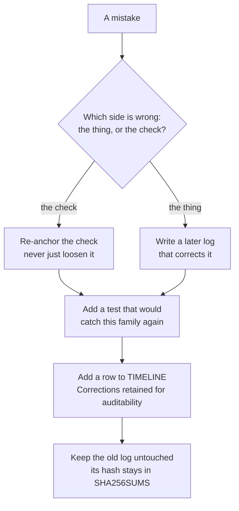
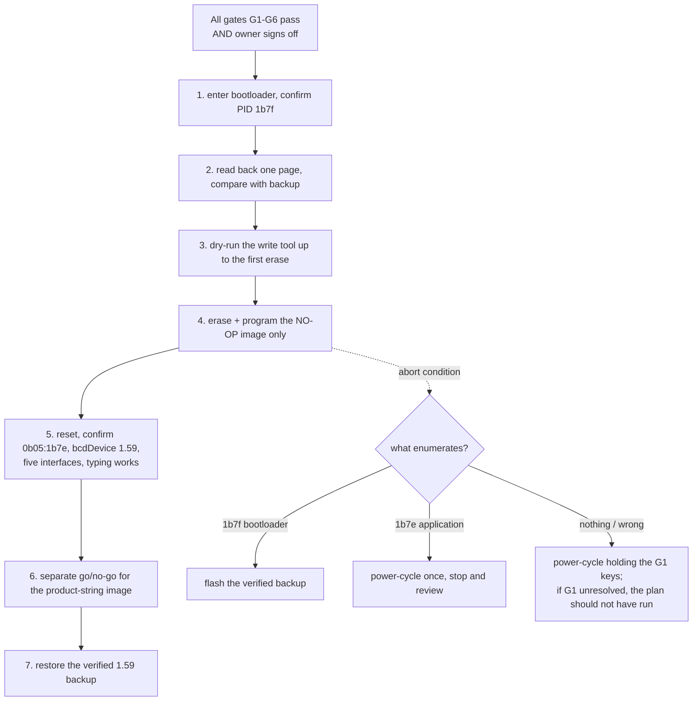
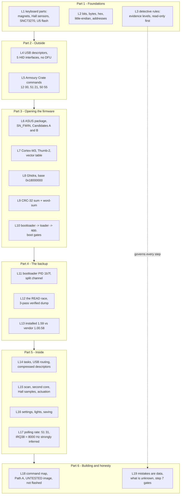

# Lesson 19 — Mistakes are data

> **In one sentence:** This investigation wrote down every mistake it made, and the mistakes, sorted into families, are the best map of how reverse engineering goes wrong and how to catch it; this lesson also lists what is still unknown, what would come next, and recaps the whole course.
> **You will learn:**
> - why the project keeps a table of its own errors, and what "a check that failed for the right reason" means
> - seven families of mistakes, each with a moral and real examples from the logs
> - what is still unknown about the keyboard, stated the way the project states it
> - what a live experiment would require, and why none has happened
> - how every lesson in this course fits together
>
> **Time:** ~60 minutes · **Prerequisites:** Lessons 1–18 (this is the finale)

---

## 1. The story (kid version)

A good scientist keeps a lab notebook. When an experiment goes wrong, she does not tear the page out. She draws one line through the wrong answer, so you can still read it, and writes the right answer next to it with the date and the reason.

Why keep the wrong answer visible? Three reasons. First, anyone checking her work can see exactly what changed. Second, other results might have been built on the wrong answer, and a visible correction tells you which ones to re-check. Third, and most important: mistakes come in **families**. Once you have made the same kind of mistake three times, you can build a habit, or a tool, that catches the fourth one before it happens.

This project's lab notebook is the table called **"Corrections retained for auditability"** at the bottom of [`TIMELINE.md`](../TIMELINE.md). No historical log is ever edited; a later log corrects an earlier one and says so.

### How the analogy maps to the real thing

| In the story | In this project |
|---|---|
| The lab notebook | The numbered `logs/`, each fingerprinted with a [SHA-256](00-glossary.md#sha-256) [hash](00-glossary.md#hash) in `logs/SHA256SUMS` |
| Drawing one line through a wrong answer | A later log that says "superseded by log N", with the original left untouched |
| The date and the reason | The "Correction" column in TIMELINE's corrections table |
| A friend checking your notebook | Independent review (for example logs 84, 95, 97, 99, 102, 131, 132, 133, 134) |
| A habit that catches the next mistake | A unit test, a `--check` mode, or a refusal built into a tool |

---

## 2. Why we needed this

Every lesson in this course had a Section 5, "What went wrong". This lesson steps back and looks at all of them together.

Why does that matter so much here? Because the whole project is built on **evidence levels** (Lesson 3): observed, strongly inferred, inference, unresolved. A mistake is usually one of two things: a claim that was **stronger** than its evidence, or evidence that was **weaker** than it looked (a search that could not see, a parser that misread, a file whose origin was not recorded). Seeing the families makes both kinds easier to spot.

The later logs (131 to 134) were almost entirely corrections, each triggered by an independent review. As FINDINGS says of one of them: "An independent review challenged the entry image's `0x1404` table. It was right, and the premise checks out from the raw bytes" (log 131).

---

## 3. The real thing

### 3.1 The phrase you will see everywhere: "failed for the right reason"

When a check fails, there are only two possibilities: the thing being checked is wrong, or the check is wrong. The project has a strict rule about the second case: **re-anchor the check, never just loosen it**. Some examples you have already met:

| check | why it failed | what was done (not "delete it") | log |
|---|---|---|---|
| "20 decoded bytes differ" | only 19 do; both strings share `F` at position 18 | replaced by "nothing outside the span changed" + "19 differ + 1 coincide = 20" | 117 |
| "the word 'polling' is not in `protocol.md`" | it is, as HAL names never captured | narrowed to the parsed command table, plus a new check asserting the HAL fact | 124 |
| `test_no_frequency_is_claimed_anywhere` | a refinement added "Hz" to the dependency map | the map now points at the note holding the number; the test was not touched | 127 |
| `test_most_of_the_table_is_admitted_undecoded` | after log 130 only one row was undecoded | rewritten to assert the coverage figure **equals** the real remainder, pinning `51 52` by name | 130 |
| "the decoder consumed the compressed source exactly" | it stopped at `0x3fd` of `0x400` | the premise was wrong: the length is word-aligned, so a zero tail is expected; replaced by two checks stating the real invariant | 105 |

The pattern: a failing check is **information**. Before changing anything, find out which side is wrong.

### 3.2 Family 1: parser and shell mistakes

> **Moral (kid version):** *If your magnifying glass is smudged, everything you see through it is smudged too. Check the glass before you trust the view.*

These are errors in the tools used to *look*, not in the thing being looked at.

| what was believed | what was true | how it was caught | log |
|---|---|---|---|
| two ports produced different descriptors | the comparison parser had included `xxd`'s ASCII column | a corrected comparison proved equality | 25 → 26 |
| the first binary-pointer search results | its shell escaping was malformed | the search was regenerated byte-safely | 50 |
| "no report lands between a `51 31` write and its commit" | fourteen do; zsh `set -- $iv` does not word-split, so every interval was compared against one malformed bound | the tool's own test contradicted the shell result | 126 |
| a sandboxed `lsusb` / `dfu-util` failure meant something about the device | it was the sandbox; a direct read-only retry succeeded | re-running outside the sandbox | TIMELINE table |
| `decode.ps1` decoded the captures | it read `usb.capdata`, which USBPcap leaves empty, so it decoded **nothing** from either preserved capture | an offline twin, `tool/decode_capture.py`, run against the real capture | 131 |

The zsh example is worth remembering because your login shell is zsh. You can reproduce it in Lesson 17, Exercise 3.

### 3.3 Family 2: overclaiming language

> **Moral:** *"I think the cookie jar is empty" and "the cookie jar is empty" are different sentences. Say exactly how sure you are, not how sure you wish you were.*

These are cases where the words claimed more than the evidence.

| overclaim | corrected wording | log |
|---|---|---|
| the rebuilt image "passes every integrity field the bootloader checks … proving the checks are live" | it shows the fields are **reproducible offline**, not that a rebuilt image boots | 77, corrected by 84 |
| "erase/program/unlock are unconstructable" | "the guard rejected every write/unlock/reset form in the self-check" | 84 |
| the READ race is "the default outcome", "orders of magnitude", "microseconds", "almost always" | withdrawn; the core clock is selected at runtime and the transfer time is unrecovered, so the result is "**proven possible**" | 86 |
| "None exist" for the Phase 4 negatives | restated as scoped search results; "a constant-and-string search cannot prove an absence" | 102, 103 |
| "reset-path writes" | renamed reset-**reachable**: call-graph reachability is not proof of execution during init | 103 |
| "x87 long doubles" for the `0x5680` records | withdrawn; "library-specific extended-precision powers-of-ten records", observations listed separately from interpretation | 132 |
| "Address reuse is refused" | a **descriptor-identity conflict** check; an address reused by a device with an identical descriptor is undetectable | 133 |

And one example of getting it **right** the first time, which is the model to copy. Log 124 noticed that `8000 / 8 = 1000` lined up with two `bInterval` values, and wrote: "That is a CONSISTENCY between two independently recovered numbers, not a measurement, and it is recorded here so a future step can test it rather than inherit it as fact." Log 127 then tested it, and it held (Lesson 17).

### 3.4 Family 3: wrong assumptions about structure

> **Moral:** *Something shaped like a key is not always a key. A row of three numbers that look like addresses can be text, or a table of powers of ten.*

These are cases where data was read as one kind of structure and was really another.

| believed | actually | log |
|---|---|---|
| entry-image table `0x1404`: "eight structures carrying a shared default callback `0x00000a0c`" | eight `"Rn:   0x%08X"` printf format strings; each ends `0d 0a 00 00` (CR LF and two pad bytes), which reads as the Thumb-looking word `0x00000a0d`; 86% of the span is printable text | 131 (after independent review) |
| table `0x5680`: three indirect roots | the exponent column of powers-of-ten records (`0x4002`, `0x4005`, `0x400c`, `0x4019`, `0x4034`, for 10^1 to 10^16); none of its words is a pointer | 105, superseded by 131 |
| the SN_FWIN record table ends at a "zero terminator" | `FUN_0000511c` scans a fixed eight slots; slot 2 is an inactive hole | 95 |
| the vector table is truncated at a fill value | ARMv7-M tables have no terminator; bounded by the first code address, it has 80 slots and `IRQ63` is live | 102 |
| eight `0x86` rows at `0x1801c37c` | three overlapping 189-byte logical wire windows plus a separate three-row `0x100` scan map | TIMELINE table |
| `0x18024000 + k*600` is "a per-layer output ring" | a current/previous double buffer; `k` is a bank selector | 128, corrected by 130 |
| `notes/protocol.md`'s six-row table is the command surface | it is the *captured* surface; the dispatcher accepts 17 opcodes, 24 `0x51` subcommands and 10 `0x12` queries | 128 |
| "Macros are recorded on-device only" | `0x180035dc` writes the macro block from the dispatcher | 128 |
| profile block `+0x4f8` is the version stamp | **refined**: the version stamp *and* the polling-rate index in bits 0..3 | 125, refined by 126 |

Here is the `0x1404` case in raw bytes, because it is the clearest picture in the project of "shape is not meaning" (FINDINGS, log 131):

```
000013f0: 30 38 58 0d 0a 00 00 00 52 30 3a 20 20 20 30 78   08X.....R0:   0x
00001400: 25 30 38 58 0d 0a 00 00 52 31 3a 20 20 20 30 78   %08X....R1:   0x
                      ^^^^^^^^^^^
                      0d 0a 00 00  -> read as a little-endian word = 0x00000a0d
                                      "odd, so Thumb code at 0x00000a0c" ... but it is CR LF NUL NUL
```

### 3.5 Family 4: blind searches

> **Moral:** *If you look for your lost shoe only under the bed, "not under the bed" does not mean "lost forever". Before you say "nothing is there", ask whether your search could have seen it.*

These are negatives that came from a search that could not find the thing.

| negative | why the search was blind | what found it | log |
|---|---|---|---|
| `0x1801e736` has "six writers and no reader" | readers load the base `0x1801e734` and read `[base,#2]`, so no literal equals the address | one grep of the Ghidra peripheral census, in the tree since log 100 | 126 → 127 |
| "exactly one function touches the watchdog blocks" and "nothing feeds them" | `FUN_000021fe` is a call-through base selector, invisible to a per-function census | three access paths, not one | 113 → 114 |
| block D has five USB writers | an **unscoped** census query merged two releases that share the `0x18000000` base | scoping to one export; a test asserts the scoped result is strictly smaller | 128 |
| log 124's "timer register" candidate | not a blind search, but the right handling of one: it was left **unresolved, not eliminated**, because "you cannot rule out a peripheral nobody has found" | (still unresolved) | 124 |

Log 126 had also done something right inside its own mistake: each of its three searches was shown to be **non-blind for the thing it searched for**, and it scoped its conclusion ("not evidence the device ignores it"). That is why log 127's correction could say log 126's statement "stands as a statement about the searches it ran" ([notes/polling-rate-reader.md](../notes/polling-rate-reader.md)).

The project now builds **anti-vacuity** tests into its tools: a detector must be shown to fire on a known-bad input, or a filter must be shown to find neighbouring fields, "so its silence elsewhere means something" (log 127).

### 3.6 Family 5: provenance and identity mistakes

> **Moral:** *Two kids named Sam in one class are not the same Sam. A name only means something if you know which room it was said in.*

"Provenance" means **where a piece of evidence came from**. "Identity" means **how you know two things are the same thing**. These mistakes mixed things up.

| believed | actually | log |
|---|---|---|
| interface 4 uses vendor page `0xFF32` | that descriptor's provenance was not recorded strongly enough; the current interface 4 is page `0x59` | 27, TIMELINE table |
| log 80's addresses are installed-firmware addresses | its decompile was of the **vendor** record slice; the installed primitive was derived separately as `0x18012fd0` | 106 |
| `usb.device_address` identifies a device | an address is scoped to a bus: in `01-first-launch.pcapng`, address 1 is an ASMedia hub on bus 2 and a Logitech receiver on bus 3; identity is now (interface, bus, address) | 132 (after independent review) |
| `PtrTarget_00000a0c` is evidence that `0x00000a0c` is a function | the seed itself created that function; citing it as evidence was circular | 131 |
| log 131's consumer rule, "21 of 26 dispatched" | the scanner matched stores to calls by **field offset** across a register map no function boundary reset; with object identity required, nothing is dispatch-proven | 132 |
| the sixth writer of `0x1801e736` is `FUN_18007030` | `0x18007a1e` is in code with **no function body**; it was mapped to the nearest preceding entry | 127 |
| an installed pointer is invalidated only by a store to the same `(object, field)` | "an identity is a name for an address", and two names can denote one word; invalidation now uses interval overlap with may-alias rules | 134 |
| Python and PowerShell used the same descriptor identity | Python used (idVendor, idProduct, bcdDevice), PowerShell only VID and PID; both now use all three | 133 |

### 3.7 Family 6: tool safety bugs

> **Moral:** *A broom that sweeps the floor should not also knock over the vase. A tool must never damage the evidence it was built to study, and must never say "done" when it isn't.*

These are the most serious family, because a tool can lose evidence or report false success.

| tool | the bug | the fix | log |
|---|---|---|---|
| `backup_firmware.py` | sent all five reports of a chunk, then read once, so the `0x8f` status reply was consumed as read data and every chunk was silently wrong | immediate request-response exchanges, every reply validated | 84 (after review) |
| the log-85 handshake | read status *before* the data query, so it could accept a half-old/half-new buffer (24 new + 24 baseline bytes, reproduced) | sample → status → confirming fetch, with an interleaving proof | 86 |
| `FakeBootloader` (the test double) | replaced the response buffer atomically, so no test *could* catch the defect above | rewritten with incremental transfers and a foreign-pending injector | 86 |
| Phase 4's `acceptance_ok` | did not execute the integrity rules it reported; flipping one byte left it True | renamed `image_rules_ok`, now folds in every validation check | 102 (after independent review) |
| `capture.ps1` | overwrote an existing `-Out` silently and printed `saved:` unconditionally. "That is how the original first-launch capture was lost" | refuses an existing output, with no `-Force`; checks exit codes and the file's magic number | 131 |
| `snap-config.ps1` | compared 1,360 of the profile's 1,500 paths; polling rate, rapid trigger, dead zones, Speed Tap, lighting and lever were in the other 140 | a recursive comparison of every path | 131 |
| `haltrace.ps1` | never checked `ERROR_ALREADY_EXISTS`, so it could race DebugView and report success | refuses instead of splitting the stream | 131 |
| log 131's `clearListing` seed removal | deleted real code: `0x9fc..0xa6e` became 114 undefined bytes, and the write of `0x3f` to `0xe000ef00` vanished from the census | both entry images re-imported and only legitimate seeds replayed | 132 |
| `FalchionRemoveSeeds.java` | carried a "do not use" banner but `run()` still called `removeFunction()`, `symbol.delete()` and `clearListing()` | every destructive call deleted; the script refuses | 133 |
| `profile_diff.snapshot_diff` | reported added and removed files backwards | fixed, with tests on the full tuple | 132 |

The step 7 plan applies the same idea to the future: "The tool is itself a review gate" (Lesson 18, gate G4). A tool that can write to the keyboard does not exist yet, on purpose.

### 3.8 Family 7: off-by-one and counting errors

> **Moral:** *If you count the fence posts and the gaps between them, you get two different numbers. Before you say "how many", decide exactly what you are counting.*

| believed | actually | log |
|---|---|---|
| the recovery poll returns after 30 matching samples | the counter is tested before it increments, so it returns on the **31st** | 102 |
| evidence is in hand for "five of" the six must-implement services | all six; the control endpoint was left out of the list | 115, caught in 116 |
| 20 decoded bytes differ in the product-string patch | 19 differ and 1 coincides | 117 |
| task entries were "135 more functions" on top of 146/573 | seeding changed the denominators; 281 of 616 is a **new baseline** | 106 |
| "eleven top-level opcodes are not opened at all" | log 128 says "eleven" top-level opcodes are unopened but lists fifteen (17 − 2). The project documents do not explain the difference; this course noticed it while writing Lesson 18 and records it here rather than guessing | 128 (unreconciled) |

That last row is deliberately included. It is an unresolved inconsistency, and the honest thing to do with one is to write it down.

### 3.9 The whole table at a glance



### 3.10 What is still unknown

These come from FINDINGS "Uncertain or superseded assumptions" and "Recommended next steps", TIMELINE "Work not performed" and "Recommended continuation", and the "Still unresolved" paragraphs of the later findings.

#### Hardware and preservation

- **Only the application region is backed up.** The verified log-92 dump covers `0x10000..0x7bfff`. It is "not a complete 4 MiB U5 image", and it does not include the primary bootloader region `[0,0x10000)`, though it does contain the mirrored copy at `[0x61000,0x71000)`, byte-identical to the vendor 1.00.58 bootloader (log 94, FINDINGS "Recommended next steps" item 8).
- **Never done** (TIMELINE "Work not performed"): a complete U5 image or the bootloader region or internal MCU storage; reading U5 or verifying its JEDEC ID electrically; connecting SWD, SPI or any hardware probe; running the ASUS updater; using `fwupd` on the keyboard; sending any persistent configuration command; erasing, programming, unlocking or detaching a driver; proving the official 1.00.58 image is a safe downgrade; flashing anything. (The list also says "built or flashed custom firmware". Since log 117 an **UNTESTED** image has been *built offline*, but nothing has been flashed.)
- Whether executable code also lives inside the SNC73270 itself, and whether its readout protection allows a non-destructive backup, is open (FINDINGS "Recommended next steps" item 6).
- `bcdDevice 1.59` is verified; equating it with the version of every code image or flash region is **an assumption** (FINDINGS "Uncertain or superseded assumptions").
- No physical boot-key method for bootloader mode is known (same section).

#### Inside the firmware

- **Recovery keys (gate G1): PARTIAL.** Two keys are named as `8` and `6`, with `7` held released; the third is vendor code `0xe8`, only strongly inferred to be Fn, and the bootloader-to-application group mapping is corroborated but not proven (step 7 plan, log 120).
- **IRQ38 = 8000 Hz is strongly inferred**, resting on the one-report-per-invocation assumption; the clock configuration (crystal, PLL, divider registers) is not recovered (log 127).
- **Phase 5 [reachability](00-glossary.md#reachability) stays explicitly incomplete** (which functions any code path is shown to lead to): application 206 of 616 reached, 410 unreached, 161 callerless, no table root in either image; no Ghidra P-code or interprocedural dispatch recovery was implemented (logs 133, 134). The three decompressed-region roots still rest on log 105's weaker rule.
- **The command map**: `51 52` undecoded; the top-level opcodes other than `0x12` and `0x51` unopened; ten HAL names with no plausible carrier; the dual-role timer's HAL name, wrap and release path; block D's second table and defaults; the macro entry format (logs 128, 130).
- **Polling rate**: whether the `51 31` write alone applies the rate (U4); what `bInterval` would do after a change; CPU headroom at 2000/4000 Hz (logs 126, 127).
- **Lighting**: the driver that consumes the LampArray frame buffer is not identified (log 112, via the ADR).

#### What still needs a Windows host

The PowerShell fixes of log 131 are proven through offline twins, "not the PowerShell runtime". Not executed anywhere yet: the refusal of an existing `-Out`, `Get-PnpDevice` enumeration, the USBPcap extcap launch, `Get-FileHash` output, `-AllProfiles` against a real ASUS folder, and the DBWIN P/Invoke path (FINDINGS "What still requires a Windows host").

#### A note on the "next steps" lists

FINDINGS "Recommended next steps" and TIMELINE "Recommended continuation" were written around the time of the backup (logs 92–94). Several items have since been done: the installed-versus-vendor comparison (log 96), and `FUN_000029d4`, which was recovered as the recovery key-combination poll (log 101) and traced further in log 120. The items that remain fully open are the preservation ones: a redundant copy of the dump, a hardware read-only dump of U5 with a reviewed plan ("correct voltage, board-power isolation, bus contention prevention, exact pin mapping, read-only commands, multiple identical dumps, and independent hashes"), and never issuing SPI Write Enable (`0x06`), Program or Erase.

### 3.11 What would come next, and the risks

The next *device* step would be flashing the no-op image. The step 7 risk plan ([notes/step7-live-experiment-risk-plan.md](../notes/step7-live-experiment-risk-plan.md)) is a **draft for owner review that authorises nothing**. In short:



The risks, from the plan:

| case | level | the catch |
|---|---|---|
| image rejected | LOW | "a failed candidate leaves the device in bootloader mode" rests on decompiled logic and **has never been live-tested** |
| checksum-correct but does not enumerate | **HIGH** | the software route back is gone; recovery depends on G1's key combination |
| power loss mid-write | MEDIUM | degrades to case 1, under the same unproven assumption |

And the things it does **not** protect: the bootloader region (unreachable over USB either way), the rest of the 4 MiB U5 beyond `0x7c000` (never dumped), and any internal MCU nonvolatile state.

The status today: G1 partial, G3 undecided (no SPI programmer or SWD probe exists), G4 not met (**no host tool that sends erase/program exists**), and the sign-off box is empty. So the honest summary is the one the plan itself gives: "Exists and validates offline" is not "safe to flash".

---

## 4. Decisions and why

| Decision | Why | Alternative rejected | Evidence (log) |
|---|---|---|---|
| Never edit a historical log | Later readers can see exactly what was believed and when; hashes in `logs/SHA256SUMS` stay valid | Fix the old log in place | FINDINGS "Evidence integrity", every correction log |
| Re-anchor a failing check instead of loosening it | A loosened check can pass for the wrong reason | Accept either number | logs 117, 124, 127, 130 |
| Keep excluded data visible (e.g. `injected_at_t0`) | An exclusion must never silently hide a real event | Drop it | log 126 |
| Fail closed when identity is ambiguous | "A false root is worse than a false negative" | Assume two pointers are distinct | log 134 |
| Build offline twins for Windows scripts | PowerShell cannot run in this environment, so the rules need a testable home | Trust the scripts | log 131 |
| Record the "eleven vs fifteen" mismatch instead of resolving it | The sources do not explain it | Pick one number | this course, from log 128 |
| Keep live flashing behind six gates and a signature | The dangerous case has no proven recovery | Flash the no-op "to see" | step 7 plan |

---

## 5. What went wrong, and how it was caught

This whole lesson is Section 5. Here are the three corrections that taught the most, told as stories.

### The table that was a format string (log 131)
- **Believed:** since log 104, the entry image had a dispatch table at `0x1404` with a shared callback `0x00000a0c`, and a function was seeded there.
- **True:** eight printf format strings. The "callback" was `CR LF NUL NUL`.
- **Caught by:** an independent review; the raw bytes confirmed it.
- **Lesson:** the correction then **went wrong itself**. Log 131's removal script deleted real code (log 132), and log 132's replacement proof could still be faked three ways (log 133), and log 133's fix was alias-blind (log 134). Four rounds, each caught by review. Fixing a mistake is also work that can contain mistakes.

### The backup race (logs 84, 85, 86)
- **Believed:** first, that polling a busy bit proved a READ was complete; then, that a buffer-change handshake closed the race.
- **True:** the busy bit reads clear for "not started yet", and the first handshake could still accept a half-old/half-new buffer.
- **Caught by:** a review (log 84), bootloader analysis (log 85), and reproducing 24 new + 24 baseline bytes (log 86).
- **Lesson:** this is why the backup (Lesson 12) is trustworthy: the method was proven wrong twice **before** it touched the keyboard's data.

### Three blind searches and one grep (logs 126, 127)
- **Believed:** nothing reads the polling-rate multiplier.
- **True:** the actuation compare reads it four times, through `key_state+2`.
- **Caught by:** asking what shape the reader would leave, then grepping a file that had been in the tree for 27 logs.
- **Lesson:** "one file nobody had thought to grep" (log 127). Before you run a clever new search, check what the tools you already have can see.

---

## 6. Try it yourself

All offline; these read only the project's text files.

### Exercise 1: count the corrections

```bash
awk '/^## Corrections retained for auditability/{f=1;next} /^## /{f=0} f && /^\| /' TIMELINE.md | tail -n +3 | wc -l
```

```
82
```

Eighty-two rows (the `tail -n +3` skips the header and separator lines). Now find the ones that name an independent review in FINDINGS:

```bash
grep -n -i "independent review\|second independent review\|third review" FINDINGS.md
```

```
1066:**Correction after independent review (log 95).** The first version of
1127:**Corrections after independent review (log 97).** Five defects were found and
1238:**Corrections after independent review (log 99).** Five defects were found and
3450:An independent review challenged the entry image's `0x1404` table. It was right,
3621:A second independent review found two blockers in log 131's own corrections.
3774:A third review found that log 132's framework could still promote a root three
```

Six places in FINDINGS name a review explicitly (logs 95, 97, 99, 131, 132, 133).

### Exercise 2: find every "superseded" and "refined" marker

```bash
grep -c -i "superseded" FINDINGS.md
grep -n "Refined, not withdrawn" TIMELINE.md | cut -c1-120
```

```
13
3385:| Log 125's "profile block `+0x4f8` is the version stamp" | **Refined, not withdrawn.** The halfword is the version
```

Thirteen lines of FINDINGS mention "superseded": each one is a place where a later log changed an earlier reading and left the earlier text standing.

### Exercise 3: check the "eleven vs fifteen" puzzle yourself

```bash
grep -n "ELEVEN TOP-LEVEL OPCODES" -A 3 logs/128-vendor-command-map.txt
```

```
476:  - ELEVEN TOP-LEVEL OPCODES are not opened at all: 0x04, 0x22, 0x25, 0x41,
477-    0x43, 0x50, 0x52, 0x53, 0x54, 0x71, 0x73, 0xb0, 0xc0, 0xfa, 0xfd — of which
478-    0x22, 0x25 and 0x50 have historical meanings from protocol.md and the rest
479-    have none.
```

Count the opcodes on lines 476–477. You should get fifteen.

### Exercise 4: prove the logs have not been edited

```bash
sha256sum -c logs/SHA256SUMS 2>&1 | tail -3
sha256sum -c logs/SHA256SUMS 2>&1 | grep -c ': OK$'
sha256sum -c logs/SHA256SUMS 2>&1 | grep -vc ': OK$'
```

```
logs/132-provenance-boundary-repair-and-bus-scoped-decode.txt: OK
logs/133-path-correlated-proof-and-inert-seed-remover.txt: OK
logs/134-pointer-alias-invalidation.txt: OK
134
0
```

Every recorded log still has the hash it had when it was written. That is what makes "we never edit old logs" checkable instead of a promise.

---

## 7. Check your understanding

**1. A check fails. What is the first question to ask, and what is the project's rule if the check turns out to be the wrong side?**

<details><summary>Answer</summary>

Ask whether the thing being checked is wrong or the check is wrong. If the check is wrong, re-anchor it to the real invariant (for example "nothing outside the span changed" instead of "exactly 20 bytes changed"); never just loosen it so it passes (logs 117, 130).
</details>

**2. Log 126's "no reader" was wrong. Why was it still not an overclaim?**

<details><summary>Answer</summary>

It was a correct statement about the searches it ran, each shown non-blind for the shape it looked for, and it explicitly said the negative was "not evidence the device ignores it". Log 127 found the reader through a shape those searches could not see (`key_state+2`) (logs 126, 127).
</details>

**3. Which family does "`usb.device_address` identifies a device" belong to, and what is the fix?**

<details><summary>Answer</summary>

Provenance and identity. An address is only unique within one bus; the fix is to key on (interface, bus, address) and refuse a capture where one key carried two different devices (log 132).
</details>

**4. Why is `capture.ps1`'s bug in the "tool safety" family and not just a parser bug?**

<details><summary>Answer</summary>

It **destroyed evidence**: it silently overwrote an existing output, which is how the original first-launch capture was lost, and it printed `saved:` even on failure. A parser bug misreads evidence; this one erased it and reported false success (log 131).
</details>

**5. Name two reasons nothing has been flashed, taken from the step 7 plan.**

<details><summary>Answer</summary>

Any two of: gate G1 (recovery keys) is only partial; G3 (hardware recovery decision) has not been made and no SPI/SWD hardware exists; G4 is unmet because no host tool that sends erase/program exists; the owner sign-off is empty; the "rejected image stays in bootloader mode" assumption has never been live-tested.
</details>

**6. What is the difference between "refined" and "withdrawn"? Give an example of each.**

<details><summary>Answer</summary>

Refined: the old reading stays true but is incomplete. Profile block `+0x4f8` is the version stamp *and* the rate index (log 126). Withdrawn: the old reading was wrong. "A per-layer output ring" became a current/previous double buffer (log 130).
</details>

---

## 8. Sources

- [../TIMELINE.md](../TIMELINE.md), sections "Corrections retained for auditability", "Work not performed", "Recommended continuation"
- [../FINDINGS.md](../FINDINGS.md), sections "Phase 5A corrected: false tables and root eligibility (log 131)", "Phase 5A corrected again: provenance and repaired boundaries (log 132)", "Phase 5A corrected a third time: path-correlated proof (log 133)", "Phase 5A corrected a fourth time: alias invalidation (log 134)", "Windows capture tooling, corrected (log 131)", "Uncertain or superseded assumptions", "Recommended next steps", "Evidence integrity"
- [../logs/84-correction-audit.txt](../logs/84-correction-audit.txt), [../logs/86-bootloader-read-handshake-correction.txt](../logs/86-bootloader-read-handshake-correction.txt), [../logs/102-phase4-and-phase5-review-corrections.txt](../logs/102-phase4-and-phase5-review-corrections.txt)
- [../logs/127-polling-rate-reader.txt](../logs/127-polling-rate-reader.txt), [../logs/128-vendor-command-map.txt](../logs/128-vendor-command-map.txt), [../logs/130-command-map-completion.txt](../logs/130-command-map-completion.txt)
- [../logs/131-pointer-root-and-windows-capture-tooling-corrections.txt](../logs/131-pointer-root-and-windows-capture-tooling-corrections.txt)
- [../logs/132-provenance-boundary-repair-and-bus-scoped-decode.txt](../logs/132-provenance-boundary-repair-and-bus-scoped-decode.txt)
- [../logs/133-path-correlated-proof-and-inert-seed-remover.txt](../logs/133-path-correlated-proof-and-inert-seed-remover.txt)
- [../logs/134-pointer-alias-invalidation.txt](../logs/134-pointer-alias-invalidation.txt)
- [../notes/step7-live-experiment-risk-plan.md](../notes/step7-live-experiment-risk-plan.md)
- [../notes/development-strategy.md](../notes/development-strategy.md)
- [../logs/SHA256SUMS](../logs/SHA256SUMS)

---

## The whole course on one page



## You can now explain…

Tick each one you could explain to a friend without looking.

- [ ] how a Hall-effect key measures *how far* it is pressed, and what "actuation at travel ≥ 100" means ([Lesson 1](01-what-is-a-keyboard.md), [Lesson 15](15-inside-keys-and-magnets.md))
- [ ] why `0x60011000` is stored as `00 10 01 60` ([Lesson 2](02-how-computers-count.md))
- [ ] the difference between observed, strongly inferred, inference and unresolved, and why the keyboard was never bricked ([Lesson 3](03-the-detectives-rules.md))
- [ ] what the five HID interfaces are and why `dfu-util` found nothing ([Lesson 4](04-usb-and-hid.md))
- [ ] what `12 00`, `51 21` and `50 55` do, and why `50 55` is never sent without approval ([Lesson 5](05-talking-to-the-keyboard.md))
- [ ] what `SN_FWIN` marks and what Candidates A and B turned out to be ([Lesson 6](06-the-firmware-file.md))
- [ ] how to read `ldrb r1,[r4,#0x4]` and `cmp r1,#0x3` from their bytes ([Lesson 7](07-arm-cortex-m3.md))
- [ ] why loading code at the wrong base address breaks every pointer ([Lesson 8](08-ghidra.md))
- [ ] how a sum of per-chunk CRC-32 values and an additive word-sum guard the image, and why their order matters ([Lesson 9](09-checksums-and-trust.md), [Lesson 18](18-commands-and-building.md))
- [ ] the boot chain from bootloader to application and what the boot gates check ([Lesson 10](10-how-it-boots.md))
- [ ] why the READ race made the first two backup methods wrong, and how the handshake fixes it ([Lesson 11](11-the-bootloader-door.md), [Lesson 12](12-the-race-and-the-backup.md))
- [ ] why the installed dump and the vendor image are different, and why restoring 1.00.58 is a downgrade ([Lesson 13](13-installed-vs-vendor.md))
- [ ] how the USB descriptors are unpacked from a compressed stream at boot ([Lesson 14](14-inside-tasks-and-usb.md))
- [ ] where profile settings live and what the two profile-block checksums cover ([Lesson 16](16-settings-lights-saving.md))
- [ ] how report *timing* proved index 0 = 1000 Hz and index 3 = 8000 Hz, and why 2000/4000 would not work by patching one handler ([Lesson 17](17-polling-rate.md))
- [ ] why Path A was chosen, what the dangerous recovery case is, and why a compressed-stream patch must touch only literals nothing copies ([Lesson 18](18-commands-and-building.md))
- [ ] the seven families of mistakes, with one example each, and what still has to happen before anything is flashed (this lesson)

If you can tick all of them, you understand this keyboard better than almost anyone outside ASUS, and, just as important, you know exactly where that understanding stops.

---

## Where to go next

- [Appendix A: Every tool explained](appendix-a-tools.md)
- [Appendix B: Every log, grouped by lesson](appendix-b-logs.md)
- [Appendix C: Every correction, and the lesson it teaches](appendix-c-corrections.md)

[← Previous](18-commands-and-building.md) · [Course home](README.md)
