# Falchion from Zero

**A course on how the ASUS ROG Falchion Ace HFX keyboard was reverse engineered: from "what is a byte" down to the instructions running inside the chip.**

This course explains everything in this folder ([`keyboard/falchion-re/`](../)): every step, why it was taken, every component, the logic of the firmware, and every mistake the investigation made and later corrected. It assumes you know **nothing** about USB, firmware, ARM processors, hex, checksums, or Ghidra.

The work itself was done between 2026-08-17 and 2026-09-20. Claude Code ran the analysis one phase at a time, and Codex, working as an independent reviewer, checked each phase. You, the owner, approved every action that touched the real keyboard. Everything here is drawn from the project's own records: [`FINDINGS.md`](../FINDINGS.md) (what is known now), [`TIMELINE.md`](../TIMELINE.md) (what happened, in order), the [`notes/`](../notes/), the numbered [`logs/`](../logs/), and the [`tool/`](../tool/) scripts.

---

## How every lesson works

Each lesson has the same eight parts:

1. **The story (kid version).** An everyday analogy, like a mailbox, a recipe book, or a library.
2. **Why we needed this.** What question was open at that point, and why this was the next move.
3. **The real thing.** The actual bytes, addresses, and instructions, explained line by line.
4. **Decisions and why.** What was chosen, what was rejected, and the evidence.
5. **What went wrong, and how it was caught.** The mistakes, and what each one teaches.
6. **Try it yourself.** Safe, **offline** commands you can run on the saved files.
7. **Check your understanding.** Questions with hidden answers.
8. **Sources.** Links to the exact logs and notes.

> **Safety promise:** no exercise in this course talks to the keyboard. They only read files that are already saved in this folder. Never run `enter_bootloader.py`, `backup_firmware.py`, or the `probe_*.py` tools with their live flags, and never run the ASUS `.exe` updaters, unless you have decided to on purpose. Lesson 3 explains why.

Run every command from the `keyboard/falchion-re/` folder:

```bash
cd ~/Documents/GIT/scripts/keyboard/falchion-re
```

---

## The lessons

### Part 1: Foundations (no prior knowledge needed)
| # | Lesson | What you'll understand |
|---|---|---|
| 00 | [Glossary](00-glossary.md) | Every term in the course, in plain words. Keep it open in another tab. |
| 01 | [What's inside a keyboard](01-what-is-a-keyboard.md) | Keys, magnets and Hall sensors, the microcontroller, flash memory, and the chips on this board |
| 02 | [How computers count](02-how-computers-count.md) | Bits, bytes, hex, little-endian, addresses, and memory maps |
| 03 | [The detective's rules](03-the-detectives-rules.md) | Evidence levels, read-only first, logs, hashes, and why the keyboard was never bricked |

### Part 2: Looking from the outside
| # | Lesson | What you'll understand |
|---|---|---|
| 04 | [USB and HID](04-usb-and-hid.md) | How the keyboard introduces itself: descriptors, the 5 interfaces, endpoints, and why there's no DFU |
| 05 | [Talking to the keyboard](05-talking-to-the-keyboard.md) | The Armoury Crate commands (`12 00`, `51 21`, `50 55`), the key map, reserved Fn keys, and the first audit |

### Part 3: Opening the firmware
| # | Lesson | What you'll understand |
|---|---|---|
| 06 | [The firmware file](06-the-firmware-file.md) | The ASUS package, the 496 KiB container, `SN_FWIN`, Candidates A and B |
| 07 | [ARM Cortex-M3 crash course](07-arm-cortex-m3.md) | Registers, Thumb-2 instructions, the vector table, and memory-mapped hardware |
| 08 | [Ghidra, the X-ray machine](08-ghidra.md) | Importing a binary, base addresses, functions, the decompiler, and the `0x18000000` discovery |
| 09 | [Checksums and trust](09-checksums-and-trust.md) | CRC-32, word-sums, and how the "impossible" checksum was cracked |
| 10 | [How the keyboard boots](10-how-it-boots.md) | Bootloader, then loader, then application, plus the boot gates and the recovery key combination |

### Part 4: The backup
| # | Lesson | What you'll understand |
|---|---|---|
| 11 | [The secret door: the bootloader](11-the-bootloader-door.md) | PID `1b7f`, erase/read/program, the wire framing, and the split channel |
| 12 | [The race condition and the backup](12-the-race-and-the-backup.md) | Why the first two read methods were wrong, the handshake proof, and the 3-pass dump |
| 13 | [Installed vs vendor firmware](13-installed-vs-vendor.md) | Comparing 1.59 with 1.00.58, and matching functions across versions |

### Part 5: Inside the running keyboard
| # | Lesson | What you'll understand |
|---|---|---|
| 14 | [Inside the firmware I: tasks and USB](14-inside-tasks-and-usb.md) | Pointer tables, the compressed descriptors, RTOS tasks, and USB routing |
| 15 | [Inside the firmware II: keys and magnets](15-inside-keys-and-magnets.md) | Scanning, the second core, Hall samples, calibration, and actuation |
| 16 | [Settings, lights and saving](16-settings-lights-saving.md) | The commit path, RGB/LampArray, and the profile format |
| 17 | [The polling rate](17-polling-rate.md) | 1000 vs 8000 Hz, reading a real USB capture, and finding the hidden reader |

### Part 6: Building, and being honest
| # | Lesson | What you'll understand |
|---|---|---|
| 18 | [The command map and building firmware](18-commands-and-building.md) | The full vendor command surface, the strategy decision, the offline builder, and the first UNTESTED image |
| 19 | [Mistakes are data](19-mistakes-are-data.md) | The correction culture, what is still unknown, and what would come next |

### Appendices
- [A: Every tool explained](appendix-a-tools.md)
- [B: Every log, grouped by lesson](appendix-b-logs.md)
- [C: Every correction, and the lesson it teaches](appendix-c-corrections.md)

---

## Suggested pace

- **Week 1:** Lessons 1–5. You'll understand the keyboard from the outside.
- **Week 2:** Lessons 6–10. You'll be able to read the firmware's layout and its boot process.
- **Week 3:** Lessons 11–13. You'll understand how a safe backup was made.
- **Week 4:** Lessons 14–19. You'll understand how the keyboard works inside, and what is still unknown.

Don't rush Lessons 2 and 7. Almost everything later builds on hex, addresses, and reading a few ARM instructions.

## The big picture in one diagram

```mermaid
flowchart LR
  A[Plug in keyboard<br/>read USB descriptors<br/>L4] --> B[Watch Armoury Crate<br/>talk to it<br/>L5]
  B --> C[Get ASUS firmware file<br/>map its layout<br/>L6]
  C --> D[Disassemble in Ghidra<br/>L7-L8]
  D --> E[Crack checksums<br/>and boot chain<br/>L9-L10]
  E --> F[Find bootloader READ<br/>make a safe backup<br/>L11-L12]
  F --> G[Compare installed vs vendor<br/>L13]
  G --> H[Map how it works inside<br/>USB, keys, magnets,<br/>lights, settings, polling<br/>L14-L17]
  H --> I[Build an UNTESTED<br/>modified image offline<br/>L18]
  I --> J[Audit everything<br/>fix the mistakes<br/>L19]
```


