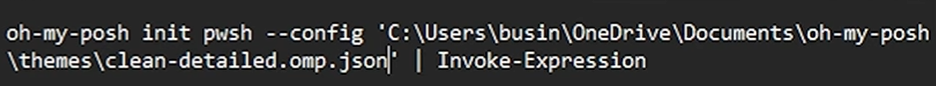

Ir a la pagina de oh my posh 

copiuar el link de instalacion con winget 

``` powershell
winget install JanDeDobbeleer.OhMyPosh --source winget
```

con este comando podemos saber en que terminal estamos. 
``` powershell
oh-my-posh get shell
```

 Pero creo que seria bueno tener poder instalar oh my poosh y  mostrar los cambios, estilos, mods, fonts , en todas las terminales.:
 powershell, git bash, pwds, 


tendremos que agregar la variable de enterno de nuestro oh my posh 
Atencion tenemos que correr este comando pero puede que no lo tengamos, asi que tendremos que crearlo para que no de error.

```powershell
notepad $PROFILE
```

Este es el comando para crear el file en caso que nos de error 
```powershell
New-Item -Path $PROFILE -Type File -Force
```

Si es que nos sigue dando error podria ser porque el path no esta bien, o tenenmos un error en el path. 
Tenemos que verificar cual es la ruta correcta con este comando 

``` powershell
$PROFILE
```

Si sigue dando problemas. 
Crearlo nosotros con coimandos como touch y mkdir


Despues de haber creado el archivo .ps1
pegar esto dentro de el 

```powershell
oh-my-posh init pwsh | Invoke-Expression
```


Tambien tenemos que descargar esta font "FiraCode Nerd Font Mono"
La pagian oficinl nos recomienda un font pero no queiro ese font pero podemos usar el comando que nos da. "oh-my-posh font install firacode"

Despues de instalada o descargada,l tenenmos que cambiar el font tambien en nustro perfil en la terminal, para ver los iconos. 


Si te das cuenta este coamndo es el mismo pero con el theme especificado. 
```powershell
    oh-my-posh init pwsh --config ~/montys.omp.json | Invoke-Expression
```

Y creo que para que no tarde en cargar podemos poner el config a un path local. Estaria bien tener el theme en el mismo lugar donde esta el file .ps1 

```https://github.com/JanDeDobbeleer/oh-my-posh/blob/main/themes/montys.omp.json``` Este es el link de descagar del theme que quiero. 

Aunque seria buena idea tambien mostrar en la terminal que theme quiere el usuario y mostrar todos los disponibles a descargar, y asi rapidamente escoger uno y hacerle set. 
quedaria algo asi, para que la terminar se abra y muestre siempre el theme oy la coinfiguracion que quiero. 

```powershell
    oh-my-posh init pwsh --config ~/montys.omp.json | Invoke-Expression
```

